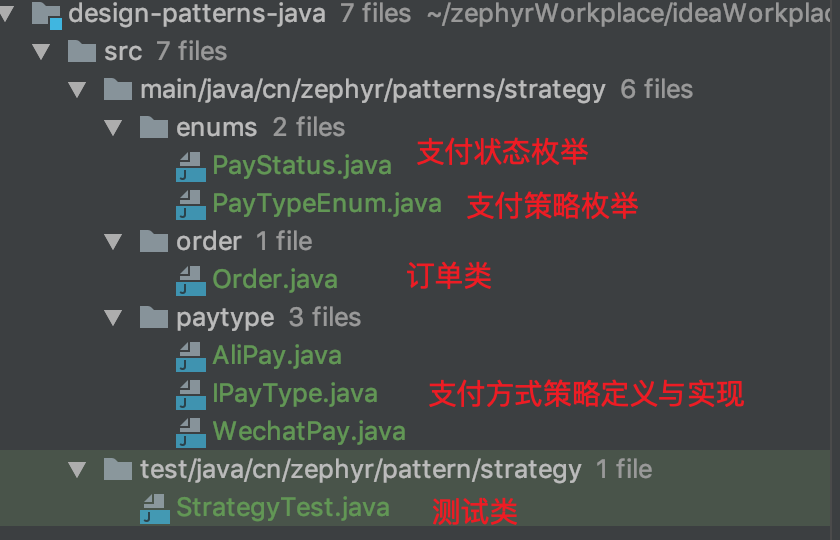
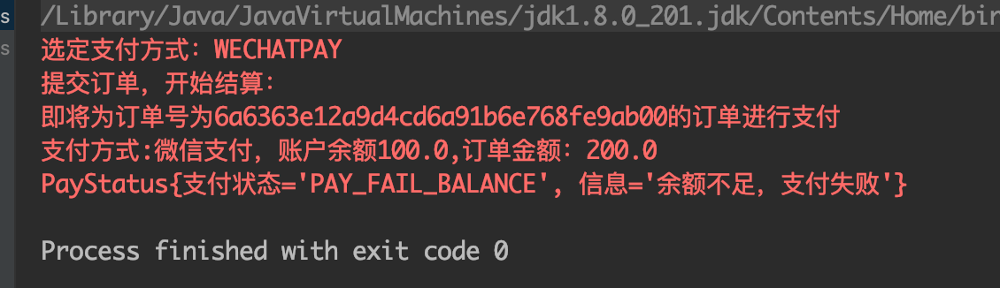
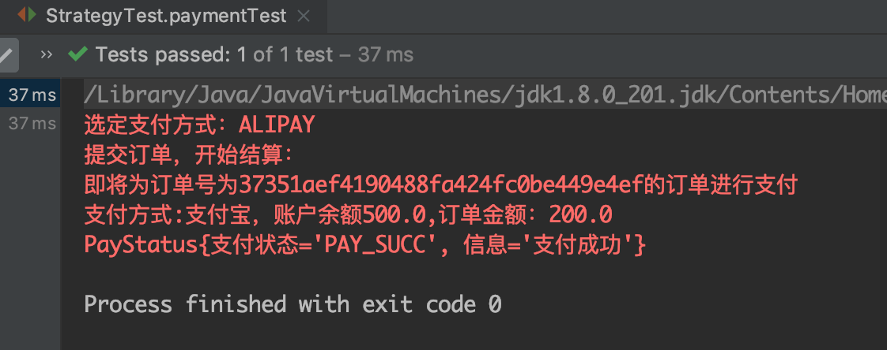
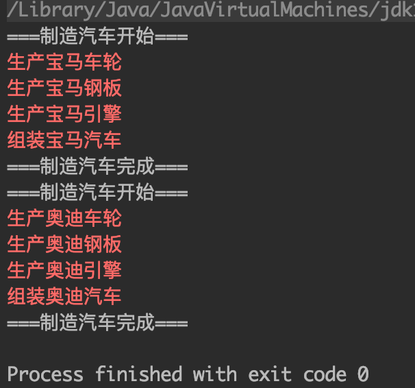
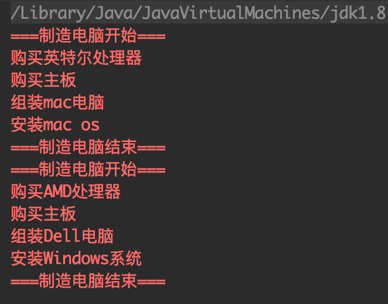

## 一、策略模式
1. 应用实例： 
    1. 订单结算时的支付方式：支付宝、微信支付、银联卡支付等，每种支付方式都是一种策略。 
    2. 旅行的出游方式，选择骑自行车、坐汽车，每一种旅行方式都是一个策略。
1. 定义：定义一系列的算法（解决方案）,把它们一个个封装起来, 并且使它们可相互替换。
1. 主要解决：在有多种算法相似的情况下，使用 if...else 所带来的复杂和难以维护。
1. 何时使用：一个系统有许多许多类，而区分它们的只是他们直接的行为。
1. 如何解决：将这些算法封装成一个一个的类，任意地替换。
1. 关键代码：实现同一个接口。
1. 优点： 
    1. 算法可以自由切换。 
    2. 避免使用多重条件判断。 
    3. 扩展性良好。
1. 缺点： 
    1. 策略类会增多。 
    2. 所有策略类都需要对外暴露。
1. 使用场景： 
    1. 如果在一个系统里面有许多类，它们之间的区别仅在于它们的行为，那么使用策略模式可以动态地让一个对象在许多行为中选择一种行为。 
    2. 一个系统需要动态地在几种算法中选择一种。 
    3. 如果一个对象有很多的行为，如果不用恰当的模式，这些行为就只好使用多重的条件选择语句来实现。
1. 注意事项：如果一个系统的策略多于四个，就需要考虑使用混合模式，解决策略类膨胀的问题。
1. 【案例】订单结算时，用户自主选择支付方式：
    1. 业务逻辑：
    1. 代码结构： 
        
    1. 支付方式接口类： 
        ``` java
        public interface IPayType {
            PayStatus pay(Order order);
        }
        ```
    1. 支付方式实现类： 
        ``` java
        @Data
        public class AliPay implements IPayType {

            private Double accountBalance = 500D;

            @Override
            public PayStatus pay(Order order) {
                System.err.println("即将为订单号为"+order.getUuid()+"的订单进行支付");
                System.err.println("支付方式:支付宝，账户余额"+accountBalance+",订单金额："+order.getPayment());
                if(this.accountBalance>=order.getPayment()){
                    return PayStatus.PAY_SUCC;
                }
                return PayStatus.PAY_FAIL_BALANCE;
            }
        }
        ```
        ``` java
        @Data
        public class WechatPay implements IPayType {

            private Double accountBalance = 100D;

            @Override
            public PayStatus pay(Order order) {
                System.err.println("即将为订单号为"+order.getUuid()+"的订单进行支付");
                System.err.println("支付方式:微信支付，账户余额"+accountBalance+",订单金额："+order.getPayment());
                if(this.accountBalance>=order.getPayment()){
                    return PayStatus.PAY_SUCC;
                }
                return PayStatus.PAY_FAIL_BALANCE;
            }
        }
        ```
    1. 支付方式枚举类（可与字典表共同维护并提供到前端）与支付状态枚举类
        ``` java
        public enum PayTypeEnum {
            /**
            * 支付宝
            */
            ALIPAY(new AliPay()),
            /**
            * 微信支付
            */
            WECHATPAY(new WechatPay()),
            ;

            private IPayType iPayType;

            PayTypeEnum(IPayType iPayType) {
                this.iPayType = iPayType;
            }
            // 省略getter、setter

        }
        ```
        ``` java
        public enum PayStatus {
            PAY_SUCC("PAY_SUCC","支付成功"),
            PAY_FAIL_BALANCE("PAY_FAIL_BALANCE","余额不足，支付失败"),
            PAY_FAIL_PAYTYPE_NOT_EXIST("PAY_FAIL_PAYTYPE_NOT_EXIST","支付方式不存在，支付失败"),
            ;

            private String key;
            private String desc;

            PayStatus(String key, String desc) {
                this.key = key;
                this.desc = desc;
            }
            // 省略setter、getter
            @Override
            public String toString() {
                return "PayStatus{" +
                        "支付状态='" + key + '\'' +
                        ", 信息='" + desc + '\'' +
                        '}';
            }
        }

        ```
    1. 订单类：
        ``` java
        @Data
        public class Order {
            // 订单号
            private String uuid;
            // 总价
            private Double payment;
            // 支付方式
            private PayTypeEnum payTypeEnum;

            public Order() {
            }

            public Order(String uuid, Double payment, PayTypeEnum payTypeEnum) {
                this.uuid = uuid;
                this.payment = payment;
                this.payTypeEnum = payTypeEnum;
            }

            public PayStatus getPaid(){
                if(null == this.getPayTypeEnum()){
                    return PayStatus.PAY_FAIL_PAYTYPE_NOT_EXIST;
                }
                return payTypeEnum.getiPayType().pay(this);
            }
        }
        ```
    1. 测试方法： 
        ``` java
        @Test
        public void paymentTest(){
            // 模拟后端提供给前端的支付方式字典
            String[] payType = {"ALIPAY","WECHATPAY"};
            // 模拟用户行为，选择支付方式
            PayTypeEnum payTypeEnum = PayTypeEnum.valueOf(payType[(int) (Math.random() * 2)]);
            System.err.println("选定支付方式："+payTypeEnum);
            System.err.println("提交订单，开始结算：");
            Order order = new Order(UUID.randomUUID().toString().replace("-",""),200D,payTypeEnum);
            // 模拟后端的结算业务
            PayStatus payStatus = order.getPaid();
            System.err.println(payStatus);
        }
        ```
    1. 效果：  
          
          

## 二、模板模式
### 1. 作用：
父类（接口类）定义一个操作中的算法的骨架，而将一些步骤延迟到子类（实现类）中。模板模式使得子类在不改变当前算法结构（业务结构）的前提下，即可重定义该算法的某些特定步骤。
### 2. 优点： 
1. 封装不变部分，扩展可变部分。 
1. 提取公共代码，便于维护。 
1. 行为由父类（接口类）控制，子类（实现类）实现。
### 3. 缺点：每一个不同的（场景）实现都需要一个子类（实现类）来实现，导致类的个数增加，使得系统更加庞大。
### 4. 使用场景： 
1. 有多个子类共有的方法，且逻辑相同。 
1. 重要的、复杂的方法，可以考虑作为模板方法。
### 4. 注意事项：
1. 为防止恶意操作，一般模板方法都加上 final 关键词。(模板方法指的是：定义了各步骤执行顺序的方法)
1. 同样是为了防止恶意操作，通常使用抽象类+子类的方式实现模板模式（接口类的default方法能够被实现类改写（没有default final方法），业务上不够安全）
### 5. 代码示例：   
1. 基于抽象类与子类
    1. 定义模板抽象类（定义业务流程）
        ``` java
        public abstract class ProductCar {
            public abstract void produceWheels();

            public abstract void produceEnginee();

            public abstract void produceMetal();

            public abstract void assemble();

            public final void produceCar(){
                try {
                    System.out.println("===制造汽车开始===");
                    Thread.sleep(100L);
                    produceWheels();
                    Thread.sleep(100L);
                    produceMetal();
                    Thread.sleep(100L);
                    produceEnginee();
                    Thread.sleep(100L);
                    assemble();
                    Thread.sleep(100L);
                    System.out.println("===制造汽车完成===");
                } catch (Exception e) {
                    e.printStackTrace();
                }
            }
        }
        ```
    1. 继承模板抽象类（具体业务实现）
        ``` java
        public class ProduceBmwCar extends ProductCar {
            @Override
            public void produceWheels() {
                System.err.println("生产宝马车轮");
            }

            @Override
            public void produceEnginee() {
                System.err.println("生产宝马引擎");
            }

            @Override
            public void produceMetal() {
                System.err.println("生产宝马钢板");
            }

            @Override
            public void assemble() {
                System.err.println("组装宝马汽车");
            }
        }
        ```
    1. 继承模板抽象类（具体业务实现）
        ``` java
        public class ProductAutoCar extends ProductCar{
            @Override
            public void produceWheels() {
                System.err.println("生产奥迪车轮");
            }

            @Override
            public void produceEnginee() {
                System.err.println("生产奥迪引擎");
            }

            @Override
            public void produceMetal() {
                System.err.println("生产奥迪钢板");
            }

            @Override
            public void assemble() {
                System.err.println("组装奥迪汽车");
            }
        }
        ```
    1. 测试方法： 
        ``` java
            @Test
        public void abstractClazzTest(){
            ProductCar productCar = new ProduceBmwCar();
            productCar.produceCar();
            productCar = new ProductAutoCar();
            productCar.produceCar();
        }
        ```
    1. 效果： 
        
1. 基于接口与实现类
    1. 定义模板接口类（定义业务流程）
        ``` java
        public interface ProduceComputer {

            void buyCPU();

            void buyMainboard();

            void assemble();

            void installOS();

            default void produceComputer(){
                System.err.println("===制造电脑开始===");
                try {
                    buyCPU();
                    Thread.sleep(100L);
                    buyMainboard();
                    Thread.sleep(100L);
                    assemble();
                    Thread.sleep(100L);
                    installOS();
                    Thread.sleep(100L);
                } catch (Exception e) {
                    e.printStackTrace();
                }
                System.err.println("===制造电脑结束===");
            }
        }
        ```
    1. 具体的模板实现类（具体业务实现）
        ``` java
        public class ProduceDellComputer implements ProduceComputer {
            @Override
            public void buyCPU() {
                System.err.println("购买AMD处理器");
            }

            @Override
            public void buyMainboard() {
                System.err.println("购买主板");
            }

            @Override
            public void assemble() {
                System.err.println("组装Dell电脑");
            }

            @Override
            public void installOS() {
                System.err.println("安装Windows系统");
            }
        }
        ```
        ``` java
        public class ProduceMacComputer implements ProduceComputer {
            @Override
            public void buyCPU() {
                System.err.println("购买英特尔处理器");
            }

            @Override
            public void buyMainboard() {
                System.err.println("购买主板");
            }

            @Override
            public void assemble() {
                System.err.println("组装mac电脑");
            }

            @Override
            public void installOS() {
                System.err.println("安装mac os");
            }
        }
        ```
    1. 测试方法：  
        ``` java
            @Test
            public void interfaceClazzTest(){
                ProduceComputer produceComputer = new ProduceMacComputer();
                produceComputer.produceComputer();
                produceComputer = new ProduceDellComputer();
                produceComputer.produceComputer();
            }
        ``` 
    1. 效果：   
        

> [菜鸟教程-->模板模式](https://www.runoob.com/design-pattern/template-pattern.html)