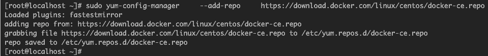

1. 设置镜像仓库：
    1. 安装基础依赖：  
        ``` yum install -y yum-utils   device-mapper-persistent-data```  
          
          
    1. 设置镜像仓库：  
        ```sudo yum-config-manager     --add-repo     https://download.docker.com/linux/centos/docker-ce.repo ```   
        
1. 安装Docker CE（社区版）
    1. 安装最新版：  
        ```yum install docker-ce docker-ce-cli containerd.io```  
          
          
    1. 启动docker：  
        ```systemctl start docker```  
    1. 查看docker安装信息：  
        ```docker version```
        
1. （可选）配置国内的镜像仓库(以docker-cn为例)  
    1. 新建/修改配置文件：
        ```vi /etc/docker/daemon.json```  
    1. 新增如下配置：
        ```  json
        {
        "registry-mirrors": ["https://registry.docker-cn.com"]
        }
        ```
    1. 重新加载daemon.json:  
        ```systemctl daemon-reload```  
    1. 重启docker： 
        ```systemctl restart docker```
    1. 查看docker信息：
        ```docker info```  
        

> 建议在centos7安装docker  
> 参考文档：  
    https://docs.docker.com/install/linux/docker-ce/centos/#install-using-the-repository      
    https://cloud.tencent.com/document/product/457/9113  
    https://docs.docker.com/registry/recipes/mirror/#use-case-the-china-registry-mirror  