1. docker架构图：  
    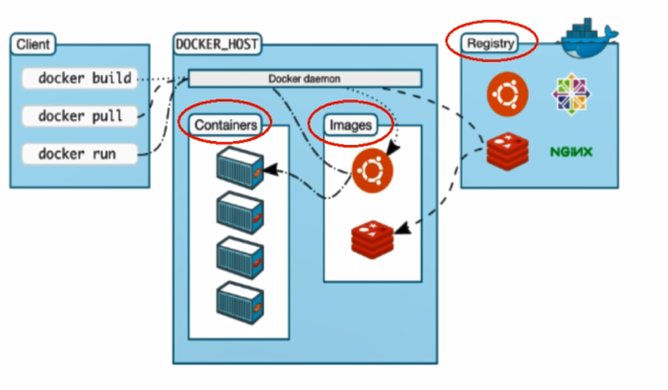 
1. docker三要素：
1. 关于docker logo的解读：海洋表示宿主机、鲸鱼表示docker、集装箱表示docker容器（来源于docker镜像文件）
1. centos7下启动docker：```systemctl start docker```

## 二、Docker常用命令
1. 镜像常用命令：
    1. docker version
    1. docker info
    1. docker --help
    1. docker images:查看本地的docker镜像  
        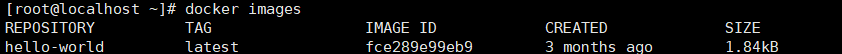 
        一个仓库源可以有多个tag，表示这个仓库源的不同版本，可以使用REPOSITORY:TAG来唯一定义不同的镜像，如果在使用镜像时不指定tag，docker将默认使用"latest"的tag，表示将会选取最新版本的tag
            1. -a：列出本地所有镜像（含中间映像层）
            1. -q：只显示镜像id
            1. --digests：显示镜像的摘要信息
            1. --no-trunc：显示完整的镜像信息
    1. docker search:从www.dockerhub.com上查找镜像信息  
        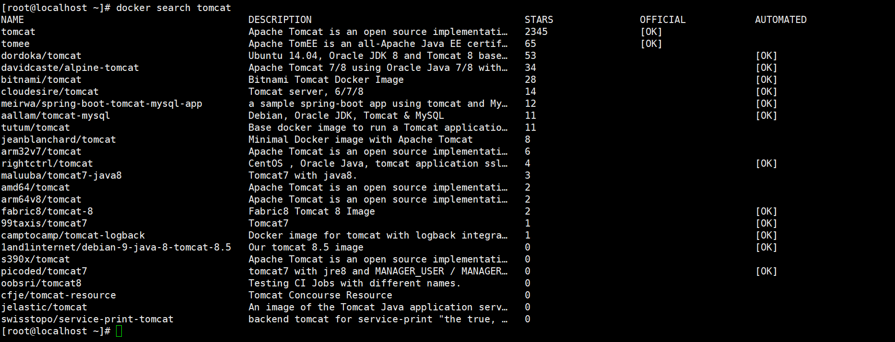 
        1. --no-trunc:显示完整的镜像描述
        1. -s：列出收藏数不小于指定值的镜像
        1. --automated：只列出automated build类型的镜像
    1. docker pull :从镜像仓库拉取指定的镜像  
        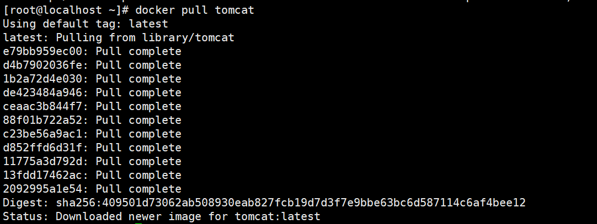 
    1. docker rmi:删除镜像
        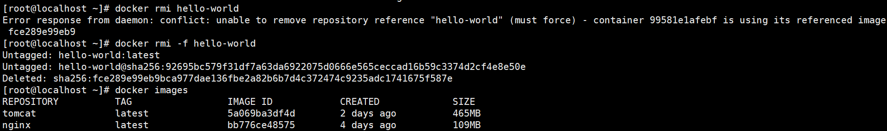
        1. 删除多个镜像：docker rmi 镜像名1:TAG 镜像名2:TAG
        1. 全部删除(类似于SQL语句)：docker rmi -f $(docker images -qa)
1. 容器常用命令：
    1. docker run:启动基于某个镜像的容器
        1. -i:已交互的方式运行容器，通常与-t同时使用
        1. -t:为容器重新分配一个伪输入终端，通常与-i同时使用
        1. -name="xxx":为容器指定一个名称  
        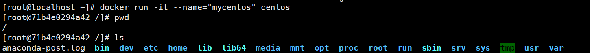
        1. -d：后台运行容器，并返回容器id，机启动守护式容器
            1. docker容器后台运行，必须要有一个前台进程
    1. docker ps:列出当前所有正在运行的容器  
        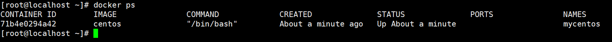  
        1. -a：列出当前所有正在运行的容器 + 历史上运行过的容器
        1. -l：显示最近创建的容器。
        1. -n：显示最近创建的n个容器
        1. -q：静默模式，只显示容器编号
        1. --no-trunc：不截断输出
    1. 退出容器：
        1. 输入："exit"，关闭容器并退出
        1. 键盘快捷键：ctrl+p+q，离开容器但不关闭容器
    1. docker start:（根据id或name）启动容器（主要用于之前doceker run过后，关闭掉的容器）
        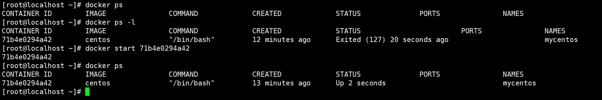  
    1. docker restart:（根据id或name）重启容器
    1. docker stop:（根据id或name）停止容器
    1. docker kill:（根据id或name）强制停止容器
    1. docker log：根据容器id查看容器日志：
        1. -t 额外显示时间戳
        1. -f 跟随最新的日志打印
        1. --tail 显示最后的某几条
    1. docker top [container id]:查看容器内运行的进程
        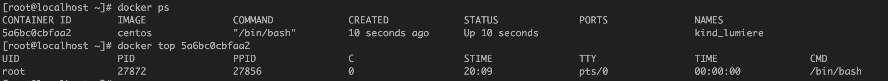  
    1. docker inspect [container id]:查看容器内部细节
    1. 使用正在运行容器：
        1. 进入正在运行的容器：docker attach [container id],相当于docker attach [container id] /bin/bash
        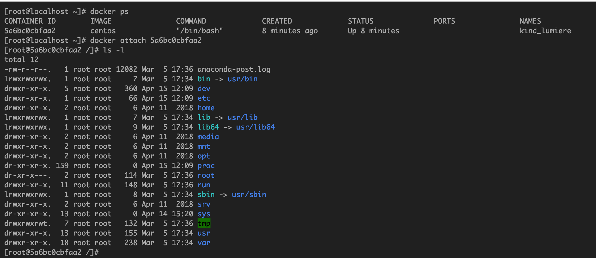  
        1. 使用正在运行的容器执行某项操作，直接返回结果而不进入容器： docker exec [container id] [command]
        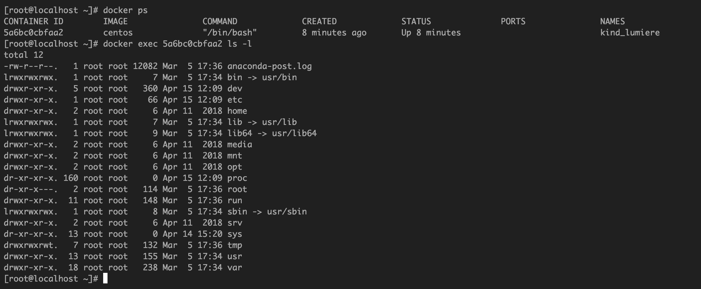  
    1. docker cp [container id]:[source] [target]：将容器中的文件拷贝到宿主机上
        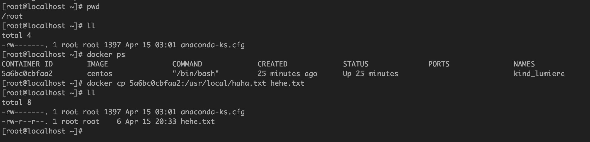  
    1. docker commit：提交容器副本使之成为一个新的镜像
        1. docker commit -m=“提交的描述信息” -a=“作者” 容器ID 要创建的目标镜像名:[标签名]  
        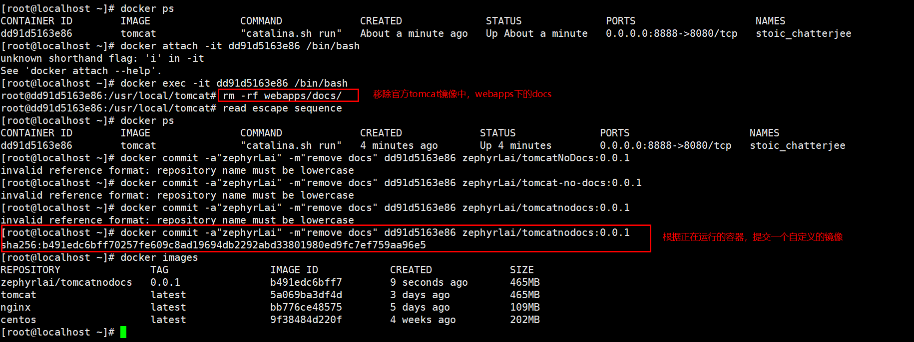  
1. docker命令图解
        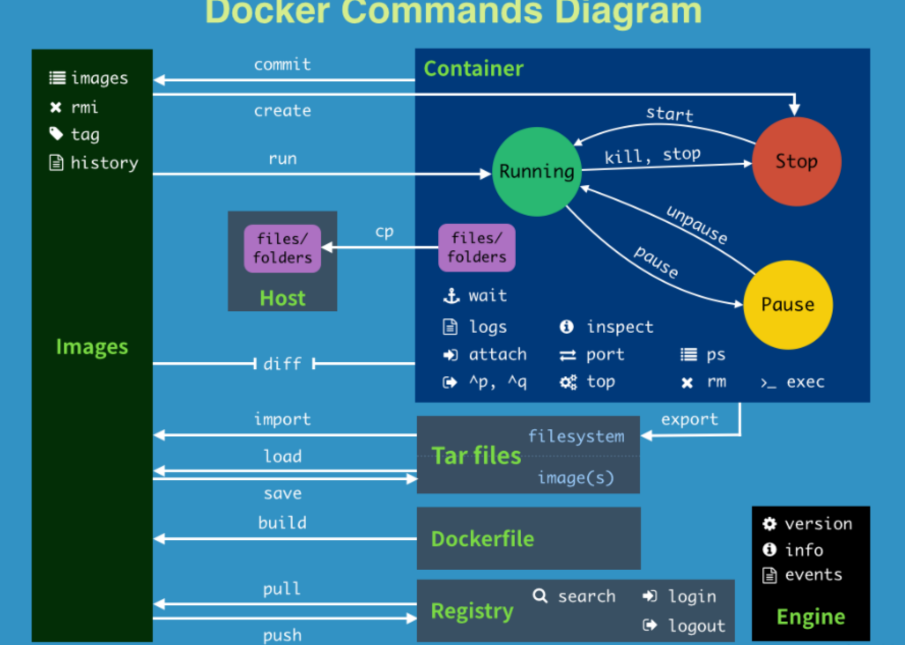  

## 三、Docker镜像
1. 镜像是一种轻量级、可执行的独立软件包，用来打包软件运行环境和基于运行环境开发的软件，它包含运行某个软件所需的所有内容，包括代码、运行时、库、环境变量和配置文件。
1. 镜像的加载原理：docker的镜像实际上由一层一层的文件系统组成，这种层级式的文件系统称为UnionFS（联合文件系统）。
1. 联合文件系统的特性：一次同时加载多个文件系统，但从外面看起来，只能看到一个文件系统，联合加载会把各层文件系统叠加起来，这样最终的文件系统会包含所有底层的文件和目录。
1. 每一个docker镜像都可以看作是一个极为精简的Linux系统，镜像的底层包括是rootfs(boot file system)与bootfs (root file system)。而bootfs是最底层的，主要包含bootloader（boot加载器）和kernel（内核）。当boot加载完成之后整个内核就都在内存中了，此时内存的使用权已由bootfs转交给内核，此时系统也会卸载bootfs。rootfs在bootfs之上。包含的就是典型 Linux 系统中的 /dev, /proc, /bin, /etc 等标准目录和文件。rootfs就是各种不同的操作系统发行版，比如Ubuntu，Centos等等。   
    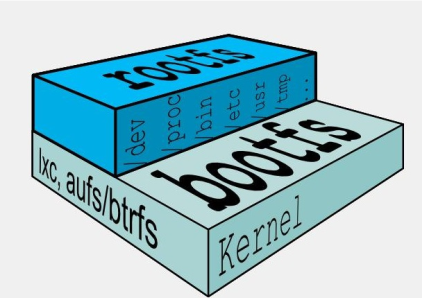   
1. 分层结构的优势：共享资源。场景：有多个镜像都从相同的 base 镜像构建而来，那么宿主机只需在磁盘上保存一份base镜像，同时内存中也只需加载一份 base 镜像，就可以为所有容器服务了。而且镜像的每一层都可以被共享。
1. Docker镜像都是只读的，当容器启动时，一个新的可写层被加载到镜像的顶部。这一层通常被称作“容器层”，“容器层”之下的都叫“镜像层”。

## 四、Docker容器数据卷
1. 作用：容器的持久化、容器间继承并共享数据
1. 在容器内添加数据卷的2种方式：
    1. 直接命令添加
        1.  docker run -it -v /宿主机绝对路径目录:/容器内目录 镜像名
        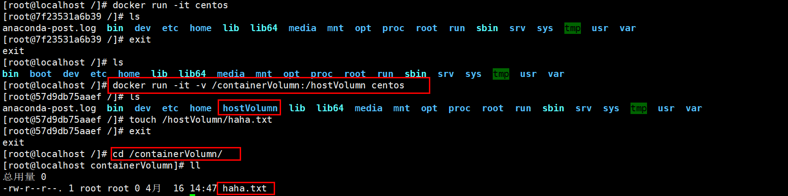   
    1. DockerFile添加
        1. 举例
            1. 添加父镜像
            1. 指定容器卷
            1. 输出语句
            1. 命令行方式打开  
            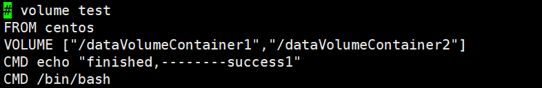   
            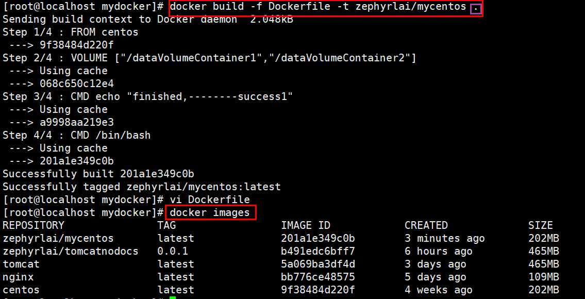   

## 五、Docekerfile

 
