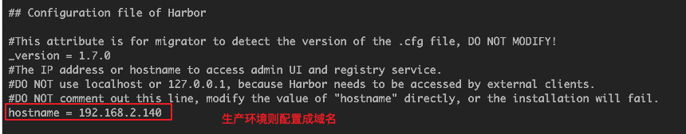
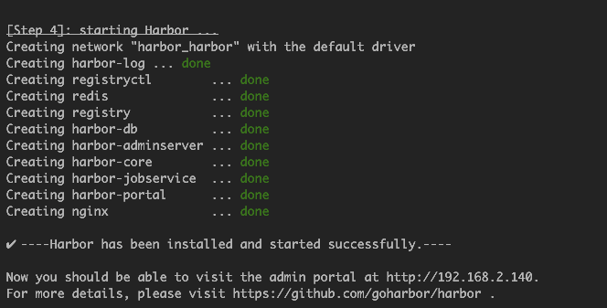
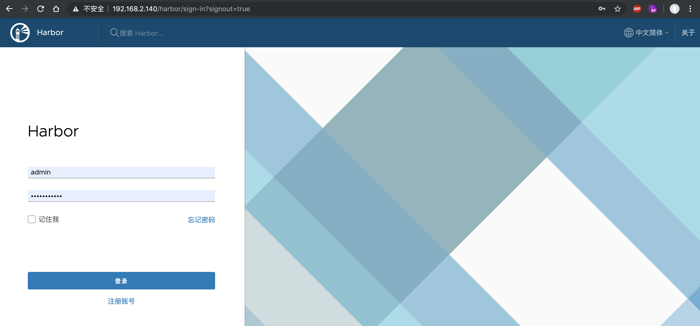
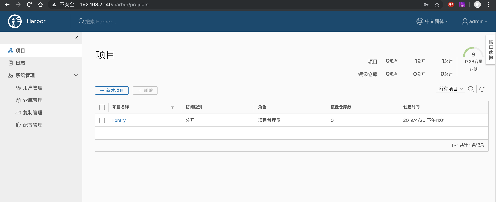
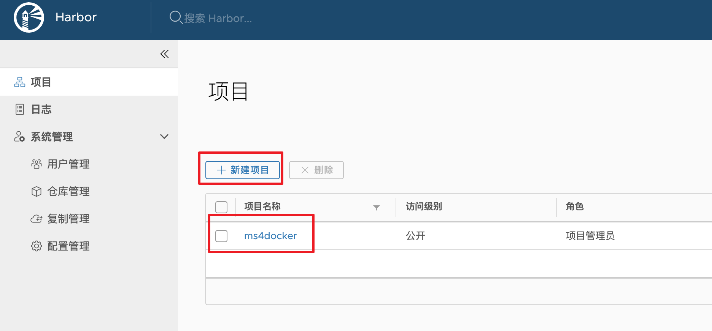
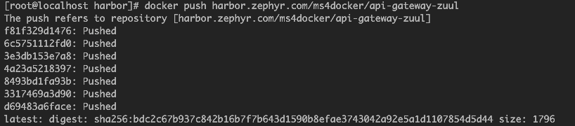
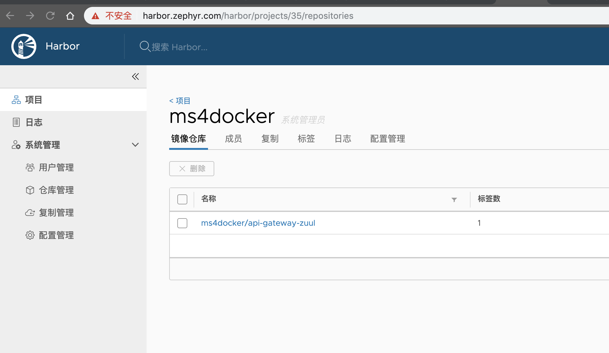

## 一、安装
1. 下载离线安装包：https://github.com/goharbor/harbor/releases  
1. 配置修改（主要涉及2个配置文件）：
    1. harbor.cfg(系统配置以及秘钥文件的挂载目录)
        1. 通常改一下域名即可安装  
            
    1. docker-compose.yml(文件挂载目录的配置，根据需要更改，默认不进行更改)
1. 安装：
    harbor目录下运行：  
    ```./install.sh```  
    
1. 访问仓库（默认用户名：admin，密码：Harbor12345，在harbor.cfg中配置）： 
      
    
## 二、使用
1. harbor的启动（第一次install时已处于启动状态，无需再次启动）：进入harbor目录下执行```docker-compose up -d```  
1. 上传镜像：
    1. 新建项目（慎重取名，docker镜像打tag的时候需要使用这个项目名）：  
        
    1. 服务器端登录到docker仓库：   
        ```docker login --username=xxx xxx.com```   
        
    1. 给目标镜像打tag：  
        ```docker tag zephyrlai/api-gateway-zuul harbor.zephyr.com/msdocker/api-gateway-zuul```  
        
    1. 推送到镜像仓库：  
        ``` docker push harbor.zephyr.com/msdocker/api-gateway-zuul```  
          
    1. 在镜像仓库中查看：  
            

> harbar.zephyr.com是通过hosts文件指定的


