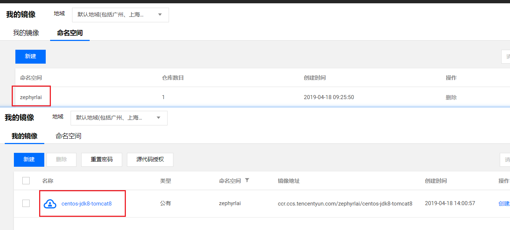
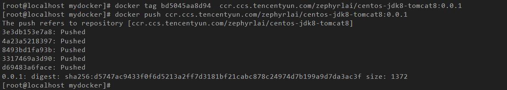

## 一、上传镜像
1. 在腾讯云容器服务创建镜像、命名空间  
    
1. docker登录到腾讯云：```docker login --username=100004301502 ccr.ccs.tencentyun.com```  
    
1. (根据镜像id)上传镜像：  
    
    1. ```docker tag bd5045aa8d94  ccr.ccs.tencentyun.com/zephyrlai/centos-jdk8-tomcat8:0.0.1```  
    1. ```docker push ccr.ccs.tencentyun.com/zephyrlai/centos-jdk8-tomcat8:0.0.1```  
    


## 二、下载镜像
... loading

> 参考地址：https://cloud.tencent.com/document/product/457/9117