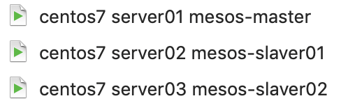
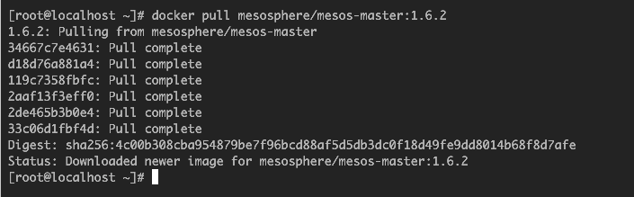
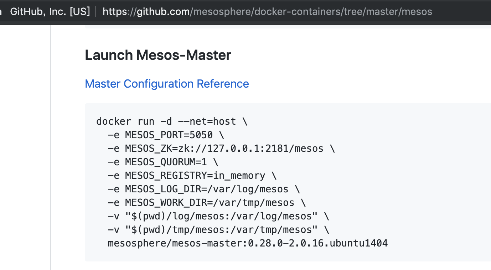
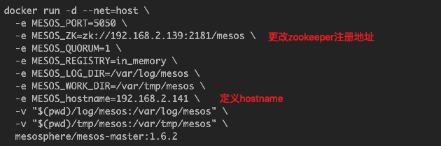
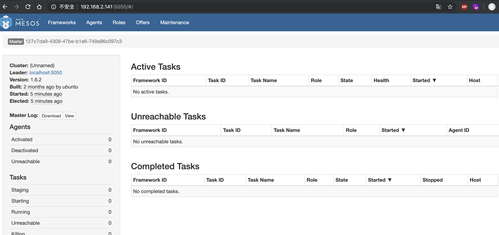
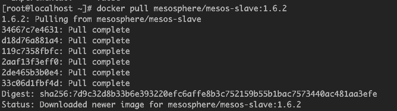
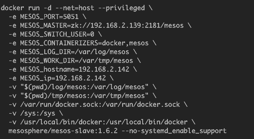
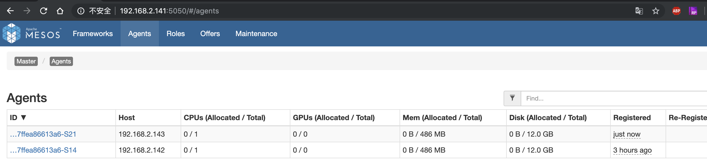

## 一、基础理论

## 二、环境搭建
1. 准备3台虚拟机环境，1台mesos-master（server01）,2台mesos-slave(server02、server03)，安装docker环境、配置静态ip  
      
1. 搭建mesos-master环境（搭建1台）
    1. 在server01上从docker hub拉取并运行mesos-master镜像
          
    1. 运行mesos-master(启动参数有点多，写个脚本，一键执行)  
           
        脚本内容：   
          
    1. 效果：  
         
1. 搭建mesos-slave环境(搭建2台)
    1. 从docker hub上拉取并运行mesos-slave镜像
         
    1. 运行mesos-slave(启动参数有点多，写个脚本，一键执行)  
          
    1. 效果：  
         

> 参考链接：   
https://github.com/mesosphere/docker-containers/tree/master/mesos  
https://blog.csdn.net/zsw7181084/article/details/54691657  
