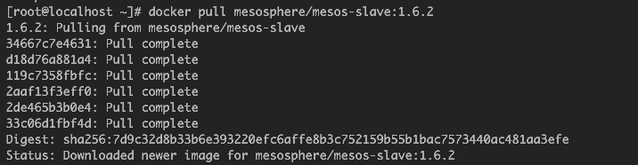
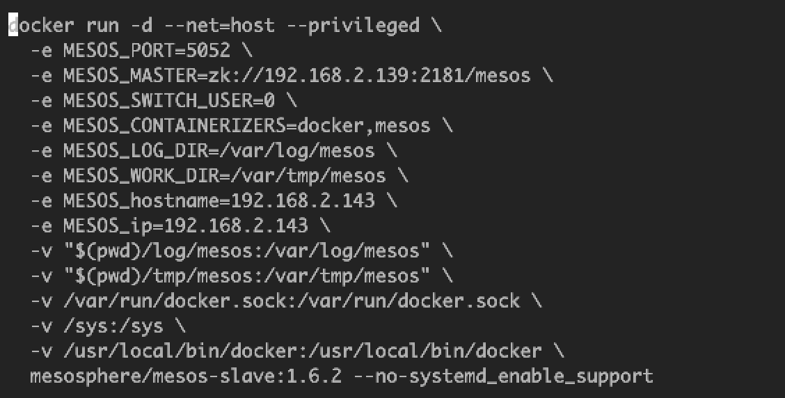
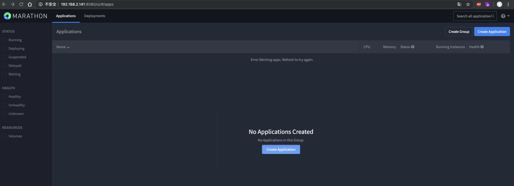
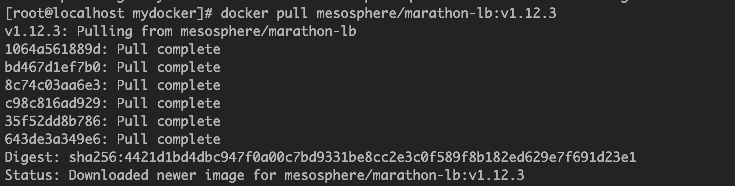
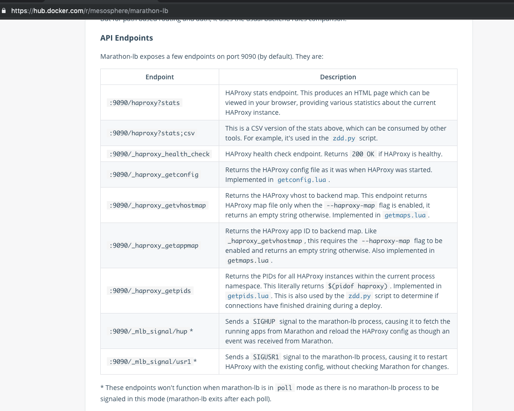
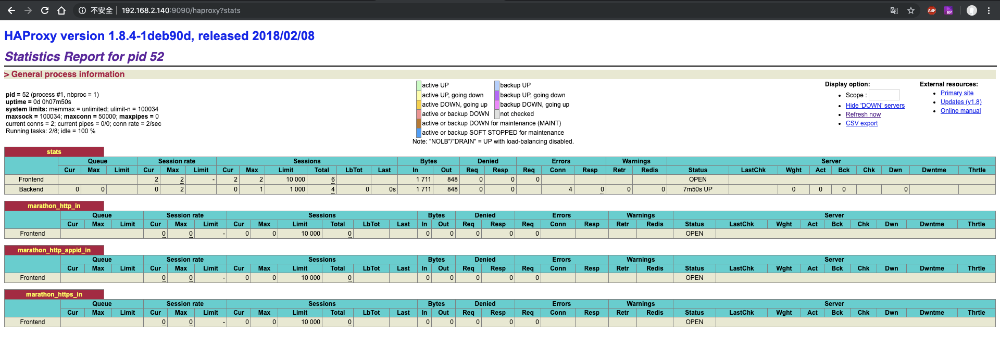

## 一、基础理论

## 二、环境搭建
1. 准备4台虚拟机环境，1台mesos-master（server01）,2台mesos-slave(server02、server03),1台docker-server，安装docker环境、配置静态ip  
      
1. 搭建mesos-master环境（搭建1台）
    1. 在server01上从docker hub拉取并运行mesos-master镜像
          
    1. 运行mesos-master(启动参数有点多，写个脚本，一键执行)  
           
        脚本内容：   
          
    1. 效果：  
         
1. 搭建mesos-slave环境(搭建2台)
    1. 从docker hub上拉取并运行mesos-slave镜像
         
    1. 运行mesos-slave(启动参数有点多，写个脚本，一键执行)  
          
    1. 效果：  
          
1. 在mesos-master所在的主机环境搭建marathon
    1. 从docker hub上拉取marathon镜像并运行
          
    1. 运行marathon镜像(启动参数有点多，写个脚本，一键执行)  
          
    1. 效果：
          
1. 在docker-server上运行marathon-lb
    1. 从docker hub上拉取镜像
          
    1. 编写运行脚本(主要包括host方式启动，映射端口9090，连接到的marathon服务地址)
        ``` sh
        docker run -d --net=host \
        -e PORTS=9090 mesosphere/marathon-lb:v1.12.3 sse \
        --group external \
        --marathon http://192.168.2.141:8080
        ```
    1. 按照文档随便访问一个：
          
          


> 参考链接：   
https://github.com/mesosphere/docker-containers/tree/master/mesos  
https://blog.csdn.net/zsw7181084/article/details/54691657  
 