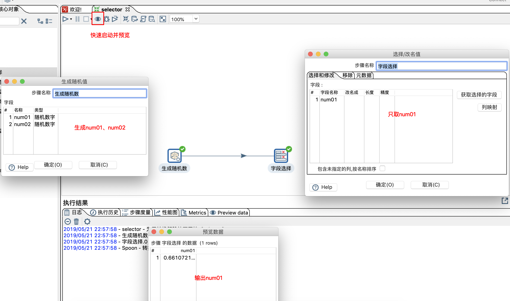
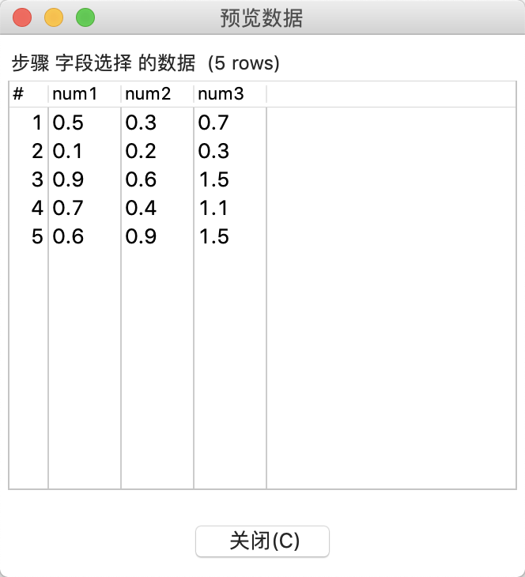
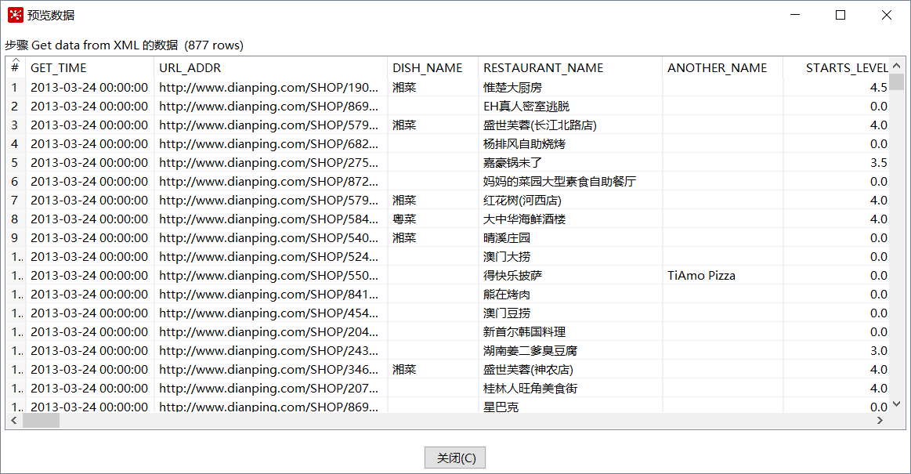

## 〇、介绍
1. ETL：是英文Extract-Transform-Load的缩写，用来描述将数据从来源端经过萃取（extract）、转置（transform）、加载（load）至目的端的过程。
    1. 抽取(Extract):一般抽取过程需要连接到不同的数据源，以便为随后的步 骤提供数据。
    1. 转换(Transform):任何对数据的处理过程都是转换。
    1. 加载(Load):将数据加载到目标系统的所有操作。
1. ETL的工作职能：从不同的数据源统一抽取数据，经整理后对外提供：  
    
1. Kettle的特性：  
    

## 一、Kettle的基本使用
### 1. 下载与使用
1. [官网下载](https://sourceforge.net/projects/pentaho/files/latest/download)
1. 启动:
    1. 图形界面启动：windows下运行spoon.bat，macOS下运行spoon.sh，启动成功效果如图：  
        
    1. Kettle 的几个子程序的功能
        1. Spoon.bat: 图形界面方式启动作业和转换设计器。 
        1. Pan.bat: 命令行方式执行转换。
        1. Kitchen.bat: 命令行方式执行作业。
        1. Carte.bat: 启动web服务，用于 Kettle 的远程运行或 集群运行。
        1. Encr.bat: 密码加密
### 2. Quick Start（转换）
1. 案例：生成随机数并输出到文件（sources/01/quickstart.ktr）
    1. 新建随机数生成组件(输入)：  
        
    1. 新建输出到文本文件组件（输出）：  
        
    1. 连线： 
        
    1. 执行转换： 
        
    1. 查看输出效果： 
        
1. 字段选择：  
    1. 作用：转换并提取部分数据  
        
1. 获取同一个转换的多个结果：
    1. 右键选择“改变开始复制的数量”，本质是多线程并行执行  
        
    1. 效果： 
        
1. 计算器： 
    1. 功能：将源数据根据设定的计算规则，计算后输出（可以输出源数据，也可以输出计算结果）  
        
    1. 效果：  
        
1. 记录集连接
    1. 功能：（个人理解）实现类似于sql中join的效果
    1. 自定义常量数据：类似于一个数据库的表，元数据就是列明
    1. 效果：  
        

## 二、kettle资源库、保存kettle元数据
1. 元数据
    1. 元数据的通用概念：“描述性数据”或“数据的数据”
    1. ETL 的元数据：描述 ETL 要执行的任务 
    1. 在Kettle里元数据的存储方式：
        1. 资源库      
            1. 资源库包括文件资源库、数据库资源库      
            1. Kettle 4.0 以后资源库类型可以插件扩展 
        1. XML 文件      
            1. .ktr 转换文件的XML的根节点必须是 <transformation>      
            1. .kjb 作业XML的根节点是<job> 
1. Kettle资源库类型 
    1. 数据库资源库： 
        1. 把 Kettle 的元数据串行化到数据库中，如 R_TRANSFORMATION 表保 存了Kettle 转换的名称、描述等属性。
        1. 在Spoon 里创建和升级数据库资源库 
    1. 文件资源库：   
        在文件的基础上的封装，实现了 org.pentaho.di.repository.Repository 接口。 是Kettle 4.0 以后版本里增加的资源库类型 
    1. 不使用资源库：  
        直接保存为ktr 或 kjb 文件
1. 资源库的操作： 
    1. 操作数据库资源库：  
        1. 新建数据库资源库（提前新建好一个空的数据库）
            
        1. 新建数据库资源库之后，对应的数据库将会有如下库表变化：  
            
        1. 连接到数据库资源库（默认用户名admin，密码admin）
            

## 三、Kettle运行方式（图形、命令行、API三种方式）
### 1. 图形界面
1. 3种运行方法：本地、远程、集群
    1. 本地方式（默认就是，略）
    1. 远程方式：  
        1. 新建远程服务器实例：  
            
        1. 配置远程执行方式：  
            
        1. 在spoon.sh同级目录下运行carte.sh(macOS)或carte.bat(win)（脚本位置因kettle版本不同会有所差异）, 后面跟随2个启动参数：ip、端口号
            ``` sh
                carte.sh localhost 8081
            ```
        1. 选用配置的远程方式启动转换  
            
        1. 效果：  
               
              
    1. 集群方式（略，用到时再补充）
### 2. 命令行
1. 执行转换：pan 命令行   
    
1. 执行作业：kitchen 命令行
    
1. 日志级别：  
    1. Error: 只记录错误信息 
    1. Nothing: 不记录任何信息,执行效率最高 
    1. Minimal: 记录最少的信息 
    1. Basic: 记录基本信息 
    1. Detailed: 记录详细信息 
    1. Debug: 记录调试信息 
    1. Rowlevel: 转换过程中的每一行都记录下来,日志最详 细,执行效率最低
1. 有两种参数格式 
    1. '/参数名:值'(建议使用)
    1. '-参数名=值'
1. 案例：使用命令行的方式操作数据库资源库
    1. 先使用图形界面新建一个作业：
        1. 新建作业（包含一个‘开始’和一个‘转换’）：  
            
        1. 执行作业： 
            
        1. 效果：  
            
    1. 通过命令行的方式执行上一个作业：  
        1. 在spoon.bat同级目录下执行命令：  
            ``` sh
            ./kitchen /rep:myDbRep01 /user:admin /pass:admin /job:myjob01 /dir:/ch2/
            ```
            
        1. 效果：  
            
### 3. API(略，用到再补充)

## 四、日志-文件日志、数据库日志 
1. 转换有四个日志表： 
    1. 转换日志表、步骤日志表、性能日志表、日志通道日志表  
        
    1. 配置日志表：  
         
    1. 初始化对应数据库中的日志表
        
    1. 效果：  
        
1. 作业有三个日志表：作业日志表、作业项日志表、日志通道日志表 （基本与转换的日志表一样，略）

## 五、输入步骤：
### 1. 生成记录/自定义常量 
1. 生成记录
1. 自定义常量
### 1. 获取系统信息 
1. 
### 1. 表输入 
1. 作用：执行 Select 语句，从数据库中获取数据 
1. 特性：  
    1. 可以通过 ？ 和 ${var} 方式使用变量
    1. ？变量要求前面步骤传来的参数的顺序一致。 
    1. 延迟转换：kettle默认使用rs.getString(int) 提取数据，但如果使用了延迟转换，将使用rs.getBytes(int) 提取并返回数据，用到时在转为String（提升了数据提取效率）    
1. 效果：  
    
1. 表输入的数据类型如何和 Kettle 数据类型对应:  
    
    
### 1. 文本文件输入 
1. 文本文件输入：处理有列分隔符（限定符、逃逸字符）的文本文件。功能选项丰富、有错误处理机制。 
    1. 文件选择方式： 
        1. 直接选择本地文件。 
        1. 从上个步骤传递文件名。 
    1. 内容：  
        1. 封闭符、分隔符的设置，不可见字符输入。  
        1. 行头设置。 
    1. 过滤：内容过滤，选中/排除记录 
    1. 字段：自动识别字段类型，不一定准确
1. CSV 文件输入：简化了文本文件输入,通过 NIO、并行、延迟转换提高性能   
    
1. 固定宽度：列固定宽度的文件，不用解析字符串，性能好  
      
    
### 1. XML 文件输入 
1. 基于DOM方式的xml文件处理  
      
     
1. 基于stream方式的xml文件处理（略，用到时再补充）
### 1. Json输入 （略）
### 1. 其他输入步骤  （略）
### 1. Json输入 
### 1. 其他输入步骤  

## 六、流程步骤与应用步骤
### 1. 流程步骤
1. 在ETL运行阶段做ETL配置（TODO：ETL元数据注入组件）
1. 过滤数据
    1. switch/case组件：多路开关，一路到多路；支持日期、数值、字符串类型比较。   
        
    1. 过滤记录：多路开关，一路到两路；支持日期、数值、字符串类型比较，自定义可嵌套的表达式。  
        
    1. 根据Java表达式过滤记录：多路开关，一路到两路；直接手写 java 表达式，比过滤记录更灵活，尤其在字符串的处理上。  
        
1. 处理不确定的数据行数
    1. 检测空行：有则不通过，没有则生成一个空行  
          
    1. 识别流的最后一行：通过一个字段，标识出数据流里的最后一行   
    1. 阻塞数据：除了最后一条，其它的数据行都不能过去  
      
1. 把多来源数据行前后合并到一起
    1. 空操作：多个来源，以自然顺序合并（略）
    1. 追加流：只能两个来源，指定顺序合并
    1. 数据流优先级排序：多个来源，指定顺序合并  
    
1. 数据流程的终点
    1. 空操作：没有用的数据，类似垃圾箱（略）
    1. 终止：如果有数据到此步骤，转换会被强行停止，并报错误(前一个步骤的记录超过指定行数，则报错)  
        
    1. 复制记录到结果：暂时保留在内存里的数据，供以后的转换使用（在同一个作业中，执行不同转换时进行数据传递）  
        
    1. 设置变量：把字段值设置为变量，变量供以后 转换 使用（常在job中使用）
1. 其它流程控制步骤
    1. 阻塞数据直到步骤都完成：阻塞数据，直到指定的步骤运行完（注意:依赖死锁问题）
    1. 克隆行：复制相同的数据行
    1. 延迟行：每行数据之间等待一定的时间间隔
    
1. 单线程
    1. kettle默认是使用多线方式运行的。但某些情况下（数据量不大，但步骤比较繁琐的转换），单线程处理反而比较快，这时可以使用单线程进行处理
    
### 2. 应用步骤
1. NULL处理(效果略)
    1. 替换null值：把 Null 变成指定的值
    1. 设置值为null：把指定的值变为 Null
1. 启动其它程序
    1. 启动本地程序
    1. 启动远程机器上程序（可以通过用户名密码方式或者ssh-keygen方法）
    
1. 日志
    1. 写日志
    1. 发送信息至系统日志（结合 apache syslog 使用）
1. 文件处理
    1. 改变文件编码：
    1. 处理文件：文件的移动、删除、复制等功能
1. 邮件
    1. 发送邮件：所有的参数信息都是存储在，前面传来的数据行里（作业里的发送邮件，参数可以通过手写或通过变量控制。）


## 七、查询步骤与连接步骤
### 1. 查询步骤: 用来查询数据源里的数据并合并到主数据流中
1. 流查询
    1. 流查询
        1. 字典数据完全加载到内存后，在内存中查询，速度快，占内存。
        1. 只支持“等于”的查询。(不支持大于，小于等方式)
        1. 如果匹配上多条，只保留最后一条。
        1. 如果没有匹配上，新增的字段值为NULL。
        1. 节省内存的选项： 
            1. 如果字典key和要查询的value都是integer，可以选中Key and value are exactly one integer field，节省内存。
            1. Use sorted list:当比较的字符串比较长的，使用 hash方式
    1. 模糊匹配
        1. 只支持单列的查询
        1. 匹配相似度最大的字符串
        1. 自定义匹配的取值范围
        1. 支持的模糊匹配算法:Jaro，JaroWinkler，Levenshtein等
    
1. 数据库查询
    1. 数据库查询：  
        1. 只返回一行
        1. 如果有多行结果:a只返回第一行，b失败
        1. 对数据流里的每条记录都要做一次数据库查询，效率低。
        1. 数据库查询(加载所有数据到缓存) = 表输入+流查询
    1. 数据库连接： 
        1. 可以自定义参数位置。
        1. 参数也可以输出。 
    1. 调用存储过程（略）：  
    
1. web查询
### 2. 连接步骤: 结果集通过关键字进行连接
1. 记录集连接
1. 数据库查询
1. xml连接


## 附：搁置的组件： 
1. ETL元数据注入（类似于Java的反射机制），没明白什么意思&怎么用
