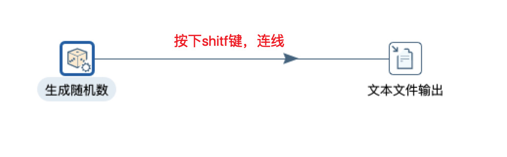

## 〇、介绍
1. ETL：是英文Extract-Transform-Load的缩写，用来描述将数据从来源端经过萃取（extract）、转置（transform）、加载（load）至目的端的过程。
    1. 抽取(Extract):一般抽取过程需要连接到不同的数据源，以便为随后的步 骤提供数据。
    1. 转换(Transform):任何对数据的处理过程都是转换。
    1. 加载(Load):将数据加载到目标系统的所有操作。
1. ETL的工作职能：从不同的数据源统一抽取数据，经整理后对外提供：  
    
1. Kettle的特性：  
    

## 一、Kettle的基本使用
### 1. 下载与使用
1. [官网下载](https://sourceforge.net/projects/pentaho/files/latest/download)
1. 启动:
    1. 图形界面启动：windows下运行spoon.bat，macOS下运行spoon.sh，启动成功效果如图：  
        
    1. Kettle 的几个子程序的功能
        1. Spoon.bat: 图形界面方式启动作业和转换设计器。 
        1. Pan.bat: 命令行方式执行转换。
        1. Kitchen.bat: 命令行方式执行作业。
        1. Carte.bat: 启动web服务，用于 Kettle 的远程运行或 集群运行。
        1. Encr.bat: 密码加密
### 2. Quick Start（转换）
1. 案例：生成随机数并输出到文件（sources/01/quickstart.ktr）
    1. 新建随机数生成组件(输入)：  
        
    1. 新建输出到文本文件组件（输出）：  
        
    1. 连线： 
        
    1. 执行转换： 
        
    1. 查看输出效果： 
        
1. 字段选择：  
    1. 作用：转换并提取部分数据  
        
1. 获取同一个转换的多个结果：
    1. 右键选择“改变开始复制的数量”，本质是多线程并行执行  
        
    1. 效果： 
        
1. 计算器： 
    1. 功能：将源数据根据设定的计算规则，计算后输出（可以输出源数据，也可以输出计算结果）  
        
    1. 效果：  
        
1. 记录集连接
    1. 功能：（个人理解）实现类似于sql中join的效果
    1. 自定义常量数据：类似于一个数据库的表，元数据就是列明
    1. 效果：  
        

## 二、kettle资源库、保存kettle元数据
1. 元数据
    1. 元数据的通用概念：“描述性数据”或“数据的数据”
    1. ETL 的元数据：描述 ETL 要执行的任务 
    1. 在Kettle里元数据的存储方式：
        1. 资源库      
            1. 资源库包括文件资源库、数据库资源库      
            1. Kettle 4.0 以后资源库类型可以插件扩展 
        1. XML 文件      
            1. .ktr 转换文件的XML的根节点必须是 <transformation>      
            1. .kjb 作业XML的根节点是<job> 
1. Kettle资源库类型 
    1. 数据库资源库： 
        1. 把 Kettle 的元数据串行化到数据库中，如 R_TRANSFORMATION 表保 存了Kettle 转换的名称、描述等属性。
        1. 在Spoon 里创建和升级数据库资源库 
    1. 文件资源库：   
        在文件的基础上的封装，实现了 org.pentaho.di.repository.Repository 接口。 是Kettle 4.0 以后版本里增加的资源库类型 
    1. 不使用资源库：  
        直接保存为ktr 或 kjb 文件
1. 资源库的操作： 
    1. 操作数据库资源库：  
        1. 新建数据库资源库（提前新建好一个空的数据库）
            
        1. 新建数据库资源库之后，对应的数据库将会有如下库表变化：  
            
        1. 连接到数据库资源库（默认用户名admin，密码admin）
            

## 三、Kettle运行方式（图形、命令行、API三种方式）
### 1. 图形界面
1. 3种运行方法：本地、远程、集群
    1. 本地方式（默认就是，略）
    1. 远程方式：  
        1. 新建远程服务器实例：  
            
        1. 配置远程执行方式：  
            
        1. 在spoon.sh同级目录下运行carte.sh(macOS)或carte.bat(win)（脚本位置因kettle版本不同会有所差异）, 后面跟随2个启动参数：ip、端口号
            ``` sh
                carte.sh localhost 8081
            ```
        1. 选用配置的远程方式启动转换  
            
        1. 效果：  
               
              
    1. 集群方式（略，用到时再补充）
### 2. 命令行
1. 执行转换：pan 命令行   
    
1. 执行作业：kitchen 命令行
    
1. 日志级别：  
    1. Error: 只记录错误信息 
    1. Nothing: 不记录任何信息,执行效率最高 
    1. Minimal: 记录最少的信息 
    1. Basic: 记录基本信息 
    1. Detailed: 记录详细信息 
    1. Debug: 记录调试信息 
    1. Rowlevel: 转换过程中的每一行都记录下来,日志最详 细,执行效率最低
1. 有两种参数格式 
    1. '/参数名:值'(建议使用)
    1. '-参数名=值'
1. 案例：使用命令行的方式操作数据库资源库
    1. 先使用图形界面新建一个作业：
        1. 新建作业（包含一个‘开始’和一个‘转换’）：  
            
        1. 执行作业： 
            
        1. 效果：  
            
    1. 通过命令行的方式执行上一个作业：  
        1. 在spoon.bat同级目录下执行命令：  
            ``` sh
            ./kitchen /rep:myDbRep01 /user:admin /pass:admin /job:myjob01 /dir:/ch2/
            ```
            
        1. 效果：  
            
### 3. API(略，用到再补充)

## 四、日志-文件日志、数据库日志 
1. 转换有四个日志表： 
    1. 转换日志表、步骤日志表、性能日志表、日志通道日志表  
        
    1. 配置日志表：  
         
    1. 初始化对应数据库中的日志表
        
    1. 效果：  
        
1. 作业有三个日志表：作业日志表、作业项日志表、日志通道日志表 （基本与转换的日志表一样，略）

## 五、输入步骤：
### 1. 生成记录/自定义常量 
1. 生成记录
1. 自定义常量
### 1. 获取系统信息 
1. 
### 1. 表输入 
### 1. 文本文件输入 
### 1. XML 文件输入 
### 1. Json输入 
### 1. 其他输入步骤  
