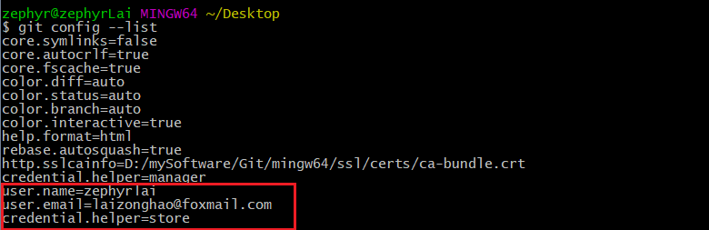

1. 设置全局用户名  
    ```git config --global user.name xxxxx ```  
    
1. 设置全局邮箱  
    ```git config --global user.email xxxxx@xxx ```    
    
1. 开启用户名密码存储  
    ```git config --global credential.helper store ```  
    
1. 查看配置  
    ```git config --list```  
    