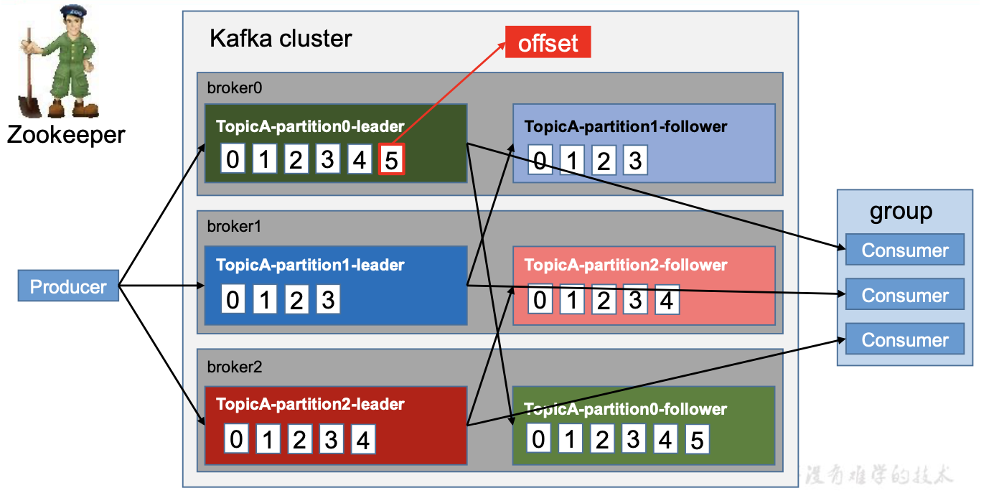
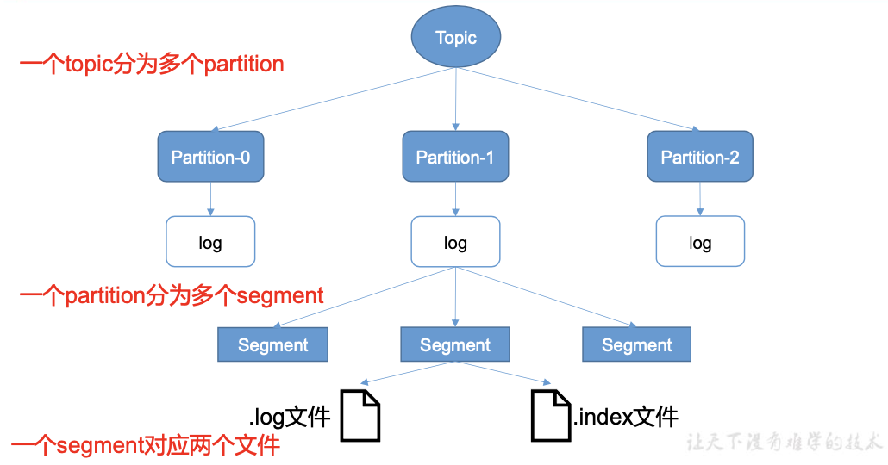
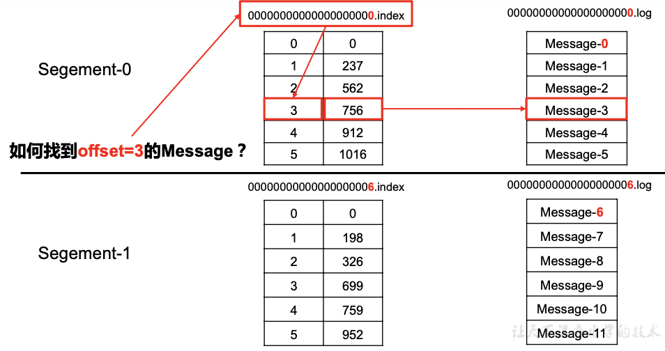
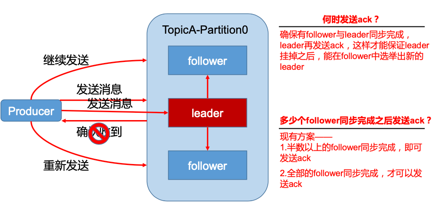
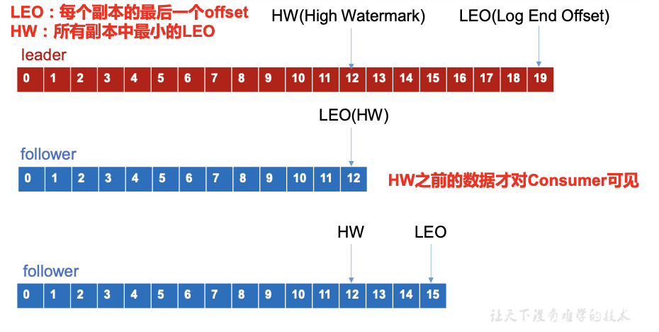
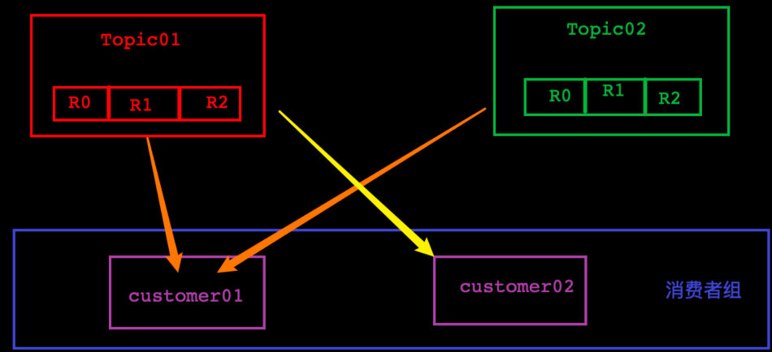
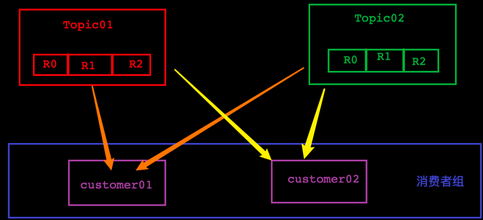
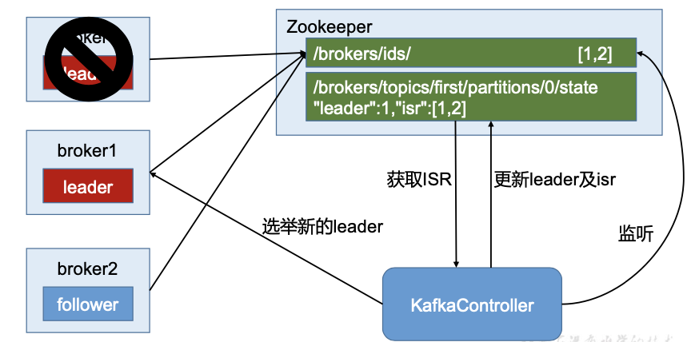

[03.Kafka架构深入](#03kafka架构深入)
- [一、Kafka工作流程及文件存储机制](#一kafka工作流程及文件存储机制)
- [二、生产者](#二生产者)  
    - [1.分区策略](#1分区策略)  
    - [2.数据可靠性保证（分区级别）](#2数据可靠性保证分区级别)    
- [三、消费者](#三消费者)
    - [1.消费方式](#1消费方式)
    - [2.分区分配策略](#2分区分配策略)
    - [3.offset 的维护](#3offset-的维护)
- [四、附加](#四附加)
    - [zookeeper在Kafka中的作用](#zookeeper在kafka中的作用)
    - [kafka事务](#kafka事务)

## 03.Kafka架构深入
### 一、Kafka工作流程及文件存储机制
    
* leader、follower有kafka自动分配到不同的机器上（分配到同一台机器上将没有意义）
* producer、consumer都是与leader节点交互，follower节点只从leader节点读取数据，不对外提供服务，除非对应的leader节点宕机，follower节点被选举为leader节点
* topic 是逻辑上的概念，而 partition 是物理上的概念，每个 partition 对应于一个 log 文件（数据文件），该 log 文件中存储的就是 producer 生产的数据。Producer 生产的数据会被不断追加到该 log 文件末端，且每条数据都有自己的 offset。
* 由于生产者生产的消息会不断追加到 log 文件末尾，为防止 log 文件过大导致数据定位 效率低下，Kafka 采取了分片和索引机制，将每个 partition 分为多个 segment。每个 segment 对应两个文件——“.index”文件和“.log”文件。这些文件位于一个文件夹下，该文件夹的命名 规则为:topic 名称+分区序号。例如，first 这个 topic 有三个分区，则其对应的文件夹为 first- 0,first-1,first-2。  
      
* 分区文件夹下的目录结构如下：
    ``` txt
    00000000000000000000.index   
    00000000000000000000.log   
    00000000000000170410.index   
    00000000000000170410.log   
    00000000000000239430.index   
    00000000000000239430.log  
    ```
    * index文件存放的kafka数据文件的索引，记录了kafka消息的偏移量与物理位置的关系；log文件中记录的是实际的消息
    * 当一个log文件超过配置文件中配置的最大大小之后，将会接着原有index文件索引，新建index、log文件，继续记录kafka的索引信息与消息数据。  
      

### 二、生产者
#### 1.分区策略
* 为什么要分区
    * 方便在集群中扩展，每个Partition可以通过调整以适应它所在的机器，而一个topic又可以有多个 Partition 组成，因此整个集群就可以适应任意大小的数据了; 
    * 可以提高并发，因为可以以 Partition 为单位读写了。
* 分区的原则  
    代码中发送的消息会被构建成一个```ProducerRecord```对象    
    ``` java
      ProducerRecord(String topic, Integer partition, Long timestamp, K key, V value, Iterable<Header> headers)   
      ProducerRecord(String topic, Integer partition, Long timestamp, K key, V value)   
      ProducerRecord(String topic, Integer partition, K key, V value, Iterable<Header> headers)   
      ProducerRecord(String topic, Integer partition, K key, V value)   
      ProducerRecord(String topic, K key, V value)   
      ProducerRecord(String topic, V value)
    ```
    * 指明 partition 的情况下，直接将指明的值直接作为 partiton 值；
    * 没有指明 partition 值但有 key 的情况下，将 key 的 hash 值与 topic 的 partition 数进行取余得到 partition 值；
    * 既没有 partition 值又没有 key 值的情况下，第一次调用时随机生成一个整数（后面每次调用在这个整数上自增），将这个值与 topic 可用的 partition 总数取余得到 partition 值，也就是常说的 round-robin 算法
#### 2.数据可靠性保证（分区级别）
* ack  
    * 为保证 producer 发送的数据，能可靠的发送到指定的 topic，topic 的每个 partition 收到 producer 发送的数据后，都需要向 producer 发送 ack(acknowledgement 确认收到)，如果 producer 收到 ack，就会进行下一轮的发送，否则重新发送数据。  
        
    * 2种副本数据同步策略
        * 半数以上follower节点完成同步，就发送ack。优势：延迟低。缺点：leader节点宕机重新选举时，有1/2概率会丢失数据。
        * 全部follower节点完成同步，就发送ack。优势：leader节点宕机重新选举时，不会有数据丢失。缺点：延迟高。
    * kafka采用的是第二种同步策略（全同步），但是引入了ISR的概念
    * acks 参数配置
        * 0：producer 不等待 broker 的 ack，这一操作提供了一个最低的延迟，broker 一接收到还 没有写入磁盘就已经返回，当 broker 故障时有可能丢失数据;
        * 1：producer 等待 broker 的 ack，partition 的 leader 保存成功后返回 ack，如果在 follower 同步成功之前 leader 故障，那么将会丢失数据;
        * -1(all)：producer 等待 broker 的 ack，partition 的 leader 和 follower 全部保存成功后才 返回 ack。但是如果在 follower 同步完成后，broker 发送 ack 之前，leader 发生故障，那么会 造成数据重复。
* ISR  
    * Leader维护了一个动态的 in-sync replica set (ISR)，意为和 leader 保持同步的 follower 集合。当 ISR 中的 follower 完成数据的同步之后，leader 就会给 follower 发送 ack。如果 follower 长时间未向 leader 同步数据，则该 follower 将被踢出 ISR，该时间阈值由 replica.lag.time.max.ms 参数设定。Leader 发生故障之后，就会从 ISR 中选举新的 leader。
    * 当前分区（Partition）中，在进行主从数据同步时，leader节点将数据同步到isr中的follower节点完毕后，就向producer发送ack表示接收成功。
* HW与LEO  
    * LEO:指的是每个副本最大的 offset;
    * HW:指的是消费者能见到的最大的 offset，ISR 队列中最小的 LEO。
        
    * follower 故障的情况下：  
        follower 发生故障后会被临时踢出 ISR，待该 follower 恢复后，follower 会读取本地磁盘 记录的上次的 HW，并将 log 文件（即数据文件）高于 HW 的部分截取掉，从 HW 开始向 leader 进行同步。 等该 follower 的 LEO 大于等于该 Partition 的 HW，即 follower 追上 leader 之后，就可以重 新加入 ISR 了。
    * leader 故障  
        leader 发生故障之后，会从 ISR 中选出一个新的 leader，之后，为保证多个副本之间的数据一致性，其余的 follower 会先将各自的 log 文件高于 HW 的部分截掉，然后从新的 leader 同步数据。（如果leader节点的offset就是HW，则其余follower节点的数据全部截断至HW位置；如果leader节点的offset高于当前分区的HW，则follower节点的数据先全部截断至HW，再从leader节点将缺失的数据同步过来）
* Exactly Once  
    * 将服务器的 ACK 级别设置为-1，可以保证 Producer 到 Server 之间不会丢失数据，即 At Least Once 语义。相对的，将服务器 ACK 级别设置为 0，可以保证生产者每条消息只会被 发送一次，即 At Most Once 语义。  
    * 0.11 版本的 Kafka，引入了一项重大特性:幂等性。所谓的幂等性就是指 Producer 不论 向 Server 发送多少次重复数据，Server 端都只会持久化一条。幂等性结合 At Least Once 语 义，就构成了 Kafka 的 Exactly Once 语义。即: 
        ``` txt 
            At Least Once + 幂等性 = Exactly Once  
        ```
    * 要启用幂等性，只需要将 Producer 的参数中 enable.idompotence 设置为 true 即可。Kafka的幂等性实现其实就是将原来下游需要做的去重放在了数据上游。开启幂等性的 Producer 在 初始化的时候会被分配一个 PID，发往同一 Partition 的消息会附带 Sequence Number。而 Broker 端会对<PID, Partition, SeqNumber>做缓存，当具有相同主键的消息提交时，Broker 只 会持久化一条。
但是 PID 重启就会变化，同时不同的 Partition 也具有不同主键，所以幂等性无法保证跨 分区跨会话的 Exactly Once。
* 总结
    * 数据丢失问题：acks、isr，producer与kafka broker通过ack机制来知晓消息是否送达，kafka broker内部维护ISR来实现高效的主从备份（数据可靠性）
    * 消费数据一致性：HW、LEO，能够解决某个leader节点宕机，选举新的leader后，分区（Partition）数据一致性，消费者获取消息的一致性问题（只能保证副本之间的数据一致性，并不能保证数据不丢失或者不重复）
    * Exactly Once：只能实现单次会话、单个分区的Exactly Once
    * 大型Kafka集群情况下，需要消费端做重复消费的处理

### 三、消费者
#### 1.消费方式
* 常见的消费方式有2种：
    * 生产者主动push：
        * 优势：消息能够已最快的速度传到消费这
        * 缺陷：很容易造成consumer来不及处理消息，典型的表现就是拒绝服务以及网络拥塞。
    * 消费者主动pull
        * 优势：consumer可以根据自身的消费能力以适当的速率消费消息。
        * 缺陷：如果生产者没有数据，消费者可能会陷入循环中，一直返回空数据。
* kafka consumer 采用 pull(拉)模式从broker中读取数据。针对这种消费方式的缺陷，Kafka的消费者在消费数据时会传入一个时长参数timeout，如果当前没有数据可供消费，consumer 会等待一段时间之后再返回，这段时长即为 timeout。
#### 2.分区分配策略
* 一个consumer group中有多个consumer，一个topic有多个partition，所以必然会涉及到partition的分配问题，即确定那个partition由哪个consumer来消费。
* Kafka有两种分配策略：
    * RoundRobin（轮询）
        * 概念：根据当前消费组中所有消费者订阅的所有主题（topic）下属的所有分区（partition），以轮询的方式分配给当前消费者组中的 __所有消费者__
        * 优势：完全实现负载均衡，各消费者消费的分区数只差不超过1
        * 缺陷：由于这种策略是将消费者组作为一个整体，如果当前消费者组下的消费者各自订阅了不同的主题，则会发生消息错误消费的问题
        * 错误消费的案例：  
                
            * 现有2个topic（各自包含3个分区），1个消费者组下有2个消费者，消费者01订阅了topic01、topic02，消费者02订阅了topic01
            * RoundRobin策略下，则会出现如下可能性：
                * customer01消费：t1r0,t1r2,t2r1
                * customer02消费：t1r1,t2r0,t2r2(customer02并没有订阅topic02，却消费了topic02的消息)
    * Range（范围，是kafka默认的策略）
        * 概念：在当前消费者组中，将消费者所订阅主题的所有分区，依次均分给对应的消费者
        * 优势：不会出现错误消费的问题，正确性得到保证
        * 缺陷：排序靠前的消费者容易出现负载不均衡的情况
        * 负载不均衡的案例：  
                
            * 现有2个topic（各自包含3个分区），1个消费者组下有2个消费者，消费者01、消费者02都订阅了topic01、topic02
            * Range策略下，则会出现如下可能性：
                * customer01消费：t1r0,t1r2,t2r0,t2r2
                * customer02消费：t1r1,t2r1(从分区的角度上看，customer01的负载是customer02的2倍)
* 消费者组中的消费者数量发生增减，会触发分区重新分配
#### 3.offset 的维护
* 由于consumer在消费过程中可能会出现断电宕机等故障，consumer恢复后，需要从故障前的位置的继续消费，所以consumer需要实时记录自己消费到了哪个 offset，以便故障恢复后继续消费。
* consumer默认将offset保存在Kafka一个内置的topic中，该topic 为__consumer_offsets。默认是无法访问的，需要在消费者的配置文件中开启。
    ``` sh
    exclude.internal.topics=false
    ```
* 消费者组(Group) + 主题(Topic) + 分区(Partition) 可以唯一确定一个offset
* 查看offset
    ``` sh
    bin/kafka-console-consumer.sh --topic __consumer_offsets --bootstrap-server 127.0.0.1:9092 --formatter "kafka.coordinator.group.GroupMetadataManager\$OffsetsMessageFormatter" --consumer.config config/consumer.properties
    ```

### 四、附加
#### zookeeper在Kafka中的作用
* Kafka集群中有一个broker会被选举为Controller，负责管理集群broker的上下线，所有topic的分区副本分配和leader选举等工作。
* Controller 的管理工作都是依赖于 Zookeeper 的。
* 以下为 partition 的 leader 选举过程:
    

#### kafka事务
* Producer 事务  
    * 为了实现跨分区跨会话的事务，需要引入一个全局唯一的 Transaction ID，并将 Producer 获得的 PID 和 Transaction ID 绑定。这样当 Producer 重启后就可以通过正在进行的 Transaction ID 获得原来的 PID。
    * 为了管理 Transaction，Kafka 引入了一个新的组件 Transaction Coordinator。Producer 就 是通过和 Transaction Coordinator 交互获得 Transaction ID 对应的任务状态。Transaction Coordinator 还负责将事务所有写入 Kafka 的一个内部 Topic，这样即使整个服务重启，由于 事务状态得到保存，进行中的事务状态可以得到恢复，从而继续进行。
* Consumer 事务  
    * 上述事务机制主要是从 Producer 方面考虑，对于 Consumer 而言，事务的保证就会相对 较弱，尤其时无法保证 Commit 的信息被精确消费。这是由于 Consumer 可以通过 offset 访 问任意信息，而且不同的 Segment File 生命周期不同，同一事务的消息可能会出现重启后被 删除的情况。
