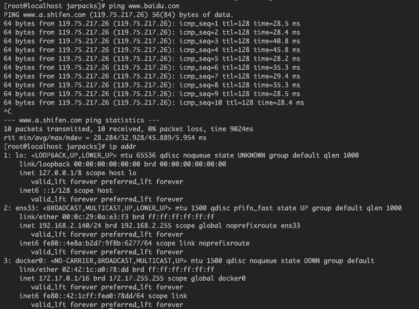

1. 获取虚拟机中linux的mac地址：  
    
1. 访问：/Library/Preferences/VMware\ Fusion/vmnet8/dhcpd.cnf，获取网关、子网掩码等信息：  
    
1. 修改Linux网络配置：  
    ```vi /etc/sysconfig/network-scripts/ifcfg-ens33```  
    
1. 重启网络：  
    ```service restart network```  
    
1. ping一下网络并查看ip
    
    
