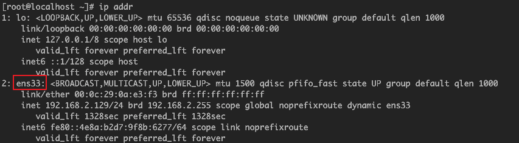
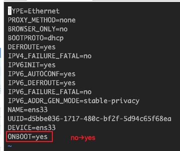

1. vmware配置虚拟机网络模式：NAT
1. 首先查看网卡信息：```ip addr```  
    
1. 修改网卡配置：开机启动``` vi /etc/sysconfig/network-scripts/ifcfg-ens33```
    
1. 重启网卡服务：```systemctl restart network```
1. 获取ip：``` ip addr ```
1. 安装网络工具：  
    ``` sh
    yum install -y net-tools
    ```
1. 查看网关等信息(最终使用‘destination：default’对应的 __网关配置__ )：  
    
1. 固定ip（更改配置文件：ifcfg-ens33）：  
    ``` sh
    BOOTPROTO=static
    IPADDR=192.168.2.129
    NETMASK=255.255.255.0
    GATEWAY=192.168.2.2
    DNS1=223.5.5.5 #添加备用DNS服务器（阿里云）
    DNS2=8.8.8.8 #添加首选DNS服务器（google）
    ```
> 附：  
> LINUX上传下载命令：RZ，SZ支持：```yum -y install lrzsz```

