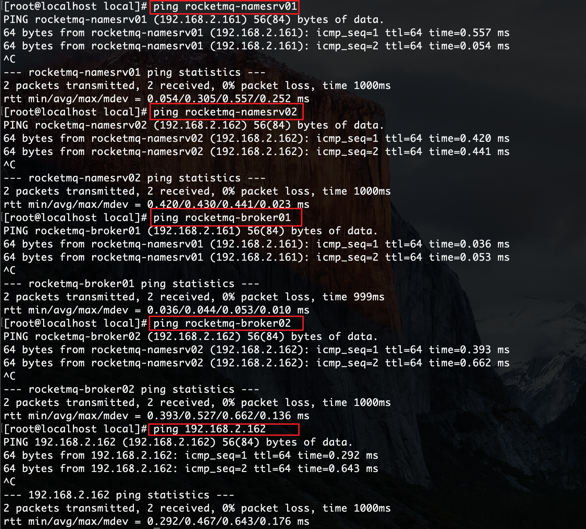
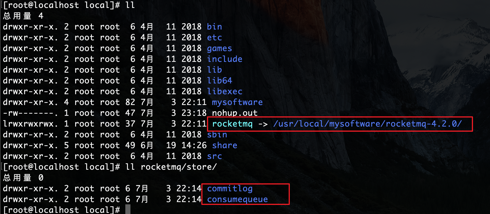
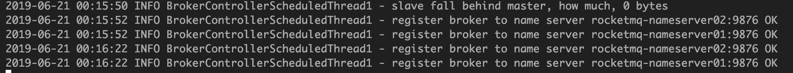
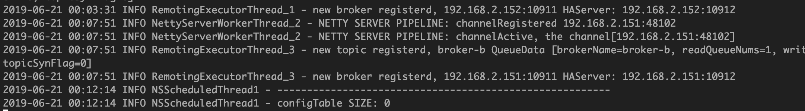
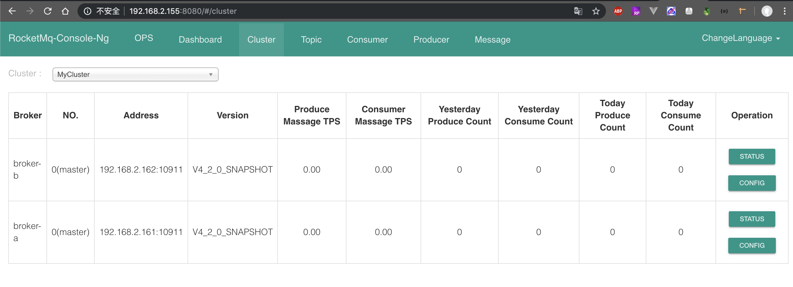

## 一、概述
1. todo

## 二、安装(双master的集群模式)
### 1. 环境准备
1. 配置2台虚拟机并固定ip（例如：192.168.2.161、192.168.2.162）
1. 配置host解析
    1. 更改/etc/hosts文件
        ``` sh
        vim /etc/hosts
        ```
        ``` sh
        # 每一台机器上都启动一个nameserver服务、一个breaker服务
        192.168.2.161 rocketmq-nameserver01
        192.168.2.161 rocketmq-master01
        192.168.2.162 rocketmq-nameserver02
        192.168.2.162 rocketmq-master02
        ```
    1. 重启网络服务： 
        ``` sh
        service network restart
        ```
    1. ping测试：  
        ``` sh
        #192.168.2.161
        ping 192.168.2.162
        ping rocketmq-namesrv02
        ping rocketmq-master02
        #192.168.2.162
        ping 192.168.2.161
        ping rocketmq-namesrv01
        ping rocketmq-master01
        ```  
          
### 3. 安装RocketMQ并启动
1. 安装jdk1.8（略）
1. 下载apache-rocketmq并安装：
    ``` sh
    # 当前目录：/usr/local/mysoftware
    # 下载
    wget http://mirrors.hust.edu.cn/apache/rocketmq/4.2.0/rocketmq-all-4.2.0-bin-release.zip
    # 解压
    unzip rocketmq-all-4.2.0-bin-release.zip -d /rocketmq-4.2.0
    # 建立软连接（可选）
    ln -s /usr/local/mysoftware/rocketmq-4.2.0 /usr/local/rocketmq   
    # 创建数据存储文件夹
    mkdir -p /usr/local/rocketmq/store/commitlog
    mkdir /usr/local/rocketmq/store/consumequeue  
    ```
    效果：    
    
1. 修改配置文件
    1. 2个配置文件都要修改
        ``` sh
        vim /usr/local/rocketmq/conf/2m-noslave/broker-a.properties
        vim /usr/local/rocketmq/conf/2m-noslave/broker-b.properties
        ```
    1. 配置文件的内容 
        ``` sh
        #所属集群名字
        brokerClusterName=MyCluster
        #broker名字，注意此处不同的配置文件填写的不一样 
        brokerName=broker-a
        #0 表示 Master，>0 表示 Slave
        brokerId=0
        #删除文件时间点，默认凌晨 4点
        deleteWhen=04
        #文件保留时间，默认 48 小时
        fileReservedTime=48
        #Broker 的角色
        #- ASYNC_MASTER 异步复制Master 
        #- SYNC_MASTER 同步双写Master 
        #- SLAVE 
        brokerRole=ASYNC_MASTER
        #刷盘方式
        #- ASYNC_FLUSH 异步刷盘 #- SYNC_FLUSH 同步刷盘 
        flushDiskType=ASYNC_FLUSH
        #Broker 对外服务的监听端口
        listenPort=10911
        #nameServer地址，分号分割
        namesrvAddr=rocketmq-namesrv01:9876;rocketmq-namesrv02:9876
        # broker的对外ip(本机ip，不同的主机对应配置不同的ip)
        brokerIP1=192.168.2.161
        #commitLog 存储路径 
        storePathCommitLog=/usr/local/rocketmq/store/commitlog
        #消费队列存储路径存储路径 
        storePathConsumerQueue=/usr/local/rocketmq/store/consumequeue
        ```
1. 修改日志配置文件
    ``` sh
    mkdir -p /usr/local/rocketmq/logs
    cd /usr/local/rocketmq/conf && sed -i 's#${user.home}#/usr/local/rocketmq#g' *.xml
    ```
1. (可选)修改启动脚本参数(虚拟机配置没给够的可以改一下) 
    1. 改nameserver的参数
        ``` sh
        vim /usr/local/rocketmq/bin/runbroker.sh
        ```
        ``` sh
        JAVA_OPT="${JAVA_OPT} -server -Xms1g -Xmx1g -Xmn512m - XX:PermSize=128m -XX:MaxPermSize=320m"
        ```
    1. 改broker的参数
        ``` sh
        vim /usr/local/rocketmq/bin/runserver.sh
        ```
        ``` sh
        JAVA_OPT="${JAVA_OPT} -server -Xms1g -Xmx1g -Xmn512m - XX:PermSize=128m -XX:MaxPermSize=320m"
        ```
1. 启动2台机器的nameserver(相当于activeMQ中的zookeeper)  
    ``` sh
    cd /usr/local/rocketmq/bin
    # 守护线程方式启动
    nohup sh mqnamesrv &
    ```
1. 启动2台机器的broker  
    ``` sh
    cd /usr/local/rocketmq/bin
    nohup sh mqbroker -c /usr/local/rocketmq/conf/2m-noslave/broker-a.properties >/dev/null 2>&1 &
    ```
1. 查看日志：    
    ``` sh
    tail -f -n 500 /usr/local/rocketmq/logs/rocketmqlogs/broker.log
    tail -f -n 500 /usr/local/rocketmq/logs/rocketmqlogs/namesrv.log
    ```  
      
      
### 3. 运行RocketMQ console
1. docker镜像方式（[推荐](https://github.com/apache/rocketmq-externals/tree/master/rocketmq-console)）
    1. 另开一台虚拟机部署docker服务（参照[笔记](https://github.com/zephyrlai/my-dev-note/blob/master/Docker%E7%9B%B8%E5%85%B3/centos7%E4%B8%8Bdocker%E5%AE%89%E8%A3%85.md)）
    1. 拉取对应的docker镜像
        ``` sh
            docker pull styletang/rocketmq-console-ng
        ```
    1. 运行镜像：  
        ``` sh
        docker run -e "JAVA_OPTS=-Drocketmq.namesrv.addr=192.168.2.151:9876;192.168.2.152:9876 -Dcom.rocketmq.sendMessageWithVIPChannel=false" -p 8080:8080 -t styletang/rocketmq-console-ng
        ```
    1. 效果： 
        
### 4. 关闭RocketMQ服务：   
先关闭broker，再关闭nameserver:  
``` sh
#关闭broker
sh bin/mqshutdown broker
#关闭nameserver
sh bin/mqshutdown namesrv
```
### 5.附：完整的rocketmq配置项以及说明（broker-xx.properties）
``` sh
#所属集群名字
brokerClusterName=rocketmq-cluster 
#broker名字，注意此处不同的配置文件填写的不一样 
brokerName=broker-a|broker-b
#0 表示 Master，>0 表示 Slave
brokerId=0
#nameServer地址，分号分割
namesrvAddr=rocketmq-nameserver01:9876;rocketmq-nameserver02:9876
#在发送消息时，自动创建服务器不存在的topic，默认创建的队列数 
defaultTopicQueueNums=4
#是否允许 Broker 自动创建Topic，建议线下开启，线上关闭 
autoCreateTopicEnable=true
#是否允许 Broker 自动创建订阅组，建议线下开启，线上关闭 
autoCreateSubscriptionGroup=true
#Broker 对外服务的监听端口
listenPort=10911
#删除文件时间点，默认凌晨 4点
deleteWhen=04
#文件保留时间，默认 48 小时
fileReservedTime=120
#commitLog每个文件的大小默认1G 
mapedFileSizeCommitLog=1073741824 
#ConsumeQueue每个文件默认存30W条，根据业务情况调整 
mapedFileSizeConsumeQueue=300000 
#destroyMapedFileIntervalForcibly=120000 
#redeleteHangedFileInterval=120000
#检测物理文件磁盘空间
diskMaxUsedSpaceRatio=88
#存储路径
storePathRootDir=/usr/local/rocketmq/store
#commitLog 存储路径 
storePathCommitLog=/usr/local/rocketmq/store/commitlog 
#消费队列存储路径存储路径 
storePathConsumeQueue=/usr/local/rocketmq/store/consumequeue 
#消息索引存储路径
storePathIndex=/usr/local/rocketmq/store/index
#checkpoint 文件存储路径 
storeCheckpoint=/usr/local/rocketmq/store/checkpoint 
#abort 文件存储路径 
abortFile=/usr/local/rocketmq/store/abort 
#限制的消息大小
maxMessageSize=65536
#flushCommitLogLeastPages=4 
#flushConsumeQueueLeastPages=2 
#flushCommitLogThoroughInterval=10000 
#flushConsumeQueueThoroughInterval=60000
#Broker 的角色
#- ASYNC_MASTER 异步复制Master 
#- SYNC_MASTER 同步双写Master 
#- SLAVE 
brokerRole=ASYNC_MASTER
#刷盘方式
#- ASYNC_FLUSH 异步刷盘 #- SYNC_FLUSH 同步刷盘 
flushDiskType=ASYNC_FLUSH
#checkTransactionMessageEnable=false
#发消息线程池数量 
#sendMessageThreadPoolNums=128 
#拉消息线程池数量 
#pullMessageThreadPoolNums=128
```

