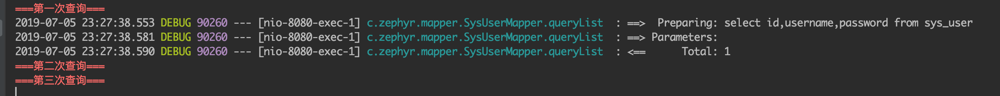

## 目录：

## 一、mapper.xml文件解读
1. namespace：关联到接口方法，起到类似于java类的package的作用
1. resultMap/resultType：
    1. resultMap：在mapper.xml中自定义结果集（通常用于返回比较复杂的查询结果）
    1. resultType：自动将查询结果组装到对应的类（通常用于返回比较简单的或者与已有实体结构对应的结果集）
1. parameterType/parameterMap：
    1. parameterType
    1. parameterMap
1. insert时的自定义id

## 二、缓存
1. 一级缓存（默认开启）
    1. 作用级别（范围）：sqlsession级别，即同一个sqlsession中，重复使用相同的查询语句，则只会执行一次实际的数据库查询，其余的查询则会直接走缓存（缓存命中）
    1. 只有开启了事务，才是在同一个SqlSession实例。默认情况下（不开启事务），每个Mapper的每次查询操作都对应一个全新的SqlSession实例。
    1. 代码示例(开启sql语句的控制台输出)：
        ``` java
        // service
        @Transactional
        public List<SysUser> queryList(){
            System.err.println("===第一次查询===");
            sysUserMapper.queryList();
            System.err.println("===第二次查询===");
            sysUserMapper.queryList();
            System.err.println("===第三次查询===");
            sysUserMapper.queryList();
            return sysUserMapper.queryList();
        }
        ```
    1. 效果：  
          

1. 二级缓存（默认关闭，也不建议使用）
    1. 作用级别（范围）：mapper范围级别
    1. 【不建议开启!】开启方式：在SqlMapConfig.xml设置二级缓存的总开关，还要在具体的mapper.xml中开启二级缓存。

## 三、进阶技能
1. 分页查询
    1. 逻辑分页
    1. 物理分页
1. 批量操作
    1. 多次发送多个SQL
    1. 单次发送单个SQL
    1. 单次发送多个SQL（autoCommit=false）
1. 联合查询
    1. 嵌套结果
    1. 嵌套查询


> https://blog.csdn.net/u012373815/article/details/47069223
