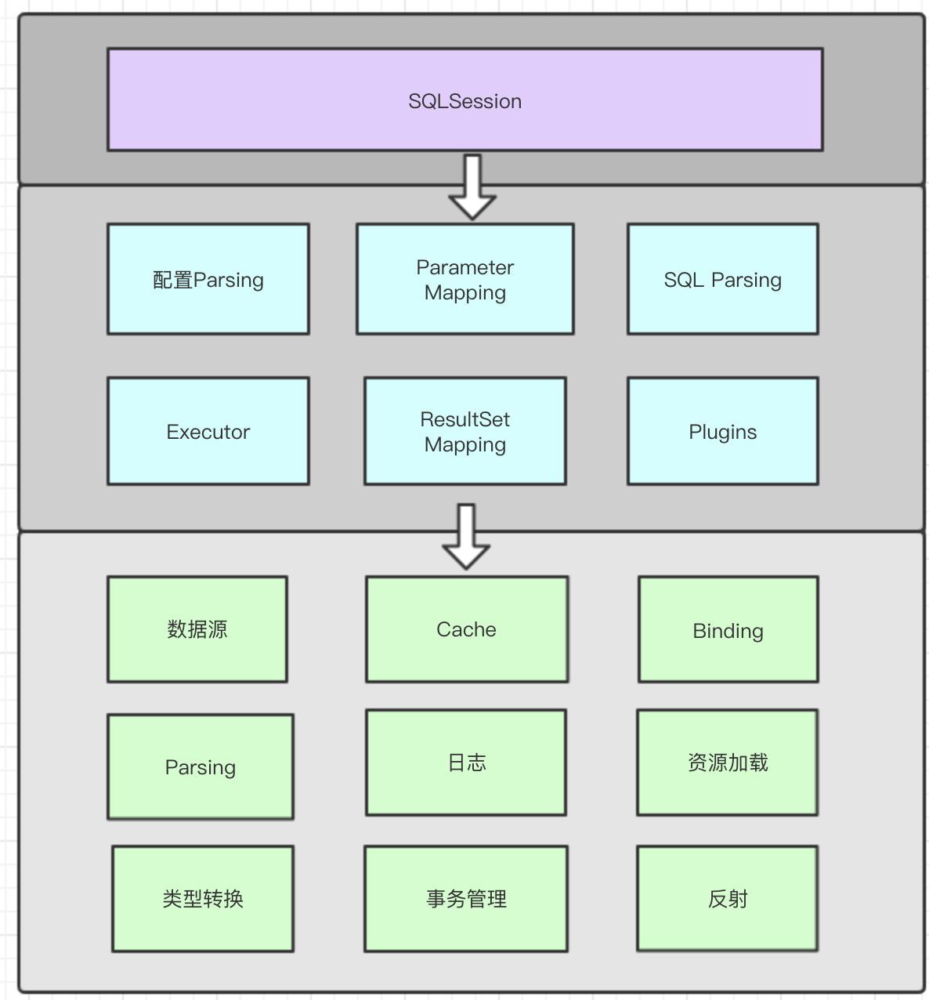
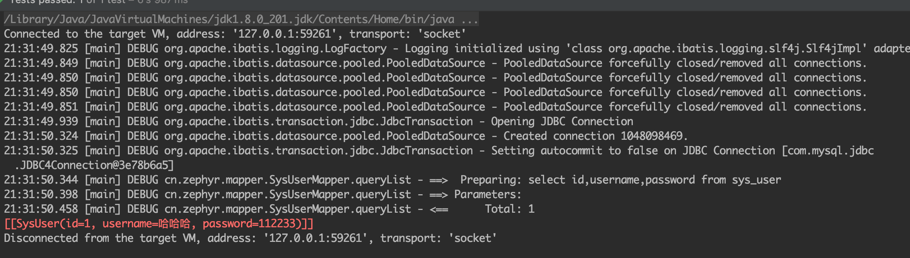
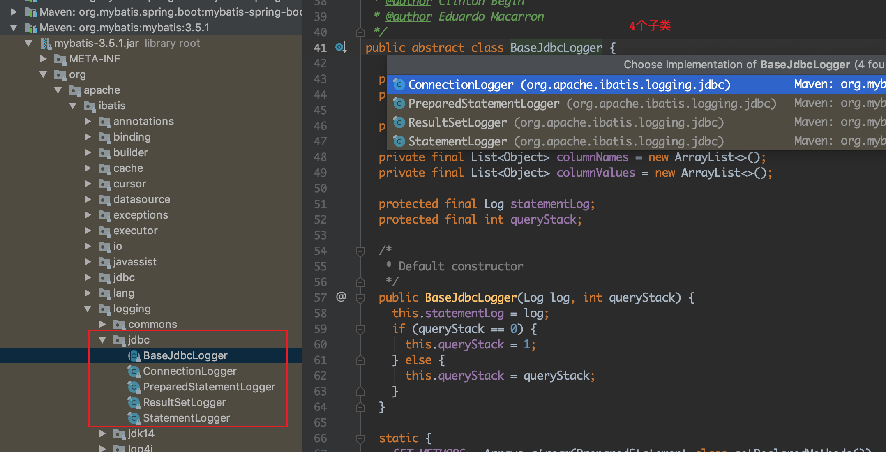
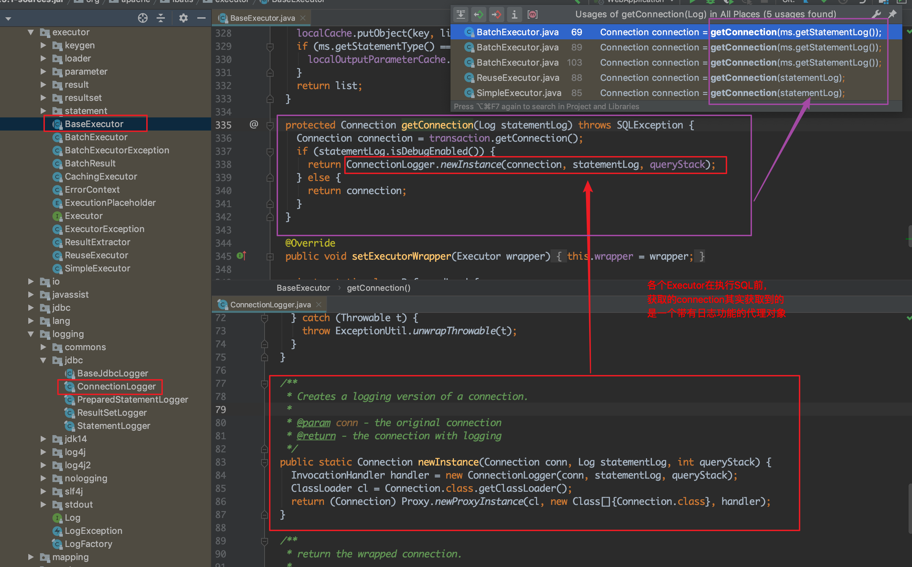
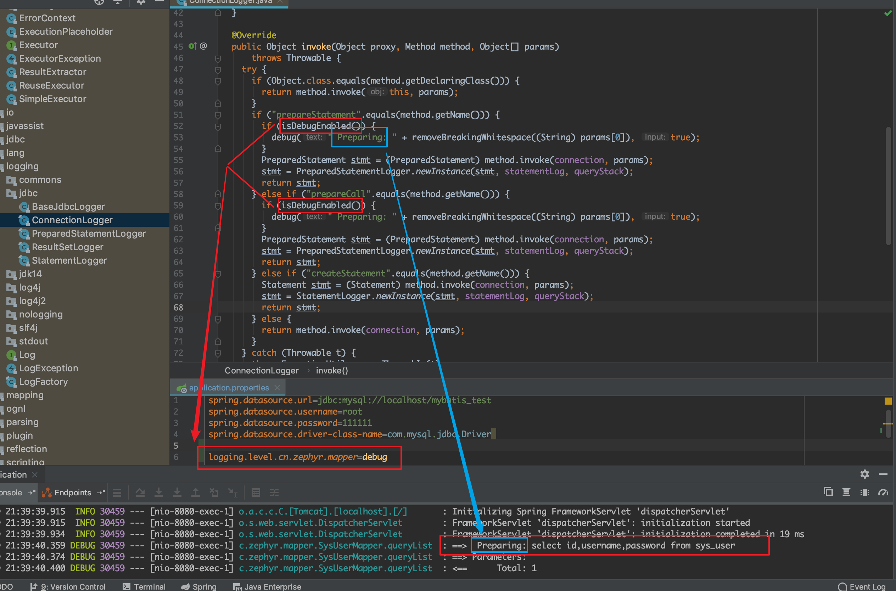
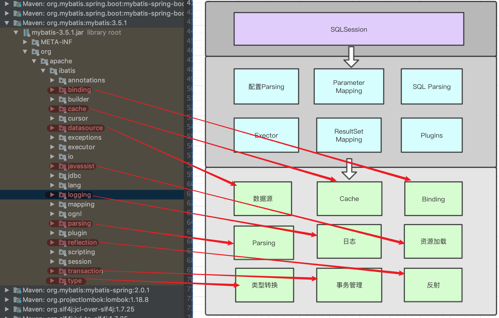
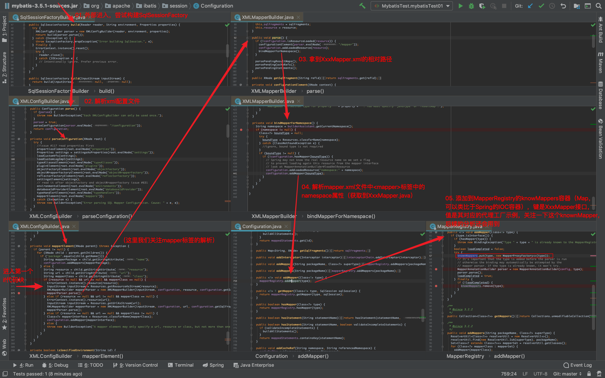
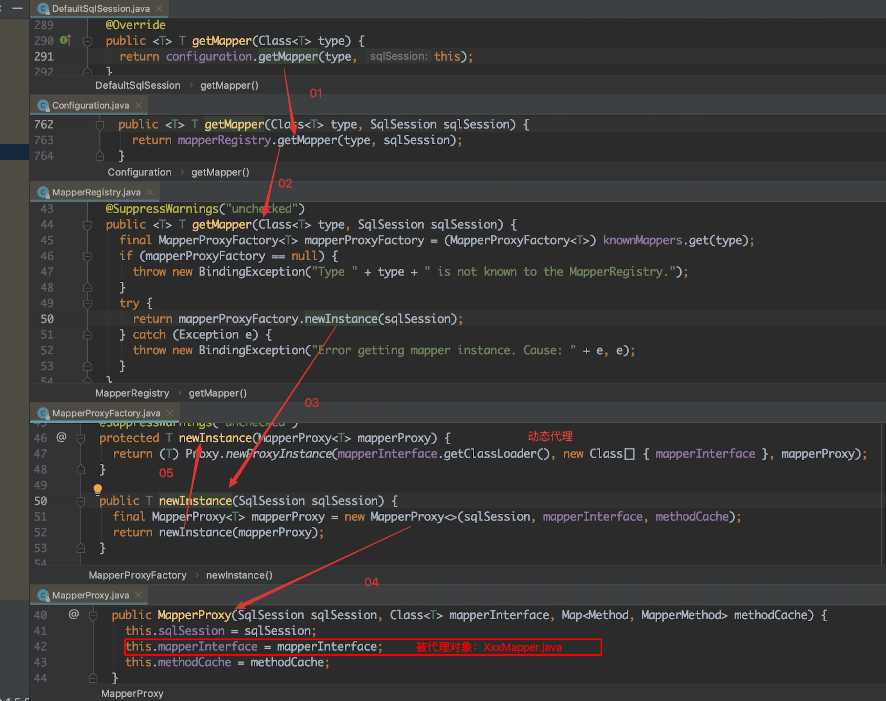
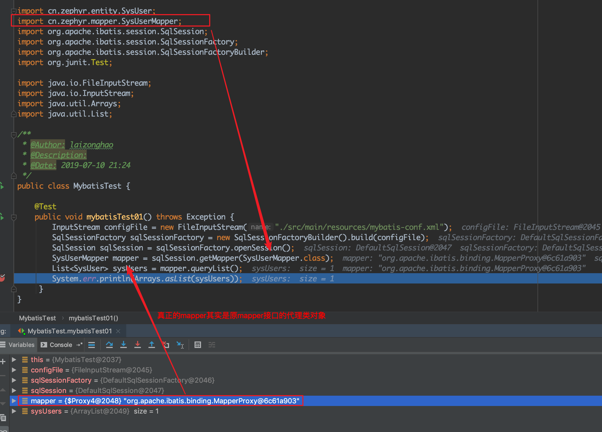

## 目录
1. Mybatis的架构概述
1. 结合源码结构Mybatis的基本执行流程

## 一、Mybatis的架构概述
1. Mybatis的架构概览如图所示：  
    
1. 第一层：SQLsession，直接对外暴露，也是我们最常用的组件：
    ``` xml
    <?xml version="1.0" encoding="UTF-8" ?>
    <!DOCTYPE configuration
            PUBLIC "-//mybatis.org//DTD Config 3.0//EN"
            "http://mybatis.org/dtd/mybatis-3-config.dtd">
    <configuration>
    <!--    <properties resource="db.properties"></properties>-->
        <environments default="development">
            <environment id="development">
                <transactionManager type="JDBC"></transactionManager>
                <dataSource type="POOLED">
                    <property name="driver" value="com.mysql.jdbc.Driver"></property>
                    <property name="url" value="jdbc:mysql://localhost/mybatis_test"></property>
                    <property name="username" value="root"></property>
                    <property name="password" value="111111"></property>
                </dataSource>
            </environment>
        </environments>
        <!--加载映射文件-->
        <mappers>
            <mapper resource="cn/zephyr/mapper/SysUserMapper.xml"></mapper>
        </mappers>
    </configuration>
    ```
    ``` java
        // 根据配置文件获取到SqlSessionFactory
        InputStream configFile = new FileInputStream("./src/main/resources/mybatis-conf.xml");
        // 根据SqlSessionFactory获取sqlSession
        SqlSessionFactory sqlSessionFactory = new SqlSessionFactoryBuilder().build(configFile);
        SqlSession sqlSession = sqlSessionFactory.openSession();
        // 在sqlSession中获取Mapper
        SysUserMapper mapper = sqlSession.getMapper(SysUserMapper.class);
        // 执行SQL查询，获取结果
        List<SysUser> sysUsers = mapper.queryList();
        System.err.println(Arrays.asList(sysUsers));
    ```  
    
1. 第二层：核心功能封装
    1. 配置parsing
    1. Parameter Mapping：查询条件的解析
    1. Sql Parsing：负责XxxMapper.xml或者基于注解（“@Select”等）的sql解析
    1. Executor：负责真正的SQL执行
    1. ResultSet Mapping：结果集映射
    1. Plugins：提供插件支持
1. 第三层：最底层的功能
    1. 数据源：提供数据源支持
    1. 缓存：提供缓存支持
    1. Binding：负责将XxxMapper.java与XxxMapper.xml做双向绑定
    1. 日志：日志输出sql语句的执行日志，内部使用了代理模式，此处略加说明
        1. 抽象类是BaseJdbcLogger，同级包下有4个子类进行集成  
            
        1. 以ConnectionLogger为例，各个Executor在执行sql之前获取到的connection，其实是connection的代理对象，通过代理类实现建立连接时的日志打印：     
              
        1. 再通过配置项，实现对打印日志的开关控制：  
            
    1. 资源加载
    1. 类型转换：负责将Java的数据类型与SQL的数据类型之间的互相转换
    1. 事务管理：Mybatis提供了轻量级的事务管理（很少用，实际项目使用时，通常将Mybatis集成到Spring，这种情况下，事务将由spring统一管理）
    1. 反射：封装了Java的反射方法作为工具类，起到了简化代码的作用  
    1. parsing：负责XxxMapper.xml或者基于注解（“@Select”等）的sql解析（以面向对象的思想来看待mybatis，XxxMapper.java是一个动作，对应的结果实体对应到实际的数据库表是一个名词）  
        


## 二、结合源码结构Mybatis的基本执行流程
### 1. 先说结论
1. 再贴一下原生使用mybatis的示例代码(为了简单，只使用了一个xml配置文件，相关的Java代码都写在单元测试用，pom直接使用了mybatis.springboot.starter)：
    ``` xml
    <?xml version="1.0" encoding="UTF-8" ?>
    <!DOCTYPE configuration
            PUBLIC "-//mybatis.org//DTD Config 3.0//EN"
            "http://mybatis.org/dtd/mybatis-3-config.dtd">
    <configuration>
    <!--    <properties resource="db.properties"></properties>-->
        <environments default="development">
            <environment id="development">
                <transactionManager type="JDBC"></transactionManager>
                <dataSource type="POOLED">
                    <property name="driver" value="com.mysql.jdbc.Driver"></property>
                    <property name="url" value="jdbc:mysql://localhost/mybatis_test"></property>
                    <property name="username" value="root"></property>
                    <property name="password" value="111111"></property>
                </dataSource>
            </environment>
        </environments>
        <!--加载映射文件-->
        <mappers>
            <mapper resource="cn/zephyr/mapper/SysUserMapper.xml"></mapper>
        </mappers>
    </configuration>
    ```  
    ``` java
        // 1. 读取配置文件
        InputStream configFile = new FileInputStream("./src/main/resources/mybatis-conf.xml");
        // 2. 根据配置文件获取到SqlSessionFactory
        SqlSessionFactory sqlSessionFactory = new SqlSessionFactoryBuilder().build(configFile);
        // 3. 根据SqlSessionFactory获取sqlSession
        SqlSession sqlSession = sqlSessionFactory.openSession();
        // 4. 在sqlSession中获取Mapper
        SysUserMapper mapper = sqlSession.getMapper(SysUserMapper.class);
        // 5. 执行SQL查询，获取结果
        List<SysUser> sysUsers = mapper.queryList();
        System.err.println(Arrays.asList(sysUsers));
    ``` 
1. 结论：  
    1. 首先读取配置文件，这里我们需要关注的是xml文件的```<mappers>```标签，这个配置告知了mybatis项目中用到的Mapper.xml文件；
    1. mybatis解析到之后，将其存储到类似于Spring的IOC容器一样的一个容器中（Map）,与Spring不同的是，容器中对应的实例是一个个代理对象的工厂对象（MapperProxyFactory），至此完成xml配置文件解析；
    1. 然后根据class获取对应的mapper的时候，直接在容器（knownMappers）中拿到对应代理对象的工厂对象(MapperProxyFactory)，生成对应的代理对象后返回（我们实际使用时，也是在使用这个代理对象）
### 2. 结论验证：
1. 第一步：加载配置文件到IO流；  
    ``` java
        InputStream configFile = new FileInputStream("./src/main/resources/mybatis-conf.xml");
    ```
1. 第二步：解析配置文件；  
    ``` java
        SqlSessionFactory sqlSessionFactory = new SqlSessionFactoryBuilder().build(configFile);
    ```    
    这一步主要做的事情就是根据配置文件获取所有的Mapper.xml，从而获取Mapper接口类，并以Mapper接口类为键，对应的代理工厂对象为值，存储到一个Mapper容器(knownMappers)中。这一步整体的代码执行流程如下图所示：  
        
1. 第三步：获取sqlSession（此处暂不展开分析）;  
    ``` java
        SqlSession sqlSession = sqlSessionFactory.openSession();
    ```
1. 第四步：根据Mapper接口类获取实现类（动态代理生成的对象）；  
    ``` java 
        sqlSession.getMapper(SysUserMapper.class)；
    ```  
    这一步就根据接口类，从之前的容器（knownMappers）中拿到对应的代理工厂对象，生成对应的代理对象并将其返回，这一步整体的代码执行流程如下：  
      
    通过断点可以看到，最终拿到的对象实现类对象是一个代理对象
      
1. 第五步：调用Executor执行sql
    ``` sql
        List<SysUser> sysUsers = mapper.queryList();
    ```


