1. 概述：
    1. MongoDB属于nosql数据库，与同属nosql的redis不同，redis是kv数据库（键值对），而MongoDB是文档型数据库，存储的是文档(这里的文档指的是bson数据，而bson就是json的二进制化)
    1. 运行机制：内部执行引擎为JS解释器, 把文档存储成bson结构,在查询时,转换为JS对象；  
        
    1. MongoDB与MySQL的区别
        1. MySQL（传统型数据库）: 结构化数据, 定好了表结构后,每一行的内容,必是符合表结构的,就是说，列的个数,类型都一样.
        1. MongoDB（文档型数据库）: 表下的每篇文档（bson）,都可以有自己独特的结构(json对象都可以有自己独特的属性和值)
1. 安装：
1. quick start
    1. mongodb在架构上总体与mysql比较类似，在学习的时候可与之比较并记忆，MongoDB的collection相当于MySQL的table；
    1. 入门命令
        1. 查看所有的数据库：```show dbs```  
        1. 选库：```use databaseName ```
        1. 查看当前库下的collection：```show tables/collections ```
        1. 创建库:Mongodb的库是隐式创建,你可以use 一个不存在的库,然后在该库下创建collection,即可创建库
        1. 创建collection：```db.createCollection(‘collectionName’) ``` 
        1. collection允许隐式创建：```db.collectionName.insert(document);```
        1. 删除collection：```db.collectionName.drop()``` ,
        1. 删除database：```db.dropDatabase(); ```   
            
1. 基本操作增删改查
    1. 增
        1. 介绍: mongodb存储的是文档,. 文档是json格式的对象.
        1. 语法: ```db.collectionName.isnert(document);```  
            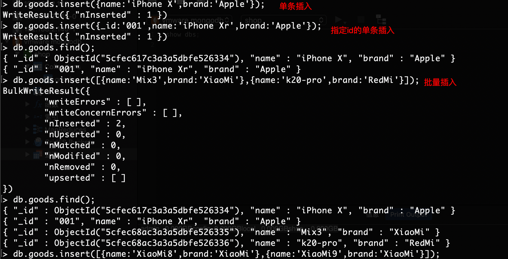
    1. 删
        1. 语法: ```db.collection.remove(查询表达式, 选项);```，选项是指  {justOne:true/false},是否只删一行, 默认为false  
            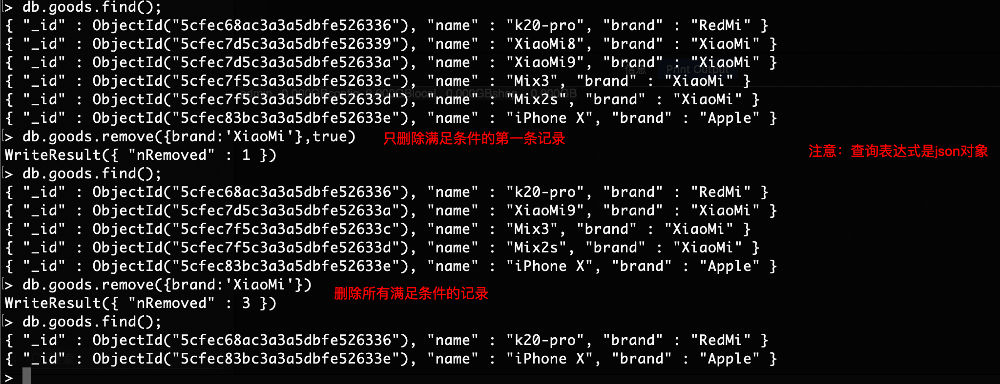
        1. 注意
            1. 查询表达式依然是个json对象
            1. 查询表达式匹配的行,将被删掉.
            1. 如果不写查询表达式,collections中的所有文档将被删掉.  
    1. 改
        1. 三步走：
            1. 改什么？ --> 查询表达式
            1. 改成什么样? --> 新值 或 赋值表达式
            1. 操作选项(Option) --> 可选参数
        1. 语法（新文档直接替换了旧文档,而不是修改）:   
            ```db.collection.update(查询表达式,新值,选项);```  
            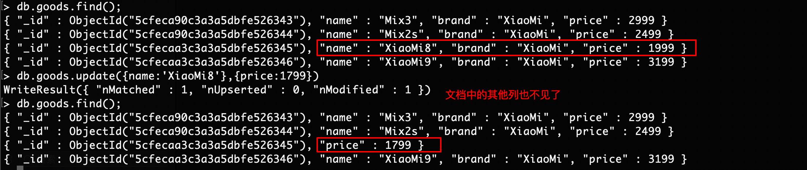
        1. 如果是想修改文档的某列(而不影响到其他列),可以用$set关键字  
            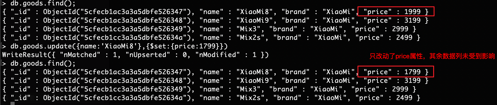
        1. 修改时的赋值表达式
            1. ```$set```  修改某列的值
            1. ```$unset``` 删除某个列
            1. ```$rename``` 重命名某个列
            1. ```$inc``` 增长某个列
            1. ```$setOnInsert``` 当upsert为true时,并且发生了insert操作时,可以补充的字段.  
            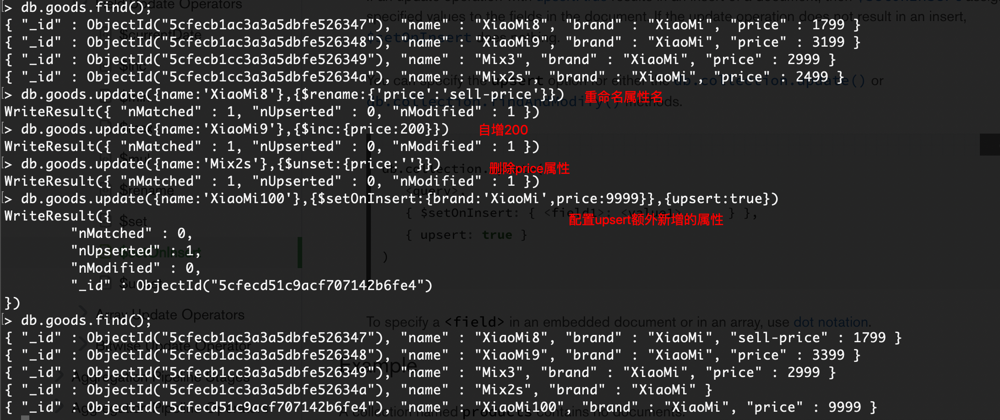
        1. 操作选项Option:  
            1. 语法：```{upsert:true/false,multi:true/false}```  
            1. 参数说明：
                1. upsert：是指没有匹配的行,则直接插入该行.(和mysql中的replace一样)
                1. multi: 是指修改多行(即使查询表达式命中多行,默认也只改1行,如果想改多行,可以用此选项)
            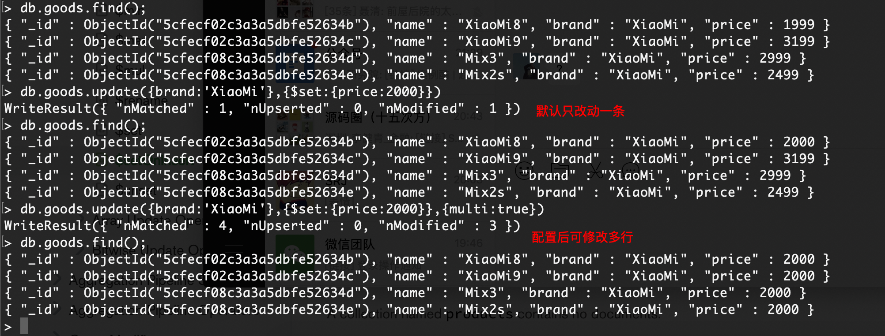
    1. 查
        1. 语法: 
            ``` sh
            db.collection.find(查询表达式,查询的列);
            db.collections.find(表达式,{列1:1,列2:1});
            ```
        1. 效果：  
            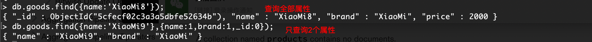
1. 查询表达式
1. 游标操作
1. 索引创建与使用
1. 导出与导入
1. 用户管理
1. 集群
1. 分片
1. 集群与分片的结合使用
1. group
1. aggregate聚合
    1. 介绍一下聚合框架中常用的几个操作：
        1. $group（相当于MySQL中的group by）：将集合中的文档分组，可用于统计结果。
        1. $match（相当于MySQL中的where或having）：用于过滤数据，只输出符合条件的文档。$match使用MongoDB的标准查询操作。  
        1. $project（相当于MySQL中的select）：修改输入文档的结构。可以用来重命名、增加或删除域，也可以用于创建计算结果以及嵌套文档。
        1. $limit（相当于MySQL中的limit）：用来限制MongoDB聚合管道返回的文档数。
        1. $skip：在聚合管道中跳过指定数量的文档，并返回余下的文档。
        1. $unwind：将文档中的某一个数组类型字段拆分成多条，每条包含数组中的一个值。
        1. $sort（相当于MySQL中的sort）：将输入文档排序后输出。
        1. $sum（相当于MySQL中的count()或sum() ）: 求和
    1. 注意：$match放在$group之前，相当于MySQL中的where；$match放在$group之后，相当于MySQL中的having
    1. 测试用基础数据：  
        ``` json
        [{"goods_id":1,"cat_id":4,"goods_name":"KD876","goods_number":1,"click_count":7,"shop_price":1388.00,"add_time":1240902890},{"goods_id":4,"cat_id":8,"goods_name":"\u8bfa\u57fa\u4e9aN85\u539f\u88c5\u5145\u7535\u5668","goods_number":17,"click_count":0,"shop_price":58.00,"add_time":1241422402},{"goods_id":3,"cat_id":8,"goods_name":"\u8bfa\u57fa\u4e9a\u539f\u88c55800\u8033\u673a","goods_number":24,"click_count":3,"shop_price":68.00,"add_time":1241422082},{"goods_id":5,"cat_id":11,"goods_name":"\u7d22\u7231\u539f\u88c5M2\u5361\u8bfb\u5361\u5668","goods_number":8,"click_count":3,"shop_price":20.00,"add_time":1241422518},{"goods_id":6,"cat_id":11,"goods_name":"\u80dc\u521bKINGMAX\u5185\u5b58\u5361","goods_number":15,"click_count":0,"shop_price":42.00,"add_time":1241422573},{"goods_id":7,"cat_id":8,"goods_name":"\u8bfa\u57fa\u4e9aN85\u539f\u88c5\u7acb\u4f53\u58f0\u8033\u673aHS-82","goods_number":20,"click_count":0,"shop_price":100.00,"add_time":1241422785},{"goods_id":8,"cat_id":3,"goods_name":"\u98de\u5229\u6d669@9v","goods_number":1,"click_count":9,"shop_price":399.00,"add_time":1241425512},{"goods_id":9,"cat_id":3,"goods_name":"\u8bfa\u57fa\u4e9aE66","goods_number":4,"click_count":20,"shop_price":2298.00,"add_time":1241511871},{"goods_id":10,"cat_id":3,"goods_name":"\u7d22\u7231C702c","goods_number":7,"click_count":11,"shop_price":1328.00,"add_time":1241965622},{"goods_id":11,"cat_id":3,"goods_name":"\u7d22\u7231C702c","goods_number":1,"click_count":0,"shop_price":1300.00,"add_time":1241966951},{"goods_id":12,"cat_id":3,"goods_name":"\u6469\u6258\u7f57\u62c9A810","goods_number":8,"click_count":13,"shop_price":983.00,"add_time":1245297652}]
        ```  
        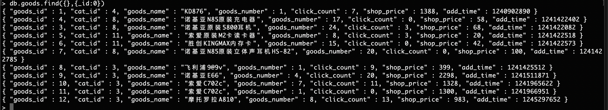
    1. 练习
        1. 分组统计每个类别下的商品数量
            ``` sh
            db.goods.aggregate({$group:{_id:'$cat_id',storage:{$sum:'$goods_number'}}})
            ```  
            
        1. 统计所有商品总数  
            ``` sh
            db.goods.aggregate({$group:{_id:null,storage:{$sum:'$goods_number'}}})
            ```
            
        1. 分组统计每个类别下，价格大于50元的商品个数
            ``` sh
            db.goods.aggregate(
                {$match:{shop_price:{$gt:50}}},
                {$group:{_id:'$cat_id',storage:{$sum:'$goods_number'}}}
            );
            ```    
            
        1. 分组统计每个栏目下价格大于50元的商品个数，并筛选出"满足条件的商品个数"大于等于10的栏目 
            ``` sh
            db.goods.aggregate(
                {$match:{shop_price:{$gt:50}}},
                {$group:{_id:'$cat_id',storage:{$sum:'$goods_number'}}},
                {$match:{storage:{$gte:10}}}
            );
            ```  
            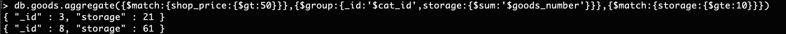
        1. 分组查询每个栏目下的库存量,并按库存量倒序排序
            ``` sh
            db.goods.aggregate(
                {$match:{shop_price:{$gt:50}}},
                {$group:{_id:'$cat_id',storage:{$sum:'$goods_number'}}},
                {$sort:{storage:-1}}
            );
            ```
            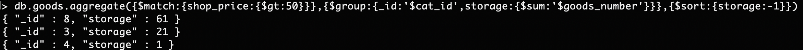
        1. 分组查询每个栏目的商品平均价格,并按平均价格由高到低排序后取第二个
            ``` sh
            [
                {$group:{_id:"$cat_id" , avg:{$avg:"$shop_price"}}},
                {$sort:{avg:-1}}
            ]
            ```
            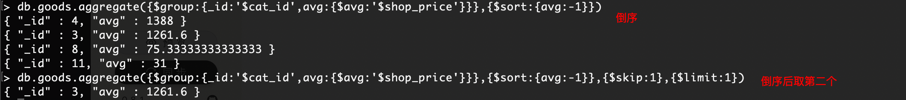
1. mapReduce

1. 参考资料
> https://docs.mongodb.com/manual/
> https://www.runoob.com/mongodb/mongodb-tutorial.html