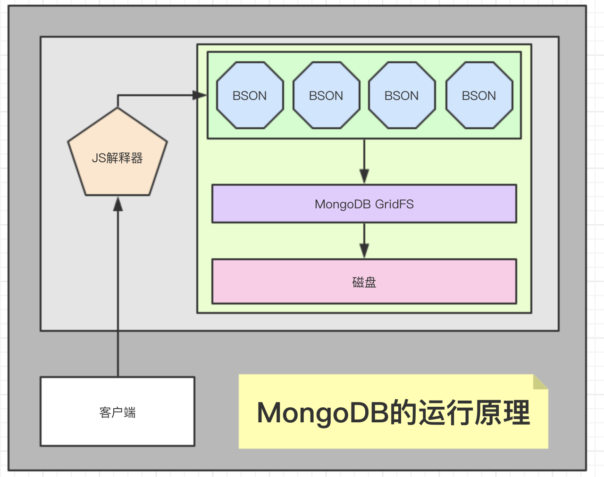

1. 概述：
    1. MongoDB属于nosql数据库，与同属nosql的redis不同，redis是kv数据库（键值对），而MongoDB是文档型数据库，存储的是文档(这里的文档指的是bson数据，而bson就是json的二进制化)
    1. 运行机制：内部执行引擎为JS解释器, 把文档存储成bson结构,在查询时,转换为JS对象；  
        
    1. MongoDB与MySQL的区别
        1. MySQL（传统型数据库）: 结构化数据, 定好了表结构后,每一行的内容,必是符合表结构的,就是说，列的个数,类型都一样.
        1. MongoDB（文档型数据库）: 表下的每篇文档（bson）,都可以有自己独特的结构(json对象都可以有自己独特的属性和值)
1. 安装：
    1. 下载mongodb www.mongodb.org  下载最新的stable版
    1. 解压文件
    1. 不用编译,本身就是编译后的二进制可执行文件
    1.
    1. 各二进制可执行文件的含义
    1. 服务器启动
    1. 客户端连接
    1. 小型启动

./bin/mongod --dbpath /usr/local/mysoftware/mongo/data --logpath /usr/local/mysoftware/mongo/log/mongodb4.log --fork  --port 27017 --bind_ip 0.0.0.0 --auth
1. 参考资料
> https://docs.mongodb.com/manual/
> https://www.runoob.com/mongodb/mongodb-tutorial.html