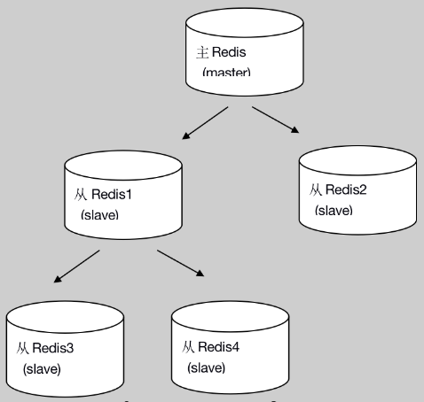

## 一、 单主机多从机的集群
### 1. Redis主从复制
#### 1.1 什么是主从复制
持久化保证了即使redis服务重启也不会丢失数据，因为redis服务重启后会将硬盘上持久化的数据恢复到内存中，但是当单节点部署的redis服务器的硬盘损坏了可能会导致数据丢失，不过通过redis的主从复制机制就可以避免这种单点故障，如下图：  
  
* 主redis中的数据有两个副本（replication）即从redis1和从redis2，即使一台redis服务器宕机其它两台redis服务也可以继续提供服务。
* 主redis中的数据和从redis上的数据保持实时同步，当主redis写入数据时通过主从复制机制会复制到两个从redis服务上。
* 只有一个主redis，可以有多个从redis。
* 主从复制不会阻塞master，在同步数据时，master 可以继续处理client请求
* 一个redis可以即是主又是从(即：一个从机(B)下面还可以挂靠多个从机(D、E)，这时B是D、E的主机)，如下图：  
    
#### 1.2 主从集群的配置示意
* 2.1.1 准备3个redis节点  
    虚拟机中练习时，可以将redis.conf复制三份（6379.conf、6378.conf、6377.conf），分别启动模拟：
    ``` sh
        # 复制redis.conf时，需要分别改动如下配置（以6377.conf为例，虚拟机当前ip：192.168.2.151）
        bind 127.0.0.1 192.168.2.151
        port 6377
        pidfile /var/run/redis_6377.pid
        # The working directory.
        dir ./data/6377/
        # The filename where to dump the DB
        # Note that you must specify a directory here, not a file name.
        dbfilename dump_6377.rdb
    ```
* 2.1.1 主redis配置（6379）  
    无需特殊配置。
* 2.1.2 从redis配置（6378、6377）    
    ``` sh
    # slaveof <masterip> <masterport>
    slaveof 192.168.2.151 6379
    ```
* 2.1.3 分别启动6379、6378、6377，可以看到6379为主节点，6378、6377为从节点：
    ``` sh
    ./redis-server 6379.conf
    ./redis-server 6378.conf
    ./redis-server 6377.conf
    ```
    ``` sh
    [root@localhost bin]# ./redis-cli -p 6379
    127.0.0.1:6379> info Replication
    # Replication
    role:master
    connected_slaves:1
    slave0:ip=127.0.0.1,port=6378,state=online,offset=203998,lag=0
    slave1:ip=127.0.0.1,port=6377,state=online,offset=203998,lag=0
    master_replid:273572c488fdaf5c00fd417c6c7966266fc0c6ac
    master_replid2:459a45607e8a4d4e4631abef48980db178ee69ad
    master_repl_offset:203998
    second_repl_offset:43684
    repl_backlog_active:1
    repl_backlog_size:1048576
    repl_backlog_first_byte_offset:1
    repl_backlog_histlen:203998
    127.0.0.1:6379>
    ```

* 2.1.4 在主节点中（6379）存入值，可以在从节点（6378、6377）中读取到，而在从节点中设置新值会报错，因为从节点是只读的：
    ``` sh
    [root@localhost bin]# ./redis-cli -p 6379
    127.0.0.1:6379> set k1 v1
    OK
    127.0.0.1:6379>
    ```
    ``` sh
    [root@localhost bin]# ./redis-cli -p 6378
    127.0.0.1:6378> keys *
    1) "k1"
    127.0.0.1:6378> get k1
    "v1"
    127.0.0.1:6378> set k2 v2
    (error) READONLY You can't write against a read only replica.
    127.0.0.1:6378>
    ```
#### 1.3 实现原理
* slave第一次或者重连到master上以后，会向master发送一个```SYNC```的命令
* master收到```SYNC```的时候，会做两件事
    * 执行```bgsave```（rdb的快照文件）
    * master会把新收到的修改命令存入到缓冲区
* 缺点：没有办法对master进行动态选举（即：当唯一的主机宕机之后，无法产生新的主机）

### 二、 基于Redis哨兵机制实现主备切换
#### 2.1 什么是Redis哨兵机制
* 简介  
    * Sentinel(哨兵)进程是用于监控redis集群中Master主服务器工作的状态，在Master主服务器发生故障的时候，可以实现Master和Slave服务器的切换，保证系统的高可用。
    * Sentinel也可以以集群方式部署。
* 哨兵进程的作用
    * 监控(Monitoring): 哨兵(sentinel) 会不断地检查你的Master和Slave是否运作正常。
    * 提醒(Notification)：当被监控的某个Redis节点出现问题时, 哨兵(sentinel) 可以通过 API 向管理员或者其他应用程序发送通知。
    * 自动故障迁移(Automatic failover)：当一个Master不能正常工作时，哨兵(sentinel) 会开始一次自动故障迁移操作。
        * 它会将失效Master的其中一个Slave升级为新的Master, 并让失效Master的其他Slave改为复制新的Master；
        * 当客户端试图连接失效的Master时，集群也会向客户端返回新Master的地址，使得集群可以使用现在的Master替换失效Master。（原失效master将变为新master的slave）
        * Master和Slave服务器切换后，Master的redis.conf、Slave的redis.conf和sentinel.conf的配置文件的内容都会发生相应的改变，即：Master主服务器的redis.conf配置文件中会多一行slaveof的配置，sentinel.conf的监控目标会随之调换。
* 哨兵进程的工作方式
    * 每个Sentinel（哨兵）进程以每秒钟一次的频率向整个集群中的Master主服务器，Slave从服务器以及其他Sentinel（哨兵）进程发送一个 ```PING``` 命令。
    * 如果一个实例（instance）距离最后一次有效回复 ```PING``` 命令的时间超过 ```down-after-milliseconds``` 选项所指定的值， 则这个实例会被 Sentinel（哨兵）进程标记为 __主观下线（SDOWN）__。
    * 如果一个Master主服务器被标记为 __主观下线（SDOWN）__，则正在监视这个Master主服务器的所有 Sentinel（哨兵）进程要以每秒一次的频率确认Master主服务器的确进入了主观下线状态。
    * 当有足够数量（大于配置的```quorum```）的 Sentinel（哨兵）进程（大于等于配置文件指定的值）在指定的时间范围内确认Master主服务器进入了 __主观下线状态（SDOWN）__， 则Master主服务器会被标记为 __客观下线（ODOWN）__。
    * 在一般情况下， 每个 Sentinel（哨兵）进程会以每 10 秒一次的频率向集群中的所有Master主服务器、Slave从服务器发送 ```INFO``` 命令。
    * 当Master主服务器被 Sentinel（哨兵）进程标记为 __客观下线（ODOWN）__ 时，Sentinel（哨兵）进程向下线的 Master主服务器的所有 Slave从服务器发送 INFO 命令的频率会从 10 秒一次改为每秒一次。
    * 若没有足够数量的 Sentinel（哨兵）进程同意 Master主服务器下线， Master主服务器的客观下线状态就会被移除。若 Master主服务器重新向 Sentinel（哨兵）进程发送 ```PING``` 命令返回有效回复，Master主服务器的主观下线状态就会被移除。
#### 2.2 Redis哨兵集群配置
* 将redis源码包下的sentinel.conf复制到安装目录下
    ``` sh
        cp ../../redis-5.0.5/sentinel.conf  26379-sentinel.conf
        cp ../../redis-5.0.5/sentinel.conf  26378-sentinel.conf
    ```
* 修改sentinel.conf的主节点信息（下面的内容以26378节点为例），
    ``` sh
    # 修改sentinel.conf的主节点信息（下面的内容以26378节点为例），
    bind 127.0.0.1 192.168.2.151
    port 26378
    # 后台模式
    # daemonize yes
    pidfile "/var/run/redis-sentinel_26378.pid"
    # dir <working-directory>
    dir "/usr/local/redis/bin/data/sentinel/26378"
    # quorum表示哨兵集群中超过这个数字的节点认为主节点SDOWN,则该主节点就变为ODOWN
    # sentinel monitor <master-name> <ip> <redis-port> <quorum>
    sentinel monitor mymaster 192.168.2.151 6379 2
    ```
* 启动2个节点的哨兵服务，可以发现成功连接上了主从节点，哨兵节点之间也连接成功，具体日志如下
    ``` sh
    22172:X 16 Oct 2019 11:00:20.759 # oO0OoO0OoO0Oo Redis is starting oO0OoO0OoO0Oo
    22172:X 16 Oct 2019 11:00:20.759 # Redis version=5.0.5, bits=64, commit=00000000, modified=0, pid=22172, just started
    22172:X 16 Oct 2019 11:00:20.759 # Configuration loaded
    22172:X 16 Oct 2019 11:00:20.760 * Increased maximum number of open files to 10032 (it was originally set to 1024).
                    _._
            _.-``__ ''-._
        _.-``    `.  `_.  ''-._           Redis 5.0.5 (00000000/0) 64 bit
    .-`` .-```.  ```\/    _.,_ ''-._
    (    '      ,       .-`  | `,    )     Running in sentinel mode
    |`-._`-...-` __...-.``-._|'` _.-'|     Port: 26379
    |    `-._   `._    /     _.-'    |     PID: 22172
    `-._    `-._  `-./  _.-'    _.-'
    |`-._`-._    `-.__.-'    _.-'_.-'|
    |    `-._`-._        _.-'_.-'    |           http://redis.io
    `-._    `-._`-.__.-'_.-'    _.-'
    |`-._`-._    `-.__.-'    _.-'_.-'|
    |    `-._`-._        _.-'_.-'    |
    `-._    `-._`-.__.-'_.-'    _.-'
        `-._    `-.__.-'    _.-'
            `-._        _.-'
                `-.__.-'

    22172:X 16 Oct 2019 11:00:20.763 # WARNING: The TCP backlog setting of 511 cannot be enforced because /proc/sys/net/core/somaxconn is set to the lower value of 128.
    22172:X 16 Oct 2019 11:00:20.766 # Sentinel ID is a0307a69e3749af20c96c62c1ef90a4027a133be
    22172:X 16 Oct 2019 11:00:20.766 # +monitor master mymaster 127.0.0.1 6379 quorum 2
    22172:X 16 Oct 2019 11:00:20.767 * +slave slave 127.0.0.1:6378 127.0.0.1 6378 @ mymaster 127.0.0.1 6379
    22172:X 16 Oct 2019 11:00:20.768 * +slave slave 127.0.0.1:6377 127.0.0.1 6377 @ mymaster 127.0.0.1 6379
    22172:X 16 Oct 2019 11:00:49.840 * +sentinel sentinel 7d45fe6dd0fcb54094e8bd08b86462c074ad023e 127.0.0.1 26378 @ mymaster 127.0.0.1 6379
    ```
* 使用```./redis-cli -p 26379```连接哨兵节点，可以看到主节点、从节点、哨兵节点的信息：
    ``` sh
    127.0.0.1:26379> info Sentinel
    # Sentinel
    sentinel_masters:1
    sentinel_tilt:0
    sentinel_running_scripts:0
    sentinel_scripts_queue_length:0
    sentinel_simulate_failure_flags:0
    master0:name=mymaster,status=ok,address=127.0.0.1:6379,slaves=2,sentinels=2
    ```

* 主备切换测试：使用```./redis-cli -p 6379 shutdown```将主节点停机，30s后，可以发现哨兵集群自动实现了主备切换（6379 -> 6377），哨兵节点的日志如下：
    ``` sh
    22172:X 16 Oct 2019 11:06:32.808 # +sdown master mymaster 127.0.0.1 6379
    22172:X 16 Oct 2019 11:06:32.900 # +new-epoch 1
    22172:X 16 Oct 2019 11:06:32.901 # +vote-for-leader 7d45fe6dd0fcb54094e8bd08b86462c074ad023e 1
    22172:X 16 Oct 2019 11:06:33.912 # +odown master mymaster 127.0.0.1 6379 #quorum 2/2
    22172:X 16 Oct 2019 11:06:33.912 # Next failover delay: I will not start a failover before Wed Oct 16 11:12:33 2019
    22172:X 16 Oct 2019 11:06:34.064 # +config-update-from sentinel 7d45fe6dd0fcb54094e8bd08b86462c074ad023e 127.0.0.1 26378 @ mymaster 127.0.0.1 6379
    22172:X 16 Oct 2019 11:06:34.064 # +switch-master mymaster 127.0.0.1 6379 127.0.0.1 6377
    22172:X 16 Oct 2019 11:06:34.064 * +slave slave 127.0.0.1:6378 127.0.0.1 6378 @ mymaster 127.0.0.1 6377
    22172:X 16 Oct 2019 11:06:34.064 * +slave slave 127.0.0.1:6379 127.0.0.1 6379 @ mymaster 127.0.0.1 6377
    ```  
* 此时通过进入6377客户端，可以看到，以及变为主节点，6378为其从节点：  
    ``` sh
    [root@localhost bin]# ./redis-cli -p 6377
    127.0.0.1:6377> info Replication
    # Replication
    role:master
    connected_slaves:1
    slave0:ip=127.0.0.1,port=6378,state=online,offset=126516,lag=0
    slave1:ip=127.0.0.1,port=6379,state=online,offset=126516,lag=0
    master_replid:273572c488fdaf5c00fd417c6c7966266fc0c6ac
    master_replid2:459a45607e8a4d4e4631abef48980db178ee69ad
    master_repl_offset:126516
    second_repl_offset:43684
    repl_backlog_active:1
    repl_backlog_size:1048576
    repl_backlog_first_byte_offset:1
    repl_backlog_histlen:126516
    ```
