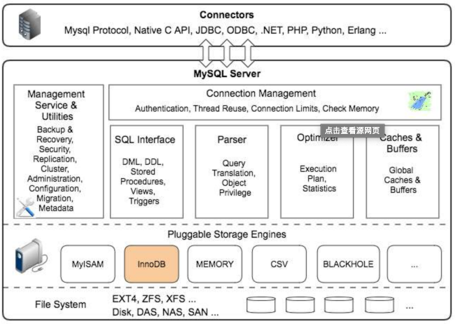
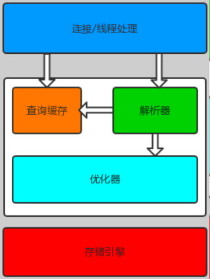

## 03、MySQL架构与索引概述
### MySQL架构


* Connectors
    指的是不同语言中与SQL的交互
* Management Serveices & Utilities：   
    系统管理和控制工具
    * Connection Pool: 连接池
    * 管理缓冲用户连接，线程处理等需要缓存的需求。
    * 负责监听对 MySQL Server 的各种请求，接收连接请求，转发所有连接请求到线程管理模块。每一个连接上 MySQL Server 的客户端请求都会被分配（或创建）一个连接线程为其单独服务。
    * 而连接线程的主要工作就是负责 MySQL Server 与客户端的通信，接受客户端的命令请求，传递 Server 端的结果信息等。线程管理模块则负责管理维护这些连接线程。包括线程的创建，线程的 cache 等。
* SQL Interface: SQL接口
    接受用户的SQL命令，并且返回用户需要查询的结果。比如select from就是调用SQL Interface
* Parser: 解析器
    SQL命令传递到解析器的时候会被解析器验证和解析。主要功能：
	* 将SQL语句进行语义和语法的分析，分解成数据结构，然后按照不同的操作类型进行分类，然后做出针对性的转发到后续步骤，以后SQL语句的传递和处理就是基于这个结构的。
	* 如果在分解构成中遇到错误，那么就说明这个sql语句是不合理的
* Optimizer: 查询优化器  
    * SQL语句在查询之前会使用查询优化器对查询进行优化。
    * 它使用的是“选取-投影-联接”策略进行查询。
     用一个例子就可以理解： select uid,name from user where gender = 1;
     * 这个select 查询先根据where 语句进行选取，而不是先将表全部查询出来以后再进行过滤
     * 这个select查询先根据uid和name进行属性投影，而不是将属性全部取出以后再进行过滤
     * 将这两个查询条件联接起来生成最终查询结果
* Cache和Buffer： 查询缓存  
    他的主要功能是将客户端提交给MySQL的 select请求的返回结果集 cache 到内存中，与该 query 的一个 hash 值 做一个对应。该 Query 所取数据的基表发生任何数据的变化之后， MySQL 会自动使该 query 的Cache 失效。在读写比例非常高的应用系统中， Query Cache 对性能的提高是非常显著的。当然它对内存的消耗也是非常大的。  
    如果查询缓存有命中的查询结果，查询语句就可以直接去查询缓存中取数据。这个缓存机制是由一系列小缓存组成的。比如表缓存，记录缓存，key缓存，权限缓存等
* 存储引擎接口  
    存储引擎接口模块可以说是 MySQL 数据库中最有特色的一点了。目前各种数据库产品中，基本上只有 MySQL 可以实现其底层数据存储引擎的插件式管理。这个模块实际上只是 一个抽象类，但正是因为它成功地将各种数据处理高度抽象化，才成就了今天 MySQL 可插拔存储引擎的特色。  
    从图还可以看出，MySQL区别于其他数据库的最重要的特点就是其插件式的表存储引擎。MySQL插件式的存储引擎架构提供了一系列标准的管理和服务支持，这些标准与存储引擎本身无关，可能是每个数据库系统本身都必需的，如SQL分析器和优化器等，而存储引擎是底层物理结构的实现，每个存储引擎开发者都可以按照自己的意愿来进行开发。
* 注意：存储引擎是基于表的，而不是数据库。


#### 存储引擎介绍 
|  | Innodb | Myisam |  
|:-----:|:-----:|:-----:|    
| 存储文件 | .frm 表定义文件 | .frm 表定义文件 |  
| | .ibd数据文件  | .myd 数据文件	|  
| | | .myi 索引文件|    
| 锁 | 表锁、行锁 | 表锁 |  
| 事务 | ACID | 不支持 |  
| CRDU | 读、写 | 读多 |  
| count | 扫表 | 专门存储的地方 |  
| 索引结构 | B+ Tree | B+ Tree |  
#### 日志文件与数据文件
MySQL是通过文件系统对数据进行存储和管理的，MySQL从物理结构上可以分为日志文件和数据文件。
* 日志文件  
    MySQL通过日志记录了数据库操作信息和错误信息。常用的日志文件包括错误日志、二进制日志、查询日志、慢查询日志和 InnoDB 引擎在线 Redo 日志、中继日志等。
    * 错误日志（err log）：
        * 默认是开启的，而且从5.5.7以后 __无法关闭__；
        * 记录了运行过程中遇到的所有严重的错误信息,以及 MySQL每次启动和关闭的详细信息。
        * 默认的错误日志名称：```hostname.err```
        * 错误日志所记录的信息是可以通过log-error和log-warnings来定义的，其中log-err是定义是否启用错误日志的功能和错误日志的存储位置，log-warnings是定义是否将警告信息也定义至错误日志中。
        * log_error可以直接定义为文件路径，也可以为ON|OFF(5.5.7以后无效)；log_warings只能使用1|0来定义开关启动
    * 二进制日志（bin log）：
        * 默认是关闭的，需要通过配置：```log-bin=mysql-bin```进行开启。其中mysql-bin是binlog日志文件的basename，binlog日志文件的名称：mysql-bin-000001.log
        * binlog记录了数据库所有的ddl语句和dml语句，但不包括select语句内容，语句以事件的形式保存，描述了数据的变更顺序，binlog还包括了每个更新语句的执行时间信息，binlog主要作用是用于恢复数据，因此binlog对于灾难恢复和备份恢复来说至关重要。
        * 如果是DDL语句，则直接记录到binlog日志，而DML语句，必须通过事务提交才能记录到binlog日志中。
        * binlog还用于实现mysql主从复制。
        * binlog还用于数据恢复。
    * 通用查询日志（general query log）：
        * 默认情况下通用查询日志是关闭的。
        * 由于通用查询日志会记录用户的所有操作，其中还包含增删查改等信息，在并发操作大的环境下会产生大量的信息从而导致不必要的磁盘IO，会影响mysql的性能的。如若不是为了调试数据库的目的建议不要开启查询日志。
    * 慢查询日志（slow query log）：
        * 默认是关闭的。需要通过设置：slow_query_log=ON进行开启。
        * 记录执行时间超过long_query_time秒的所有查询，便于收集查询时间比较长的SQL语句
    * 事务日志：
        * 事务日志（InnoDB特有的日志）也叫redo日志。
        * 文件名为"ib_logfile0"和“ib_logfile1”，默认存放在表空间所在目录。
        * 还有一个日志文件叫undo 日志，默认存储在ib_data目录下。
    * 中继日志：
        * 是在主从复制环境中产生的日志。
        * 主要作用是为了从机可以从中继日志中获取到主机同步过来的SQL语句，然后执行到从机中。
* 数据文件
    查看MySQL数据文件：```SHOW VARIABLES LIKE ‘%datadir%’;```
    * .frm文件：主要存放与表相关的数据信息,主要包括表结构的定义信息
    * .ibd和.ibdata文件：用来存储InnoDB存储引擎的表数据和索引信息
    * .myd文件：主要用来存储使用MyISAM存储引擎的表数据信息。
    * .myi文件：主要用来存储使用MyISAM存储引擎的表数据文件中任何索引的数据树。

### MySQL索引
#### 概述
* 使用索引的主要目的是为了优化查询速度（通俗的说，数据库索引好比是一本书前面的目录，能加快数据库的查询速度。）
* 索引是一种特殊的文件或者叫数据结构(InnoDB数据表上的主键索引是表空间的一个组成部分)，它们包含着对数据表里所有记录的引用指针。
* 索引是在存储引擎中实现的，也就是说不同的存储引擎，会使用不同的索引。
    * MyISAM和InnoDB存储引擎：只支持BTREE索引， 也就是说默认使用BTREE，不能够更换；
    * MEMORY/HEAP存储引擎：支持HASH和BTREE索引；
#### 索引的分类
* 单列索引
    * 主键索引：是一种特殊的唯一索引，不允许有空值，无需手动创建，建表是指定主键，将自动创建主键索引；
    * 唯一索引：索引列中的值必须是唯一的，但是允许为空值；
    * 普通索引：MySQL中基本索引类型，没有什么限制，允许在定义索引的列中插入重复值和空值，纯粹为了查询数据更快一点；
* 组合索引：在表中的多个字段组合上创建的索引，只有在查询条件中使用了这些字段的左边字段时，索引才会被使用，使用组合索引时遵循 __最左前缀原则__。(假设针对A、B、C 3个字段使用了组合索引，则针对A、AB、ABC查询时，索引生效，如果针对AC、B、BC、C查询时，索引将不生效)
* 全文索引：只有在MyISAM引擎上才能使用，只能在CHAR,VARCHAR,TEXT类型字段上使用全文索引。
* 空间索引（略）

#### 索引的使用
* ```explain```的说明：
    * possible_keys：可能会用到的索引
    * key：实际上用到的索引
    * key_len：单个索引（键）的长度
* 创建主键索引：不用创建，建表时就会建立
    ``` sql
    mysql> explain select * from order_info where id= 1;
    +----+-------------+------------+-------+---------------+---------+---------+-------+------+-------+
    | id | select_type | table      | type  | possible_keys | key     | key_len | ref   | rows | Extra |
    +----+-------------+------------+-------+---------------+---------+---------+-------+------+-------+
    |  1 | SIMPLE      | order_info | const | PRIMARY       | PRIMARY | 4       | const |    1 | NULL  |
    +----+-------------+------------+-------+---------------+---------+---------+-------+------+-------+
    1 row in set (0.00 sec)
    ```
* 创建唯一索引：
    ``` sql
    -- 语法
    CREATE UNIQUE INDEX index_name ON table(column(length));-- mysql 5.6 报错会
    -- 或者
    ALTER TABLE table_name ADD UNIQUE INDEX index_name(column(length));
    -- 实际使用
    mysql> ALTER TABLE order_info ADD INDEX idx_batch_no(batch_no(32));
    Query OK, 0 rows affected (2.17 sec)
    Records: 0  Duplicates: 0  Warnings: 0
    ```
* 创建普通索引：
    ``` sql
    -- 语法
    CREATE INDEX index_name ON table(column(length));-- mysql 5.6 报错会
    -- 或者
    ALTER TABLE table_name ADD INDEX index_name(column(length));
    -- 实际使用
    mysql> ALTER TABLE order_info ADD INDEX idx_batch_no(batch_no(32));
    Query OK, 0 rows affected (2.17 sec)
    Records: 0  Duplicates: 0  Warnings: 0
    ```
* 创建组合索引
    ``` sql
    -- 语法
    ALTER TABLE table_name ADD INDEX index_name(col1(len1),col2(len2)...);
    -- 实际使用
    mysql> ALTER TABLE order_info ADD INDEX idx_batch_no(id,batch_no(32));
    Query OK, 0 rows affected (0.82 sec)
    Records: 0  Duplicates: 0  Warnings: 0
    ```
* 查看所有索引
    ``` sql
    mysql> show index from order_info;
    +------------+------------+-----------------+--------------+-------------+-----------+-------------+----------+--------+------+------------+---------+---------------+
    | Table      | Non_unique | Key_name        | Seq_in_index | Column_name | Collation | Cardinality | Sub_part | Packed | Null | Index_type | Comment | Index_comment |
    +------------+------------+-----------------+--------------+-------------+-----------+-------------+----------+--------+------+------------+---------+---------------+
    | order_info |          0 | PRIMARY         |            1 | id          | A         |       98095 |     NULL | NULL   |      | BTREE      |         |               |
    | order_info |          0 | idx_id          |            1 | id          | A         |       98095 |     NULL | NULL   |      | BTREE      |         |               |
    | order_info |          1 | idx_id_batch_no |            1 | id          | A         |       98095 |     NULL | NULL   |      | BTREE      |         |               |
    | order_info |          1 | idx_id_batch_no |            2 | batch_no    | A         |       98095 |     NULL | NULL   | YES  | BTREE      |         |               |
    | order_info |          1 | idx_batch_no    |            1 | batch_no    | A         |       98095 |     NULL | NULL   | YES  | BTREE      |         |               |
    +------------+------------+-----------------+--------------+-------------+-----------+-------------+----------+--------+------+------------+---------+---------------+
    5 rows in set (0.00 sec)
    ```
* 删除索引
    ``` sql
    -- 语法
    ALTER TABLE table_name DROP INDEX index_name;
    -- 实际使用
    mysql> ALTER TABLE order_info DROP index idx_batch_no;
    Query OK, 0 rows affected (0.02 sec)
    Records: 0  Duplicates: 0  Warnings: 0
    ```

#### 索引的存储结构
* MySQL的2个主流引擎（MyISAM引擎、InnoDB引擎）都是用了B+Tree的数据结构存储索引，但各自的实现方式不尽相同。
* MyISAM引擎：  
    
    * 使用MyISAM引擎建表，将会产生2个数据文件：.MYI(MyISAM Index 索引文件)、.MYD（MyISAM Data 数据文件）
    * MYI文件是索引文件，通过B Tree方式存储 __索引__ 与数据在MYD文件中所属位置指针的映射关系。实际查找时，先通过MYI文件，找到对应数据在MYD文件的位置（物理地址），然后再去MYD文件中根据地址信息直接获取。
* InnoDB引擎：  
    
    * 使用InnoDB引擎建表，只会产生一个数据文件：.RDB文件
    * .RDB文件通过 __主键索引__ 组织数据(__一定是且只能是主键索引__)，主键索引下挂载的是实际的数据（而不是数据的物理地址），
    * 如果自定义了其他索引（例如name字段），则此时的索引下挂载的是id索引（相对于一个个的key-value，key是每条记录的name值，value是每条记录的主键（主键索引），即此时万物基于id索引）；
    * 主键索引上挂载数据，非主键索引指向主键
    * 主键不建议使用uuid或者比较长的字符创，额外的主键索引文件消耗

#### 注意事项
* 尽量创建组合索引（组合索引其实会默认按照最左前缀原则帮我们创建多组索引）
* 索引最左前缀原则
* 索引覆盖：要查询的列，也要使用索引覆盖住

> 可以使用[此站点](https://www.cs.usfca.edu/~galles/visualization/Algorithms.html)查看B Tree、B+Tree示意
> [参考地址](https://www.cnblogs.com/liqiangchn/p/9060521.html)
