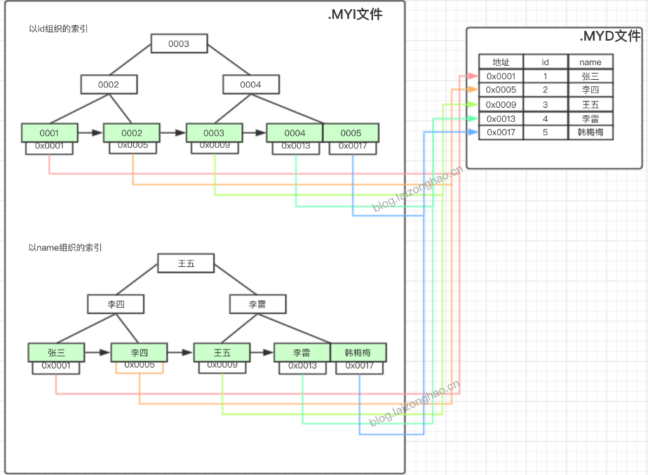
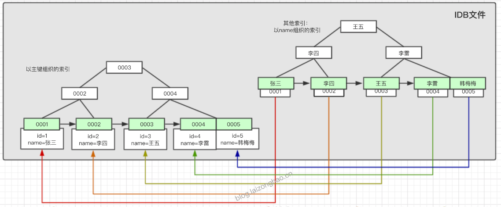

## 03、MySQL架构与索引概述
### MySQL架构

#### 日志文件
#### 数据文件

### MySQL索引
#### 概述
* 使用索引的主要目的是为了优化查询速度（通俗的说，数据库索引好比是一本书前面的目录，能加快数据库的查询速度。）
* 索引是一种特殊的文件或者叫数据结构(InnoDB数据表上的主键索引是表空间的一个组成部分)，它们包含着对数据表里所有记录的引用指针。
* 索引是在存储引擎中实现的，也就是说不同的存储引擎，会使用不同的索引。
    * MyISAM和InnoDB存储引擎：只支持BTREE索引， 也就是说默认使用BTREE，不能够更换；
    * MEMORY/HEAP存储引擎：支持HASH和BTREE索引；
#### 索引的分类
* 单列索引
    * 主键索引：是一种特殊的唯一索引，不允许有空值，无需手动创建，建表是指定主键，将自动创建主键索引；
    * 唯一索引：索引列中的值必须是唯一的，但是允许为空值；
    * 普通索引：MySQL中基本索引类型，没有什么限制，允许在定义索引的列中插入重复值和空值，纯粹为了查询数据更快一点；
* 组合索引：在表中的多个字段组合上创建的索引，只有在查询条件中使用了这些字段的左边字段时，索引才会被使用，使用组合索引时遵循 __最左前缀原则__。(假设针对A、B、C 3个字段使用了组合索引，则针对A、AB、ABC查询时，索引生效，如果针对AC、B、BC、C查询时，索引将不生效)
* 全文索引：只有在MyISAM引擎上才能使用，只能在CHAR,VARCHAR,TEXT类型字段上使用全文索引。
* 空间索引（略）

#### 索引的使用
* ```explain```的说明：
    * possible_keys：可能会用到的索引
    * key：实际上用到的索引
    * key_len：单个索引（键）的长度
* 创建主键索引：不用创建，建表时就会建立
    ``` sql
    mysql> explain select * from order_info where id= 1;
    +----+-------------+------------+-------+---------------+---------+---------+-------+------+-------+
    | id | select_type | table      | type  | possible_keys | key     | key_len | ref   | rows | Extra |
    +----+-------------+------------+-------+---------------+---------+---------+-------+------+-------+
    |  1 | SIMPLE      | order_info | const | PRIMARY       | PRIMARY | 4       | const |    1 | NULL  |
    +----+-------------+------------+-------+---------------+---------+---------+-------+------+-------+
    1 row in set (0.00 sec)
    ```
* 创建唯一索引：
    ``` sql
    -- 语法
    CREATE UNIQUE INDEX index_name ON table(column(length));-- mysql 5.6 报错会
    -- 或者
    ALTER TABLE table_name ADD UNIQUE INDEX index_name(column(length));
    -- 实际使用
    mysql> ALTER TABLE order_info ADD INDEX idx_batch_no(batch_no(32));
    Query OK, 0 rows affected (2.17 sec)
    Records: 0  Duplicates: 0  Warnings: 0
    ```
* 创建普通索引：
    ``` sql
    -- 语法
    CREATE INDEX index_name ON table(column(length));-- mysql 5.6 报错会
    -- 或者
    ALTER TABLE table_name ADD INDEX index_name(column(length));
    -- 实际使用
    mysql> ALTER TABLE order_info ADD INDEX idx_batch_no(batch_no(32));
    Query OK, 0 rows affected (2.17 sec)
    Records: 0  Duplicates: 0  Warnings: 0
    ```
* 创建组合索引
    ``` sql
    -- 语法
    ALTER TABLE table_name ADD INDEX index_name(col1(len1),col2(len2)...);
    -- 实际使用
    mysql> ALTER TABLE order_info ADD INDEX idx_batch_no(id,batch_no(32));
    Query OK, 0 rows affected (0.82 sec)
    Records: 0  Duplicates: 0  Warnings: 0
    ```
* 查看所有索引
    ``` sql
    mysql> show index from order_info;
    +------------+------------+-----------------+--------------+-------------+-----------+-------------+----------+--------+------+------------+---------+---------------+
    | Table      | Non_unique | Key_name        | Seq_in_index | Column_name | Collation | Cardinality | Sub_part | Packed | Null | Index_type | Comment | Index_comment |
    +------------+------------+-----------------+--------------+-------------+-----------+-------------+----------+--------+------+------------+---------+---------------+
    | order_info |          0 | PRIMARY         |            1 | id          | A         |       98095 |     NULL | NULL   |      | BTREE      |         |               |
    | order_info |          0 | idx_id          |            1 | id          | A         |       98095 |     NULL | NULL   |      | BTREE      |         |               |
    | order_info |          1 | idx_id_batch_no |            1 | id          | A         |       98095 |     NULL | NULL   |      | BTREE      |         |               |
    | order_info |          1 | idx_id_batch_no |            2 | batch_no    | A         |       98095 |     NULL | NULL   | YES  | BTREE      |         |               |
    | order_info |          1 | idx_batch_no    |            1 | batch_no    | A         |       98095 |     NULL | NULL   | YES  | BTREE      |         |               |
    +------------+------------+-----------------+--------------+-------------+-----------+-------------+----------+--------+------+------------+---------+---------------+
    5 rows in set (0.00 sec)
    ```
* 删除索引
    ``` sql
    -- 语法
    ALTER TABLE table_name DROP INDEX index_name;
    -- 实际使用
    mysql> ALTER TABLE order_info DROP index idx_batch_no;
    Query OK, 0 rows affected (0.02 sec)
    Records: 0  Duplicates: 0  Warnings: 0
    ```

#### 索引的存储结构
* 根据不同的存储引擎，MySQL索引将使用不同的存储结构。
* MyISAM引擎：B Tree索引  
    
    * 使用MyISAM引擎建表，将会产生2个数据文件：.MYI(MyISAM Index 索引文件)、.MYD（MyISAM Data 数据文件）
    * MYI文件是索引文件，通过B Tree方式存储 __索引__ 与数据在MYD文件中所属位置指针的映射关系。实际查找时，先通过MYI文件，找到对应数据在MYD文件的位置（物理地址），然后再去MYD文件中根据地址信息直接获取。
* InnoDB引擎：B+ Tree索引  
    
    * 使用InnoDB引擎建表，只会产生一个数据文件：.RDB文件
    * .RDB文件通过 __主键索引__ 组织数据(__一定是且只能是主键索引__)，主键索引下挂载的是实际的数据（而不是数据的物理地址），
    * 如果自定义了其他索引（例如name字段），则此时的索引下挂载的是id索引（相对于一个个的key-value，key是每条记录的name值，value是每条记录的主键（主键索引），即此时万物基于id索引）；
    * 主键索引上挂载数据，非主键索引指向主键
    * 主键不建议使用uuid或者比较长的字符创，额外的主键索引文件消耗

#### 注意事项
* 尽量创建组合索引（组合索引其实会默认按照最左前缀原则帮我们创建多组索引）
* 索引最左前缀原则
* 索引覆盖：要查询的列，也要使用索引覆盖住


> 可以使用[此站点](https://www.cs.usfca.edu/~galles/visualization/Algorithms.html)查看B Tree、B+Tree示意
> [参考地址](https://www.cnblogs.com/liqiangchn/p/9060521.html)
