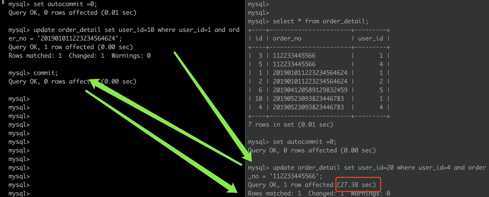

## 05.MySQL事务与锁
- [一、MySQL事务管理](#一mysql事务管理)
    - [1.1 概述](#11-概述)
    - [1.2 相关命令](#12-相关命令)
    - [1.3 并发问题与隔离级别](#13-并发问题与隔离级别)
- [二、MySQL的锁机制](#二mysql的锁机制)
    - [2.1 概述](#21-概述)
        - [2.1.1 独占锁、共享锁](#211-独占锁共享锁)
        - [2.1.2 行级锁](#212-行级锁)
        - [2.1.3 表级锁](#213-表级锁)
        - [2.1.4 页级锁(间隙锁)](#214-页级锁间隙锁)
    - [2.2 锁演示](#22-锁演示)
        - [2.2.1 表级锁：](#221-表级锁)
        - [2.2.2 行级锁(写锁自动添加，读锁手动添加)：](#222-行级锁写锁自动添加读锁手动添加)
        - [2.2.4 行级锁自动升级为表级锁：](#224-行级锁自动升级为表级锁)
        - [2.2.5 间隙锁带来的插入问题演示](#225-间隙锁带来的插入问题演示)
        - [2.2.6 使用共同索引导致不同数据阻塞演示](#226-使用共同索引导致不同数据阻塞演示)
        - [2.2.7 死锁演示](#227-死锁演示)
    - [2.3 悲观锁、乐观锁](#23-悲观锁乐观锁)
        - [2.3.1 悲观锁](#231-悲观锁)
        - [2.3.2 乐观锁](#232-乐观锁)
    - [2.4 意向锁](#24-意向锁)
### 一、MySQL事务管理
#### 1.1 概述
* 在 MySQL 中只有使用了 Innodb 数据库引擎的数据库或表才支持事务。
* 事务处理可以用来维护数据库的完整性，保证成批的 SQL 语句要么全部执行，要么全部不执行。
* 事务用来管理DDL、DML、DCL操作，比如 insert,update,delete 语句，默认是自动提交的。
* 事务应该具有的4个特性：ACID
    * __A__ tomicity（原子性）:构成事务的的所有操作必须是一个逻辑单元，要么全部执行，要么全部不执行。
    * __C__ onsistency（稳定性、一致性）:数据库在事务执行前后状态都必须是稳定的。例如对银行转帐事务，不管事务成功还是失败，应该保证事务结束后ACCOUNTS表中Tom和Jack的存款总额为2000元。
    * __I__ solation（隔离性）:事务之间不会相互影响。
    * __D__ urability（可靠性、持久性）:事务执行成功后必须全部写入磁盘，永久保存且不会被回滚。
#### 1.2 相关命令
常见的操作有一下三个：
* ```BEGIN```或```START TRANSACTION```；显式地开启一个事务；
* ```COMMIT```；也可以使用```COMMIT WORK```，不过二者是等价的。```COMMIT```会提交事务，并使已对数据库进行的所有修改称为永久性的；
* ```ROLLBACK```；有可以使用```ROLLBACK WORK```，不过二者是等价的。回滚会结束用户的事务，并撤销正在进行的所有未提交的修改；  

在 MySQL 命令行的默认设置下，事务都是自动提交的，即执行 SQL 语句后就会马上执行```COMMIT```操作。因此要显式地开启一个事务务须使用命令```BEGIN```或```START TRANSACTIO```，或者执行命令```SET AUTOCOMMIT=0```，用来禁止使用当前会话的自动提交。
#### 1.3 并发问题与隔离级别
3种并发问题：  
* 脏读是指一个事务读取到了其他事务没有提交的数据
* 不可重复读是指一个事务内多次根据同一个查询条件查询出来的同一行记录的值不一样
* 幻读是指一个事务内多次根据同个条件查出来的记录行数不一样。

为了解决事务并发带来的问题，才有了事务规范中的四个事务隔离级别，不同隔离级别对上面问题部分或者全部做了避免(正确性由低到高，性能从高到低）：
* Read uncommitted (读未提交)：最低级别，任何情况都无法保证。
* Read committed (读已提交)：可避免脏读的发生。
* Repeatable read (可重复读)：可避免脏读、不可重复读的发生。
* Serializable (串行化)：可避免脏读、不可重复读、幻读的发生。

并发问题与隔离级别直接的关系：
| 隔离级别 \ 并发问题 | 脏读（Dirty Read） | 不可重复读（NonRepeatable Read） | 幻读（Phantom Read）|  
|:---|:---|:---|:---|  
| 未提交读（Read uncommitted） |  √  | √  | √ |  
| 已提交读（Read committed） | × | √  | √ |  
| 可重复读（Repeatable read） | × | × | √ |  
| 可串行化（Serializable ） | × | × | × |  

默认的隔离级别
* 大多数数据库的默认隔离级别是Read committed，比如Oracle、DB2等。
* MySQL数据库的默认隔离级别是Repeatable read。

如何查看和设置隔离级别：
* 在MySQL数据库中查看当前事务的隔离级别：
    ``` sql
    -- 语法规则：select @@tx_isolation;
    mysql> select @@tx_isolation;
    +-----------------+
    | @@tx_isolation  |
    +-----------------+
    | REPEATABLE-READ |
    +-----------------+
    1 row in set (0.00 sec)
    ```
* 在MySQL数据库中设置事务的隔离级别：
    ``` sql
    -- 语法规则：
    -- set  [glogal | session]  transaction isolation level 隔离级别名称;
    -- set tx_isolation=’隔离级别名称;’
    mysql> set session transaction isolation level read committed;
    Query OK, 0 rows affected (0.01 sec)

    mysql> select @@tx_isolation;
    +----------------+
    | @@tx_isolation |
    +----------------+
    | READ-COMMITTED |
    +----------------+
    1 row in set (0.00 sec)
    ```

### 二、MySQL的锁机制
#### 2.1 概述
数据库锁定机制简单来说就是数据库为了保证数据的一致性而使各种共享资源在被并发访问访问变得有序所设计的一种规则。  
总的来说，MySQL各存储引擎使用了三种类型（级别）的锁定机制：__行级锁定__，__页级锁定__ 和 __表级锁定__。
##### 2.1.1 独占锁、共享锁
MySQL的锁定有两种模式：__共享锁（读锁）__ 和 __独占锁（写锁）__。  
* 排他锁，也称写锁，独占锁，当前写操作没有完成前，它会阻断其他写锁和读锁。
* 共享锁，也称读锁，多用于判断数据是否存在，多个读操作可以同时进行而不会互相影响。当如果事务对读锁进行修改操作，很可能会造成死锁。
##### 2.1.2 行级锁
* 优势：锁的粒度小，发生锁冲突的概率低；处理并发的能力强；
* 缺陷：开销大；加锁慢；容易出现死锁；
* 加锁方式：对于UPDATE、DELETE和INSERT语句自动加锁，SELECT语句不会自动加锁，或者用如下方式为SELECT语句加锁；
    ``` sql
    -- 独占锁（写锁）
    select col1,col2 from table where col1=con1... for update;
    -- 共享锁（读锁）
    select col1,col2 from table where col1=con1... lock in share mode;
    ```
* InnoDB的行锁是针对索引加的锁，不是针对记录加的锁。并且该索引不能失效，__否则都会从行锁升级为表锁。__
##### 2.1.3 表级锁
* 和行级锁定相反，表级别的锁定是MySQL各存储引擎中最大颗粒度的锁定机制。该锁定机制最大的特点是实现逻辑非常简单，带来的系统负面影响最小。所以获取锁和释放锁的速度很快。由于表级锁一次会将整个表锁定，所以可以很好的避免困扰我们的死锁问题。  
* 当然，锁定颗粒度大所带来最大的负面影响就是出现锁定资源争用的概率也会最高，致使并大度大打折扣。
* MySQL 实现的表级锁定的争用状态变量：
    ``` sql
    mysql> show status like 'table_locks%';
    +----------------------------+-------+
    | Variable_name              | Value |
    +----------------------------+-------+
    | Table_locks_immediate      | 71    |
    | Table_locks_waited         | 0     |
    +----------------------------+-------+
    5 rows in set (0.02 sec)
    -- table_locks_immediate：产生表级锁定的次数；
    -- table_locks_waited：出现表级锁定争用而发生等待的次数；
    ```
* 手动增加表锁
    ``` sql
    lock table 表名称 read(write),表名称2 read(write),...;
    ```
* 查看表锁情况
    ``` sql
    show open tables;
    ```
* 删除表锁
    ``` sql
    unlock tables;
    ```
##### 2.1.4 页级锁(间隙锁)
开销和加锁时间介于表锁和行锁之间；会出现死锁；锁定粒度介于表锁和行锁之间，并发处理能力一般。只需了解一下。

#### 2.2 锁演示
需要开始手动提交事务模式
``` sql
set autocommit = 0;
```
##### 2.2.1 表级锁：
* 读锁  
      
    ```
* 写锁
    
##### 2.2.2 行级锁(写锁自动添加，读锁手动添加)：
* 读锁
    
* 写锁
    
##### 2.2.4 行级锁自动升级为表级锁：

##### 2.2.5 间隙锁带来的插入问题演示

##### 2.2.6 使用共同索引导致不同数据阻塞演示

##### 2.2.7 死锁演示


#### 2.3 悲观锁、乐观锁
##### 2.3.1 悲观锁
* 思路：对数据修改持悲观态度，认为总是会有其他连接来修改自己的数据，每次在拿数据的时候都会上锁，这样别人想拿这个数据就会block直到它拿到锁；
* 实现方式：行锁、表锁、页锁就是数据库层面的悲观锁实现；或者在代码层面上使用synchronized或lock；
##### 2.3.2 乐观锁
* 思路：对数据修改持乐观态度，认为不会有其他连接来修改自己的数据，只是在更新数据时（代码层面）会根据版本号或者CAS机制(CompareAndSet)校验一下当前数据是否被其他连接修改过；
* 实现方式：
    * version
        ``` sql
        update ... where ... and version = xx;
        ```
    * cas：
        ``` java
        do{   
            备份旧数据；  
            基于旧数据构造新数据；  
        }while(!CAS( 内存地址，备份的旧数据，新数据 )); 
        ```
        * cas包括了compare、set 2个操作，通过硬件层面来保证cas操作的原子性；
        * 缺陷：ABA问题。如果变量V初次读取的时候是A，并且在准备赋值的时候检查到它仍然是A，那能说明它的值没有被其他线程修改过了吗？如果在这段期间曾经被改成B， 然后又改回A，那CAS操作就会误认为它从来没有被修改过。针对这种情况，java并发包中提供了一个带有标记的原子引用类AtomicStampedReference，它可以通过控制变量值的版本来保证CAS的正确性

#### 2.4 意向锁
* 共享/排它锁：
    * 事务拿到某一行记录的共享S锁，才可以读取这一行；
    * 事务拿到某一行记录的排它X锁，才可以修改或者删除这一行；
    * 其兼容互斥表如下：
        | | S | X | 
        |---|---|---|  
        | S | 兼容 | 互斥 |  
        | X | 互斥 | 互斥 |  
    * 即：
        * 多个事务可以拿到一把S锁，读读可以并行；
        * 而只有一个事务可以拿到X锁，写写/读写必须互斥；
    * 共享/排它锁的潜在问题是，不能充分的并行
* 意向锁是指，未来的某个时刻，事务可能要加共享(S)/排它(X)锁了，先提前声明一个意向。
* 意向锁有这样一些特点：
    * 意向锁是一个表级别的锁(table-level locking)；
    * 意向锁分为：
        * 意向共享锁(intention shared lock, IS)，它预示着，事务有意向对表中的某些行加共享S锁
        * 意向排它锁(intention exclusive lock, IX)，它预示着，事务有意向对表中的某些行加排它X锁
* 意向锁协议(intention locking protocol)是这样的：
    * 事务要获得某些行的S锁，必须先获得表的IS锁
    * 事务要获得某些行的X锁，必须先获得表的IX锁
* 由于意向锁仅仅表明意向，它其实是比较弱的锁，意向锁之间并不相互互斥，而是可以并行，其兼容互斥表如下：
    | | IS | IX |
    |---|---|---|
    | IS| 兼容| 兼容 |
    | IX| 兼容| 兼容 |
* 既然意向锁之间都相互兼容，那其意义在哪里呢？它会与共享锁/排它锁互斥，其兼容互斥表如下：
    | | S | X |
    |---|---|---|
    | IS | 兼容 | 互斥 |
    | IX | 互斥 | 互斥 |


>[何为脏读、不可重复读、幻读](http://ifeve.com/db_problem/)  
>[MySQL 表锁和行锁机制](https://juejin.im/entry/5a55c7976fb9a01cba42786f)  
>[InnoDB并发插入，居然使用意向锁？](https://mp.weixin.qq.com/s/iViStnwUyypwTkQHWDIR_w)  