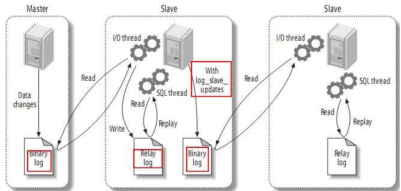

### 06、主从复制与读写分离
- [一、主从复制](#一主从复制)
    - [1.1 概述](#11-概述)
    - [1.2 实践练习（一主一从）](#12-实践练习一主一从)
- [二、读写分离(基于MySQL Proxy)](#二读写分离基于mysql-proxy)
    - [2.1 概述](#21-概述)
    - [2.2 实战演练](#22-实战演练)
#### 一、主从复制
##### 1.1 概述
主从复制的原理：
* 在对主机的数据进行操作时，一旦进行事务提交，则会将其写入主机自身的binlog中。
* 从机的IO子进程会实时从主机的binlog中读取文件内容到从机自身的relaylog。
* 从机的sql子进程会将本地的relaylog中的操作在从机自身再执行一遍。

##### 1.2 实践练习（一主一从）
* 准备2台独立的MySQL服务（192.168.2.161:161、192.168.2.162，使用vmware的虚拟机复制时，需要手动删除副本上mysql目录下的auto.cfg，MySQL server通过此文件唯一确定定位一台MySQL服务，如果文件不存在会自动创建）
* 主机配置：
    * 修改my.cnf文件，在```[mysqld]```下添加/修改如下内容
        ``` txt
        #启用二进制日志
        log_bin=mysql-bin
        #服务器唯一ID，一般取IP最后一段
        server-id=161
        ```
    * 重启MySQL服务
        ``` sh
        service mysqld restart
        ```
    * 授权slave节点
        ``` sql
        -- “%”表示所有客户端都可能连，只要帐号，密码正确，此处可用具体客户端IP代替，如192.168.2.162，加强安全。
        GRANT REPLICATION SLAVE, REPLICATION CLIENT ON *.* to 'root'@'%' identified by '111111'; 
        -- 或 GRANT REPLICATION SLAVE ON *.* to 'root'@'%' identified by ‘111111’; 
        -- 刷新权限
        mysql> FLUSH PRIVILEGES;
        ```
    * 查看master状态
        ``` sql
        mysql> show master status;
        +------------------+----------+--------------+------------------+-------------------+
        | File             | Position | Binlog_Do_DB | Binlog_Ignore_DB | Executed_Gtid_Set |
        +------------------+----------+--------------+------------------+-------------------+
        | mysql-bin.000001 |      615 |              |                  |                   |
        +------------------+----------+--------------+------------------+-------------------+
        1 row in set (0.00 sec)
        ```
* 从机配置：
    * 修改my.cnf文件，在```[mysqld]```下添加/修改如下内容
        ``` txt
        #服务器唯一ID，一般取IP最后一段
        server-id=162
        ```
    * 重启从机后，登录到MySQL命令行客户端进行从机配置
        ``` sql
        change master to master_host='192.168.2.161',master_port=3306,master_user='root',master_password='111111',master_log_file='mysql-bin.000001',master_log_pos=615;
        ```
    * 开启从机数据复制：
        ``` sql
        start slave;
        ```
    * 查看从机节点状态：    
        ``` sql
        mysql>  show slave status\G
        *************************** 1. row ***************************
                    Slave_IO_State: Waiting for master to send event
                        Master_Host: 192.168.2.161
                        Master_User: root
                        Master_Port: 3306
                        Connect_Retry: 60
                    Master_Log_File: mysql-bin.000001
                Read_Master_Log_Pos: 658
                    Relay_Log_File: mysqld-relay-bin.000002
                        Relay_Log_Pos: 524
                Relay_Master_Log_File: mysql-bin.000001
                    Slave_IO_Running: Yes
                    Slave_SQL_Running: Yes
                    Replicate_Do_DB:
                Replicate_Ignore_DB:
                Replicate_Do_Table:
            Replicate_Ignore_Table:
            Replicate_Wild_Do_Table:
        Replicate_Wild_Ignore_Table:
                        Last_Errno: 0
                        Last_Error:
                        Skip_Counter: 0
                Exec_Master_Log_Pos: 658
                    Relay_Log_Space: 698
                    Until_Condition: None
                    Until_Log_File:
                        Until_Log_Pos: 0
                Master_SSL_Allowed: No
                Master_SSL_CA_File:
                Master_SSL_CA_Path:
                    Master_SSL_Cert:
                    Master_SSL_Cipher:
                    Master_SSL_Key:
                Seconds_Behind_Master: 0
        Master_SSL_Verify_Server_Cert: No
                        Last_IO_Errno: 0
                        Last_IO_Error:
                    Last_SQL_Errno: 0
                    Last_SQL_Error:
        Replicate_Ignore_Server_Ids:
                    Master_Server_Id: 161
                        Master_UUID: c8bfda5c-ff03-11e9-a1c4-000c29c67a98
                    Master_Info_File: /var/lib/mysql/master.info
                            SQL_Delay: 0
                SQL_Remaining_Delay: NULL
            Slave_SQL_Running_State: Slave has read all relay log; waiting for the slave I/O thread to update it
                Master_Retry_Count: 86400
                        Master_Bind:
            Last_IO_Error_Timestamp:
            Last_SQL_Error_Timestamp:
                    Master_SSL_Crl:
                Master_SSL_Crlpath:
                Retrieved_Gtid_Set:
                    Executed_Gtid_Set:
                        Auto_Position: 0
        1 row in set (0.00 sec)
        -- 注：Slave_IO及Slave_SQL进程必须正常运行，即YES状态，否则都是错误的状态(如：其中一个NO均属错误)。
        ```
* 数据备份实验：主节点上删除一个数据，可以发现从节点也自动删除了对应的数据
    ``` sql
    -- master node
    mysql> select * from order_detail;
    +----+-----------------------+---------+
    | id | order_no              | user_id |
    +----+-----------------------+---------+
    |  3 | 112233445566          |       1 |
    |  5 | 112233445566          |       4 |
    |  2 | 201901011223234564624 |       2 |
    |  1 | 201901011223234564624 |      10 |
    |  6 | 201904120589129832459 |       5 |
    |  4 | 20190523093823446783  |       4 |
    +----+-----------------------+---------+
    7 rows in set (0.00 sec)

    mysql> delete from order_detail where id = 5;
    Query OK, 1 row affected (0.02 sec)

    -- slave node
    mysql> select * from order_detail;
    +----+-----------------------+---------+
    | id | order_no              | user_id |
    +----+-----------------------+---------+
    |  3 | 112233445566          |       1 |
    |  2 | 201901011223234564624 |       2 |
    |  1 | 201901011223234564624 |      10 |
    |  6 | 201904120589129832459 |       5 |
    |  4 | 20190523093823446783  |       4 |
    +----+-----------------------+---------+
    5 rows in set (0.00 sec)
    ```
 
#### 二、读写分离(基于MySQL Proxy)
##### 2.1 概述  
* MySQL Proxy相当于一层外壳，包裹在MySQL集群外部，协调内部读写分离，MySQL Proxy对外提供MySQL服务；
* 多嘴一句：MySQL Proxy的读写分离是基于lua脚本的，并不推荐使用，了解即可，大部分生产级别环境都会使用MyCat实现；

  
##### 2.2 实战演练
* 准备一台服务器/虚拟机（192.168.2.163，无需mysql环境，防火墙关闭）
* 官网下载MySQL Proxy([百度网盘提取码: 8g3b](https://pan.baidu.com/s/1_OTqCN489qgfjhPatPDVng))
* 解压，bin目录下新建配置文件mysql-proxy.cnf
    ``` txt
    [mysql-proxy]
    user=root
    admin-username=root
    admin-password=111111
    # proxy 服务地址
    proxy-address=192.168.2.163:4040
    # 主机地址
    proxy-backend-addresses=192.168.2.161:3306
    # 从机地址
    proxy-read-only-backend-addresses=192.168.2.162:3306
    # lua脚本地址
    proxy-lua-script=/usr/local/mysoftware/mysql-proxy/share/doc/mysql-proxy/rw-splitting.lua
    # 日志输出地址
    log-file=/usr/apps/mysql-proxy/logs/mysql-proxy.log
    log-level=debug
    keepalive=true
    daemon=true
    ```
* 启动MySQL Proxy
    ``` sh
    ./mysql-proxy  --defaults-file=mysql-proxy.cnf
    ```
* 查看mysql proxy log
    ``` txt
    2019-11-04 08:46:05: (message) chassis-unix-daemon.c:136: [angel] we try to keep PID=9150 alive
    2019-11-04 08:46:05: (debug) chassis-unix-daemon.c:157: waiting for 9150
    2019-11-04 08:46:05: (debug) chassis-unix-daemon.c:121: we are the child: 9150
    2019-11-04 08:46:05: (critical) plugin proxy 0.8.5 started
    2019-11-04 08:46:05: (debug) max open file-descriptors = 1024
    2019-11-04 08:46:05: (message) proxy listening on port 192.168.2.163:4040
    2019-11-04 08:46:05: (message) added read/write backend: 192.168.2.161:3306
    2019-11-04 08:46:05: (message) added read-only backend: 192.168.2.162:3306
    2019-11-04 08:46:05: (debug) now running as user: root (0/0)
    ```
* 外服服务器连接到mysql proxy
    ``` sql
    [root@localhost ~]# mysql -uroot -P4040 -h192.168.2.163  -p111111
    Warning: Using a password on the command line interface can be insecure.
    Welcome to the MySQL monitor.  Commands end with ; or \g.
    Your MySQL connection id is 6
    Server version: 5.6.46-log MySQL Community Server (GPL)

    Copyright (c) 2000, 2019, Oracle and/or its affiliates. All rights reserved.

    Oracle is a registered trademark of Oracle Corporation and/or its
    affiliates. Other names may be trademarks of their respective
    owners.

    Type 'help;' or '\h' for help. Type '\c' to clear the current input statement.

    mysql> exit
    Bye
    ```

