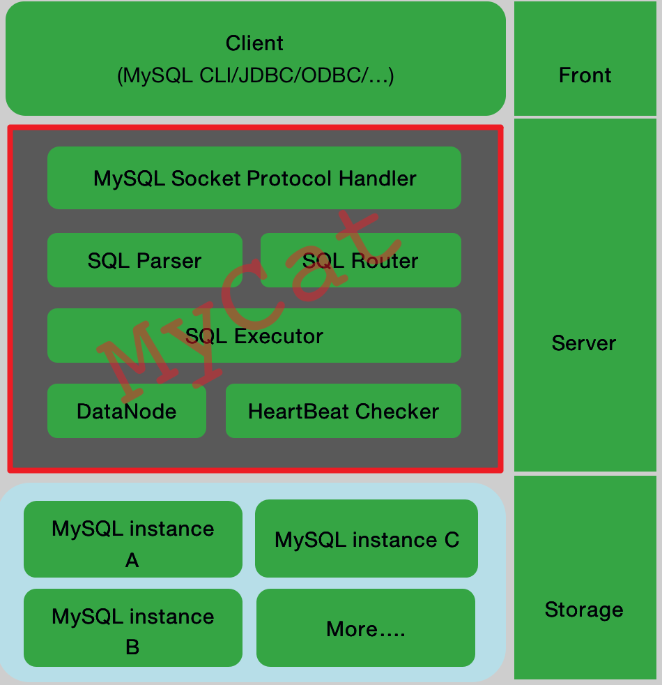
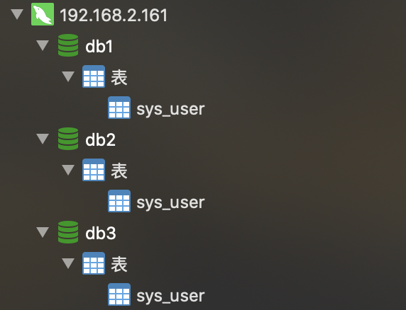
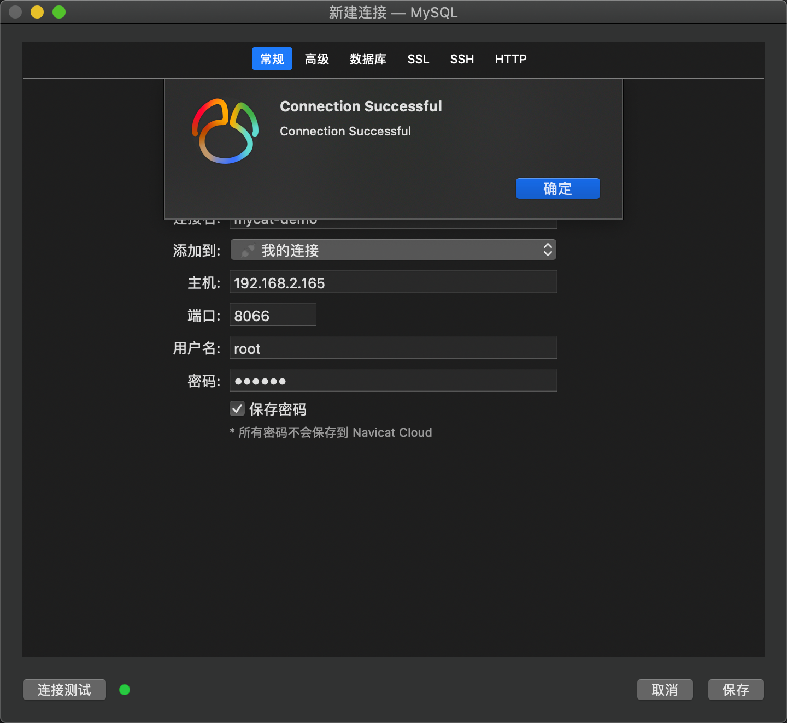
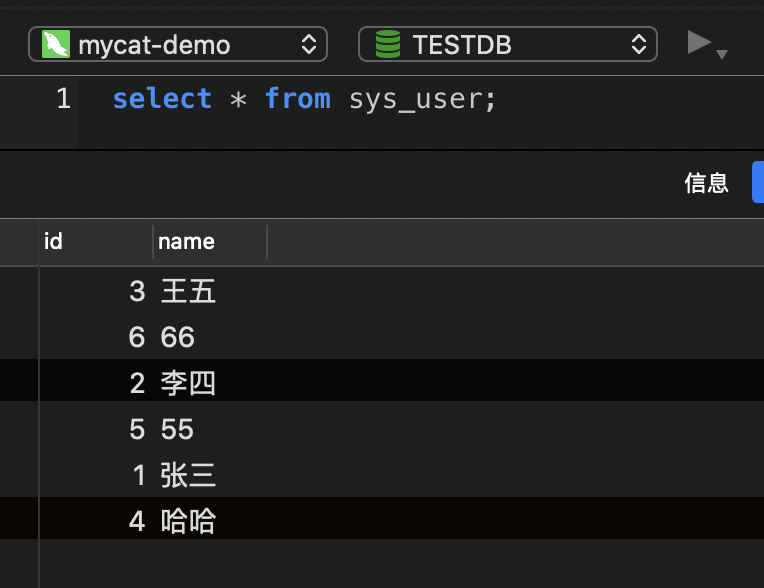
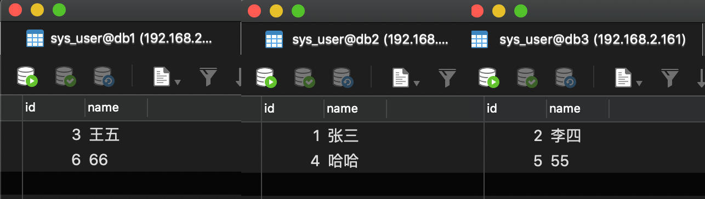

### 07. MyCat分表分库基础实践

- [一、概述](#一概述)
    - [1.1 数据的切分分为两种（Mycat都支持）：](#11-数据的切分分为两种mycat都支持)
    - [1.2 MyCAT的关键特性](#12-mycat的关键特性)
    - [1.3 MyCat架构与核心概念](#13-mycat架构与核心概念)
    - [1.4 Mycat存在的问题](#14-mycat存在的问题)
- [二、实战演练](#二实战演练)

#### 一、概述
当数据库表数据特别大时，比如说上亿的记录，数据库本身的优化基本上无法解决性能问题了，根本原因是数据库本身的io读写到了一个瓶颈，这个时候，需要海量数据的存储和查询问题。此时我们需要利用分库分表的思想去进行数据库的架构优化。  

##### 1.1 数据的切分分为两种（Mycat都支持）：  
* 垂直切分：按照业务模块进行切分，将不同模块的表切分到不同的数据库中(一个数据库中多个表格A，B，C，A存储到节点1上，B存储到节点2上，C存储到节点3上)。
* 水平切分：一个表格的数据分割到多个节点上，按照行分隔。

##### 1.2 MyCAT的关键特性  
* 支持 SQL 92标准
* 支持Mysql集群，可以作为Proxy使用
* 支持JDBC连接ORACLE、DB2、SQL Server，将其模拟为MySQL  Server使用
* 支持galera for mysql集群，percona-cluster或者mariadb cluster，提供高可用性数据分片集群
* 自动故障切换，高可用性
* 支持读写分离，支持Mysql双主多从，以及一主多从的模式
* 支持全局表，数据自动分片到多个节点，用于高效表关联查询
* 支持独有的基于E-R 关系的分片策略，实现了高效的表关联查询
* 多平台支持，部署和实施简单

##### 1.3 MyCat架构与核心概念
* 架构图：
    
* 核心概念
    * Schema：由它指定逻辑数据库
    * Table：逻辑表
    * DataNode：真正存储节点
    * DataHost：真正的数据库主机
MyCAT使用Mysql的通讯协议模拟成了一个Mysql服务器，并建立了完整的Schema（数据库）、Table （数据表）、User(用户)的逻辑模型，并将这套逻辑模型映射到后端的存储节点DataNode（MySQL Instance）上的真实物理库中，这样一来，所有能使用Mysql的客户端以及编程语言都能将MyCAT当成是Mysql Server来使用，不必开发新的客户端协议。  
注意：mycat不会新建、修改、删除实体库，它只是在顶层做调度，它自身不真正实现mysql server，但依赖于真实的mysql实例

##### 1.4 Mycat存在的问题
* 跨库join问题
	* 通过业务分析，将不同库的join查询拆分成多个select
	* 建立全局表（每个库都有一个相同的表）
	* 冗余字段（不符合数据库三范式）
	* E-R分片（将有关系的记录都存储到一个库中）
	* 最多支持跨两张表跨库的join
* 分布式事务（弱事务）
    * 强一致性事务（同步）
    * 最终一致性事务（异步思想）
* 分布式主键
    * redis incr命令
    * 数据库（生成主键）
    * UUID
    * snowflake算法
#### 二、实战演练
* 启动一台mysql server（192.168.2.161:3306）
* 新建数据库：db1、db2、db3，并在3个数据库中分别建表：sys_user
    ``` sql
    DROP TABLE IF EXISTS `sys_user`;
    CREATE TABLE `sys_user` (
    `id` int(11) NOT NULL AUTO_INCREMENT,
    `name` varchar(255) DEFAULT NULL,
    PRIMARY KEY (`id`)
    ) ENGINE=InnoDB AUTO_INCREMENT=7 DEFAULT CHARSET=utf8mb4;
    ```  
     
* 再准备一台机器（需要jdk环境，关闭防火墙，ip：192.168.2.165）、[官网下载](http://dl.mycat.io/)Mycat压缩包、上传至服务器并解压
* 进入conf目录，重点关注如下4个配置文件
    * schema.xml：是MyCat中重要的配置文件之一，管理着MyCat的逻辑库、表、分片规则、DataNode以及DataSource
    * server.xml：配置mycat对外暴露的MySQL服务的用户名、密码、权限
    * rule.xml：定义分片规则（schema.xml配置的规则都来源于此，也可以自行添加）
* 修改schema.xml
    ``` xml
    <?xml version="1.0"?>
    <!DOCTYPE mycat:schema SYSTEM "schema.dtd">
    <mycat:schema xmlns:mycat="http://io.mycat/">
        <!-- name：对外暴露的库名，sqlMaxLimit：返回结果的最大数量（相当于在sql末尾追加limit字段）-->
        <schema name="TESTDB" checkSQLschema="false" sqlMaxLimit="100">
                <!-- name：对外暴露的表名， dataNode：数据库节点id，rule:分片规则（在rule.xml中定义，此处直接引用对应的id即可）-->
                <table name="sys_user" dataNode="dn1,dn2,dn3" rule="mod-long" />
        </schema>
        <!-- <dataNode name="dn1$0-743" dataHost="localhost1" database="db$0-743"
                /> -->
        <dataNode name="dn1" dataHost="localhost1" database="db1" />
        <dataNode name="dn2" dataHost="localhost1" database="db2" />
        <dataNode name="dn3" dataHost="localhost1" database="db3" />

        <dataHost name="localhost1" maxCon="1000" minCon="10" balance="0"
                        writeType="0" dbType="mysql" dbDriver="native" switchType="1"  slaveThreshold="100">
                <heartbeat>select user()</heartbeat>
                <!-- can have multi write hosts -->
                <writeHost host="hostM1" url="192.168.2.161:3306" user="root"
                                password="111111">
                </writeHost>
        </dataHost>
    </mycat:schema>
    ```
* 修改server.xml（仅修改用户名、密码）
    ``` xml
    <!-- …… -->
    <user name="root" defaultAccount="true">
                <property name="password">111111</property>
                <property name="schemas">TESTDB</property>

                <!-- 表级 DML 权限设置 -->
                <!--
                <privileges check="false">
                        <schema name="TESTDB" dml="0110" >
                                <table name="tb01" dml="0000"></table>
                                <table name="tb02" dml="1111"></table>
                        </schema>
                </privileges>
                 -->
        </user>
    <!-- …… -->
    ```
* 启动服务：
    ``` sh
    bin/mycat.sh start
    ```
* 使用Navicat做连接与sql测试
    * 连接：
          
          
    * 新增：
        ``` sql
        insert into sys_user(id,name) values(1,'张三'),(2,'李四'),(3,'王五'),(4,'哈哈'),(5,'55'),(6,'66');
        ```
    * 查询： 可以看到，数据以轮询取模的方式均匀存在在3个数据库中，并且能够在Mycat TESTDB的sys_user中一次性查出 
        
        


