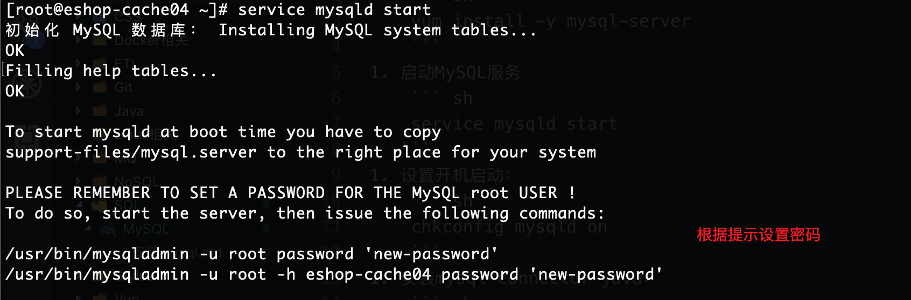
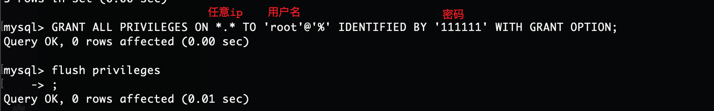
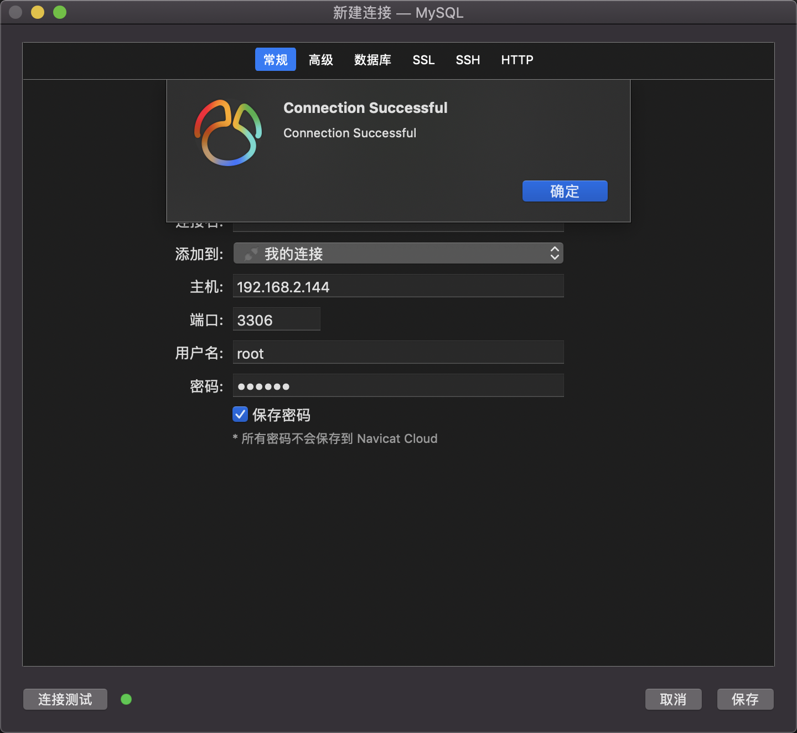

1. 安装MySQL服务器端：  
    ``` sh
    yum install -y mysql-server
    ```
1. 启动MySQL服务
    ``` sh
    service mysqld start
    ```
1. 根据提示设置root用户的密码：    
    
1. 设置开机启动：  
    ``` sh
    chkconfig mysqld on
    ```
1. 安装mysql-connector-java：  
    ``` sh
    yum install -y mysql-connector-java
    ```
1. (可选)配置任意ip登录：  
    ``` sh
    GRANT ALL PRIVILEGES ON *.* TO 'root'@'%' IDENTIFIED BY '111111' WITH GRANT OPTION;
    flush privileges
    ```
      
      


