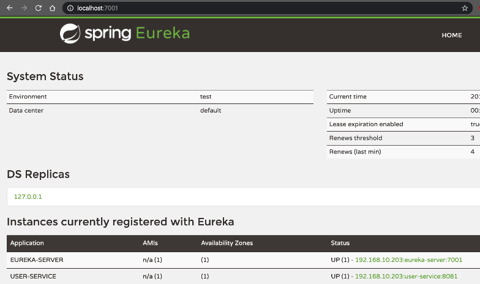

# 01.Quick Start
本文将重点使用Eureka组件构建一个Spring Cloud的基础Demo:[springcloud-demo](https://github.com/zephyrlai/springcloud-demo/tree/01-eureka)。项目总体结构如下：  
* springcloud-demo  
    * user-service  
    * eureka-service  
    * consumer-demo


## 一、Eureka概述
Eureka组件是Spring Cloud中的核心组件，充当全局服务注册中心的角色，提供了服务注册、服务发现、服务治理的功能。现在将以最精简的方式展现如下3个工程：user-service（服务提供者）、eureka-server（注册中心）、consumer-demo（服务消费者），来体验一下Spring Cloud的基础使用。

## 二、项目搭建
### 2.1 准备工作:新建maven父工程springcloud-demo，并添加依赖
``` xml
<groupId>cn.zephyr</groupId>
<artifactId>springcloud-demo</artifactId>
<version>1.0-SNAPSHOT</version>

<parent>
    <groupId>org.springframework.boot</groupId>
    <artifactId>spring-boot-starter-parent</artifactId>
    <version>2.2.2.RELEASE</version>
    <relativePath/> <!-- lookup parent from repository -->
</parent>

<properties>
    <java.version>1.8</java.version>
    <spring-cloud.version>Hoxton.RELEASE</spring-cloud.version>
</properties>

<dependencies>
    <dependency>
        <groupId>org.projectlombok</groupId>
        <artifactId>lombok</artifactId>
        <optional>true</optional>
    </dependency>
</dependencies>

<dependencyManagement>
    <dependencies>
        <dependency>
            <groupId>org.springframework.cloud</groupId>
            <artifactId>spring-cloud-dependencies</artifactId>
            <version>${spring-cloud.version}</version>
            <type>pom</type>
            <scope>import</scope>
        </dependency>
    </dependencies>
</dependencyManagement>
```
### 2.2 搭建一个业务微服务（以user-service为例）
#### 2.2.1 添加maven依赖
``` xml
<?xml version="1.0" encoding="UTF-8"?>
<project xmlns="http://maven.apache.org/POM/4.0.0" xmlns:xsi="http://www.w3.org/2001/XMLSchema-instance"
	xsi:schemaLocation="http://maven.apache.org/POM/4.0.0 https://maven.apache.org/xsd/maven-4.0.0.xsd">
	<modelVersion>4.0.0</modelVersion>
	<parent>
		<groupId>cn.zephyr</groupId>
		<artifactId>springcloud-demo</artifactId>
		<version>1.0-SNAPSHOT</version>
		<relativePath/> <!-- lookup parent from repository -->
	</parent>
	<groupId>cn.zephyr</groupId>
	<artifactId>user-service</artifactId>
	<version>0.0.1-SNAPSHOT</version>
	<name>user-service</name>
	<description>User Service Module</description>

	<properties>
		<java.version>1.8</java.version>
	</properties>

	<dependencies>
		<dependency>
			<groupId>org.springframework.boot</groupId>
			<artifactId>spring-boot-starter-web</artifactId>
		</dependency>

		<dependency>
			<groupId>mysql</groupId>
			<artifactId>mysql-connector-java</artifactId>
			<scope>runtime</scope>
		</dependency>
		<dependency>
			<groupId>org.springframework.boot</groupId>
			<artifactId>spring-boot-starter-test</artifactId>
			<scope>test</scope>
			<exclusions>
				<exclusion>
					<groupId>org.junit.vintage</groupId>
					<artifactId>junit-vintage-engine</artifactId>
				</exclusion>
			</exclusions>
		</dependency>
		<!--	通用Mapper	-->
		<dependency>
			<groupId>tk.mybatis</groupId>
			<artifactId>mapper-spring-boot-starter</artifactId>
			<version>2.0.2</version>
		</dependency>

	</dependencies>

	<build>
		<plugins>
			<plugin>
				<groupId>org.springframework.boot</groupId>
				<artifactId>spring-boot-maven-plugin</artifactId>
			</plugin>
		</plugins>
	</build>

</project>

```
#### 2.2.2 添加user-service项目配置
``` .properties
spring.datasource.url=jdbc:mysql://localhost:3306/zephyr_sc
spring.datasource.username=root
spring.datasource.password=111111
spring.application.name=user-service

server.port=8081
```
#### 2.2.3 添加基础业务代码：
* SysUserController.java
    ``` java
    @RequestMapping("sysUser")
    @RestController
    public class SysUserController {

        @Resource
        private SysUserService sysUserService;

        @RequestMapping("selectById")
        public SysUser selectById(Integer id ){
            return sysUserService.selectById(id);
        }
    }
    ```
* SysUserService.java
    ``` java
    @Service
    public class SysUserService {

        @Resource
        private SysUserMapper sysUserMapper;

        /**
        * 根据id查询
        * @param id
        * @return
        */
        public SysUser selectById(Integer id){
            return this.sysUserMapper.selectByPrimaryKey(id);
        }
    }
    ```
* SysUserMapper.java
    ``` java
    @Mapper
    public interface SysUserMapper extends tk.mybatis.mapper.common.Mapper<SysUser>{
    }
    ```
* SysUser.java
    ``` java
    @Data
    @Table(name = "sys_user")
    public class SysUser {
        @Id
        @GeneratedValue(strategy = GenerationType.IDENTITY)
        private Integer id;
        // 用户名
        private String username;

        // 密码
        private String password;

        // 姓名
        private String name;

        // 年龄
        private Integer age;

        // 性别，1男性，2女性
        private Integer gender;

        // 备注
        private String remarks;

    }
    ```
* 启动类：UserServiceApplication.java
    ``` java
    @SpringBootApplication
    public class UserServiceApplication {
        public static void main(String[] args) {
            SpringApplication.run(UserServiceApplication.class, args);
        }
    }
    ```
* 库表结构
    ``` sql
    -- auto-generated definition
    create table sys_user
    (
        id       int auto_increment
            primary key,
        username varchar(20)  null,
        password varchar(50)  null,
        name     varchar(20)  null,
        age      int          null,
        gender   int          null,
        remarks  varchar(255) null
    );
    ```
#### 2.2.4 业务接口测试
``` 
// http://localhost:8081/sysUser/selectById?id=1

{
  "id": 1,
  "username": "haha",
  "password": "111111",
  "name": "zhangsan",
  "age": 21,
  "gender": 1,
  "remarks": "11223344"
}
```

### 2.3 搭建服务服务注册中心
#### 2.3.1 新建maven子模块eureka-server，并添加依赖：
``` xml
<parent>
    <groupId>cn.zephyr</groupId>
    <artifactId>springcloud-demo</artifactId>
    <version>1.0-SNAPSHOT</version>
    <relativePath/> <!-- lookup parent from repository -->
</parent>

<groupId>cn.zephyr</groupId>
<artifactId>eureka-server</artifactId>
<version>0.0.1-SNAPSHOT</version>
<name>eureka-server</name>
<description>Eureka Server Module</description>

<properties>
    <java.version>1.8</java.version>
    <spring-cloud.version>Hoxton.RELEASE</spring-cloud.version>
</properties>

<dependencies>
    <dependency>
        <groupId>org.springframework.cloud</groupId>
        <artifactId>spring-cloud-starter-netflix-eureka-server</artifactId>
    </dependency>

    <dependency>
        <groupId>org.springframework.boot</groupId>
        <artifactId>spring-boot-starter-test</artifactId>
        <scope>test</scope>
        <exclusions>
            <exclusion>
                <groupId>org.junit.vintage</groupId>
                <artifactId>junit-vintage-engine</artifactId>
            </exclusion>
        </exclusions>
    </dependency>
</dependencies>
```
#### 2.3.2 新增配置：application.yml
``` .yml
server:
  port: 7001 # 端口
spring:
  application:
    name: eureka-server # 应用名称，会在Eureka中显示
eureka:
  client:
    register-with-eureka: true # 是否注册自己的信息到EurekaServer，默认是true
    fetch-registry: false # 是否拉取其它服务的信息，默认是true
    service-url: # EurekaServer的地址，现在是自己的地址，如果是集群，需要加上其它Server的地址。
      defaultZone: http://127.0.0.1:7001/eureka
```
#### 2.3.3 新增启动类
``` java
@SpringBootApplication
@EnableEurekaServer
public class EurekaServerApplication {

	public static void main(String[] args) {
		SpringApplication.run(EurekaServerApplication.class, args);
	}

}
```
#### 2.3.4 启动测试
访问地址：http://localhost:7001/  


### 2.4 改造业务微服务(user-service)，并注册到eureka-server(以下配置都是针对user-service进行的)
#### 2.4.1 新增maven依赖
``` xml
<!-- Eureka客户端 -->
<dependency>
    <groupId>org.springframework.cloud</groupId>
    <artifactId>spring-cloud-starter-netflix-eureka-client</artifactId>
</dependency>
``` 
#### 2.4.2 新增eureka配置
``` .properties
# EurekaServer地址
eureka.client.service-url.defaultZone=http://127.0.0.1:7001/eureka
# 指定自己的ip信息，不指定的话会自己寻找
eureka.instance.prefer-ip-address=true
eureka.instance.ip-address=127.0.0.1
```
#### 2.4.3 启动类上通过添加`@EnableDiscoveryClient`来开启Eureka客户端功能
``` java
@SpringBootApplication
@EnableDiscoveryClient
public class UserServiceApplication {
	public static void main(String[] args) {
		SpringApplication.run(UserServiceApplication.class, args);
	}
}
```
#### 2.4.4 启动测试：
访问地址：http://localhost:7001/，可以发现user-service已注册到eureka-server上  


### 2.5 新增服务调用模块（以consumer-demo为例）
#### 2.5.1 新增依赖
``` xml
<?xml version="1.0" encoding="UTF-8"?>
<project xmlns="http://maven.apache.org/POM/4.0.0" xmlns:xsi="http://www.w3.org/2001/XMLSchema-instance"
	xsi:schemaLocation="http://maven.apache.org/POM/4.0.0 https://maven.apache.org/xsd/maven-4.0.0.xsd">
	<modelVersion>4.0.0</modelVersion>
	<parent>
		<groupId>cn.zephyr</groupId>
		<artifactId>springcloud-demo</artifactId>
		<version>1.0-SNAPSHOT</version>
		<relativePath/> <!-- lookup parent from repository -->
	</parent>
	<groupId>cn.zephyr</groupId>
	<artifactId>consumer-demo</artifactId>
	<version>0.0.1-SNAPSHOT</version>
	<name>consumer-demo</name>
	<description>consumer-demo module</description>

	<properties>
		<java.version>1.8</java.version>
	</properties>

	<dependencies>
		<dependency>
			<groupId>org.springframework.boot</groupId>
			<artifactId>spring-boot-starter-web</artifactId>
		</dependency>

		<!-- Eureka客户端 -->
		<dependency>
			<groupId>org.springframework.cloud</groupId>
			<artifactId>spring-cloud-starter-netflix-eureka-client</artifactId>
		</dependency>

		<dependency>
			<groupId>org.springframework.boot</groupId>
			<artifactId>spring-boot-starter-test</artifactId>
			<scope>test</scope>
			<exclusions>
				<exclusion>
					<groupId>org.junit.vintage</groupId>
					<artifactId>junit-vintage-engine</artifactId>
				</exclusion>
			</exclusions>
		</dependency>

	</dependencies>


	<build>
		<plugins>
			<plugin>
				<groupId>org.springframework.boot</groupId>
				<artifactId>spring-boot-maven-plugin</artifactId>
			</plugin>
		</plugins>
	</build>

</project>
```
#### 2.5.2 新增配置文件
``` .properties
spring.application.name=consumer-name
server.port=8080
# EurekaServer地址
eureka.client.service-url.defaultZone=http://127.0.0.1:7001/eureka,http://127.0.0.1:7002/eureka
# 指定自己的ip信息，不指定的话会自己寻找
eureka.instance.prefer-ip-address=true
eureka.instance.ip-address=127.0.0.1
```
#### 2.5.3 编写业务代码
* 配置类：SysConfiguration.java
    ``` java
    @Configuration
    public class SysConfiguration {

        @Bean
        public RestTemplate restTemplate(){
            return new RestTemplate();
        }
    }
    ``` 
* controller:SysUserController.java
    ``` java
    @RestController
    @RequestMapping("consumer/sysUser/")
    public class SysUserController {
        @Resource
        private RestTemplate restTemplate;

        @Resource
        private DiscoveryClient discoveryClient;

        @RequestMapping("selectById")
        public SysUser selectById(Integer id){
            ServiceInstance instance = discoveryClient.getInstances("user-service").get(0);
            String url = "http://"+instance.getHost() + ":" + instance.getPort()+"/user/";
            return restTemplate.getForObject(url,SysUser.class);
        }
    }
    ``` 
* 实体类：UserService
    ``` java
    @Data
    @NoArgsConstructor
    @AllArgsConstructor
    public class SysUser {
        private Integer id;
        // 用户名
        private String username;

        // 密码
        private String password;

        // 姓名
        private String name;

        // 年龄
        private Integer age;

        // 性别，1男性，2女性
        private Integer gender;

        // 备注
        private String remarks;
    ``` 
* 启动类：ConsumerDemoApplication.java
    ``` java
    @SpringBootApplication
    @EnableDiscoveryClient // 开启Eureka客户端
    public class ConsumerDemoApplication {

        public static void main(String[] args) {
            SpringApplication.run(ConsumerDemoApplication.class, args);
        }
    }
    ``` 
#### 2.5.4 启动后效果
* 请求consumer-demo中的接口
    ``` json
    // http://localhost:8080/consumer/sysUser/selectById?id=1
    {
    "id": 1,
    "username": "haha",
    "password": "111111",
    "name": "zhangsan",
    "age": 21,
    "gender": 1,
    "remarks": "11223344"
    }
    ```
* 访问地址：http://localhost:7001/，  可以发现consumer-demo已注册到eureka-server上  
    
#### 2.5.5 目前的项目结构：  


### 2.6 项目概述
#### 2.6.1 父工程：springcloud-demo
父工程的作用对于子项目的依赖版本管理在Spring Cloud 中尤其重要，Spring Cloud各组件之间的依赖局限于指定的版本，如果每个子组件都单独定义版本，将会非常麻烦且容易出错。为了解决这个问题，Spring Cloud 官方提供了`spring-cloud-dependencies`，这个依赖内部定义了当前Spring Cloud大版本下各子组件的版本。以F版`spring-cloud-dependencies`为例，其pom文件中对版本的指定如下
``` xml
<properties>
    <spring-cloud-kubernetes.version>1.1.0.RELEASE</spring-cloud-kubernetes.version>
    <spring-cloud-security.version>2.2.0.RELEASE</spring-cloud-security.version>
    <spring-cloud-config.version>2.2.0.RELEASE</spring-cloud-config.version>
    <spring-cloud-contract.version>2.2.0.RELEASE</spring-cloud-contract.version>
    <spring-cloud-netflix.version>2.2.0.RELEASE</spring-cloud-netflix.version>
    <spring-cloud-vault.version>2.2.0.RELEASE</spring-cloud-vault.version>
    <spring-cloud-openfeign.version>2.2.0.RELEASE</spring-cloud-openfeign.version>
    <spring-cloud-task.version>2.2.1.RELEASE</spring-cloud-task.version>
    <spring-cloud-stream.version>Horsham.RELEASE</spring-cloud-stream.version>
    <spring-cloud-commons.version>2.2.0.RELEASE</spring-cloud-commons.version>
    <spring-cloud-build.version>2.2.0.RELEASE</spring-cloud-build.version>
    <spring-cloud-zookeeper.version>2.2.0.RELEASE</spring-cloud-zookeeper.version>
    <spring-cloud-consul.version>2.2.0.RELEASE</spring-cloud-consul.version>
    <spring-cloud-bus.version>2.2.0.RELEASE</spring-cloud-bus.version>
    <spring-cloud-function.version>3.0.0.RELEASE</spring-cloud-function.version>
    <spring-cloud-sleuth.version>2.2.0.RELEASE</spring-cloud-sleuth.version>
    <spring-cloud-gateway.version>2.2.0.RELEASE</spring-cloud-gateway.version>
    <spring-cloud-gcp.version>1.2.0.RELEASE</spring-cloud-gcp.version>
    <spring-cloud-cloudfoundry.version>2.2.0.RELEASE</spring-cloud-cloudfoundry.version>
    <main.basedir>${basedir}/../..</main.basedir>
    <spring-cloud-circuitbreaker.version>1.0.0.RELEASE</spring-cloud-circuitbreaker.version>
    <spring-cloud-aws.version>2.2.0.RELEASE</spring-cloud-aws.version>
    <spring-cloud-cli.version>2.2.0.RELEASE</spring-cloud-cli.version>
</properties>
```
#### 2.6.2 注册中心：eureka-server
注册中心的概念很容易理解，项目中做的事情就是在启动类上添加`@EnableEurekaServer`注解以开启服务治理，然后添加如下配置，主要是指定注册中心的访问地址，目前是自己注册自己的，注册中心也可以不注册自己。
``` yml
eureka:
  client:
    register-with-eureka: true # 是否注册自己的信息到EurekaServer，默认是true
    fetch-registry: false # 是否拉取其它服务的信息，默认是true
    service-url: # EurekaServer的地址，现在是自己的地址，如果是集群，需要加上其它Server的地址。
      defaultZone: http://127.0.0.1:7001/eureka
  instance:
    prefer-ip-address: true # 当其它服务获取地址时提供ip而不是hostname
    ip-address: 127.0.0.1 # 指定自己的ip信息，不指定的话会自己寻找
```
#### 2.6.3 服务提供方：user-service
这个就是一个比较常规的微服务，除了基础业务之外，只是针对Spring Cloud做了如下3个改动  
* 添加`eureka-client`加依赖
* 启动类上添加`@EnableDiscoveryClient`注解，使其能够将自己注册到Eureka Server、能够从Eureka Server拉取服务列表并调用
* 配置Eureka Server地址
    ``` properties
    # EurekaServer地址
    eureka.client.service-url.defaultZone=http://127.0.0.1:7001/eureka,http://127.0.0.1:7002/eureka
    # 指定自己的ip信息，不指定的话会自己寻找
    eureka.instance.prefer-ip-address=true
    eureka.instance.ip-address=127.0.0.1
    ```
整体很简单，就不赘述了。
#### 2.6.4 服务调用方：consumer-demo
服务调用方做的事情就是从Eureka Server拉取服务列表并调用，落实到代码上，主要体现在这些地方：
* 将`RestTemplate`提交到IOC容器
* 使用`DiscoveryClient`从Eureka Server拉取服务列表并选取第一个服务实例进行调用
* 新增配置，指定EurekaServer地址  
### 2.7 END
至此，我们完成了SpringCloud的最基础使用，接下来，将系统地学习SpringCould的各大组件。