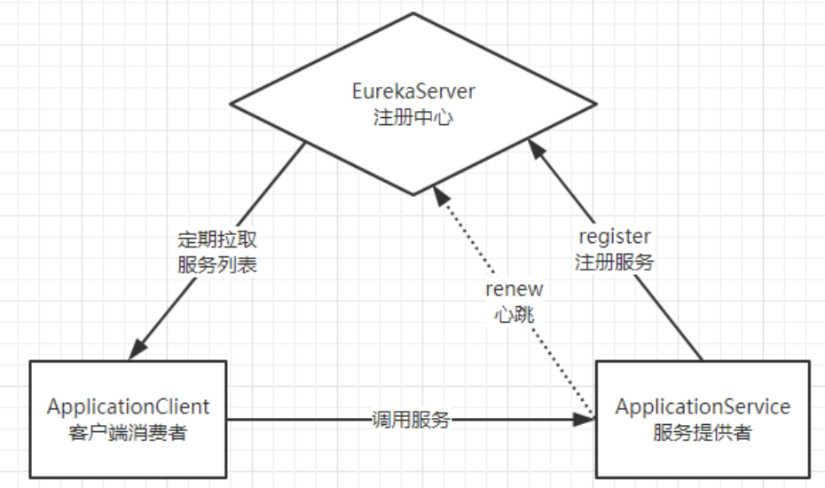
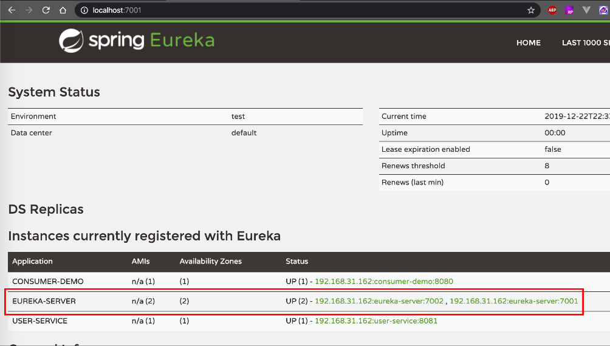
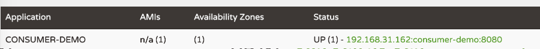
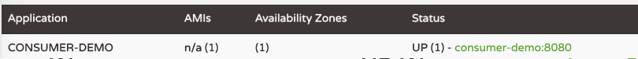

# 01. Eureka服务发现与治理
上一篇文章中我们主要使用了Eureka组件搭建了一个SpringCloud基础Demo:[springcloud-demo](https://github.com/zephyrlai/springcloud-demo/tree/01-eureka)，而本文将重点讲解Eureka组件。
## 一、Eureka初识
### 1.1 什么是服务治理
微服务之间的相互调用是很常见且频繁的，如果只是各自维护彼此的调用的关系，则会增大代码复杂度，平添运维成本。Spring Cloud Eureka可以帮助我们解决这个问题。  
Eureka管理着所有可用的服务，服务调用者无需自己寻找服务，而是把自己的需求告诉Eureka，然后Eureka会把符合你需求的服务告诉你。
同时，服务提供方与Eureka之间通过`“心跳”`机制进行监控，当某个服务提供方出现问题，Eureka自然会把它从服务列表中剔除。
这就实现了服务的自动注册、发现、状态监控。
### 1.2 Eureka基础架构
  
* Eureka：就是服务注册中心（可以是一个集群），对外暴露自己的地址
* 提供者：启动后向Eureka注册自己信息（地址，提供什么服务）
* 消费者：向Eureka订阅服务，Eureka会将对应服务的所有提供者地址列表发送给消费者，并且定期更新
* 心跳(续约)：提供者定期通过http方式向Eureka刷新自己的状态

## 二、Eureka详解
### 2.1 Eureka架构中的三个核心角色：
* 服务注册中心
    Eureka的服务端应用，提供服务注册和发现功能，前文中eureka-demo就充当注册中心的角色。
* 服务提供者
    提供服务的应用，可以是SpringBoot应用，也可以是其它任意技术实现，只要对外提供的是Rest风格服务即可。
* 服务消费者
    消费应用从注册中心获取服务列表，从而得知每个服务方的信息，知道去哪里调用服务方。
### 2.2 Eureka集群实现高可用
在[springcloud-demo](https://github.com/zephyrlai/springcloud-demo/tree/01-eureka)中，我们启用了一台eureka-server，而在生产环境中，则需要启用多台eureka-server来搭建服务注册中心集群以保障服务治理的高可用。 
#### 服务同步 
集群搭建的思想就是注册中心之间互相注册，当服务提供者注册到Eureka Server集群中的某个节点时，该节点会把服务的信息同步给集群中的每个节点，从而实现**数据同步**。因此，无论客户端访问到Eureka Server集群中的任意一个节点，都可以获取到完整的服务列表信息。  
#### 集群搭建
现以2台eureka-server（端口号分别为7001、7002）搭建集群为例：
* 7001配置文件
    ``` yml
    server:
    port: 7001 # 端口
    spring:
    application:
        name: eureka-server # 应用名称，会在Eureka中显示
    eureka:
    client:
        register-with-eureka: true # 是否注册自己的信息到EurekaServer，默认是true
        fetch-registry: false # 是否拉取其它服务的信息，默认是true
        service-url: # EurekaServer的地址，现在是自己的地址，如果是集群，需要加上其它Server的地址。
        defaultZone: http://127.0.0.1:7002/eureka
    instance:
        prefer-ip-address: true # 当其它服务获取地址时提供ip而不是hostname
        ip-address: 127.0.0.1 # 指定自己的ip信息，不指定的话会自己寻找
    ```
* 7002配置文件
    ``` yml
    server:
    port: 7002 # 端口
    spring:
    application:
        name: eureka-server # 应用名称，会在Eureka中显示
    eureka:
    client:
        register-with-eureka: true # 是否注册自己的信息到EurekaServer，默认是true
        fetch-registry: false # 是否拉取其它服务的信息，默认是true
        service-url: # EurekaServer的地址，现在是自己的地址，如果是集群，需要加上其它Server的地址。
        defaultZone: http://127.0.0.1:7001/eureka
    instance:
        prefer-ip-address: true # 当其它服务获取地址时提供ip而不是hostname
        ip-address: 127.0.0.1 # 指定自己的ip信息，不指定的话会自己寻找
    ```
* 服务生产者、消费者的eureka配置（配置所有eureka-server节点，以逗号分隔）
    ``` properties
    eureka.client.service-url.defaultZone=http://127.0.0.1:7001/eureka,http://127.0.0.1:7002/eureka
    ```
* 启动后，可以看到此时的eureka-server集群信息如下：
    


### 2.3 服务提供者
服务提供者要向EurekaServer注册服务，并且完成服务续约等工作。
#### 2.3.1 服务注册
服务提供者在启动时，会检测配置属性中的：`eureka.client.register-with-erueka=true`参数是否正确，事实上默认就是true。如果值确实为true，则会向EurekaServer发起一个Rest请求，并携带自己的元数据信息，Eureka Server会把这些信息保存到一个`双层Map结构`中。第一层Map的Key就是服务名称，第二层Map的key是服务的实例id。
#### 2.3.2 服务续约
在注册服务完成以后，服务提供者会维持一个心跳（定时向EurekaServer发起Rest请求），告诉EurekaServer：“我还活着”。这个我们称为服务的续约（renew）。有两个重要参数可以修改服务续约的行为：
``` yml
eureka:
  instance:
    # 服务失效时间，默认值90秒
    lease-expiration-duration-in-seconds: 90
    # 服务续约(renew)的间隔，默认为30秒
    lease-renewal-interval-in-seconds: 30
```
也就是说，默认情况下每个30秒服务会向注册中心发送一次心跳，证明自己还活着。如果超过90秒没有发送心跳，EurekaServer就会认为该服务宕机，会从服务列表中移除，这两个值在生产环境不要修改，默认即可。
### 2.4 服务消费者
当服务消费者启动是，会检测`eureka.client.fetch-registry=true`参数的值，如果为true，则会从Eureka Server服务的列表只读备份，然后缓存在本地。并且`每隔30秒`会重新获取并更新数据，此参数对应的配置是：`eureka.client.registry-fetch-interval-seconds`,单位秒。

### 2.5 失效剔除和自我保护
#### 2.5.1 失效提出
有些时候，我们的服务提供方并不一定会正常下线，可能因为内存溢出、网络故障等原因导致服务无法正常工作。Eureka Server需要将这样的服务剔除出服务列表。因此它会开启一个定时任务，每隔60秒对所有失效的服务（超过90秒未响应）进行剔除。  
可以通过`eureka.server.eviction-interval-timer-in-ms`参数对其进行修改，单位是毫秒，生成环境不建议修改。

#### 2.5.2 自我保护
我们关停一个服务，就会在Eureka面板看到一条警告：
  
这是触发了Eureka的自我保护机制。当一个服务未按时进行心跳续约时，Eureka会统计最近15分钟心跳失败的服务实例的比例是否超过了85%。在生产环境下，因为网络延迟等原因，心跳失败实例的比例很有可能超标，但是此时就把服务剔除列表并不妥当，因为服务可能没有宕机。Eureka就会把当前实例的注册信息保护起来，不予剔除。生产环境下这很有效，保证了大多数服务依然可用。  
可以通过如下2个配置来关闭自我保护或者调整扫描失效服务的时间间隔。  
``` yml
eureka:
  server:
    enable-self-preservation: false # 关闭自我保护模式（缺省为打开）
    eviction-interval-timer-in-ms: 1000 # 扫描失效服务的间隔时间（缺省为60*1000ms）
```
## 补充：
在eureka默认提供的监控页面中，status一列显示以下信息：
  
* UP(1)：代表现在是启动了1个示例，没有集群
* 192.168.31.162:consumer-demo:8080：是示例的名称（instance-id），
  * 默认格式是：`${hostname} + ${spring.application.name} + ${server.port}`
  * instance-id是区分同一服务的不同实例的唯一标准，因此不能重复。
我们可以通过instance-id属性来修改它的构成：
``` properties
eureka.instance.instance-id=${spring.application.name}:${server.port}
```
重启后显示如下：  
  

