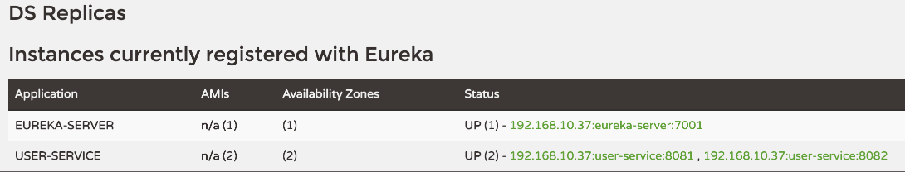
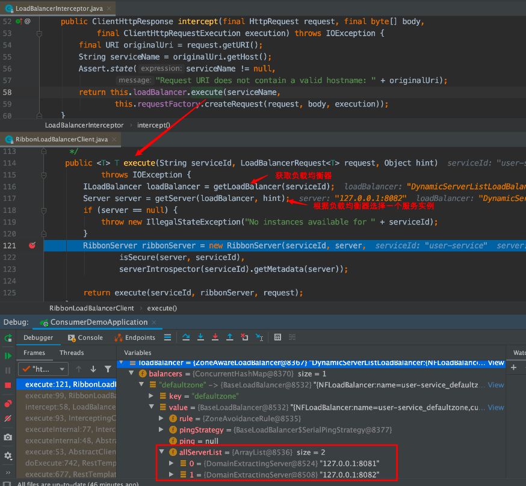
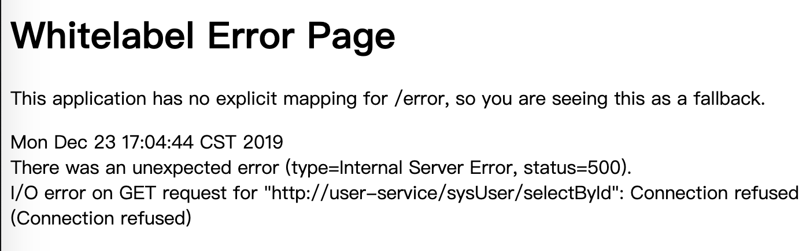
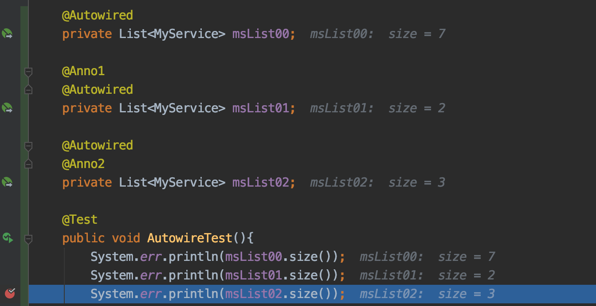

# 02. Robbin：负载均衡
之前的项目[springcloud-demo](https://github.com/zephyrlai/springcloud-demo/tree/01-eureka)中，我们使用了单机的服务提供者（user-service），而在实际的生产环境中，服务提供方肯定会以多台部署（集群）的方式提供以保障服务高可用，这种情况下，很容易想到需要写一个负载均衡算法来调用。而Spring Cloud Eureka已提供了负载均衡组件Robbin，只需要少量代码、配置即可快速投入使用
## 一、基础使用
### 1.1 提供2个user-service实例


### 1.2 修改注入的RestTemplate实例
``` java
@Configuration
public class SysConfiguration {

    // 添加@LoadBalanced注解
    @Bean
    @LoadBalanced
    public RestTemplate restTemplate(){
        return new RestTemplate();
    }
}
```
### 1.3 修改服务调用方的服务调用方式：不再使用host:port方式调用，而直接根据服务名(spring.application.name)调用
``` java
@RestController
@RequestMapping("consumer/sysUser/")
public class SysUserController {
    @Resource
    private RestTemplate restTemplate;

    @RequestMapping("selectById")
    public SysUser selectById(Integer id) {
        String url = "http://user-service/sysUser/selectById?id=" + id;
        return restTemplate.getForObject(url, SysUser.class);
    }

}
```
### 1.4 改造服务提供方，输出请求ip
``` java
@RequestMapping("sysUser")
@RestController
public class SysUserController {

    @Resource
    private SysUserService sysUserService;

    @Resource
    private HttpServletRequest request;

    @RequestMapping("selectById")
    public SysUser selectById(Integer id ){
        System.err.println(request.getRequestURL());
        return sysUserService.selectById(id);
    }
}
```
### 1.5 多次执行后，user-service的输出日志
``` log
http://127.0.0.1:8081/sysUser/selectById
http://127.0.0.1:8082/sysUser/selectById
http://127.0.0.1:8081/sysUser/selectById
http://127.0.0.1:8082/sysUser/selectById
```

## 二、源码进阶
### 2.1 核心对象
2个重点自动配置类：
* RibbonAutoConfiguration.java：将`RibbonLoadBalancerClient`注入Spring容器
* LoadBalancerAutoConfiguration.java：将`LoadBalancerRequestFactory`对象、`LoadBalancerInterceptor`对象注入Spring容器，获取所有被`@LoadBalance`标记的`RestTemplate`对象，并挨个添加`LoadBalancerInterceptor`对象。
#### 2.1.1 @LoadBalanced
* javadoc:Annotation to mark a RestTemplate bean to be configured to use a LoadBalancerClient.
* 含义：标记会被转换成`LoadBalancerClient`的`RestTemplate`对象
#### 2.1.2 LoadBalancerClient：
* javadoc:Represents a client-side load balancer.
* 大致含义：客户端负载均衡器。
* 由RibbonAutoConfiguration默认提供的RibbonLoadBalancerClient对象：
    ``` java
    @Configuration
    @Conditional(RibbonAutoConfiguration.RibbonClassesConditions.class)
    @RibbonClients
    @AutoConfigureAfter(
            name = "org.springframework.cloud.netflix.eureka.EurekaClientAutoConfiguration")
    @AutoConfigureBefore({ LoadBalancerAutoConfiguration.class,
            AsyncLoadBalancerAutoConfiguration.class })
    @EnableConfigurationProperties({ RibbonEagerLoadProperties.class,
            ServerIntrospectorProperties.class })
    public class RibbonAutoConfiguration {
        ...
        @Bean
        @ConditionalOnMissingBean(LoadBalancerClient.class)
        public LoadBalancerClient loadBalancerClient() {
            return new RibbonLoadBalancerClient(springClientFactory());
        }
        ...
    }
    ```
#### 2.1.3 LoadBalancerRequestFactory:
* javadoc：Creates LoadBalancerRequests for LoadBalancerInterceptor and RetryLoadBalancerInterceptor. Applies LoadBalancerRequestTransformers to the intercepted HttpRequest.
* 大致含义：将`HttpRequest`转化为`LoadBalancerRequest`并提供给`LoadBalancerRequests`或`LoadBalancerInterceptor`。（如果有提供自定义`LoadBalancerRequestTransformers`实现，也可在转化中执行）
* `LoadBalancerRequestFactory`实例在`LoadBalancerAutoConfiguration`中注入：
    ``` java
    @Configuration(proxyBeanMethods = false)
    @ConditionalOnClass(RestTemplate.class)
    @ConditionalOnBean(LoadBalancerClient.class)
    @EnableConfigurationProperties(LoadBalancerRetryProperties.class)
    public class LoadBalancerAutoConfiguration {
        // 获取到所有被@LoadBalanced标记的RestTemplate对象
        @LoadBalanced
        @Autowired(required = false)
        private List<RestTemplate> restTemplates = Collections.emptyList();
        ...
        @Bean
        @ConditionalOnMissingBean
        public LoadBalancerRequestFactory loadBalancerRequestFactory(
                LoadBalancerClient loadBalancerClient) {
            return new LoadBalancerRequestFactory(loadBalancerClient, this.transformers);
        }
        ...
    }
    ```
#### 2.1.4 LoadBalancerInterceptor (implements ClientHttpRequestInterceptor)
* `ClientHttpRequestInterceptor`的javadoc：Intercepts client-side HTTP requests. Implementations of this interface can be registered with the RestTemplate, as to modify the outgoing ClientHttpRequest and/or the incoming ClientHttpResponse.
* 含义：拦截客户端的http请求，将接收到的`HttpRequest`转化成`ClientHttpRequest`，并最终返回`ClientHttpResponse`
* 可以看到，`loadBalancerInterceptor`在`LoadBalancerAutoConfiguration.LoadBalancerInterceptorConfig#restTemplateCustomizer`添加到`restTemplate`的拦截器列表。而创建`loadBalancerInterceptor`所需的`loadBalancerClient`、`requestFactory`就是上面Ribbon默认注入的。
``` java
@Configuration(proxyBeanMethods = false)
@ConditionalOnClass(RestTemplate.class)
@ConditionalOnBean(LoadBalancerClient.class)
@EnableConfigurationProperties(LoadBalancerRetryProperties.class)
public class LoadBalancerAutoConfiguration {
    ...
    @Configuration(proxyBeanMethods = false)
	@ConditionalOnMissingClass("org.springframework.retry.support.RetryTemplate")
	static class LoadBalancerInterceptorConfig {

		@Bean
		public LoadBalancerInterceptor ribbonInterceptor(
				LoadBalancerClient loadBalancerClient,
				LoadBalancerRequestFactory requestFactory) {
			return new LoadBalancerInterceptor(loadBalancerClient, requestFactory);
		}

		@Bean
		@ConditionalOnMissingBean
		public RestTemplateCustomizer restTemplateCustomizer(
				final LoadBalancerInterceptor loadBalancerInterceptor) {
			return restTemplate -> {
				List<ClientHttpRequestInterceptor> list = new ArrayList<>(
						restTemplate.getInterceptors());
				list.add(loadBalancerInterceptor);
				restTemplate.setInterceptors(list);
			};
		}
        ...
	}
    ...
}
```

### 2.2 请求地址替换
上一章节中，服务调用者在代码中请求的地址是"http://user-service/sysUser/selectById"，盲猜是Ribbon将地址中的“user-service”替换成了实际的请求地址，实际上是`LoadBalancerInterceptor`帮助我们做了这件事。  
通过前一小结的分析
现在我们来简单地追踪一下源码，看一下Ribbon是如何实现的：     
其中的loadBalancer、requestFactory就是上面提到的`RibbonLoadBalancerClient`与`LoadBalancerRequestFactory`对象。
### 2.3 负载均衡策略
#### 2.3.1 轮询：默认的负载均衡策略
##### 2.3.1.1 负载均衡策略模式的选取
追踪源码可以发现，是`BaseLoadBalancer`中的`rule`对象，默认注入的是轮询类型的Rule。
``` java
public class BaseLoadBalancer extends AbstractLoadBalancer implements
        PrimeConnections.PrimeConnectionListener, IClientConfigAware {
    private final static IRule DEFAULT_RULE = new RoundRobinRule();
    ...
    protected IRule rule = DEFAULT_RULE;
    ...
    public Server chooseServer(Object key) {
        if (counter == null) {
            counter = createCounter();
        }
        counter.increment();
        if (rule == null) {
            return null;
        } else {
            try {
                return rule.choose(key);
            } catch (Exception e) {
                logger.warn("LoadBalancer [{}]:  Error choosing server for key {}", name, key, e);
                return null;
            }
        }
    }
    ...
}
```
也可以写个单元测试来验证：
``` java
@SpringBootTest(classes = ConsumerDemoApplication.class)
public class LoadBalanceTest {

    @Autowired
    RibbonLoadBalancerClient client;

    @Test
    public void test(){
        for (int i = 0; i < 10; i++) {
            ServiceInstance instance = this.client.choose("user-service");
            System.out.println(instance.getHost() + ":" + instance.getPort());
        }
    }
}
```
可以看到，缺失是轮询请求的：
``` 
127.0.0.1:8081
127.0.0.1:8082
127.0.0.1:8081
127.0.0.1:8082
127.0.0.1:8081
127.0.0.1:8082
127.0.0.1:8081
127.0.0.1:8082
127.0.0.1:8081
127.0.0.1:8082
```
#### 2.3.2 修改负载均衡策略
* 可以根据IRule接口的实现，看看SpringCloud提供了那些负载均衡实现  
    ``` 
    AbstractLoadBalancerRule.java
    AvailabilityFilteringRule.java
    BestAvailableRule.java
    ClientConfigEnabledRoundRobinRule.java
    PredicateBasedRule.java
    RandomRule.java
    ResponseTimeWeightedRule.java
    RetryRule.java
    RoundRobinRule.java
    WeightedResponseTimeRule.java
    ZoneAvoidanceRule.java
    ```
* 修改yml配置：
    格式是：`{服务名称}.ribbon.NFLoadBalancerRuleClassName`，值就是IRule的实现类。  
    ``` yml
    user-service:
        ribbon:
            NFLoadBalancerRuleClassName: com.netflix.loadbalancer.RandomRule
    ```
* 重新执行单测，可以发现已经变成随机请求：
    ``` 
    127.0.0.1:8082
    127.0.0.1:8081
    127.0.0.1:8082
    127.0.0.1:8081
    127.0.0.1:8081
    127.0.0.1:8081
    127.0.0.1:8082
    127.0.0.1:8081
    127.0.0.1:8081
    127.0.0.1:8081
    ```

## 三、重试机制
Eureka的服务治理强调了CAP原则中的AP，即可用性和可靠性。它与Zookeeper这一类强调CP（一致性，可靠性）的服务治理框架最大的区别在于：Eureka为了实现更高的服务可用性，牺牲了一定的一致性，极端情况下它宁愿接收故障实例也不愿丢掉健康实例，正如我们上面所说的自我保护机制。
但是，此时如果我们调用了这些不正常的服务，调用就会失败，从而导致其它服务不能正常工作！这显然不是我们愿意看到的。如果现在`user-service`注册了8081、8082台实例，`consumer-demo`启动Ribbon负载均衡，此时我们停掉`user-service`的8082示例。`eureka-server`中针对`user-service`中还记录着8082实例，此时`consumer-demo`轮询到8082将报如下错误信息，但`user-service`的8081实例是可以提供服务的：
  
在这种情况下，我们希望Ribbon能自动重试其他可用实例，如果其余实例都宕机，再返回连接不可用的信息
### 3.1 新增pom依赖
``` xml
<dependency>
    <groupId>org.springframework.retry</groupId>
    <artifactId>spring-retry</artifactId>
</dependency>
```
### 3.2 新增配置
``` properties
# 开启Spring Cloud的重试功能
spring.cloud.loadbalancer.retry.enabled=true
# Ribbon的连接超时时间
user-service.ribbon.ConnectTimeout=250
# Ribbon的数据读取超时时间
user-service.ribbon.ReadTimeout=1000
# 是否对所有操作都进行重试
user-service.ribbon.OkToRetryOnAllOperations=true
# 切换实例的重试次数
user-service.ribbon.MaxAutoRetriesNextServer=1
# 对当前实例的重试次数
user-service.ribbon.MaxAutoRetries=1
```
可以看到，Ribbon能够实现自动重试而不会返回8082实例的错误信息。


## 四、补充知识
### 4.1 @Autowire冷知识
在使用`@Autowire`或`@Resource`获取Spring容器中对象时，同时写上自定义注解，将或获取到被自定义注解标记的对象，下面用代码来简单演示一下：
* 定义2个注解：`Anno1.java`、`Anno2.java`*注意需要在注解上添加@Qualifier注解*
    ``` java
    @Documented
    @Qualifier
    @Retention(RetentionPolicy.RUNTIME)
    @Target({ElementType.METHOD,ElementType.FIELD})
    public @interface Anno1 {
    }
    ```    
    ``` java
    @Documented
    @Qualifier
    @Retention(RetentionPolicy.RUNTIME)
    @Target({ElementType.METHOD,ElementType.FIELD})
    public @interface Anno2 {
    }
    ```
* 定义一个类，用于提交到Spring容器：`MyService.java`
    ``` java
    public class MyService {
    }
    ```
* 定义配置类，用于提交多个`MyService`实例：`MyConfig.java`
    ``` java
    @Configuration
    public class MyConfig {

        @Bean
        @Anno1
        public MyService ms11(){
            return new MyService();
        }
        @Bean
        @Anno1
        public MyService ms12(){
            return new MyService();
        }
        @Bean
        @Anno2
        public MyService ms21(){
            return new MyService();
        }
        @Bean
        @Anno2
        public MyService ms22(){
            return new MyService();
        }
        @Bean
        @Anno2
        public MyService ms23(){
            return new MyService();
        }
        @Bean
        public MyService ms01(){
            return new MyService();
        }
        @Bean
        public MyService ms02(){
            return new MyService();
        }
    }
    ```
* 从Spring容器获取`MyService`实例
    ``` java
    @Autowired
	private List<MyService> msList00;

	@Anno1
	@Autowired
	private List<MyService> msList01;

	@Autowired
	@Anno2
	private List<MyService> msList02;

	@Test
	public void AutowireTest(){
		System.err.println(msList00.size());
		System.err.println(msList01.size());
		System.err.println(msList02.size());
	}
    ```
* 效果：
    


## 参考
> [为何一个@LoadBalanced注解就能让RestTemplate拥有负载均衡的能力？](https://juejin.im/post/5d80576de51d4561b416d51f#heading-4)  
> [CAP原则(CAP定理)、BASE理论](https://www.cnblogs.com/duanxz/p/5229352.html)


