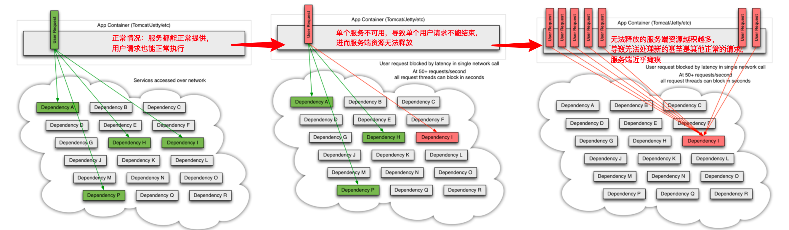

>  本文所构建的代码已上传至[Github](https://github.com/zephyrlai/springcloud-demo/tree/04-hystrix)(注意切换分支) ，所有代码均亲测有效，祝食用愉快。
## 一、Why Hystrix?
### 1.1 雪崩问题
微服务架构中，常见的情况就是各微服务之间互相/嵌套调用，假设服务 A 依赖服务 B 和服务 C，而 B 服务和 C 服务有可能继续依赖
 其他的服务，继续下去会使得调用链路过长，技术上称 1->N 扇出。，其中一个微服务不可用时，很容易导致调用到该服务的其他微服务级联宕机，称之为服务雪崩。为了应对这样的局面，可以使用Spring Cloud Hystrix组件来实现服务降级与服务降级。  
  

## 二、What Is Hystrix?
### 2.1 服务降级
所谓服务降级，就类似于头等舱降为经济舱，常见于服务宕机时，服务端能自动返回一个友好的提示，告知用户当前服务暂不可用。具体的代码实现，则可以为每一个接口提供一个fallback方法，或者全局提供一个通用的fallback方法用于返回错误信息或用户提示。
### 2.2 服务熔断
当Hystrix Command请求后端服务失败数量超过一定比例(默认50%), 断路器会切换到开路状态(Open). 这时所有请求会直接失败而不会发送到后端服务. 断路器保持在开路状态一段时间后(默认5秒), 自动切换到半开路状态(HALF-OPEN).时会判断下一次请求的返回情况, 如果请求成功, 断路器切回闭路状态(CLOSED), 否则重新切换到开路状态(OPEN). Hystrix的断路器就像我们家庭电路中的保险丝, 一旦后端服务不可用, 断路器会直接切断请求链, 避免发送大量无效请求影响系统吞吐量, 并且断路器有自我检测并恢复的能力.
### 2.3 依赖隔离
在Hystrix中, 主要通过线程池来实现资源隔离. 通常在使用的时候我们会根据调用的远程服务划分出多个线程池.比如说，一个服务调用两外两个服务，你如果调用两个服务都用一个线程池，那么如果一个服务卡在哪里，资源没被释放。后面的请求又来了，导致后面的请求都卡在哪里等待，导致你依赖的A服务把你卡在哪里，耗尽了资源，也导致了你另外一个B服务也不可用了。这时如果依赖隔离，某一个服务调用A B两个服务，如果这时我有100个线程可用，我给A服务分配50个，给B服务分配50个，这样就算A服务挂了，我的B服务依然可以用。  

### 2.4 Hystrix的作用：
Hystirx在所起的作用，官方wiki是这样描述的：
> When you use Hystrix to wrap each underlying dependency, the architecture as shown in diagrams above changes to resemble the following diagram. Each dependency is isolated from one other, restricted in the resources it can saturate when latency occurs, and covered in fallback logic that decides what response to make when any type of failure occurs in the dependency  
翻译一下：
> 当使用Hystrix封装每个基础依赖项时，如上图所示的体系结构将更改为类似于下图。 每个依赖项彼此隔离，受到延迟时发生饱和的资源的限制，并包含回退逻辑，该逻辑决定了在依赖项中发生任何类型的故障时做出什么响应。

## 三、How To Use Hystrix?
### 3.1 类级别的服务降级
#### 3.1.1 新建工程（consumer-feign-hystrix-demo-9021）
#### 3.1.2 引入依赖
``` xml
<dependency>
    <groupId>org.springframework.cloud</groupId>
    <artifactId>spring-cloud-starter-netflix-hystrix</artifactId>
</dependency>
```
#### 3.1.3 配置
``` properties
spring.application.name=consumer-hystrix-feign-demo-9021
server.port=9021
# EurekaServer地址
eureka.client.service-url.defaultZone=http://127.0.0.1:7001/eureka,http://127.0.0.1:7002/eureka
# 指定ip信息
eureka.instance.prefer-ip-address=true
eureka.instance.ip-address=127.0.0.1

feign.httpclient.enabled=true
feign.hystrix.enabled=true

# 设置服务熔断时限，改为 2000 毫秒
hystrix.command.default.execution.isolation.thread.timeoutInMilliseconds=2000
```
#### 3.1.3 启动类上激活Hystrix
``` java
@SpringBootApplication
@EnableDiscoveryClient // 开启Eureka客户端
@EnableHystrix
public class ConsumerDemoApplication {
	public static void main(String[] args) {
		SpringApplication.run(ConsumerDemoApplication.class, args);
	}
}
```
#### 3.1.4 针对feignService新建FallbackFactory类
``` java
@Component
public class FeignSysUserServiceFallbackFactory implements FallbackFactory<FeignSysUserService> {
    @Override
    public FeignSysUserService create(Throwable throwable) {
        return new FeignSysUserService() {
            @Override
            public SysUser selectById(Integer id) {
                System.err.println("hystrix fallback method");
                return new SysUser("user not available");
            }

            @Override
            public SysUser selectById4Get(Integer id) {
                System.err.println("hystrix fallback method");
                return new SysUser("user not available");
            }

            @Override
            public SysUser query4Get(SysUser sysUser) {
                System.err.println("hystrix fallback method");
                return new SysUser("user not available");
            }

            @Override
            public Boolean save(SysUser sysUser) {
                System.err.println("hystrix fallback method");
                return false;
            }
        };
    }
}
```
#### 3.1.5 在feignService上关联对应的FallbackFactory类
``` java
@FeignClient(value="user-service",fallbackFactory = FeignSysUserServiceFallbackFactory.class)
@RequestMapping("/sysUser")
public interface FeignSysUserService {
    @RequestMapping("/selectById/{id}")
    SysUser selectById(@PathVariable Integer id);

    @RequestMapping("/selectById4Get")
    SysUser selectById4Get(@RequestParam("id") Integer id);

    @RequestMapping("/query4Get")
    SysUser query4Get(@RequestBody SysUser sysUser);

    @PostMapping("/save")
    Boolean save(SysUser sysUser);
}
```
#### 3.1.6 查看效果
启动`eureka-servce`、`consumer-hystrix-feign-demo-9021`（未开启服务提供方（`user-service`）），可以看到服务成功降级：
``` json
// 20200101173653
// http://localhost:9021/consumer/sysUser/selectById/1

{
  "id": null,
  "username": "user not available",
  "password": null,
  "name": null,
  "age": null,
  "gender": null,
  "remarks": null
}
```


### 3.2 方法级别的服务降级
主要用于使用`restTemplate`执行请求的情况，注意：每个方法的fallback方法，需要与原方法的入参出参（即方法签名）一致：
#### 3.2.1 新建一个基于RestTemplate的简单服务：
``` java
@RestController
@RequestMapping("rest/sysUser")
public class RestTemplateSysUserController {

    private RestTemplate restTemplate = new RestTemplate();

    // 3. 添加注解，并指定fallback方法
    @HystrixCommand(fallbackMethod = "myFallback")
    @RequestMapping("selectById/{id}")
    public SysUser selectById(@PathVariable("id") Integer id){
        // 1. 使用restTemplate执行请求
        String url = "http://user-service/sysUser/selectById?id=" + id;
        return restTemplate.getForObject(url, SysUser.class);
    }
    // 2. 编写对应的fallback方法：
    public SysUser myFallback(Integer id){
        return new SysUser("user not available");
    }
}
```
#### 3.2.2 效果：
``` json
// 20200101180646
// http://localhost:9021/rest/sysUser/selectById/1

{
  "id": null,
  "username": "user not available",
  "password": null,
  "name": null,
  "age": null,
  "gender": null,
  "remarks": null
}
```


## 四、全局统一服务降级的尝试
SpringCloud推荐对应每一个业务方法提供对应的fallback方法，这当然能提供到更加友好的服务降级，但针对每个service、甚至是method提供对应的fallback，这必将延长开发周期，代码越多越容易出错，个人认为没有必要（__偏见__），在这里提出一种全局的服务降级模式：在提供全局的`FallbackFactory`实现中的`create`方法中，抛出对应的业务异常，而在全局异常处理器中捕获对应异常，统一向客户端返回一个通用的服务降级的结果。
### 4.1 统一FallbackFactory实现
``` java
@Component
public class CommonFallbackFactory implements FallbackFactory {
    @Override
    public Object create(Throwable throwable) {
        throwable.printStackTrace();
        throw new RuntimeException("service not available");
    }
}
```
### 4.2 全局异常处理
``` java
@ControllerAdvice
public class GlobalExceptionHandler {

    @Resource
    private HttpServletResponse response;

    @ExceptionHandler(value =RuntimeException.class)
    public void exceptionHandler(Exception e) throws IOException {
        System.out.println("系统错误！原因是:"+e);
        PrintWriter writer = response.getWriter();
        writer.print("service not available");

    }
}
```
### 4.3 业务层改造
``` java
@FeignClient(value="user-service",fallbackFactory = CommonFallbackFactory.class)
@RequestMapping("/sysUser")
public interface FeignSysUserService {
    ...
}
```
### 4.4 效果
``` log
service not available
```
而控制台也能看到准确的错误日志:
``` log
Caused by: com.netflix.client.ClientException: Load balancer does not have available server for client: user-service
	at com.netflix.loadbalancer.LoadBalancerContext.getServerFromLoadBalancer(LoadBalancerContext.java:483)
	at com.netflix.loadbalancer.reactive.LoadBalancerCommand$1.call(LoadBalancerCommand.java:184)
	at com.netflix.loadbalancer.reactive.LoadBalancerCommand$1.call(LoadBalancerCommand.java:180)
	at rx.Observable.unsafeSubscribe(Observable.java:10327)
    ...
```

## 五、关于服务熔断
服务熔断的概念在2.2小结已经说的比较清楚了，在`Hystrix`中的服务熔断是自动的，我们只要正确地添加`Hystrix`依赖、启动类上添加`@EnableCircuitBreaker`（基于Feign的话还需要添加配置`feign.hystrix.enabled=true`）就行了。

## 参考
> [Netflix/Hystrix](https://github.com/Netflix/Hystrix/wiki)