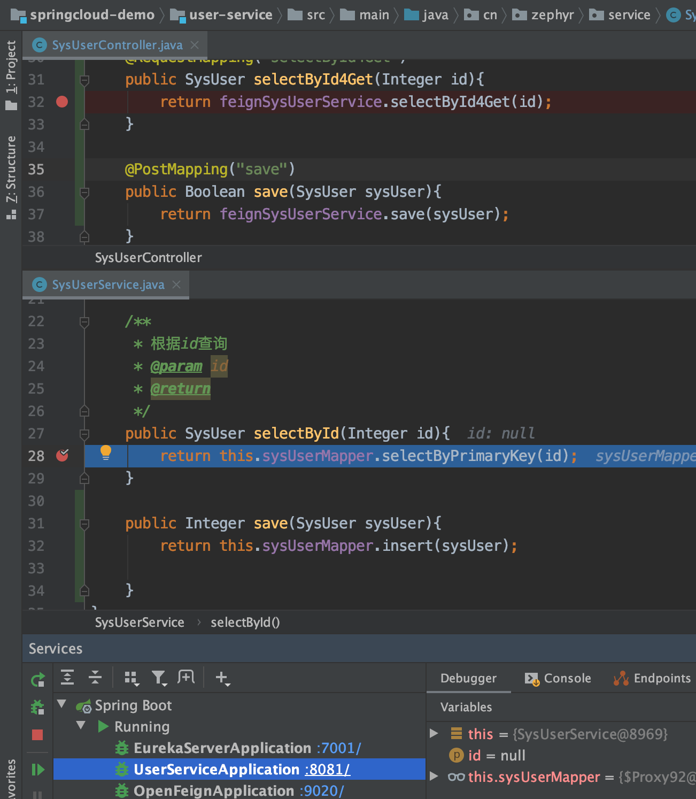

>  本文所构建的代码已上传至[Github](https://github.com/zephyrlai/springcloud-demo/tree/03-feign)(注意切换分支) ，所有代码均亲测有效，祝食用愉快。
## 一、Why Feign
### 1.1 直接使用RestTemplate的缺点
1. 手动定义接口的调用路径
2. 执行结果未知

## 二、What is Feign
openFeign是针对消费端的
官网对于Spring Cloud OpenFeign的说明：
> Declarative REST Client: Feign creates a dynamic implementation of an interface decorated with JAX-RS or Spring MVC annotations.  
即：作为声明式的REST客户端，针对被JAX-RS和Spring MVC注解修饰的接口，Feign提供了一种动态的实现。  
Feign，假装、伪装。就是将服务名伪装为接口名对外提供服务。  
此外，OpenFeign 中使用 Ribbon 进行负载均衡，所以 OpenFeign 直接内置了 Ribbon。即在导入 OpenFeign 依赖后，无需再专门导入 Ribbon 依赖了。


## 三、How to use Feign
### 2.1 新建项目（consumer-feign-demo-9020）
### 2.2 添加依赖
``` xml
<dependencies>
    <dependency>
        <groupId>org.springframework.boot</groupId>
        <artifactId>spring-boot-starter-web</artifactId>
    </dependency>

    <!-- Eureka客户端 -->
    <dependency>
        <groupId>org.springframework.cloud</groupId>
        <artifactId>spring-cloud-starter-netflix-eureka-client</artifactId>
    </dependency>
    <!--  OpenFeign  -->
    <dependency>
        <groupId>org.springframework.cloud</groupId>
        <artifactId>spring-cloud-starter-openfeign</artifactId>
    </dependency>
</dependencies>
```
### 2.3 添加配置
``` properties
spring.application.name=consumer-feign-demo
server.port=9020
# EurekaServer地址
eureka.client.service-url.defaultZone=http://127.0.0.1:7001/eureka
# 指定自己的ip信息，不指定的话会自己寻找
eureka.instance.prefer-ip-address=true
eureka.instance.ip-address=127.0.0.1
```
### 2.4 编写调用服务端接口的声明式接口
``` java
@FeignClient("user-service")
@RequestMapping("/sysUser")
public interface FeignSysUserService {
    @RequestMapping("/selectById/{id}")
    SysUser selectById(@PathVariable Integer id);
}
```
### 2.5 Controller层调用FeignService
``` java
@RestController
@RequestMapping("consumer/sysUser")
public class SysUserController {

    @Resource
    private FeignSysUserService feignSysUserService;

    @RequestMapping("selectById/{id}")
    public SysUser selectById(@PathVariable Integer id){
        return feignSysUserService.selectById(id);
    }
}
```
### 2.6 启动类上开启Feign
``` java
@SpringBootApplication
@EnableFeignClients
public class OpenFeignApplication {
    public static void main(String[] args) {
        SpringApplication.run(OpenFeignApplication.class,args);
    }
}
```
### 2.7 效果
启动`eureka-server`、`user-service`、`consumer-feign-demo-9020`后，请求接口地址`http://localhost:9020/consumer/sysUser/selectById/1`可以看到，与使用RestTemplate直接调用无异。
``` json
// 20191231213541
// http://localhost:9020/consumer/sysUser/selectById/1

{
  "id": 1,
  "username": "haha",
  "password": "111111",
  "name": "zhangsan",
  "age": 21,
  "gender": 1,
  "remarks": "11223344"
}
```

## 四、关于Feign接口调用时的传参问题
个人感觉Spring Cloud Feign在传参的时候严格遵守Restful风格，在执行get请求时，仅从url路径中提取参数，如果我们平时开发时，未遵守Restful风格，在提交get请求时，其携带的参数将会被丢失掉：
### 4.1 使用Get提交多个条件的查询（使用/xx/xx?x1=xx&...&...）
#### 4.1.1 consumer-feign-demo-9020
``` java
// SysUserController
@RequestMapping("selectById4Get")
public SysUser selectById4Get(Integer id){
    return feignSysUserService.selectById4Get(id);
}
```
``` java
// FeignSysUserService
@RequestMapping("/selectById4Get")
SysUser selectById4Get(Integer id);
```
#### 4.1.2 user-service
``` java
// SysUserController
@RequestMapping("selectById4Get")
public SysUser selectById4Get(Integer id){
    System.err.println(request.getRequestURL());
    return sysUserService.selectById(id);
}
```
#### 4.1.3 执行请求，将会看到user-service接收不到参数

### 4.2 解决方案:使用Apache HttpClient替换Feign原生httpclient
#### 4.2.1 新增配置
``` properties
feign.httpclient.enabled=true
```
#### 4.2.2 新增依赖
``` xml
<!--使用Apache HttpClient替换Feign原生httpclient-->
<dependency>
    <groupId>org.apache.httpcomponents</groupId>
    <artifactId>httpclient</artifactId>
</dependency>
<dependency>
    <groupId>io.github.openfeign</groupId>
    <artifactId>feign-httpclient</artifactId>
</dependency>
```
#### 4.2.3 FeignService与服务提供方（user-service）均采用json方式通信
*  consumer-feign-demo-9020 
    ``` java
    // SysUserController
    // 无需json方式
    @RequestMapping("query4Get")
    public SysUser query4Get(SysUser sysUser){
        return feignSysUserService.query4Get(sysUser);
    }
    ```
    ``` java
    //FeignSysUserService
    @RequestMapping("/query4Get")
    SysUser query4Get(@RequestBody SysUser sysUser);
    ```
* user-service
    ``` java
    // SysUserController
    @RequestMapping("query4Get")
    public SysUser query4Get(@RequestBody SysUser sysUser){
        return sysUserService.query4Get(sysUser);
    }
    ```
    ``` java
    // SysUserService
    public SysUser query4Get(SysUser sysUser){
        return this.sysUserMapper.select(sysUser).get(0);
    }
    ```
* 效果：
    ``` json
    // http://localhost:9020/consumer/sysUser/query4Get?id=2
    {
    "id": 2,
    "username": "heihei",
    "password": "222222",
    "name": "lisi20",
    "age": 20,
    "gender": 2,
    "remarks": null
    }
    ```
### 4.3 其他解决方案：
* ~~GET方式改POST方式提交~~(手动滑稽)
* 开发时遵守Restful风格规范

