## 一、Vue核心
### 1. 入门尝试
1. 中国官网：https://cn.vuejs.org/
1. 特点：
    1. 遵循MVVM模式（M：模型（数据对象），V：视图（模板对象），VM:view model,视图模型(Vue实例)）  
        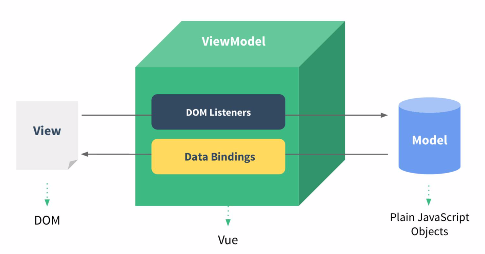   
    1. 它本身只关注 UI, 可以轻松引入 vue 插件或其它第三库开发项目（渐进式 JavaScript 框架 ）
1. 快速体验： 
    ``` html
    <body>
        <div id="app">
            <input type="text" v-model="username">
            <p>hello {{username}}</p>
        </div>
    </body>

    <script src="js/vue.js"></script>
    <script>
        const vm = new Vue({
            el:'#app',
            data:{
                username:"haha"
            }
        })
    </script>
    ```  
1. 效果： 
        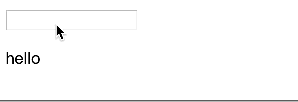
### 2. 模板语法：
1. 概念：  
    1. 双大括号表达式
    1. 指令(以 v-开头的自定义标签属性)
1. 参考代码：
    ``` html
    <body>
        <div id='app'>
        <h4>双大括号语法</h4>
        <p>{{msg}}</p>
        <p>{{msg.toUpperCase()}}</p>  <!-- 直接在大括号里写js -->
        <p v-html="htmlCode"></p>  <!-- 相当于innerHtml -->
        <p v-text="msg"></p> <!-- 相当于textContent -->
        <h4>指令一：强制数据绑定</h4>
         
        
         <!-- 简写 -->
        <h4>指令二：绑定事件监听</h4>
        <button v-on:click='myClick'>点击1</button>
        <button @click='myClick'>点击2</button> <!-- 简写 -->
        <button v-on:mouseOver='myOver("abcd")'>悬浮</button> <!-- 传参  -->

        </div>
    </body>
    <script src="js/vue.js"></script>
    <script>
        new Vue({
            el: '#app',
            data:{
                msg:'haha',
                htmlCode:'<a href="http://www.baidu.com">谷歌</a>',
                imgUrl:'images/googlelogo.png'
            },
            methods: {
                myClick(){
                    alert('哈哈1😄');
                },
                myOver(content){
                    alert(content+'😄');
                }
            }
        })
    </script>
    ```  
1. 效果：  
    
### 3. 计算属性与监视
1. 计算属性：在vue对象的computed属性对象中定义计算属性的方法，在页面上使用{{方法名}}来显示计算结果（或用v-model）
1. 监视属性：通过vue对象的$watch()或者watch配置来监视指定的属性，当属性变化时，回调函数自动调用，在函数内部进行计算
1. 计算属性高级：通过getter、setter方法实现对属性的显示与监视。【计算属性存在缓存：若多次读取，则只执行一次getter计算】
1. 参考代码：
    ``` html
    <body>
        <div class="app">
        <p>姓</p> <input type="text" v-model='firstName'> <br>
        <p>名</p> <input type="text" v-model='lastName'> <br>
        <p>全名1</p> <input type="text" v-model='fullName1'> <br>
        <p>全名2</p> <input type="text" v-model='fullName2'> <br>
        <p>全名3</p> <input type="text" v-model='fullName3'> <br>
        </div>
    </body>
    <script src='js/vue.js'></script>
    <script>
        const vm = new Vue({ 
            el:'.app',
            data:{
                firstName:'A',
                lastName:'B',
                // fullName1:'',  // 计算属性时，不能赋初值
                fullName2:'',
                // fullName3:'',
            },
            /* 计算属性 */
            /* 执行时机：初始化显示或相关data属性发生改变 */
            computed: {
                fullName1(){
                    return this.firstName+this.lastName;
                },
                fullName3:{
                    // 回调函数：属性值发生改变时调用（根据方法更新其他属性的值 ）
                    set(value){
                        const nameArray = value.split(' ');
                        this.firstName = nameArray[0]
                        this.lastName = nameArray[1]
                    },
                    // 回调函数：读取当前属性值时调用（根据方法重新计算）
                    get(){
                        return this.firstName+' '+this.lastName;
                    }
                }   
            },
            /* 配置监视 */
            watch: {
                // firstName发生改变时，自动改变fullName2的值
                // firstName:function(oldVal,newVal)
                firstName:function(value){
                    this.fullName2 = value+' '+this.lastName;
                }
            }
        });
        // 方法监视：lastName发生改变时，自动更新fullName2的值
        vm.$watch('lastName',function(value){
            console.log(1);
            this.fullName2 = this.firstName +' '+ value;
        })

    </script>
    ```
1. 效果：
    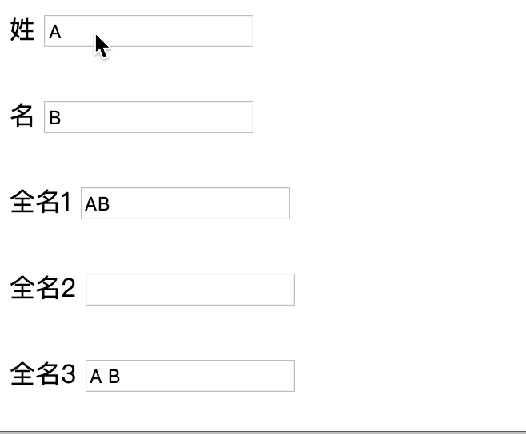
### 4. class与style绑定
1. class/style绑定就是专门用来实现动态样式的 
1. class绑定： ```:class='xxx'```
    xxx可以是字符串、对象、数组
1. style绑定: ```:style="{attr1:param1,attr2:param2}"```,attr是css属性，param是vue对象中data中的属性
1. 参考代码：
    ``` html
    <style>
        .redClass{
            color:red;
        }
        .greenClass{
            color:green;
        }
        .bigClass{
            font-size:40px;
        }
    </style>
    <body>
        <div class="app">
            <button @click='myClick'>点击</button>
            <h4>1. class绑定：class='xxx'</h4>
            <p :class='myClass'>字符串形式</p> <!-- 字符串形式 -->
            <p :class='{greenClass:greenFlag,bigClass:bigFlag}'>对象形式</p> <!-- 对象形式 -->
            <p :class='["greenClass",myClass]'>数组形式</p> <!-- 数组形式(注意要固定类名上要写引号) -->
        <h4>2. style绑定</h4>
            <p :style="{color:myColor,fontSize:mySize+'px'}">灰色,变大</p>
        </div>
    </body>
    <script src="js/vue.js"></script>
    <script>
        new Vue({
            el:".app",
            data:{
                myClass:"bigClass",
                greenFlag:true,
                bigFlag:false,
                myColor:'#aaa',
                mySize:'10',
            },
            methods: {
                myClick(){
                this.myClass='redClass' ;
                this.greenFlag=false;
                this.bigFlag=true;
                this.mySize="30";
                }
            },
        })
    </script>
    ```
1. 效果：  
    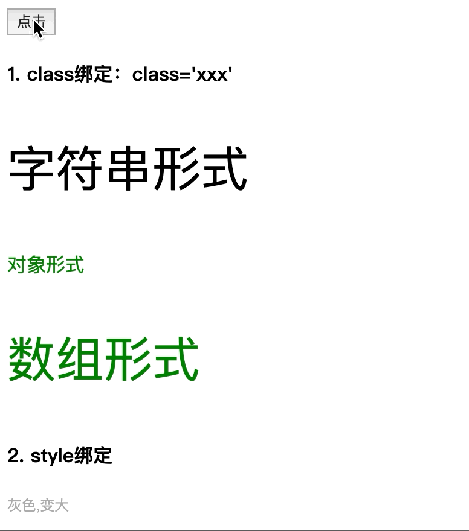
### 5. 条件渲染指令
1. v-if与v-else成对出现，是通过创建、删除标签对象实现显示与隐藏的
1. v-show是通过控制css的display实现显示与隐藏的
1. 参考代码：  
    ``` html
    <body>
        <div class="app">
        <p v-if="showFlag">成功</p>
        <p v-else>失败</p>
        <p v-show="showFlag">显示</p>
        <p v-show="!showFlag">隐藏</p>
        <button @click="showFlag=!showFlag">切换</button>

        </div>
    </body>
    <script src="js/vue.js"></script>
    <script>
        new Vue({
            el:".app",
            data:{
                showFlag:true,
            }
        })
    </script>
    ```  
1. 效果：  
    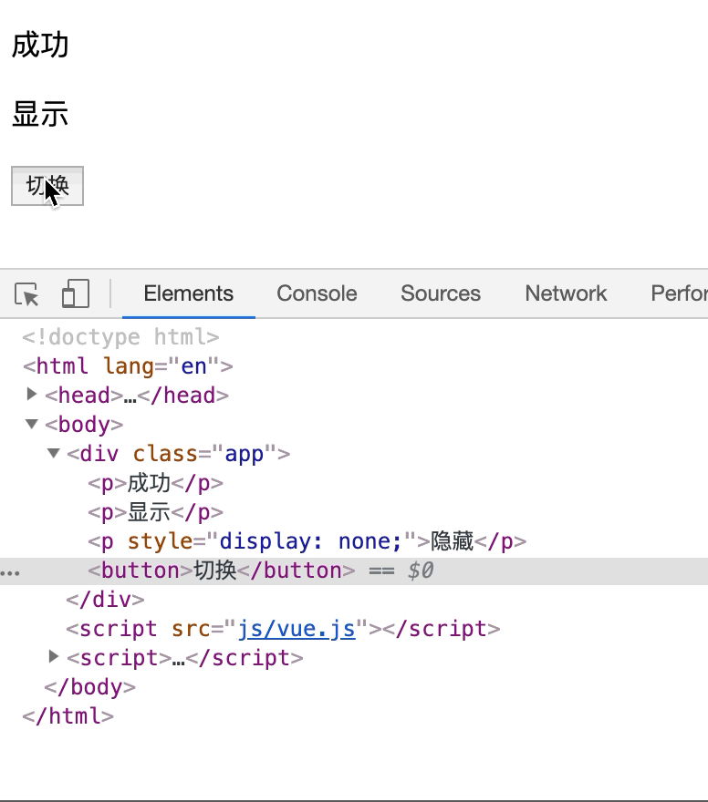
### 6. 列表渲染
1. 基础使用
    1. v-for渲染数组中的元素：```v-for="(item,index) in array"```
    1. v-for渲染对象中的属性：```v-for="(key,value) in obj"```
    1. 参考代码：
        ``` html
        <body>
            <div class="app">
                <h4>1. v-for遍历数组</h4>
                <ul>
                    <li v-for="(item,index) in persons" :key="index">{{index}}---name:{{item.name}}---age:{{item.age}}
                        ---<button @click="myDelete(index)">删除</button>
                        ---<button @click="myUpdate(index,{name:'dog',age:2})">更新</button>
                    </li>
                </ul>
                <h4>2. v-for遍历对象中的属性</h4>
                <ul>
                    <li v-for="(key,value) in persons[1]" :key="key">{{value}}-----{{key}}</li>
                </ul>
            </div>
        </body>
        <script src="js/vue.js"></script>
        <script>
            new Vue({
                el:'.app',
                data:{
                    persons:[
                        {name:"haha",age:18},
                        {name:"zhangsan",age:19},
                        {name:"gaga",age:20},
                        {name:"hehe",age:21},
                        {name:"xiaoming",age:22}
                    ]
                },
                methods: {
                    myDelete(index){
                        this.persons.splice(index,1);
                    },
                    myUpdate(index,newPerson){
                        this.persons.splice(index,1,newPerson)
                    }
                },
            })
        </script>
        ```
    1. 效果：  
        
1. 高阶：列表过滤与列表排序
    1. 思路：让ul绑定新的计算属性，而在计算属性对应的方法中进行过滤、排序
    1. 参考代码： 
        ``` html
        <body>
            <div class="app">
                <input type="text" v-model="searchName">
                <ul>
                    <li v-for="(item,index) in filterPersons" :key="index">
                        {{index}}---name:{{item.name}}---age:{{item.age}}
                    </li>
                </ul>
                <button @click='setSortType(1)'>年龄正序</button>
                <button @click='setSortType(2)'>年龄倒序</button>
                <button @click='setSortType(0)'>重置排序</button>
                <p>{{searchName}}</p>
            </div>
        </body>
        <script src="js/vue.js"></script>
        <script>
            new Vue({
                el:'.app',
                data:{
                    searchName:'',
                    sortType:0, // -1倒序，0重置，1正序
                    persons:[
                        {name:"haha",age:18},
                        {name:"zhangsan",age:29},
                        {name:"gaga",age:30},
                        {name:"hehe",age:11},
                        {name:"xiaoming",age:22}
                    ]
                },
                computed: {
                    // 其中涉及的属性发生改变时自动触发
                    filterPersons(){
                        let {searchName,persons,sortType} = this; // 注意解构的属性必须同名
                        var myPersons = persons.filter(p=>p.name.indexOf(searchName)>-1); 
                        // 排序
                        if(sortType !== 0){
                            if(sortType === 1 ){
                                myPersons.sort(function(p1,p2){
                                    return p1.age - p2.age;
                                })
                            }else{
                                myPersons.sort(function(p1,p2){
                                    return p2.age - p1.age;
                                })
                            }
                        }
                        return myPersons;
                    }
                },
                methods: {
                    // 赋值计算属性中涉及的属性，将自动触发计算属性的重新计算
                    setSortType(sortType){
                        this.sortType = sortType;
                    },
                },
            });
        </script>
        ```
    1. 效果：  
    
### 7. 事件处理
1. 绑定监听：以点击事件为例，不传参时，默认传入事件对象，也可以指定$event作为事件对象传入
1. 事件修饰符：
    1. 停止事件冒泡：以点击事件为例：```@click.stop='xxx'```  
    1. 阻止事件默认行为：以a标签的点击事件为例：```@click.prevent='xxx'```  
1. 按键修饰符：
    1. 以keyup事件为例：```@keyup.按键值/按键名```
1. 参考代码：  
    ``` html
    <body>
        <div class="app">
            <h4>1. 绑定监听</h4>
            <button @click="testMethod01('hahaha')">test01</button>
            <button @click='testMethod02'>test02</button> <!-- 如果要自动传入事件对象，则不能有括号 -->
            <button @click='testMethod03("hahaha",$event)'>test03</button>

            <h4>2. 事件修饰符</h4>
            <p>停止事件冒泡:@click.stop</p>
            <div class="outer" style="width: 200px;height:200px;backgroundColor:#888" @click='testMethod04'>
                <div class="inner" style="width: 100px;height:100px;backgroundColor:#bbb" @click.stop='testMethod05'></div>
            </div>
            <p>阻止事件默认行为:@click.prevent</p>
            <a href="http://www.baidu.com" @click.prevent='testMethod06'>Google</a>
            <h4>3. 按键修饰符:@keyup.{keyCode}/.{keyName}</h4>
            <input type="text" @keyup.13='testMethod07'>
            <input type="text" @keyup.enter='testMethod07'>
        </div>
    </body>
    <script src="js/vue.js"></script>
    <script>
        new Vue({
            el:'.app',
            data:{

            },
            methods: {
                testMethod01(content){
                    console.log(content);
                },
                testMethod02(event){
                    console.log(event.target.innerHTML);
                },
                testMethod03(content,event){
                    console.log(content+event.target.innerText);
                },
                testMethod04(){
                    console.log('outer');
                },
                testMethod05(){
                    console.log('inner');
                },
                testMethod06(){
                    console.log('即将跳转...');
                },
                testMethod07(event){
                    console.log(event.target.value);
                }
            },
        })
    </script>
    ```
1. 效果： 
    
### 8. 表单数据的自动收集
1. 思路：直接在表单标签上，使用v-model属性绑定到vue对象的数据属性即可
1. 参考代码：
    ``` html
    <body>
        <div class="app">
            <form action="/xx" @submit.prevent='handleSubmit'>
                <span>姓名</span>
                <input type="text" v-model="username"> 
                
                <br/>
                <span>密码</span>
                <input type="password" v-model="password"> 
                
                <br/>
                <span>性别</span>
                <input type="radio" value='男' v-model="gender">男 
                <input type="radio" value='女' v-model="gender"> 女
                
                <br/>
                <span>爱好</span>
                <input type="checkbox" value="eat" v-model="hobby"> 吃饭
                <input type="checkbox" value="sleep"  v-model="hobby"> 睡觉
                <input type="checkbox" value="beat"  v-model="hobby"> 打豆豆

                <br/>
                <span>城市</span>
                <select v-model="cityId">
                    <option value=" ">请选择</option>
                    <option :value="item.code" v-for="(item, index) in citys" :key="index">{{item.name}}</option>
                </select>

                <br/>
                <span>描述</span>
                <textarea cols="30" rows="10" v-model='desc'></textarea>
                <button type="submit">注册</button>

            </form>
        </div>
    </body>
    <script src="js/vue.js"></script>
    <script>
        new Vue({
            el:".app",
            data:{
                username:"",
                password:"",
                gender:'女',
                hobby:[],
                // 动态生成下拉框选项
                citys:[
                    {name:'北京',code:'beijing'},
                    {name:'浙江',code:'zhejiang'},
                    {name:'江苏',code:'jiangsu'}
                ],
                // 下拉框实际选中值
                cityId:'beijing',
                desc:"哈哈哈哈"
            },
            methods: {
                handleSubmit(){
                    console.log(this.username+" "+this.password+" "+this.gender+" "+this.hobby+" "+this.cityId+" "+this.desc)
                }
            },
        });
    </script>
    ```
1. 效果： 
    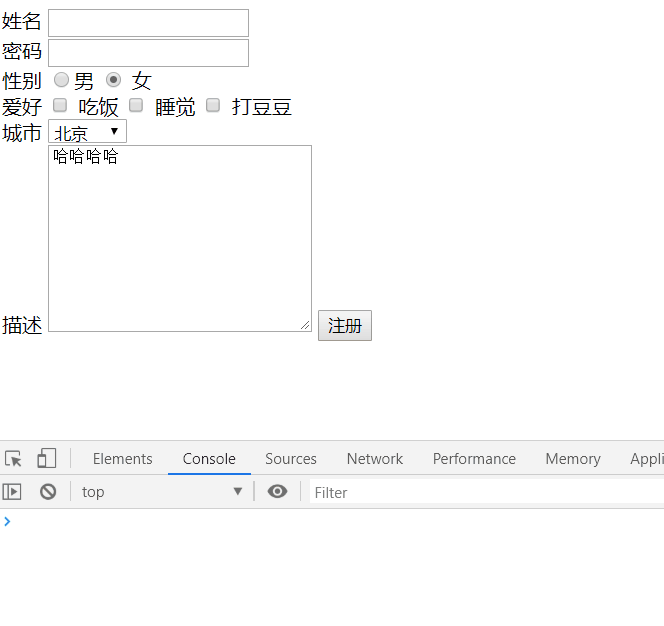  
### 9. VUE生命周期
1. 大致文字描述：
    1. 在```new Vue();```之后，初始化事件与生命周期
    1. 调用```beforeCreate()```函数，然后初始化一些注入数据
    1. 调用```create()```函数
    1. 检测有没有```el```选项，没有的话就等待调用```mount()```函数;
    1. 检测有咩有```template```选项，有的话就编译指定的template，没有的话就编译```el```外部的html做为template(编译指的是将vue模板语法中的变量、属性替换为实际需要显示的数据、属性);
    1. 调用beforeMount()函数，创建vue对象的el属性，并替换掉原来的el属性
    1. 调用mounted()函数；
    1. __至此，整个页面初始化渲染完成__
    1. 数据更新时
        1. 调用beforeUpdate()方法
        1. 虚拟DOM重载
        1. 调用update()方法
    1. 当vue对象的destroy()方法被调用时
        1. 调用beforeDestory()方法
        1. 停止各类子组件、事件监听器
        1. 调用destory()方法。
        1. __至此，整个vue对象被销毁__
1. vue对象生命周期的官方流程图
    
1. 参考代码：  
    ``` html
    <body>
        <div class="app">
            <button @click='myClick'>点击</button>
            <p v-show='showFlag'>哈哈哈哈</p>
        </div>
    </body>
    <script src="js/vue.js"></script>
    <script>
        new Vue({
            el:'.app',
            data:{
                showFlag:false,
            },
            beforeCreate() {
                console.log("before create...")
            },
            created() {
                console.log('created...')
            },
            beforeMount() {
                console.log('before mount...')
            },
            mounted() {
                this.intervalId = setInterval(()=>{
                    console.log('---');
                    this.showFlag =!this.showFlag;
                },1000);
            },
            beforeDestroy() {
                console.log('before destroy start,clear the internal...');
                clearInterval(this.intervalId);
                console.log('before destroy end...');
            },
            destroyed() {
                console.log('destroyed...')
            },
            methods: {
                myClick(){
                    this.$destroy();
                }
            },
        })
    </script>
    ```
1. 效果：
    
### 10. 过渡与动画
1. 在进入/离开的过渡中，会有6个class切换，如图：
    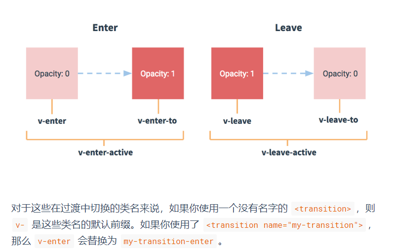
1. 参考代码：
    ``` html
    <style>
        /* 针对name='test01'动画的样式 */
        .test01-enter-active,.test01-leave-active{
            transition: opacity 2s;
        }
        .test01-leave-to,.test01-enter{
            opacity: 0;
        }

        /* 针对name='test02'动画的样式 */
        .test02-enter-active,.test02-leave-active{
            transition: all 1s;
        }
        .test02-enter,.test02-leave-to{
            transform: translateX(20px);
            opacity: 0;
        }

        /* 针对name='test03'动画的样式 */
        .test03-enter-active {
            animation: bounce-in .5s;
        }
        .test03-leave-active {
            animation: bounce-in .5s reverse;
        }
        @keyframes bounce-in {
        0% {
            transform: scale(0);
        }
        50% {
            transform: scale(1.5);
        }
        100% {
            transform: scale(1);
        }
        }
    </style>
    <body>
        <div class="app">
            <button @click='showFlag01=!showFlag01'>按钮01</button>
            <transition name='test01'>
                <p v-show='showFlag01'>哈哈哈11</p>
            </transition>
            <br/>
            <button @click='showFlag02=!showFlag02'>按钮02</button>
            <transition name='test02'>
                <p v-show='showFlag02'>哈哈哈22</p>
            </transition>
            <br/>
            <button @click='showFlag03=!showFlag03'>按钮03</button> 
            <br/>
            <transition name='test03'>
                <p v-show='showFlag03' style='background-color: #aaa;display: inline-block;'>哈哈哈22</p>
            </transition>
        </div>
    </body>
    <script src='js/vue.js'></script>
    <script>
        new Vue({
            el:'.app',
            data:{
                showFlag01:true,
                showFlag02:true,
                showFlag03:true,
            }
        })
    </script>
    ```
1. 效果：
    
### 11. 过滤器
1. 定义过滤器(定义在vue对象外面)  
    ```Vue.filter(filterName,function(val,attr1,attr2...){...})```
1. 使用过滤器(以双大括号表达式为例)  
    ```{{data | filterName(attr1,attr2...)}}```
1. 参考代码：
    ``` html
    <body>
        <div class="app">
        <span>原始时间：{{date}}</span> <br/>
        <span>格式化时间：{{date | dateFormat}}</span>  <br/>
        <span>格式化年月日：{{date | dateFormat('YYYY-MM-DD')}}</span>    <br/>
        <span>格式化时分秒：{{date | dateFormat('HH:mm:ss')}}</span>

        </div>
    </body>
    <script src="js/vue.js"></script>
    <script src="https://cdn.bootcss.com/moment.js/2.24.0/moment.js"></script>
    <script>
        //自定义过滤器
        Vue.filter("dateFormat",function(value,format){
            return moment(value).format(format || "YYYY-MM-DD HH:mm:ss");
        })

        let vm = new Vue({
            el:'.app',
            data:{
                date:new Date()
            },
            // 1s刷新一次
            mounted() {
                setInterval(()=>{
                    this.date=new Date();
                },1000);
            }
        });
    </script>
    ```
1. 效果：
    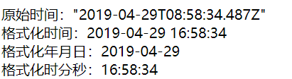
### 12. 指令
1. 常用内置指令：   
    1. v:text: 更新元素的 textContent 
    1. v-html: 更新元素的 innerHTML 
    1. v-if: 如果为 true, 当前标签才会输出到页
    1. v-else: 如果为 false, 当前标签才会输出到页面 
    1. v-show: 通过控制 display 样式来控制显示/隐藏 
    1. v-for: 遍历数组/对象 
    1. v-on: 绑定事件监听, 一般简写为@ 
    1. v-bind: 强制绑定解析表达式, 可以省略 v-bind 
    1. v-model: 双向数据绑定 
    1. ref: 指定唯一标识,vue 对象通过$refs 属性访问这个元素对象 
    1. v-cloak: 防止闪现, 与 css 配合:[v-cloak]{display:none}
    1. 参考代码：
        ``` html
        <style>
            [v-cloak]{
                display: none;
            }
        </style>
        <body>
            <div class="app">
                <p>{{msg}}</p>
                <p v-text='msg'></p> 
                <p v-text='msg' v-cloak>{{msg}}</p>
            </div>
        </body>
        <script src="js/vue.js"></script>
        <script>
        alert("111");
        </script>
        <script>
            new Vue({
                el:'.app',
                data:{
                    msg:'哈哈'
                }
            })
        </script>
        ```
    1. 效果：   
        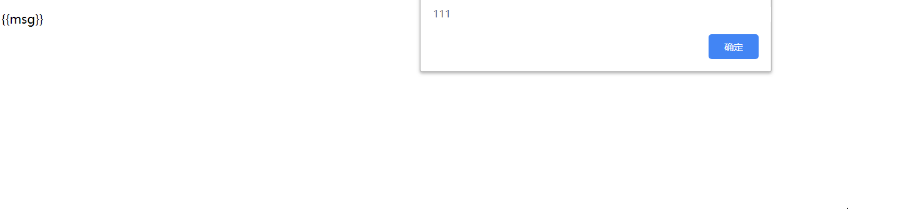
1. 自定义指令
    1. 注册全局指令（在vue对象外）：  
        ``` Vue.directive(name,function(el,bind){...})```
    1. 注册局部指令（在vue对象内部）： 
        ``` js
        directives:{
            name:function(){...}
        }
        ``` 
    1. bind里有什么：  
        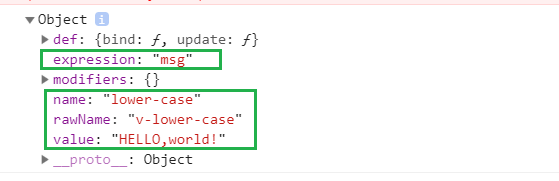
    1. 参考代码：
        ``` html
        <body>
            <div id='app01'>
                <p v-upper-case='msg'></p>
                <p v-lower-case='msg'></p>
            </div>
            <div id='app02'>
                <p v-upper-case='msg'></p>
                <p v-lower-case='msg'></p>
            </div>
        </body>
        <script src='js/vue.js'></script>
        <script>
            // 注册全局指令
            Vue.directive("upper-case",(el,bind)=>{
                el.innerHTML = bind.value.toUpperCase();
            })
            new Vue({
                el:'#app01',
                data:{
                    msg:"HELLO,world!"
                }
            });
            new Vue({
                el:'#app02',
                data:{
                    msg:"HELLO,world!"
                },
                // 注册局部指令
                directives:{
                    'lower-case':(el,bind)=>{
                        console.dir(bind);
                        el.innerHTML = bind.value.toLowerCase();
                    }
                }
            })
        </script>
        ```
    1. 效果：  
        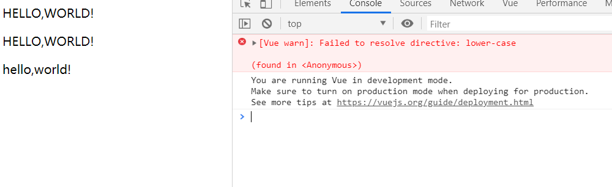
### 13. 插件
1. 参考代码：
    ``` js

    ``` 
    ``` html

    ```


## 附：一些细枝末节
1. ```=>```（es6语法中的arrow function，类似于Java8中的lambda表达式）
    ``` js
    (x) => x+6 ;
    ```  
    相当于  
    ``` js
    function(x){
        return x+6;
    };
    ```
1. 变量的解构赋值
    1. ES6 允许按照一定模式，从数组和对象中提取值，对变量进行赋值，这被称为解构（Destructuring）。  
    1. 直观的解构
        ``` js
        let { bar, foo } = { foo: 'aaa', bar: 'bbb' };
        foo // "aaa"
        bar // "bbb"
        ```
    1. 从对象中解构
        ``` js
        // 例一：将Math对象的对数、正弦、余弦三个方法，赋值到对应的变量上
        let { log, sin, cos } = Math;
        // 例二：将console.log赋值到log变量
        const { log } = console;
        log('hello') // hello
        ```
    > http://es6.ruanyifeng.com/#docs/destructuring