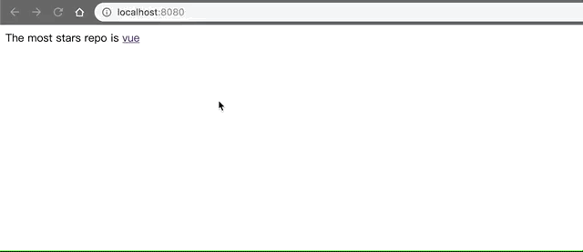
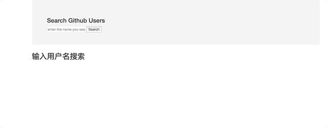

### 三、 vue-ajax
1. vue-resource(非官方库, vue1.x 使用广泛)
    1. 安装依赖  
        ```npm install vue-resource --save```
    1. 参考代码(模块引入与使用插件的声明，写在main.js中)
        ``` js
        // 引入模块
        import VueResource from 'vue-resource' 
        ```
        ``` js
        // 使用插件
        Vue.use(VueResource)
        ```
        ``` js
        // 通过 vue/组件对象发送 ajax 请求 
        this.$http.get('/someUrl').then(
        // success callback
        (response) => {
            console.log(response.data) //返回结果数据 
        }, 
        // error callback
        (response) => {
            console.log(response.statusText) //错误信息 
        })
        ```
    1. 效果： 
        
1. axios(通用的 ajax 请求库, 官方推荐, vue2.x 使用广泛)
    1. 安装依赖：  
        ```npm install axios --save```
    1. 参考代码：
        ``` js
        // 引入模块
        import axios from 'axios'
        ```
        ``` js
        // 发送 ajax 请求 
        axios.get(url).then(response => {
            console.log(response.data) // 得到返回结果数据
        }).catch(error => {
            console.log(error.message) 
        })
        ```
    1. 效果：（同上）

### 8. 案例三：GitHub用户搜索
1. 思路：search组件中点击搜索按钮发布搜索的消息，main组件订阅搜索的消息，通过ajax请求获取并展示数据
1. 参考代码：主要代码位于```src```文件夹下
1. 效果 ：  
    
