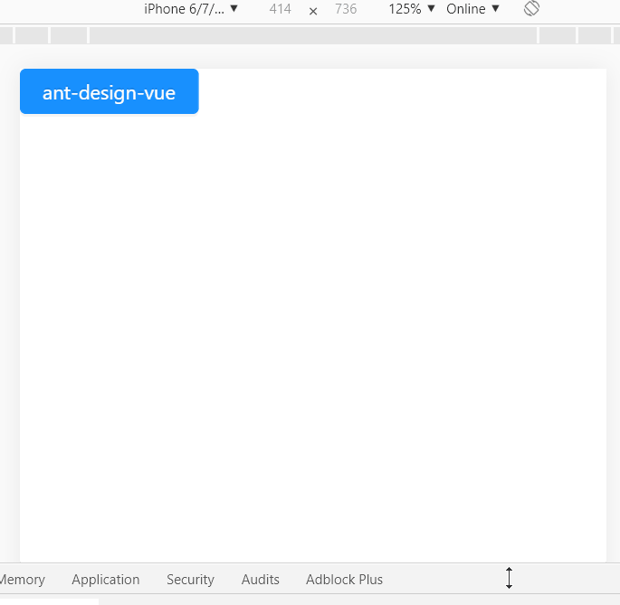
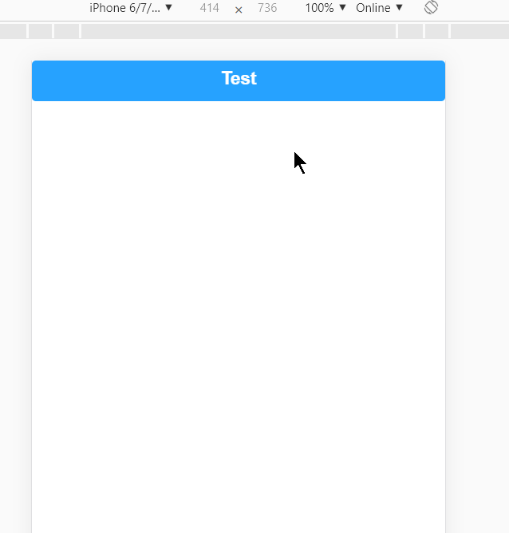

## 四、 Vue UI库使用
1. Ant Design Vue
    1. 安装ant design vue组件：```npm i --save ant-design-vue```
    1. (可选,按需引入时建议使用)安装babel-plugin-import:```npm install babel-plugin-import --save-dev```
    1. 引入：
        1. 完整引入(main.js)：  
            ``` js
            import Vue from 'vue'
            import Antd from 'ant-design-vue'
            import App from './App'
            import 'ant-design-vue/dist/antd.css'
            Vue.config.productionTip = false

            Vue.use(Antd)

            /* eslint-disable no-new */
            new Vue({
            el: '#app',
            components: { App },
            template: '<App/>'
            })
            ```
        1. 按需引入(main.js + .babelrc，参考代码中引入了三个组件)：
            main.js:  
            ``` js
            import Vue from 'vue'
            import { Button, Icon, notification } from 'ant-design-vue'
            import App from './App.vue'

            Vue.config.productionTip = false

            Vue.use(Button)
            Vue.use(Icon)
            Vue.prototype.$notification = notification

            /* eslint-disable no-new */
            new Vue({
            el: '#app',
            components: {
                App
            },
            template: '<App/>'
            })
            ```
            .babelrc:  
            ``` json
            // .babelrc or babel-loader option
            {
                "plugins": [
                    ["import", { "libraryName": "ant-design-vue", "libraryDirectory": "es", "style": "css" }] // `style: true` 会加载 less 文件
                ]
            }
            ```
    1. 业务代码示例（App.vue）：
        ``` html
        <template>
            <div>
                <a-button type="primary" @click='handleClick'>ant-design-vue</a-button>
            </div>
        </template>

        <script>
            export default{
                methods: {
                    handleClick() {
                    this.$notification.open({
                        message: '通知通知',
                        description: '心心念念的Ant Design Vue.',
                        duration: 2,
                        onClose: 'close',
                        icon: <a-icon type="smile" style="color: #108ee9" />
                        })
                    }
                }
            }
        </script>
        ```
    1. 效果：  
        
1. Mint-ui:
    1. 安装mint-ui：```npm install --save mint-ui```
    1. 安装babel-plugin-component:```npm install --save-dev babel-plugin-component```
    1. 使用上差不多，部分引入时使用的是```babel-plugin-component```，笔记略，代码参考：```src-mint-ui```文件夹
    1. 效果：  
        
