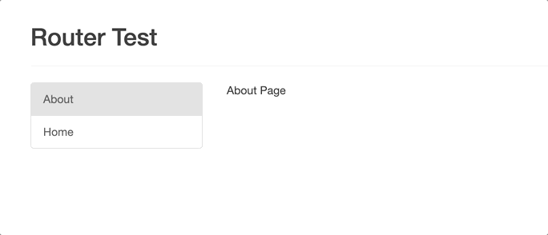

### 五、 vue-router
1. 是什么：官方提供的用来实现 SPA(Single Page Application, 单页应用) 的 vue 插件
1. 安装： ```npm install vue-router --save```
1. 基础语法：
    1. VueRouter(): 用于创建路由器的构建函数
        ``` js
        new VueRouter({ 
            // 多个配置项
        })
        ```
    1. 路由配置：
        ``` js
        routes: [
            { // 一般路由
                path: '/about',
                component: About 
            },
            { // 自动跳转路由 
                path: '/',
                redirect: '/about' 
            }
        ]
        ```
    1. 注册路由器：
        ``` js
        import router from './router' 
        new Vue({
            //...,省略其他配置
            router 
        })
        ```
    1. 使用路由组件标签
        1. ```<router-link>```: 用来生成路由链接
            ``` js
            <router-link to="/xxx">Go to XXX</router-link>
            ```
        2. ```<router-view>```: 用来显示当前路由组件界面 
            ``` js
            <router-view></router-view>
            ```
1. 使用案例：
    1. 在src/components文件夹下新建2个子组件（例如：About.vue、Home.vue）
    1. 定义并对外暴露路由器 + 路由配置：在src文件夹下新建router文件夹，在src/router下新建index.js，在index.js中引入Vue、VueRouter以及components下的两个子组件，在路由器对象中配置路由
        ``` js
        import Vue from 'vue'
        import VueRouter from 'vue-router'

        Vue.use(VueRouter);

        import About from '../components/About.vue'
        import Home from '../components/Home.vue'

        export default new VueRouter({
            // n个路由
            routes: [
                {
                    path: '/about',
                    component: About
                },
                {
                    path: '/home',
                    component: Home
                },
                // 访问默认路径时，重定向到about
                {
                    path: '/',
                    redirect: 'about'
                }
            ]
        })
        ```
    1. 在main.js中注册路由器  
        ``` js
        import Vue from 'vue'
        import App from './App.vue'
        import router from './router'

        /* eslint-disable no-new */
        new Vue({
            el: '#app',
            components: {
                App
            },
            template: '<App/>',
            router
        })
        ```
    1. 将菜单标签与页面标签（子组件标签）改为路由组件标签
        ``` html
        <div class="row">
            <div class="col-xs-2 col-xs-offset-2">
                <div class="list-group">
                <!--生成路由链接-->
                    <router-link to="/about" class="list-group-item">About</router-link>
                    <router-link to="/home" class="list-group-item">Home</router-link>
                </div>
            </div>
            <div class="col-xs-6">
                <router-view ></router-view>
            </div>
        </div>
        ```
    1. 效果：  
      

    
