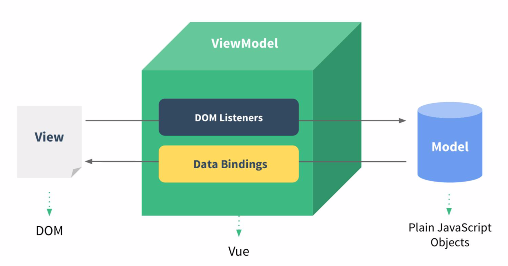
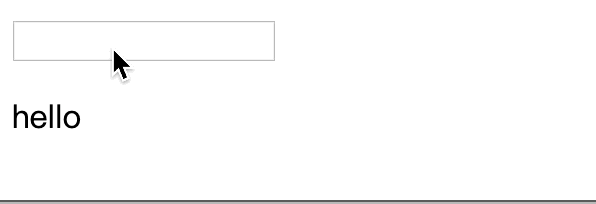
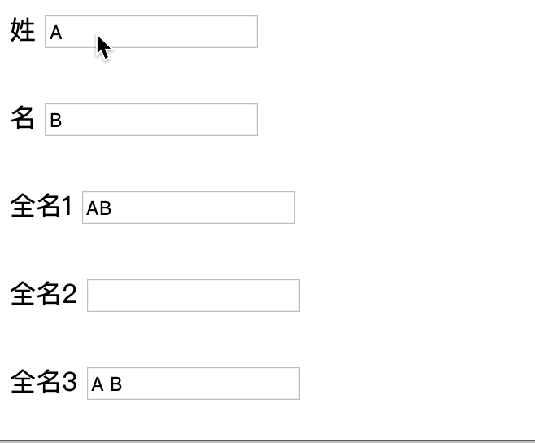
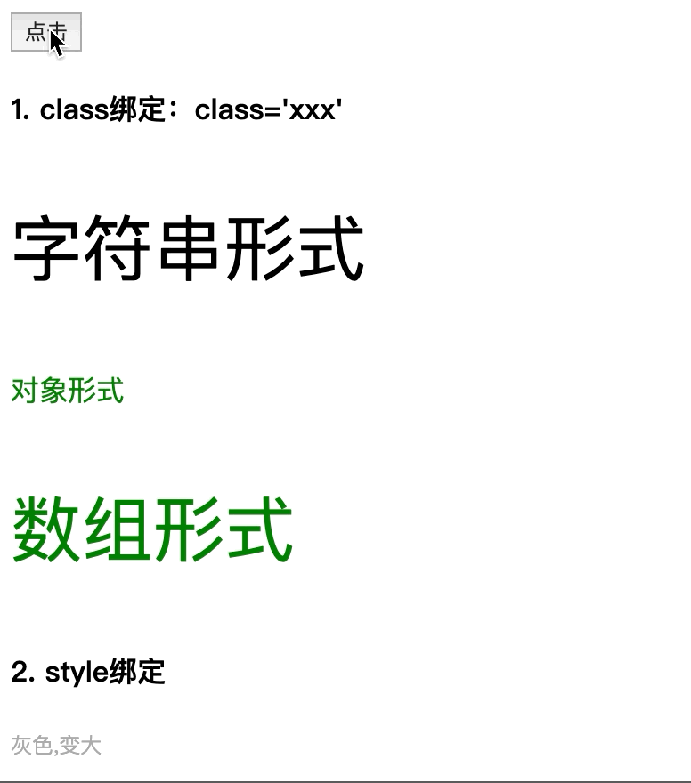
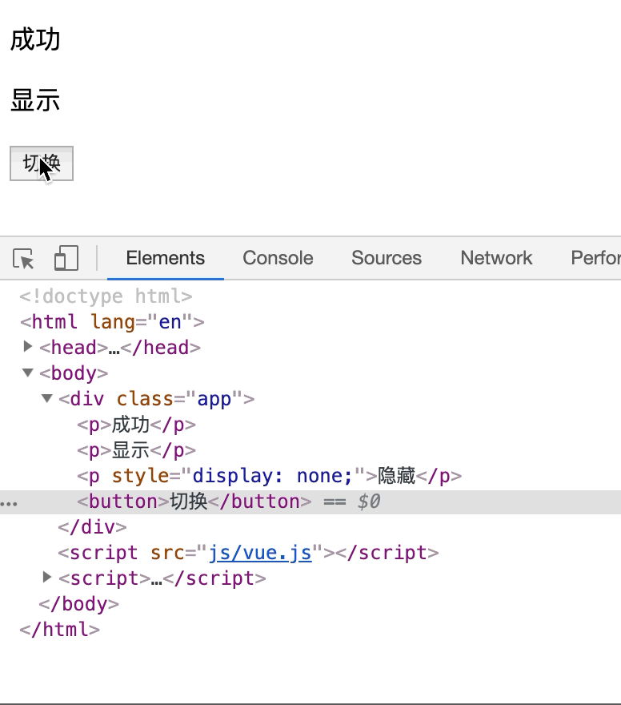
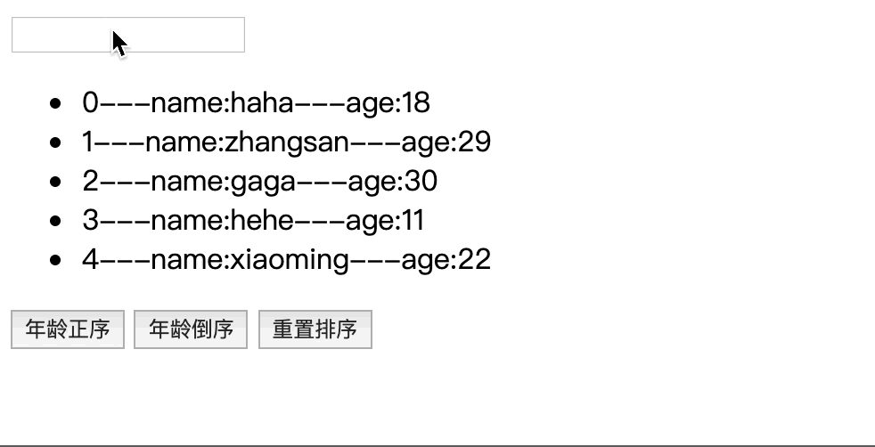

## 一、Vue核心
### 1. 入门尝试
1. 中国官网：https://cn.vuejs.org/
1. 特点：
    1. 遵循MVVM模式（M：模型（数据对象），V：视图（模板对象），VM:view model,视图模型(Vue实例)）  
           
    1. 它本身只关注 UI, 可以轻松引入 vue 插件或其它第三库开发项目（渐进式 JavaScript 框架 ）
1. 快速体验： 
    ``` html
    <body>
        <div id="app">
            <input type="text" v-model="username">
            <p>hello {{username}}</p>
        </div>
    </body>

    <script src="js/vue.js"></script>
    <script>
        const vm = new Vue({
            el:'#app',
            data:{
                username:"haha"
            }
        })
    </script>
    ```  
1. 效果： 
        
### 2. 模板语法：
1. 概念：  
    1. 双大括号表达式
    1. 指令(以 v-开头的自定义标签属性)
1. 参考代码：
    ``` html
    <body>
        <div id='app'>
        <h4>双大括号语法</h4>
        <p>{{msg}}</p>
        <p>{{msg.toUpperCase()}}</p>  <!-- 直接在大括号里写js -->
        <p v-html="htmlCode"></p>  <!-- 相当于innerHtml -->
        <p v-text="msg"></p> <!-- 相当于textContent -->
        <h4>指令一：强制数据绑定</h4>
         
        
         <!-- 简写 -->
        <h4>指令二：绑定事件监听</h4>
        <button v-on:click='myClick'>点击1</button>
        <button @click='myClick'>点击2</button> <!-- 简写 -->
        <button v-on:mouseOver='myOver("abcd")'>悬浮</button> <!-- 传参  -->

        </div>
    </body>
    <script src="js/vue.js"></script>
    <script>
        new Vue({
            el: '#app',
            data:{
                msg:'haha',
                htmlCode:'<a href="http://www.baidu.com">谷歌</a>',
                imgUrl:'images/googlelogo.png'
            },
            methods: {
                myClick(){
                    alert('哈哈1😄');
                },
                myOver(content){
                    alert(content+'😄');
                }
            }
        })
    </script>
    ```  
1. 效果：  
    
### 3. 计算属性与监视
1. 计算属性：在vue对象的computed属性对象中定义计算属性的方法，在页面上使用{{方法名}}来显示计算结果（或用v-model）
1. 监视属性：通过vue对象的$watch()或者watch配置来监视指定的属性，当属性变化时，回调函数自动调用，在函数内部进行计算
1. 计算属性高级：通过getter、setter方法实现对属性的显示与监视。【计算属性存在缓存：若多次读取，则只执行一次getter计算】
1. 参考代码：
    ``` html
    <body>
        <div class="app">
        <p>姓</p> <input type="text" v-model='firstName'> <br>
        <p>名</p> <input type="text" v-model='lastName'> <br>
        <p>全名1</p> <input type="text" v-model='fullName1'> <br>
        <p>全名2</p> <input type="text" v-model='fullName2'> <br>
        <p>全名3</p> <input type="text" v-model='fullName3'> <br>
        </div>
    </body>
    <script src='js/vue.js'></script>
    <script>
        const vm = new Vue({ 
            el:'.app',
            data:{
                firstName:'A',
                lastName:'B',
                // fullName1:'',  // 计算属性时，不能赋初值
                fullName2:'',
                // fullName3:'',
            },
            /* 计算属性 */
            /* 执行时机：初始化显示或相关data属性发生改变 */
            computed: {
                fullName1(){
                    return this.firstName+this.lastName;
                },
                fullName3:{
                    // 回调函数：属性值发生改变时调用（根据方法更新其他属性的值 ）
                    set(value){
                        const nameArray = value.split(' ');
                        this.firstName = nameArray[0]
                        this.lastName = nameArray[1]
                    },
                    // 回调函数：读取当前属性值时调用（根据方法重新计算）
                    get(){
                        return this.firstName+' '+this.lastName;
                    }
                }   
            },
            /* 配置监视 */
            watch: {
                // firstName发生改变时，自动改变fullName2的值
                // firstName:function(oldVal,newVal)
                firstName:function(value){
                    this.fullName2 = value+' '+this.lastName;
                }
            }
        });
        // 方法监视：lastName发生改变时，自动更新fullName2的值
        vm.$watch('lastName',function(value){
            console.log(1);
            this.fullName2 = this.firstName +' '+ value;
        })

    </script>
    ```
1. 效果：
    
### 4. class与style绑定
1. class/style绑定就是专门用来实现动态样式的 
1. class绑定： ```:class='xxx'```
    xxx可以是字符串、对象、数组
1. style绑定: ```:style="{attr1:param1,attr2:param2}"```,attr是css属性，param是vue对象中data中的属性
1. 参考代码：
    ``` html
    <style>
        .redClass{
            color:red;
        }
        .greenClass{
            color:green;
        }
        .bigClass{
            font-size:40px;
        }
    </style>
    <body>
        <div class="app">
            <button @click='myClick'>点击</button>
            <h4>1. class绑定：class='xxx'</h4>
            <p :class='myClass'>字符串形式</p> <!-- 字符串形式 -->
            <p :class='{greenClass:greenFlag,bigClass:bigFlag}'>对象形式</p> <!-- 对象形式 -->
            <p :class='["greenClass",myClass]'>数组形式</p> <!-- 数组形式(注意要固定类名上要写引号) -->
        <h4>2. style绑定</h4>
            <p :style="{color:myColor,fontSize:mySize+'px'}">灰色,变大</p>
        </div>
    </body>
    <script src="js/vue.js"></script>
    <script>
        new Vue({
            el:".app",
            data:{
                myClass:"bigClass",
                greenFlag:true,
                bigFlag:false,
                myColor:'#aaa',
                mySize:'10',
            },
            methods: {
                myClick(){
                this.myClass='redClass' ;
                this.greenFlag=false;
                this.bigFlag=true;
                this.mySize="30";
                }
            },
        })
    </script>
    ```
1. 效果：  
    
### 5. 条件渲染指令
1. v-if与v-else成对出现，是通过创建、删除标签对象实现显示与隐藏的
1. v-show是通过控制css的display实现显示与隐藏的
1. 参考代码：  
    ``` html
    <body>
        <div class="app">
        <p v-if="showFlag">成功</p>
        <p v-else>失败</p>
        <p v-show="showFlag">显示</p>
        <p v-show="!showFlag">隐藏</p>
        <button @click="showFlag=!showFlag">切换</button>

        </div>
    </body>
    <script src="js/vue.js"></script>
    <script>
        new Vue({
            el:".app",
            data:{
                showFlag:true,
            }
        })
    </script>
    ```  
1. 效果：  
      
### 6. 列表渲染
1. 基础使用
    1. v-for渲染数组中的元素：```v-for="(item,index) in array"```
    1. v-for渲染对象中的属性：```v-for="(key,value) in obj"```
    1. 参考代码：
        ``` html
        <body>
            <div class="app">
                <h4>1. v-for遍历数组</h4>
                <ul>
                    <li v-for="(item,index) in persons" :key="index">{{index}}---name:{{item.name}}---age:{{item.age}}
                        ---<button @click="myDelete(index)">删除</button>
                        ---<button @click="myUpdate(index,{name:'dog',age:2})">更新</button>
                    </li>
                </ul>
                <h4>2. v-for遍历对象中的属性</h4>
                <ul>
                    <li v-for="(key,value) in persons[1]" :key="key">{{value}}-----{{key}}</li>
                </ul>
            </div>
        </body>
        <script src="js/vue.js"></script>
        <script>
            new Vue({
                el:'.app',
                data:{
                    persons:[
                        {name:"haha",age:18},
                        {name:"zhangsan",age:19},
                        {name:"gaga",age:20},
                        {name:"hehe",age:21},
                        {name:"xiaoming",age:22}
                    ]
                },
                methods: {
                    myDelete(index){
                        this.persons.splice(index,1);
                    },
                    myUpdate(index,newPerson){
                        this.persons.splice(index,1,newPerson)
                    }
                },
            })
        </script>
        ```
    1. 效果：  
        
1. 高阶：列表过滤与列表排序
    1. 思路：让ul绑定新的计算属性，而在计算属性对应的方法中进行过滤、排序
    1. 参考代码： 
        ``` html
        <body>
            <div class="app">
                <input type="text" v-model="searchName">
                <ul>
                    <li v-for="(item,index) in filterPersons" :key="index">
                        {{index}}---name:{{item.name}}---age:{{item.age}}
                    </li>
                </ul>
                <button @click='setSortType(1)'>年龄正序</button>
                <button @click='setSortType(2)'>年龄倒序</button>
                <button @click='setSortType(0)'>重置排序</button>
                <p>{{searchName}}</p>
            </div>
        </body>
        <script src="js/vue.js"></script>
        <script>
            new Vue({
                el:'.app',
                data:{
                    searchName:'',
                    sortType:0, // -1倒序，0重置，1正序
                    persons:[
                        {name:"haha",age:18},
                        {name:"zhangsan",age:29},
                        {name:"gaga",age:30},
                        {name:"hehe",age:11},
                        {name:"xiaoming",age:22}
                    ]
                },
                computed: {
                    // 其中涉及的属性发生改变时自动触发
                    filterPersons(){
                        let {searchName,persons,sortType} = this; // 注意解构的属性必须同名
                        var myPersons = persons.filter(p=>p.name.indexOf(searchName)>-1); 
                        // 排序
                        if(sortType !== 0){
                            if(sortType === 1 ){
                                myPersons.sort(function(p1,p2){
                                    return p1.age - p2.age;
                                })
                            }else{
                                myPersons.sort(function(p1,p2){
                                    return p2.age - p1.age;
                                })
                            }
                        }
                        return myPersons;
                    }
                },
                methods: {
                    // 赋值计算属性中涉及的属性，将自动触发计算属性的重新计算
                    setSortType(sortType){
                        this.sortType = sortType;
                    },
                },
            });
        </script>
        ```
    1. 效果：  
        


## 附：一些细枝末节
1. ```=>```（es6语法中的arrow function，类似于Java8中的lambda表达式）
    ``` js
    (x) => x+6 ;
    ```  
    相当于  
    ``` js
    function(x){
        return x+6;
    };
    ```
1. 变量的解构赋值
    1. ES6 允许按照一定模式，从数组和对象中提取值，对变量进行赋值，这被称为解构（Destructuring）。  
    1. 直观的解构
        ``` js
        let { bar, foo } = { foo: 'aaa', bar: 'bbb' };
        foo // "aaa"
        bar // "bbb"
        ```
    1. 从对象中解构
        ``` js
        // 例一：将Math对象的对数、正弦、余弦三个方法，赋值到对应的变量上
        let { log, sin, cos } = Math;
        // 例二：将console.log赋值到log变量
        const { log } = console;
        log('hello') // hello
        ```
    > http://es6.ruanyifeng.com/#docs/destructuring