## 二、 Vue组件化编码
### 1. 使用vue-cli创建模板项目
1. 说明：
    1. vue-cli 是 vue 官方提供的脚手架工具
    1. github: https://github.com/vuejs/vue-cli
    1. 作用: 从 https://github.com/vuejs-templates 下载模板项目
1. 创建vue项目
    1. 依次执行如下指令(如遇权限不足，则使用```sudo```提权)：
        ``` sh
        npm install -g vue-cli
        vue init webpack vue_demo 
        cd vue_demo
        npm install
        npm run dev
        ```  
    1. 最终将出现如下所示：  
          
    1. 访问： 
        
    1. 模板项目的结构：  
        
### 2. 基于脚手架编写项目
1. 删除src目录下main.js文件、App.vue文件、components文件夹，自己重新写一份
1. 文件关系：  
    App.vue将components下的组件编译到App.vue中，main.js将App.vue中的组件编译到index.html中
1. components/HelloWorld.vue:
    ``` html
    <!-- 3要素：html、js、css -->
    <template>
        <div>
            <p>{{msg}}</p>
        </div>
    </template>

    <script>
        export default {
            data () {
                return {
                msg: 'hello world!'
                }
            }
        }
    </script>

    <style>
        p{
            color:#bbb;
            font-size:30px;
        }
    </style>
    ```  
1. App.vue:  
    1. 引入HelloWorld组件
    2. 映射HelloWorl组件标签
    3. 使用HelloWorld标签   
    ``` html
    <template>
        <div>
            
            <!-- 3. 使用标签 -->
            <HelloWorld/>
        </div>
    </template>

    <script>
    // 1. 引入组件
    import HelloWorld from './components/HelloWorld'
    export default {
    // 2. 将组件映射为标签
    components: {
            HelloWorld
        }
    }
    </script>

    <style lang="">
    </style>
    ```
1. main.js(入口js)：创建vue实例，最终将App.vue渲染至index.html中  
    1. 引入App组件
    2. 映射App组件标签
    3. 使用App标签（通过template方式） 
    ``` js
    import Vue from 'vue'
    import App from './App.vue'

    /* eslint-disable no-new */
    new Vue({
        el: '#app',
        components: {
            App
        },
        template: '<App/>'
    })
    ```
1. 运行```npm run dev```  
1. 效果：  
    
### 3. ESLint
1. ESLint是什么：
    1. ESLint 是一个代码规范检查工具 
    1. 它定义了很多特定的规则, 一旦你的代码违背了某一规则,eslint会作出非常有用的提示
1. ESLint提供以下支持
    1. ES 
    1. JSX 
    1. style 检查 
    1. 自定义错误和提示
1. 规则的错误等级有三种
    1. 0：关闭规则。 
    1. 1：打开规则，并且作为一个警告（信息打印黄色字体） 
    1. 2：打开规则，并且作为一个错误（信息打印红色字体）
1. 3中方式更改规则x`
    1. .eslintrc.js: 全局规则配置文件 'rules':{ 'no-new':1 }
    1. 在 js/vue 文件中修改局部规则 
        ``` js
            /*eslint-disableno-new*/ 
            newVue({ el:'body', components:{App} })
        ```
    1. .eslintignore: 指令检查忽略的文件 *.js *.vue
### 4. 案例一：交互评论页面
1. 代码文件层次：  
    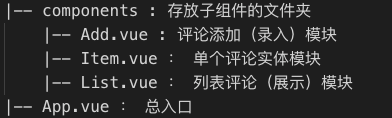  
1. 效果图：
    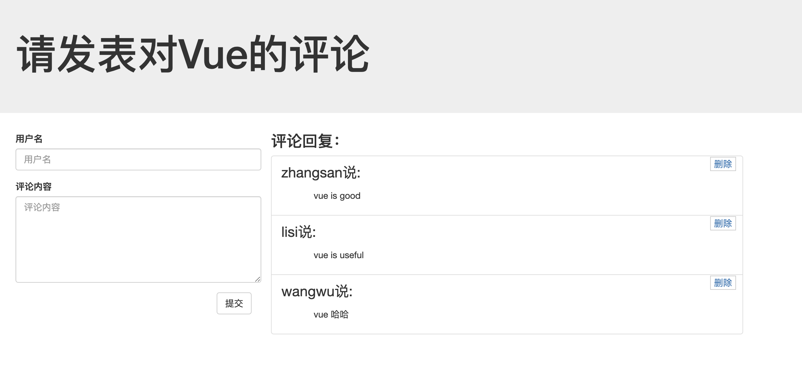
1. 文件依赖关系图示：  
    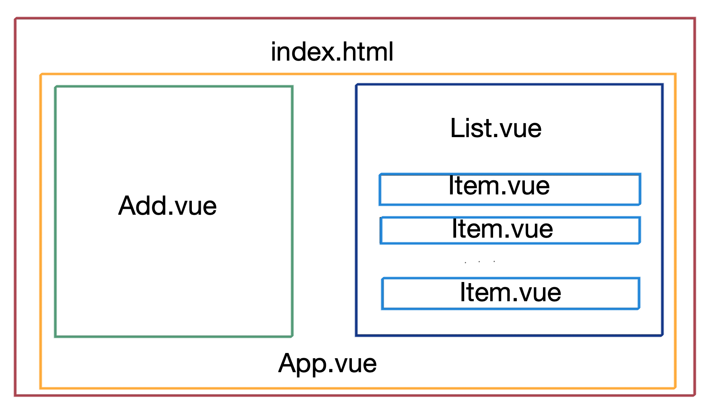  
1. 参考代码详见```vue-demo```文件夹下```src-comments```、```static-comments```
1. 效果：  
    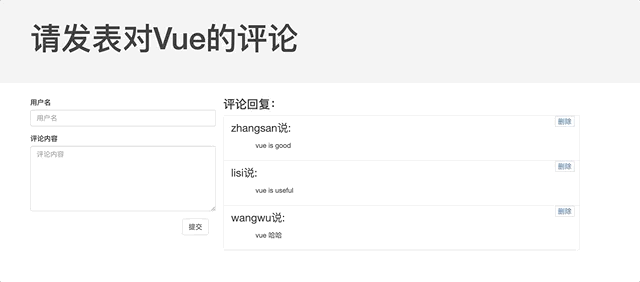

### 5. 案例二：交互待办页面
1. 代码文件层次：  
    |-- components : 子组件所在文件夹
        |-- Footer.vue : 功能区底部
        |-- Header.vue ：功能区头部
        |-- Item.vue ：单个待办实体
        |-- Items.vue ：待办列表
    |-- App.vue ：总入口
    |-- main.js : 将App.vue引入index.html
1. 效果图： 
    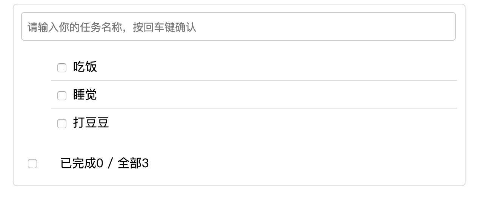  
1. 文件依赖关系：  
    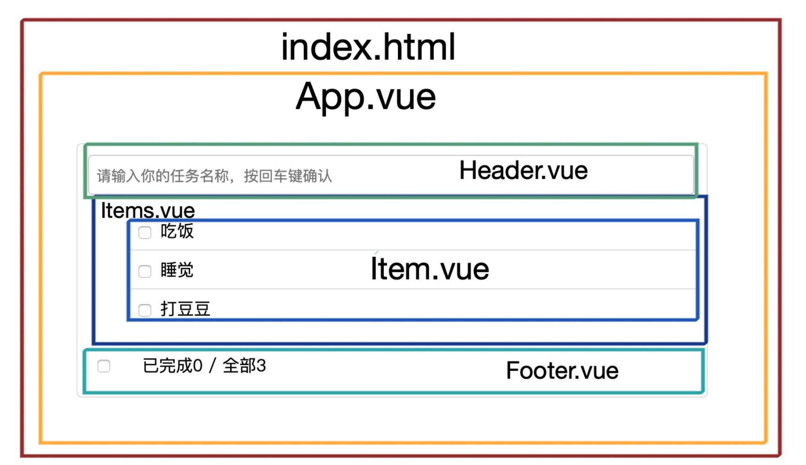
1. 参考代码详见```vue-demo```文件夹下```src```、```static```
1. 效果：  
    

### 6. 组件之间通信
1. 方式一：props
    1. 使用组件标签时
        ``` html
        <my-component name='tom' :age='3' :set-name='setName'></my-component>
        ```
    1. 定义 MyComponent 时
        1. 在组件内声明所有的 props
        1. 方式一: 只指定名称   
            ```props: ['name', 'age', 'setName']```
        1. 方式二: 指定名称和类型  
            ``` js
            props: {
                name: String,
                age: Number, setNmae: Function
            }
            ```
        1. 方式三: 指定名称/类型/必要性/默认值  
            ``` js
            props: {
                name: {type: String, required: true, default:xxx},
            }
            ```
    1. 注意：
        1. 此方式用于父组件向子组件传递数据
        1. 所有标签属性都会成为组件对象的属性, 模板页面可以直接引用
        1. 缺陷:
            1. 如果需要向非子后代传递数据必须多层逐层传递
            1. 兄弟组件间也不能直接 props 通信, 必须借助父组件才可以
1. 方式二：自定义事件（监听事件 + 触发事件）
    1. 2种绑定监听的方式
        1. ```<Header @addItem ='addItem'/> <!-- 绑定监听方式一 -->```
        1. 异步绑定：  
            1. 使用ref属性注册引用信息  
                ```<Header ref='header'/> <!-- 绑定监听方式二：异步绑定 -->```  
            1. 在mounted中异步绑定监听
                ``` js
                mounted() {
                    this.$refs.header.$on('addItem',this.addItem);
                }
                ```
    1. 触发事件：
        ``` js
        this.$emit('addItem',todoItem);
        ```
    1. 注意:
        1. 此方式只用于子组件向父组件发送消息(数据)
        1. 问题: 隔代组件或兄弟组件间通信此种方式不合适
1. 方式三：消息订阅与发布（PubSubJs库）：
    1. 安装PubSubJs： ```npm install --save pubsub-js```
    1. 引入依赖：  
        ```import PubSub from 'pubsub-js'```
    1. 订阅消息（相当于【绑定事件监听】）:  
        ```PubSub.subscribe('msg', function(msg, data){})```
    1. 发布消息（相当于【触发事件】）:  
        ```PubSub.publish('msg', data)```
    1. 优点: 此方式可实现任意关系组件间通信(数据)
1. 方式四：slot 
    1. 此方式用于父组件向子组件传递`标签数据`
    1. 子组件：child.vue
        ``` html
        <template> 
            <div>
                <slot name="xxx">不确定的标签结构 1</slot> 
                <div>组件确定的标签结构</div>
                <slot name="yyy">不确定的标签结构 2</slot>
            </div> 
        </template>
        ```
    1. 父组件：parent.vue
        ``` html
        <child>
            <div slot="xxx">xxx 对应的标签结构</div> 
            <div slot="yyy">yyyy 对应的标签结构</div>
        </child>
        ```
1. 方式五：vuex（延后）

### 7. vue-ajax
1. vue-resource(非官方库, vue1.x 使用广泛)
    1. 安装依赖  
        ```npm install vue-resource --save```
    1. 参考代码(模块引入与使用插件的声明，写在main.js中)
        ``` js
        // 引入模块
        import VueResource from 'vue-resource' 
        ```
        ``` js
        // 使用插件
        Vue.use(VueResource)
        ```
        ``` js
        // 通过 vue/组件对象发送 ajax 请求 
        this.$http.get('/someUrl').then(
        // success callback
        (response) => {
            console.log(response.data) //返回结果数据 
        }, 
        // error callback
        (response) => {
            console.log(response.statusText) //错误信息 
        })
        ```
    1. 效果： 
        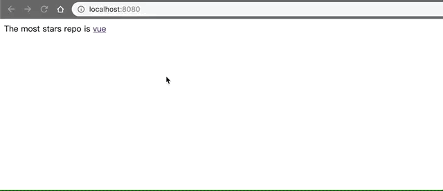
1. axios(通用的 ajax 请求库, 官方推荐, vue2.x 使用广泛)
    1. 安装依赖：  
        ```npm install axios --save```
    1. 参考代码：
        ``` js
        // 引入模块
        import axios from 'axios'
        ```
        ``` js
        // 发送 ajax 请求 
        axios.get(url).then(response => {
            console.log(response.data) // 得到返回结果数据
        }).catch(error => {
            console.log(error.message) 
        })
        ```
    1. 效果：（同上）

### 8. 案例三：GitHub用户搜索
1. 思路：search组件中点击搜索按钮发布搜索的消息，main组件订阅搜索的消息，通过ajax请求获取并展示数据
1. 参考代码：主要代码位于```src```文件夹下
1. 效果 ：  
    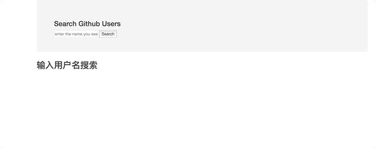

### 9. Vue UI库使用
1. Ant Design Vue
    1. 安装ant design vue组件：```npm i --save ant-design-vue```
    1. (可选,按需引入时建议使用)安装babel-plugin-import:```npm install babel-plugin-import --save-dev```
    1. 引入：
        1. 完整引入(main.js)：  
            ``` js
            import Vue from 'vue'
            import Antd from 'ant-design-vue'
            import App from './App'
            import 'ant-design-vue/dist/antd.css'
            Vue.config.productionTip = false

            Vue.use(Antd)

            /* eslint-disable no-new */
            new Vue({
            el: '#app',
            components: { App },
            template: '<App/>'
            })
            ```
        1. 按需引入(main.js + .babelrc，参考代码中引入了三个组件)：
            main.js:  
            ``` js
            import Vue from 'vue'
            import { Button, Icon, notification } from 'ant-design-vue'
            import App from './App.vue'

            Vue.config.productionTip = false

            Vue.use(Button)
            Vue.use(Icon)
            Vue.prototype.$notification = notification

            /* eslint-disable no-new */
            new Vue({
            el: '#app',
            components: {
                App
            },
            template: '<App/>'
            })
            ```
            .babelrc:  
            ``` json
            // .babelrc or babel-loader option
            {
                "plugins": [
                    ["import", { "libraryName": "ant-design-vue", "libraryDirectory": "es", "style": "css" }] // `style: true` 会加载 less 文件
                ]
            }
            ```
    1. 业务代码示例（App.vue）：
        ``` html
        <template>
            <div>
                <a-button type="primary" @click='handleClick'>ant-design-vue</a-button>
            </div>
        </template>

        <script>
            export default{
                methods: {
                    handleClick() {
                    this.$notification.open({
                        message: '通知通知',
                        description: '心心念念的Ant Design Vue.',
                        duration: 2,
                        onClose: 'close',
                        icon: <a-icon type="smile" style="color: #108ee9" />
                        })
                    }
                }
            }
        </script>
        ```
    1. 效果：  
        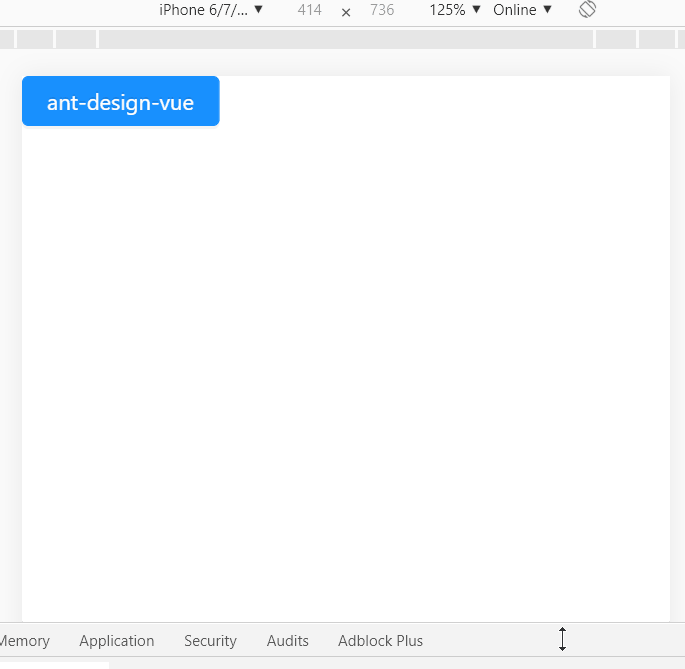
1. Mint-ui:
    1. 安装mint-ui：```npm install --save mint-ui```
    1. 安装babel-plugin-component:```npm install --save-dev babel-plugin-component```
    1. 使用上差不多，部分引入时使用的是```babel-plugin-component```，笔记略，代码参考：```src-mint-ui```文件夹
    1. 效果：  
        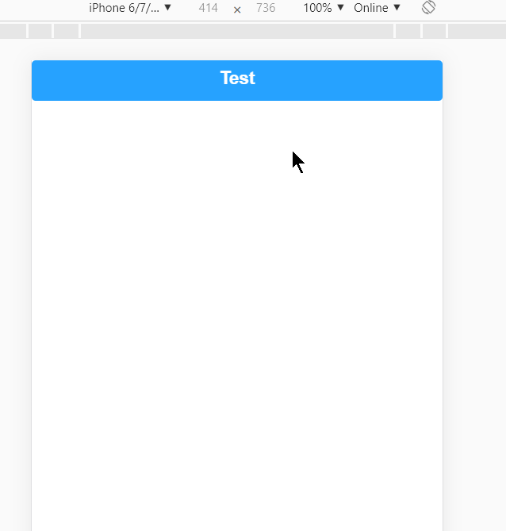

### 10. vue-router
1. 是什么：官方提供的用来实现 SPA(Single Page Application, 单页应用) 的 vue 插件
1. 安装： ```npm install vue-router --save```
1. 基础语法：
    1. VueRouter(): 用于创建路由器的构建函数
        ``` js
        new VueRouter({ 
            // 多个配置项
        })
        ```
    1. 路由配置：
        ``` js
        routes: [
            { // 一般路由
                path: '/about',
                component: About 
            },
            { // 自动跳转路由 
                path: '/',
                redirect: '/about' 
            }
        ]
        ```
    1. 注册路由器：
        ``` js
        import router from './router' 
        new Vue({
            //...,省略其他配置
            router 
        })
        ```
    1. 使用路由组件标签
        1. ```<router-link>```: 用来生成路由链接
            ``` js
            <router-link to="/xxx">Go to XXX</router-link>
            ```
        2. ```<router-view>```: 用来显示当前路由组件界面 
            ``` js
            <router-view></router-view>
            ```
1. 使用案例：
    1. 在src/components文件夹下新建2个子组件（例如：About.vue、Home.vue）
    1. 定义并对外暴露路由器 + 路由配置：在src文件夹下新建router文件夹，在src/router下新建index.js，在index.js中引入Vue、VueRouter以及components下的两个子组件，在路由器对象中配置路由
        ``` js
        import Vue from 'vue'
        import VueRouter from 'vue-router'

        Vue.use(VueRouter);

        import About from '../components/About.vue'
        import Home from '../components/Home.vue'

        export default new VueRouter({
            // n个路由
            routes: [
                {
                    path: '/about',
                    component: About
                },
                {
                    path: '/home',
                    component: Home
                },
                // 访问默认路径时，重定向到about
                {
                    path: '/',
                    redirect: 'about'
                }
            ]
        })
        ```
    1. 在main.js中注册路由器  
        ``` js
        import Vue from 'vue'
        import App from './App.vue'
        import router from './router'

        /* eslint-disable no-new */
        new Vue({
            el: '#app',
            components: {
                App
            },
            template: '<App/>',
            router
        })
        ```
    1. 将菜单标签与页面标签（子组件标签）改为路由组件标签
        ``` html
        <div class="row">
            <div class="col-xs-2 col-xs-offset-2">
                <div class="list-group">
                <!--生成路由链接-->
                    <router-link to="/about" class="list-group-item">About</router-link>
                    <router-link to="/home" class="list-group-item">Home</router-link>
                </div>
            </div>
            <div class="col-xs-6">
                <router-view ></router-view>
            </div>
        </div>
        ```
    1. 效果：  
      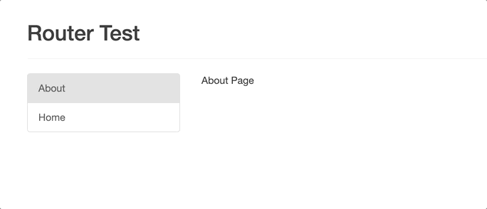

    

### 附：补充知识点：
1. JavaScript Array filter() 方法
    1. 定义：filter() 方法创建一个新的数组，新数组中的元素是通过检查指定数组中符合条件的所有元素。
    1. filter() 不会对空数组进行检测；
    1. filter() 不会改变原始数组。
    1. 参考代码：
        ``` js
        var ages = [32, 33, 16, 40];
        function checkAdult(age) {
            return age >= 18;
        }
        function myFunction() {
            document.getElementById("demo").innerHTML = ages.filter(checkAdult);
        }
        ```
    1. 效果：  
        
1. JavaScript forEach() 方法
    1. forEach() 方法用于调用数组的每个元素，并将元素传递给回调函数。
    1. forEach() 对于空数组是不会执行回调函数的。
    1. 参考代码：   
        ``` html
        <button onclick="numbers.forEach(myFunction)">点我</button>
        <p id="demo"></p>
        
        <script>
        demoP = document.getElementById("demo");
        var numbers = [4, 9, 16, 25];
        
        function myFunction(item, index) {
            demoP.innerHTML = demoP.innerHTML + "index[" + index + "]: " + item + "<br>"; 
        }
        </script>
        ```  
    1. 效果：
        
1. JavaScript Array map() 方法
    1. map() 方法返回一个新数组，数组中的元素为原始数组元素调用函数处理后的值。
    1. map() 方法按照原始数组元素顺序依次处理元素。
    1. 注意： 
        1. map() 不会对空数组进行检测。
        1. map() 不会改变原始数组。
    1. 参考代码：  
        ``` js
        var numbers = [4, 9, 16, 25];

        function myFunction() {
            x = document.getElementById("demo")
            x.innerHTML = numbers.map(Math.sqrt);
        }
        ```
    1. 效果：  
        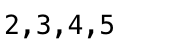
> https://www.runoob.com/jsref/jsref-obj-array.html


          
