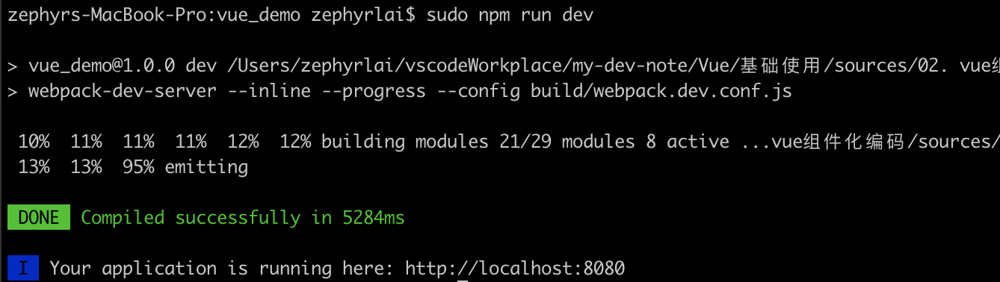
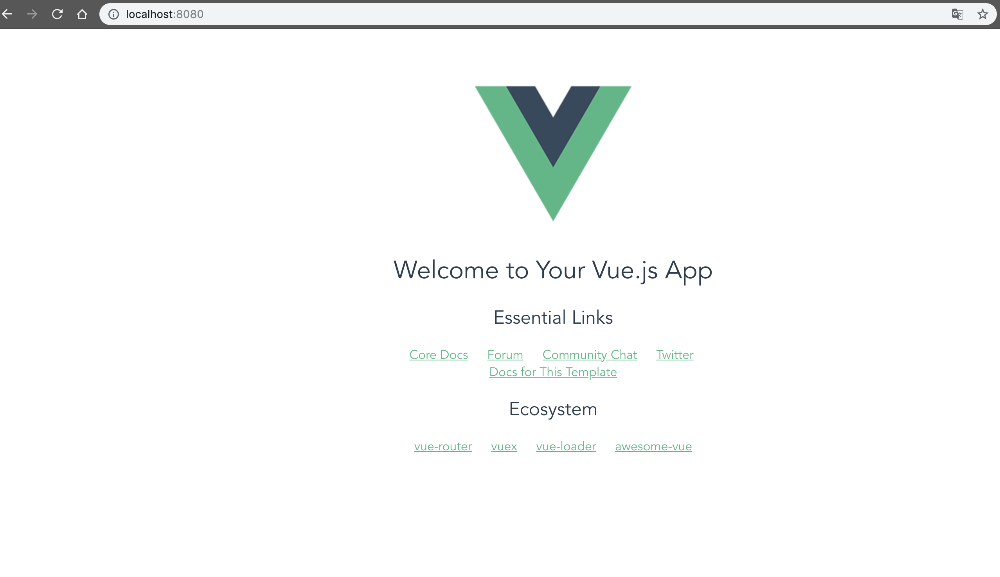
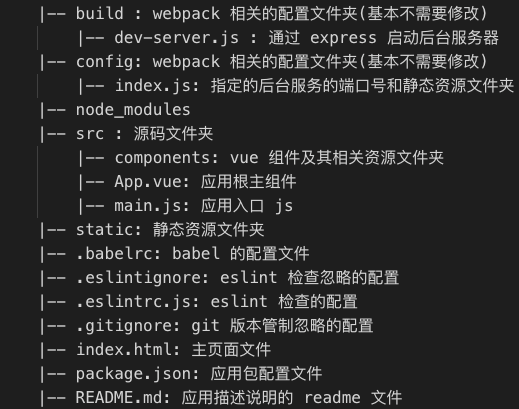
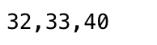
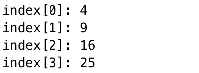

## 二、 Vue组件化编码
### 1. 使用vue-cli创建模板项目
1. 说明：
    1. vue-cli 是 vue 官方提供的脚手架工具
    1. github: https://github.com/vuejs/vue-cli
    1. 作用: 从 https://github.com/vuejs-templates 下载模板项目
1. 创建vue项目
    1. 依次执行如下指令(如遇权限不足，则使用```sudo```提权)：
        ``` sh
        npm install -g vue-cli
        vue init webpack vue_demo 
        cd vue_demo
        npm install
        npm run dev
        ```  
    1. 最终将出现如下所示：  
          
    1. 访问： 
        
    1. 模板项目的结构：  
        
### 2. 基于脚手架编写项目
1. 删除src目录下main.js文件、App.vue文件、components文件夹，自己重新写一份
1. 文件关系：  
    App.vue将components下的组件编译到App.vue中，main.js将App.vue中的组件编译到index.html中
1. components/HelloWorld.vue:
    ``` html
    <!-- 3要素：html、js、css -->
    <template>
        <div>
            <p>{{msg}}</p>
        </div>
    </template>

    <script>
        export default {
            data () {
                return {
                msg: 'hello world!'
                }
            }
        }
    </script>

    <style>
        p{
            color:#bbb;
            font-size:30px;
        }
    </style>
    ```  
1. App.vue:  
    1. 引入HelloWorld组件
    2. 映射HelloWorl组件标签
    3. 使用HelloWorld标签   
    ``` html
    <template>
        <div>
            
            <!-- 3. 使用标签 -->
            <HelloWorld/>
        </div>
    </template>

    <script>
    // 1. 引入组件
    import HelloWorld from './components/HelloWorld'
    export default {
    // 2. 将组件映射为标签
    components: {
            HelloWorld
        }
    }
    </script>

    <style lang="">
    </style>
    ```
1. main.js(入口js)：创建vue实例，最终将App.vue渲染至index.html中  
    1. 引入App组件
    2. 映射App组件标签
    3. 使用App标签（通过template方式） 
    ``` js
    import Vue from 'vue'
    import App from './App.vue'

    /* eslint-disable no-new */
    new Vue({
        el: '#app',
        components: {
            App
        },
        template: '<App/>'
    })
    ```
1. 运行```npm run dev```  
1. 效果：  
    
### 3. ESLint
1. ESLint时什么：
    1. ESLint 是一个代码规范检查工具 
    1. 它定义了很多特定的规则, 一旦你的代码违背了某一规则,eslint会作出非常有用的提示
1. ESLint提供以下支持
    1. ES 
    1. JSX 
    1. style 检查 
    1. 自定义错误和提示
1. 规则的错误等级有三种
    1. 0：关闭规则。 
    1. 1：打开规则，并且作为一个警告（信息打印黄色字体） 
    1. 2：打开规则，并且作为一个错误（信息打印红色字体）
1. 3中方式更改规则x`
    1. .eslintrc.js: 全局规则配置文件 'rules':{ 'no-new':1 }
    1. 在 js/vue 文件中修改局部规则 
        ``` js
            /*eslint-disableno-new*/ 
            newVue({ el:'body', components:{App} })
        ```
    1. .eslintignore: 指令检查忽略的文件 *.js *.vue
### 4. 

### 附：补充知识点：
1. JavaScript Array filter() 方法
    1. 定义：filter() 方法创建一个新的数组，新数组中的元素是通过检查指定数组中符合条件的所有元素。
    1. filter() 不会对空数组进行检测；
    1. filter() 不会改变原始数组。
    1. 参考代码：
        ``` js
        var ages = [32, 33, 16, 40];
        function checkAdult(age) {
            return age >= 18;
        }
        function myFunction() {
            document.getElementById("demo").innerHTML = ages.filter(checkAdult);
        }
        ```
    1. 效果：  
        
1. JavaScript forEach() 方法
    1. forEach() 方法用于调用数组的每个元素，并将元素传递给回调函数。
    1. forEach() 对于空数组是不会执行回调函数的。
    1. 参考代码：   
        ``` html
        <button onclick="numbers.forEach(myFunction)">点我</button>
        <p id="demo"></p>
        
        <script>
        demoP = document.getElementById("demo");
        var numbers = [4, 9, 16, 25];
        
        function myFunction(item, index) {
            demoP.innerHTML = demoP.innerHTML + "index[" + index + "]: " + item + "<br>"; 
        }
        </script>
        ```  
    1. 效果：
        
> https://www.runoob.com/jsref/jsref-obj-array.html


          
