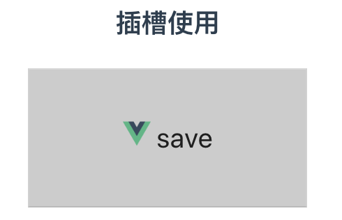
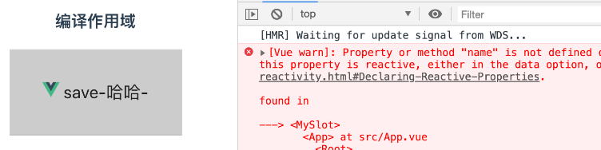
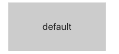
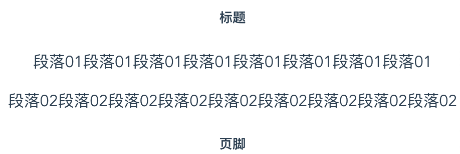
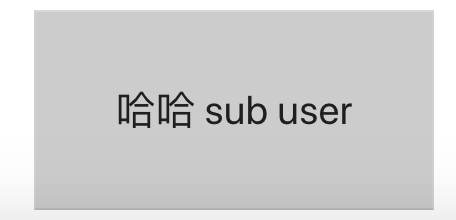

## Vue插槽
注意：在2.6.0中，vue为具名插槽和作用域插槽引入了一个新的统一的语法(即```v-slot```指令)

### 一、插槽使用
什么是插槽：插槽就是Vue实现的一套内容分发的API，将<slot></slot>元素作为承载分发内容的出口。通俗地说，没有插槽的情况下在组件标签内些一些内容是不起任何作用的，当我在组件中声明了slot元素后，在组件元素内写的内容就会出现在slot元素中。  
基本使用：
1. 定义父级组件(MySlot.vue)：  
    ``` html
    <template>
        <my-btn>
            
            save
        </my-btn>
    </template>
    <script>...</script>
    <style>...</style>
    ```
1. 定义插槽组件(MyBtn.vue)：
    ``` html
    <template>
        <button class='my-btn'>
            <slot></slot>
        </button>
    </template>
    <script>...</script>
    <style>...</style>
    ```
1. 效果：  
    


### 二、编译作用域
规则：父级模板里的所有内容都是在父级作用域中编译的；子模板里的所有内容都是在子作用域中编译的。  
代码实战：
1. 定义父级组件(MySlot.vue)：
    ``` html
    <template>
        <my-btn name='123'>
            
            save-{{user.name}}-{{name}}
        </my-btn>
    </template>
    <script>
        export default {
            data() {
                return {
                    user: {name:'哈哈',age:18}
                }
            }
            ...
        }
    </script>
    <style>...</style>
    ```
1. 效果：  
    
该插槽跟模板的其它地方一样可以访问相同的实例属性 (也就是相同的“作用域”)，而不能访问 <my-btn> 的作用域(无法获取my-btn元素中的name属性)

### 三、后备内容（理解为插槽默认值）
什么是后备内容：可以在插槽中定义一些默认内容，当父级元素中没有元素传入的时候，将使用默认内容
代码实战：
1. 定义父级组件(MySlot.vue)：
    ``` html
    <template>
        <my-btn>
        </my-btn>
    </template>
    <script>...</script>
    <style>...</style>
    ```
1. 定义插槽组件(MyBtn.vue)：
    ``` html
    <template>
        <button class='my-btn'>
            <slot>default</slot>
        </button>
    </template>
    <script>...</script>
    <style>...</style>
    ```
1. 效果：  
    


### 四、具名插槽
定义：插槽组件中有多个slot元素时，为了区分不同的slot，在slot元素上添加name属性以示区别，父元素在传入数据的时候通过在template元素上使用v-slot属性，将不同的数据注入到各自的slot元素。  
简写：'v-slot:header'可简写作'#header'   
代码实战：
1. 定义插槽组件：
    ``` html
    <template>
        <div>
            <slot name='header'></slot>
            <!-- 默认插槽：任何没有被包裹在带有 v-slot 的 <template> 中的内容都会被视为默认插槽的内容。 -->
            <slot></slot>
            <slot name='footer'></slot>
        </div>
    </template>
    <script>...</script>
    <style>...</style>
    ```
1. 定义父级组件：
    ```html
    <template>
        <my-article>
            <template v-slot:header>
                <div>
                    <h5>标题</h5>
                </div>
            </template>
            <template>
                <div>
                    <p>段落01段落01段落01段落01段落01段落01段落01段落01</p>
                </div>
            </template>
            <!-- 具名插槽简写：#:xxx -->
            <template #footer>
                <div>
                    <h5>页脚</h5>
                </div>
            </template>
            <template>
                <div>
                    <p>段落02段落02段落02段落02段落02段落02段落02段落02段落02</p>
                </div>
            </template>
        </my-article>
    </template>
    <script>...</script>
    <style>...</style>
    ```
1. 效果：    
    

### 五、作用域插槽
为了让插槽中的数据在父级的插槽内容中可用，我们可以将插槽数据作为 <slot> 元素的一个特性绑定上去。父级元素使用v-slot='xxxData'接收，插槽使用v-bind:xxxData='xxxData'向上传递
代码实战  
1. 定义插槽(MySoltBind.vue)：
    ``` html
    <template>
        <button class='my-btn'>
                <slot v-bind:subUser='subUser'>
                {{subUser.name}}
                </slot>
        </button> 
    </template>
    <script>
        export default {
            data() {
                return {
                    subUser:{
                        name:"哈哈 sub user",
                        age:22
                    }
                }
            }
        }
    </script>
    <style>...</style>
    ```
1. 定义父级元素：
    ``` html
    <template>
        <my-slot-bind>
            <template v-slot:default='slotProps'>
                {{slotProps.subUser.name}}     
            </template>
        </my-slot-bind>
    </template>
    <script>...</script>
    <style>...</style>
    ```
1. 效果：  
    

### 参考：
> [官方文档：插槽](https://cn.vuejs.org/v2/guide/components-slots.html)