## 一、项目准备工作
1. 使用@vue/cli 3.x工具创建脚手架，首次使用需要安装 ：  
    1. 安装命令
        ``` sh
            npm install -g @vue/cli
        ```
    1. 或使用如下命令查看已安装的版本：  
        ``` sh
            vue --version
        ```
1. 创建项目
    1. 创建命令：  
        ``` sh
            vue create demo-project
        ```
    1. 推荐配置：  
        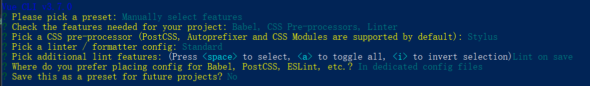
    1. 进入项目文件夹并运行：  
        ``` sh
            cd demo-project
            npm run serve
        ```
    1. 效果：  
        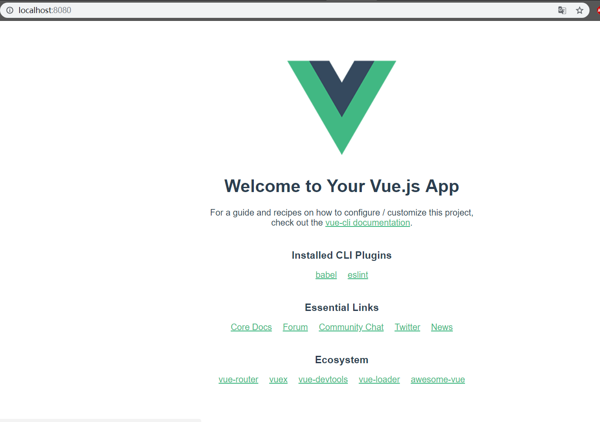
1. 在项目中安装cube-ui
    1. 安装命令：  
        ``` sh
            vue add cube-ui
        ```
    1. 再次运行项目：  
        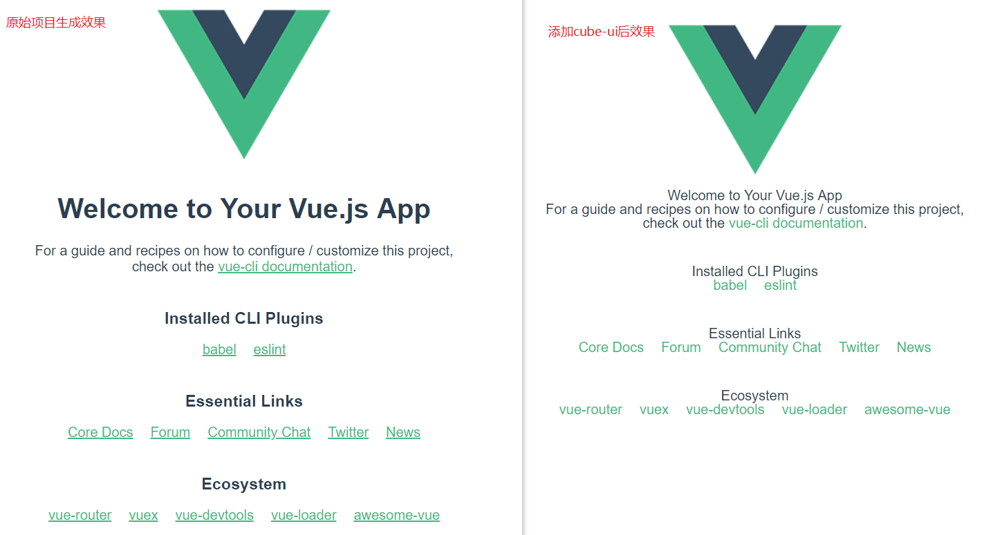

## 二、头部组件开发（对应分支：ch2）
1. 引入静态header组件
    1. 在public目录下的index.html文件中mate下加入视口限制：禁止缩放:  
        ``` html
        <meta name="viewport" content="width=device-width,initial-scale=1.0,maximum-scale=1.0,minimum-scale=1.0,user-scalable=no">
        
        ```
    1. 在src目录下创建common目录，存放font、stylus文件
        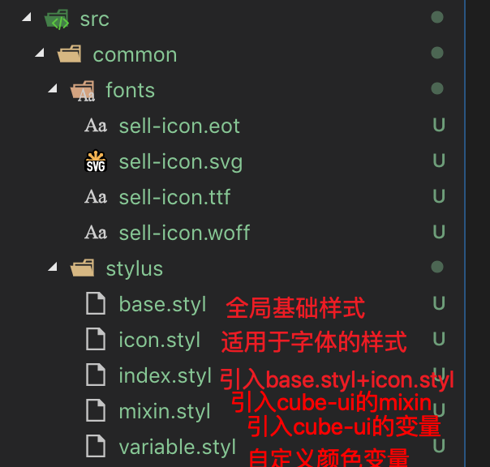
    1. 在main.js中引入"common/stylus/index.styl"
    1. 在components中引入support-ico、v-header组件
        1. support-ico
            1. support-ico组件是抽取了的图标模块，因为页面的很多地方都将用到不同大小的图标，因此将其抽取
            1. 在vue.conf.js中加入如下支持，以便在vue文件的style标签中通过这种方式引入其他样式```@import "~common/stylus/mixin"```
                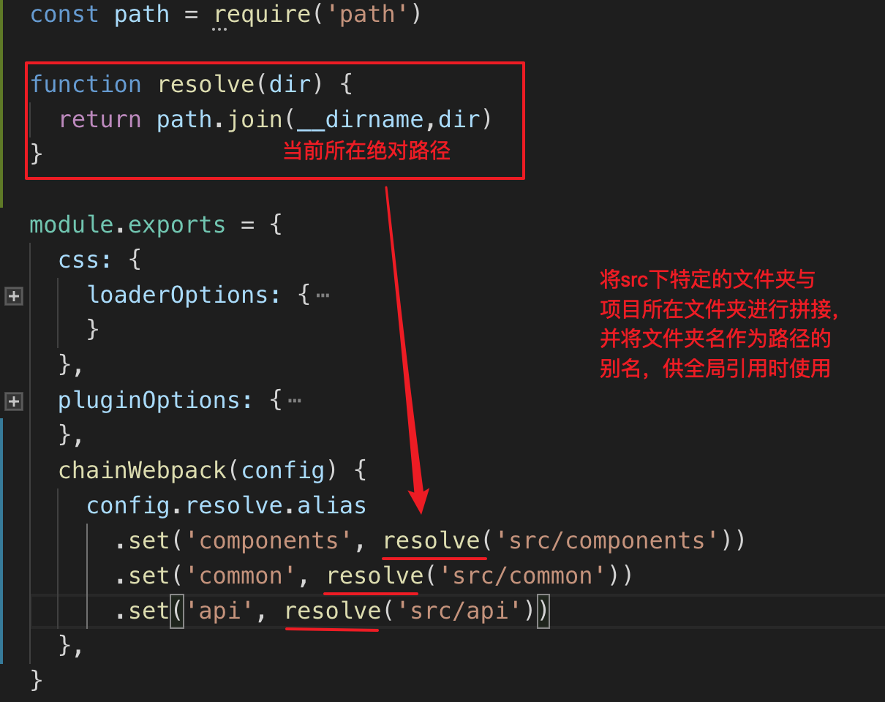
        1.  v-header
            1. 即店铺首页的头部模块
    1. 在App.vue中引入v-header模块：  
        ``` html
        <template>
        <div id="app">
            <v-header></v-header>
        </div>
        </template>

        <script>
        import VHeader from 'components/v-header/v-header.vue'

        export default {
        name: 'app',
        components: {
            VHeader
        }
        }
        </script>

        <style lang="stylus">
        </style>
        ```
    1. 在.eslintrc.js中去掉没有必要的校验：  
        
    1. 运行项目后的效果：  
        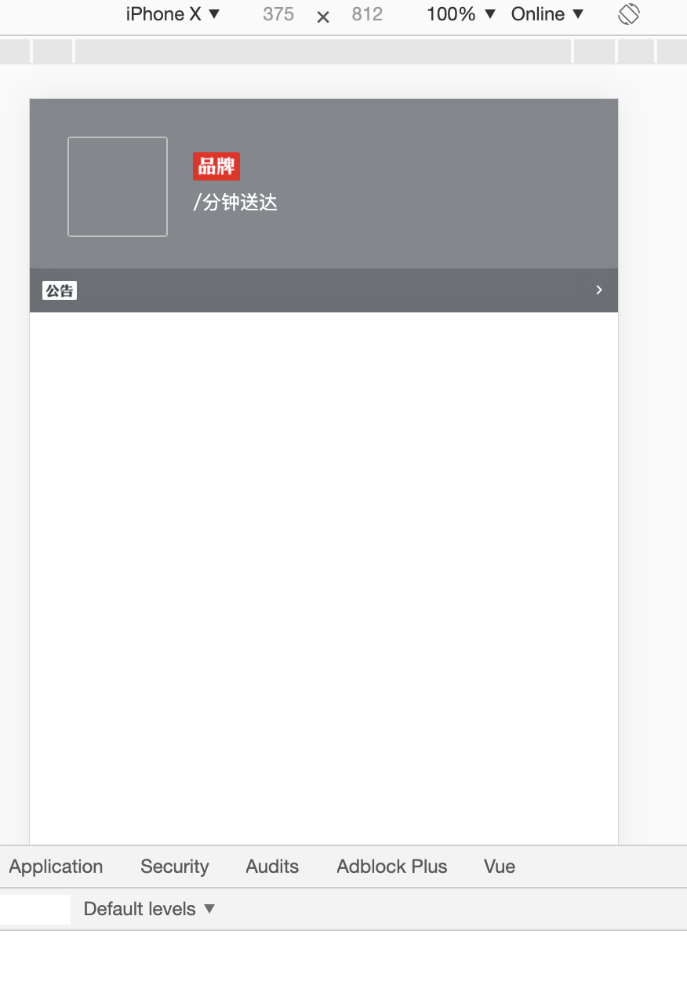
1. axios封装与数据获取
    1. 安装axios: ```npm i axios --save```
    1. 配置mock数据模拟后端接口请求
        1. 在项目目录下引入data.json
        1. 在vue.conf.js中进行如下配置  
            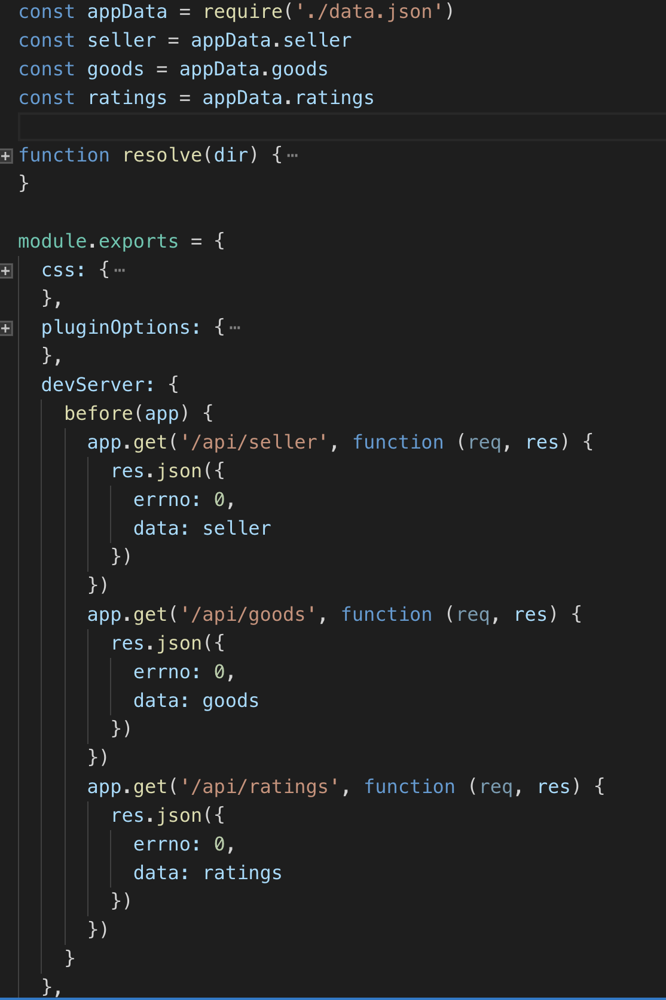
        1. 接口请求效果：  
            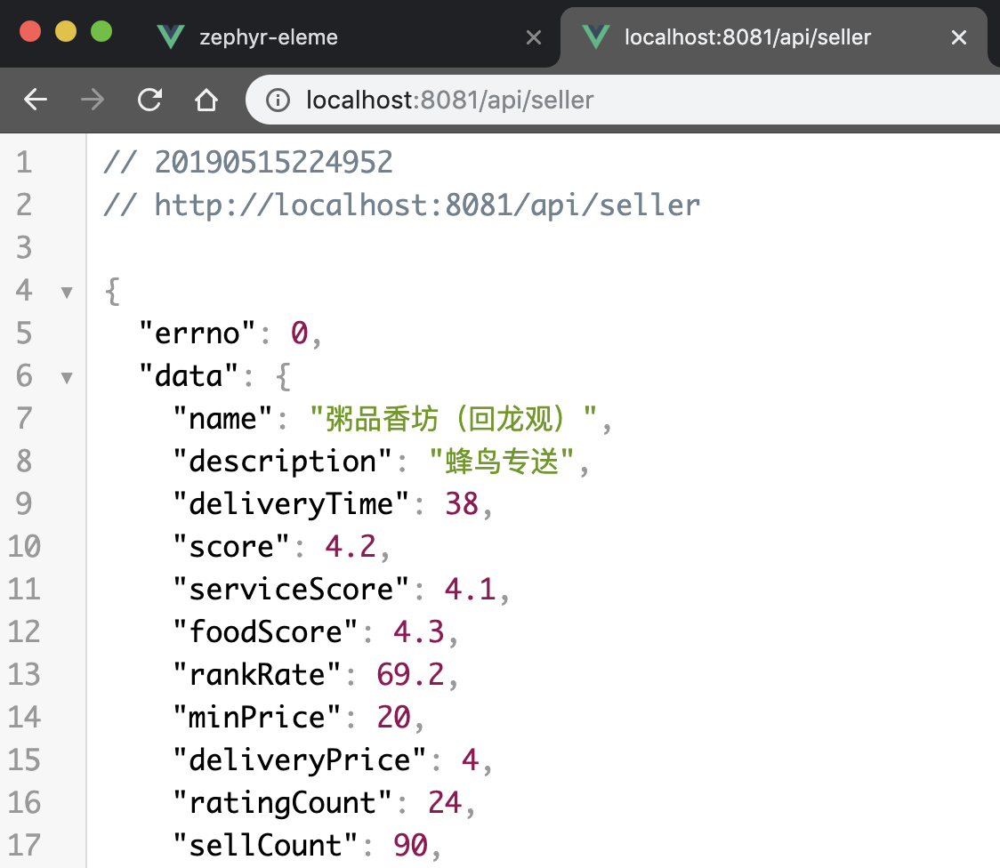
    1. 封装axios
        1. 在src下新建api模块，在api文件夹下新建helper.js、index.js
        1. helper.js中封装并对外暴露执行get请求的方法  
            ``` js
            import axios from 'axios'

            // 统一定义接口请求成功编码
            const SUCC_STATUS = 0

            export function myGet(url){
                return function(params){
                    return axios.get(url,{params})
                        .then(res => {
                            const {errno,data} = res.data;
                            if(errno === SUCC_STATUS){
                                return data;
                            }
                        })
                        .catch(() => {
                            console.log('request error!')
                        })
                }
            }
            ```
        1. index.js中引入helper.js中的get方法后，封装并对外暴露请求特定接口的方法  
            ``` js
            import { myGet } from './helper'

            const getSellers = myGet('api/seller')

            export {
                getSellers
            }
            ```
    1. 在App.vue中请求数据并显示
        1. 在create()钩子中触发数据请求
            ``` html
            <script>
                import VHeader from 'components/v-header/v-header.vue'
                import { getSellers } from 'api'

                export default {
                    name: 'app',
                    data() {
                        return {
                        seller: {}
                        }
                    },
                    created() {
                        this._myGetSellers()
                    },
                    methods: {
                        _myGetSellers() {
                            getSellers().then(seller => {
                                this.seller = seller
                            })
                        }
                    },
                    components: {
                        VHeader
                    }
                }
            </script>
            ```
    1. 效果：  
        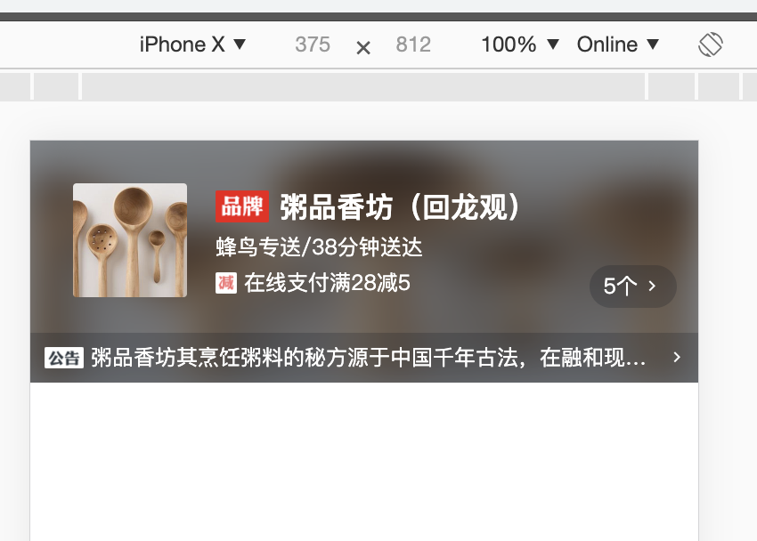 
1. 新增评分组件
    1. 在components下新建star文件夹，里面放评分用到的图片，并新建star.vue
    1. 根据传递的size统一确定星星的大小，根据传递的score，利用计算属性itemClasses，动态生成所有的星星的class名（实星、半星、空星）  
        ``` html
        <template>
            <div class="star" :class="starType">
                <span v-for="(itemClass,index) in itemClasses" :class="itemClass" class="star-item" :key="index"></span>
            </div>
        </template>
        <script>
            const LENGTH = 5    // 星星的总数
            const CLS_ON = 'on' // 实星
            const CLS_HALF = 'half' // 半星
            const CLS_OFF = 'off'   // 空星
            export default {
                props: {
                    size: {
                        type: Number
                    },
                    score: {
                        type: Number
                    }
                },
                computed: {
                    // 统一指定星星的大小：48、36、24
                    starType() {
                        return 'star-' + this.size
                    },
                    itemClasses() {
                        let result = [];
                        // 获取整数或者0.5的小数
                        // 4.1*2=8.2，向下取整得8，8/2=4
                        // 2.9*2=5.8，向下取整得5，5/2=2.5
                        const num = Math.floor(this.score*2)/2;
                        const hasDecimal = num%1 != 0 ;
                        const intScore = Math.floor(num);
                        // 放入满星
                        for (let index = 0; index < intScore; index++) {
                            result.push(CLS_ON);                
                        }
                        // 有半星就放一个半星
                        if(hasDecimal)
                            result.push(CLS_HALF);
                        // 剩余的位置都放空星
                        while (result.length < LENGTH) {
                            result.push(CLS_OFF);
                        }
                        return result;
                    }
                },
            }
        </script>
        <style lang="stylus">
            @import "~common/stylus/mixin.styl"
            .star
                display: flex
                align-items: center
                justify-content: center
                .star-item
                background-repeat: no-repeat
                &.star-48
                .star-item
                    width: 20px
                    height: 20px
                    margin-right: 22px
                    background-size: 20px 20px
                    &:last-child
                    margin-right: 0
                    &.on
                    bg-image('star48_on')
                    &.half
                    bg-image('star48_half')
                    &.off
                    bg-image('star48_off')
                &.star-36 //...略
                &.star-24 //...略
        </style>

        ```
1. 引用头部的描述模块
    1. 用到了cube-ui中的createAPI模块
        1. [官网与文档](https://didi.github.io/cube-ui/#/zh-CN/docs/create-api)
        1. 思想与优势：原生的alert是通过js调用实现的，createAPI的作用就是可以实现以 API 的形式调用自定义组件，因此全局的遮罩、弹框都可以使用createAPI实现
        1. 基本使用： 
            1. 所有通过 createAPI 实现的通过 API 的形式调用的自定义组件（cube-ui 内置的组件）都需要通过 Vue.use 注册才可以。
            1. createAPI(Vue, Component, [events, single])
                1. 参数说明：  
                    __Vue__：Vue 函数  
                    __Component__：Vue子组件，组件必须有name属性，如果缺失name将会出现报错：  
                        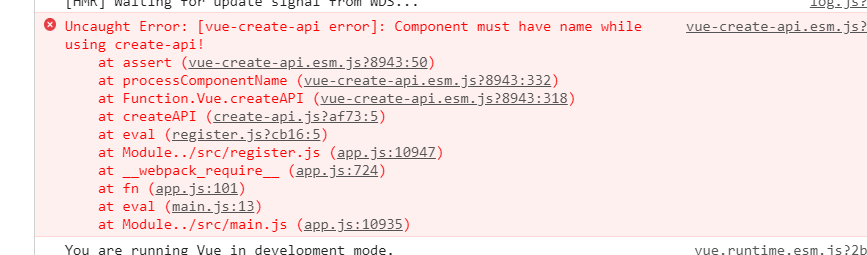       
                    __events__: 可选参数，组件实例 emit 的事件名集合  
                    __single__: 可选参数，是否为单例，默认true 
        1. [方式一]createAPI在普通 js 文件的模板代码： 
            ``` js
            import Vue from 'vue'
            import Hello from './Hello.vue'

            import {
            createAPI
            } from 'cube-ui'

            // 创建 this.$createHello and $Hello.create API
            createAPI(Vue, Hello, ['click'], true)

            Hello.$create(config, renderFn)
            ```
        1. [方式二]createAPI通过 Vue.use 注册的模板代码：
            ``` js
            import Vue from 'vue'
            import { Dialog } from 'cube-ui'

            Vue.use(Dialog)

            Dialog.$create({
            ...
            })
            ```
        1. createAPI该方法在 Vue 的 prototype 上增加一个名为 $create{camelize(Component.name)} 的方法，这样就可以在其他组件中直接通过 const instance = this.$createAaBb(config, [renderFn, single]) 这样来实例化组件了，而且这个实例化组件的元素是被附加到 body 元素下的。调用示意：  
            ``` js
            const instance = this.$createAaBb(config, renderFn, single)
            ```
        1. createAPI的$createAaBb方法需要2个参数$prop(传递给组件的 Props)与$event(可选,组件的 Events 事件回调)
            1. $props 示例，约定结构 { [key]: [propKey] }  __（注意体会为什么写作'propKey',而不写作'propValue'）__： 
                ``` js
                {
                    title: 'title',
                    content: 'my content',
                    open: false
                }
                ```
            1. title、content、open 就是传递给组件的 Prop 的 key，而对应 Prop 的值则按照如下规则获取：
                1. 如果是非字符串，则直接取配置的 propKey 作为值
                1. 如果是字符串，且配置的 propKey 不在当前实例上下文属性上，则直接取 propKey 作为值
                1. __是字符串，且在当前实例上下文属性上，那么直接获取当前实例上下文对应的 propKey 的值，且会监控这个值的变化实时更新到组件实例上__
    1. src下新建register.js，使用createAPI在HeaderDetail组件中间接添加api调用方法：  
        ``` js
        import { createAPI } from 'cube-ui'
        import Vue from 'vue'
        import HeaderDetail from 'components/header-detail/header-detail'

        createAPI(Vue, HeaderDetail)
        ```
    1. 在main.js中初始化（调用）register.js  
        ``` js
        import './register'
        ```
    1. vHeader组件中的点击事件()：  
        ``` js
        showDetail() {
            this.headerDetailComponent = this.headerDetailComponent || this.$createHeaderDetail({
                $props: {
                    seller: 'seller'
                }
            })
            // 这里的show方法是HeaderDetail组件中通过控制v-show的标志位实现的显示与隐藏
            this.headerDetailComponent.show()
        }
        ```
    1. 效果：  
        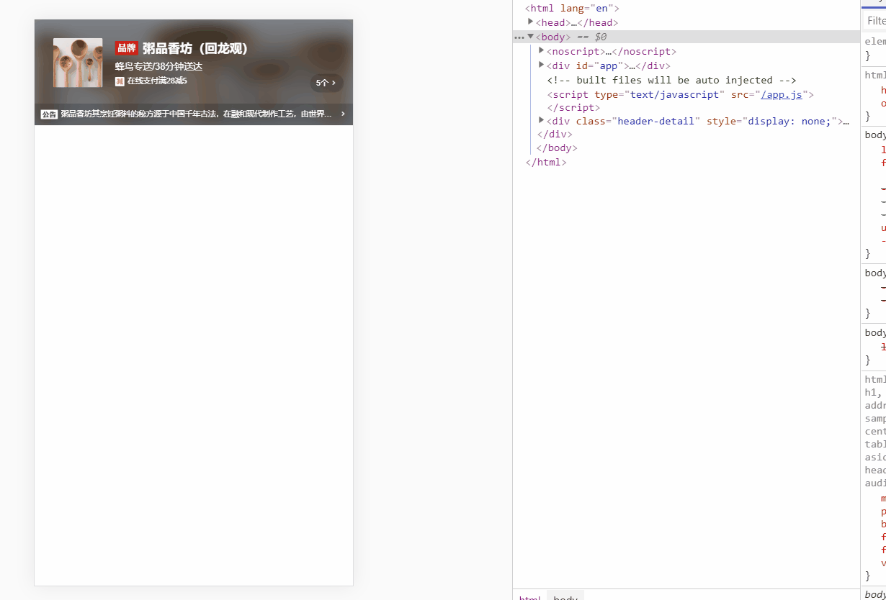

## 三、Tab 组件开发（对应分支：ch3）
1. 实现思路：tab栏使用了cube-ui的tab-bar组件，而主页面则采用了轮播组件
1. tab组件基础实现：
    1. 新建seller、goods、ratings、tab组件，并将前三个组件引入tab组件
    1. 在VHeader组件中引入tab组件
    1. tab组件：  
        ``` html
        <template>
            <div class='tab'>
                <cube-tab-bar
                    :showSlider=true 
                    v-model="selectedLabel" 
                    :data="tabs"
                    ref="tabBar"
                    class="border-bottom-1px">
                </cube-tab-bar>
                <div class="slide-wapper">
                    <cube-slide
                        :loop=false
                        :auto-play=false
                        :show-dots=false
                        :initial-index="index"
                        ref="slide">
                        <cube-slide-item>
                            <goods></goods>
                        </cube-slide-item>
                        <cube-slide-item>
                            <seller></seller>
                        </cube-slide-item>
                        <cube-slide-item>
                            <ratings></ratings>
                        </cube-slide-item>
                    </cube-slide>
                </div>
            </div>
        </template>

        <script>
        import Goods from 'components/goods/goods'
        import Seller from 'components/seller/seller'
        import Ratings from 'components/ratings/ratings'

        export default {
            name: 'tab',
            data() {
                return {
                    index: 0,
                    tabs: [{label:'商品'},{label:'评价'},{label:'商家'}]
                }
            },
            computed: {
                selectedLabel: {
                    get() {
                        return this.tabs[this.index].label;
                    },
                    set(value) {
                        this.index = this.tabs.findIndex(item => {
                            return value === item.label
                        })
                    }
                }
            },  
            components: {
                Goods,
                Seller,
                Ratings
            }
        }
        </script>

        <style lang="stylus" scoped>
            @import "~common/stylus/variable"
            .tab
                display: flex
                flex-direction: column
                height: 100%
                >>> .cube-tab
                padding: 10px 0
                .slide-wrapper
                flex: 1
                overflow: hidden
        </style>
        ```
    1. 在theme.styl中引入/common/stylus/variable.styl，并将最后的tab类样式变量修改如下：  
        ``` 
        $tab-active-color = $color-red
        $tab-slider-bgc = $color-red
        ```
    1. 效果：  
        
1. tab组件上下联动
    1. 代码思路：根据当前轮播图在全部轮播图并排排列视角下的位置比例，实时动态计算并更改tabBar下划线的位置，实现如丝般顺滑的效果
    1. 在tab.vue的data中添加滑动的[选项参数](https://didi.github.io/cube-ui/#/zh-CN/docs/scroll#cube-Props%E9%85%8D%E7%BD%AE-anchor)(开启滚动监听、[实时触发scroll事件](https://ustbhuangyi.github.io/better-scroll/doc/zh-hans/options.html#probetype)、[设定判别滚动方向的阈值](https://ustbhuangyi.github.io/better-scroll/doc/zh-hans/options.html#directionlockthreshold)：  
        ``` 
        scrollOptions: {
            listenScroll: true,
            probeType: 3,
            diretionLockThreshold: 0
        }
        ```
    1. 在cube-slide标签中添加cube-ui的option属性、绑定scroll方法：
        ```
            @scroll="onScroll"
            :options = 'scrollOptions'
        ```
    1. cube-ui的tabBar组件对外提供了setSliderTransform方法，可以手动调整tabBar下划线的位置
    1.添加onScroll、onChange方法：  
        ``` js
        onScroll(pos) {
            // console.log(pos.x)
            // 获取tarBar的宽度（红色下边框的宽度）
            const tarBarWidth = this.$refs.tabBar.$el.clientWidth
            // 获取slide的宽度(全部轮播图并排排列的宽度)
            const slideWidth = this.$refs.slide.slide.scrollerWidth
            const slideLocation = -pos.x/slideWidth * tarBarWidth
            this.$refs.tabBar.setSliderTransform(slideLocation)
        },
        onChange(current) {
            this.index = current
        }
        ```
    1. 效果：  
        
1. tab组件抽象与封装
    1. 为什么要抽象：tabBar与对应的页面（vue组件）可能会发生改变，抽象后的需求改动，只需要重新引入新的vue组件即可，而不需要更改TabBar
    1. 在App.vue中引入页面组件，并向tab标签传递如下tabs对象(注意：名称属性的名字必须叫‘label’，因为cube-ui的tabBar组件解析的时候是解析数据数组中每个对象的label属性)(tabs数组目前写死，以后可以通过后端接口传递)： 
        ```
        import Goods from "components/goods/goods";
        import Seller from "components/seller/seller";
        import Ratings from "components/ratings/ratings";
        ``` 
        ``` 
            { label: "商品", component: Goods },
            { label: "评价", component: Ratings },
            { label: "商家", component: Seller }
        ```
    1. 将tab.vue中的goods、seller、ratings组件移除，接收tabs数组，并将cube-slide-item改为遍历并借助与vue的component标签动态渲染组件的形式：  
        ``` js
        // 接收数组
        props: {
            tabs:{
                type:Array,
                default(){
                    return {}
                }
            },
            // ...
        }
        ```
        ``` html
        <cube-slide-item v-for="(tab, index) in tabs" :key="index">
            <component :is="tab.component"></component>
        </cube-slide-item>
        ```
    1. 效果（无变化，图略）
    

## 四、商品页面开发
1. scroll-nav组件应用（[cube-ui](https://didi.github.io/cube-ui/#/zh-CN/docs/scroll-nav)）
    1. 在/src/api/index.js下封装模拟远程请求获取商品数据的接口
        ``` js
        const getSellers = myGet('api/seller')
        const getGoods = myGet('api/goods')

        export {
            getSellers
            getGoods
        }
        ```
    1. 在goods组件中引入静态页面资源，主体结构如下： 
        ``` html
        <div class="goods">
         <div class="scroll-nav-wrapper" >
            <cube-scroll-nav>
             <cube-scroll-nav-panel v-for='xx'> 
                <!-- 左侧类别遍历以及展示 -->
                <ul>
                    <!-- 右侧每个类别的商品遍历以及展示 -->
                    <li v-for=''>
                        <div>...单个商品实体...</div>
                    </li>
                </ul>
        ```
1. shop-cart(购物车)组件

## 五、商品详情页开发

## 六、评价和商家页面开发

## 七、打包构建和项目部署

## 附：补充知识点：
1. Math.floor() 返回小于或等于一个给定数字的最大整数。
1. findIndex()方法返回数组中满足提供的测试函数的第一个元素的索引
    ``` js
    var array1 = [5, 12, 8, 130, 44];

    function isLargeNumber(element) {
        return element > 13;
    }

    console.log(array1.findIndex(isLargeNumber));
    // expected output: 3
    ```
1. Vue scoped CSS 与深度作用选择器
    1. 使用 scoped 后，父组件的样式将不会渗透到子组件中。

## 源码仓库：  
https://github.com/zephyrlai/zephyr-eleme