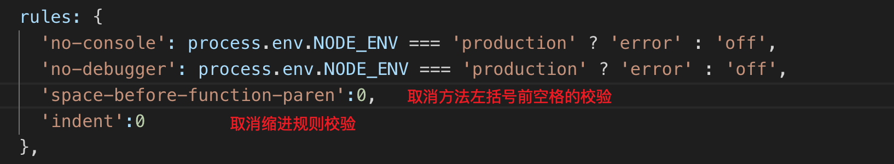

## 一、项目准备工作
1. 使用@vue/cli 3.x工具创建脚手架，首次使用需要安装 ：  
    1. 安装命令
        ``` sh
            npm install -g @vue/cli
        ```
    1. 或使用如下命令查看已安装的版本：  
        ``` sh
            vue --version
        ```
1. 创建项目
    1. 创建命令：  
        ``` sh
            vue create demo-project
        ```
    1. 推荐配置：  
        
    1. 进入项目文件夹并运行：  
        ``` sh
            cd demo-project
            npm run serve
        ```
    1. 效果：  
        
1. 在项目中安装cube-ui
    1. 安装命令：  
        ``` sh
            vue add cube-ui
        ```
    1. 再次运行项目：  
        

## 二、头部组件开发
1. 引入静态header组件
    1. 在public目录下的index.html文件中mate下加入视口限制：禁止缩放:  
        ``` html
        <meta name="viewport" content="width=device-width,initial-scale=1.0,maximum-scale=1.0,minimum-scale=1.0,user-scalable=no">
        
        ```
    1. 在src目录下创建common目录，存放font、stylus文件
        
    1. 在main.js中引入"common/stylus/index.styl"
    1. 在components中引入support-ico、v-header组件
        1. support-ico
            1. support-ico组件是抽取了的图标模块，因为页面的很多地方都将用到不同大小的图标，因此将其抽取
            1. 在vue.conf.js中加入如下支持，以便在vue文件的style标签中通过这种方式引入其他样式```@import "~common/stylus/mixin"```
                
        1.  v-header
            1. 即店铺首页的头部模块
    1. 在App.vue中引入v-header模块：  
        ``` html
        <template>
        <div id="app">
            <v-header></v-header>
        </div>
        </template>

        <script>
        import VHeader from 'components/v-header/v-header.vue'

        export default {
        name: 'app',
        components: {
            VHeader
        }
        }
        </script>

        <style lang="stylus">
        </style>
        ```
    1. 在.eslintrc.js中去掉没有必要的校验：  
        
    1. 运行项目后的效果：  
        
1. axios封装与数据获取
    1. 安装axios: ```npm i axios --save```
    1. 配置mock数据模拟后端接口请求
        1. 在项目目录下引入data.json
        1. 在vue.conf.js中进行如下配置  
            
        1. 接口请求效果：  
            
    1. 封装axios
        1. 在src下新建api模块，在api文件夹下新建helper.js、index.js
        1. helper.js中封装并对外暴露执行get请求的方法  
            ``` js
            import axios from 'axios'

            // 统一定义接口请求成功编码
            const SUCC_STATUS = 0

            export function myGet(url){
                return function(params){
                    return axios.get(url,{params})
                        .then(res => {
                            const {errno,data} = res.data;
                            if(errno === SUCC_STATUS){
                                return data;
                            }
                        })
                        .catch(() => {
                            console.log('request error!')
                        })
                }
            }
            ```
        1. index.js中引入helper.js中的get方法后，封装并对外暴露请求特定接口的方法  
            ``` js
            import { myGet } from './helper'

            const getSellers = myGet('api/seller')

            export {
                getSellers
            }
            ```
    1. 在App.vue中请求数据并显示
        1. 在create()钩子中触发数据请求
            ``` html
            <script>
                import VHeader from 'components/v-header/v-header.vue'
                import { getSellers } from 'api'

                export default {
                    name: 'app',
                    data() {
                        return {
                        seller: {}
                        }
                    },
                    created() {
                        this._myGetSellers()
                    },
                    methods: {
                        _myGetSellers() {
                            getSellers().then(seller => {
                                this.seller = seller
                            })
                        }
                    },
                    components: {
                        VHeader
                    }
                }
            </script>
            ```
    1. 效果：  
         

## 三、Tab 组件开发

## 四、商品页面开发

## 五、商品详情页开发

## 六、评价和商家页面开发

## 七、打包构建和项目部署