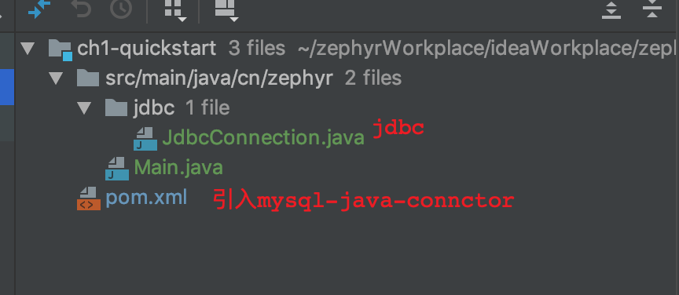
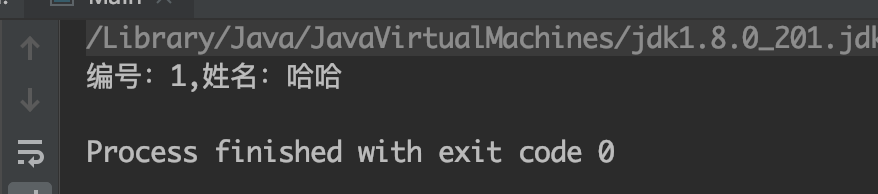
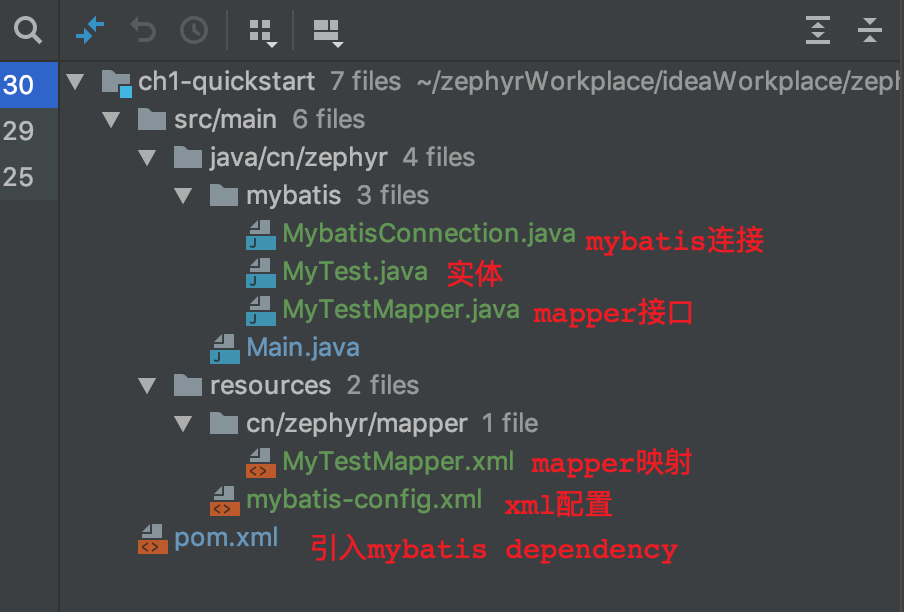
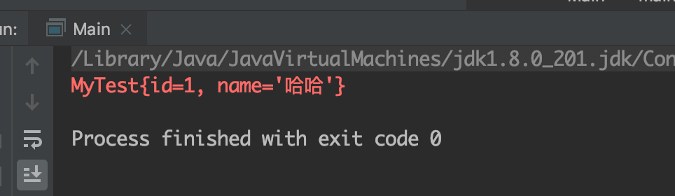
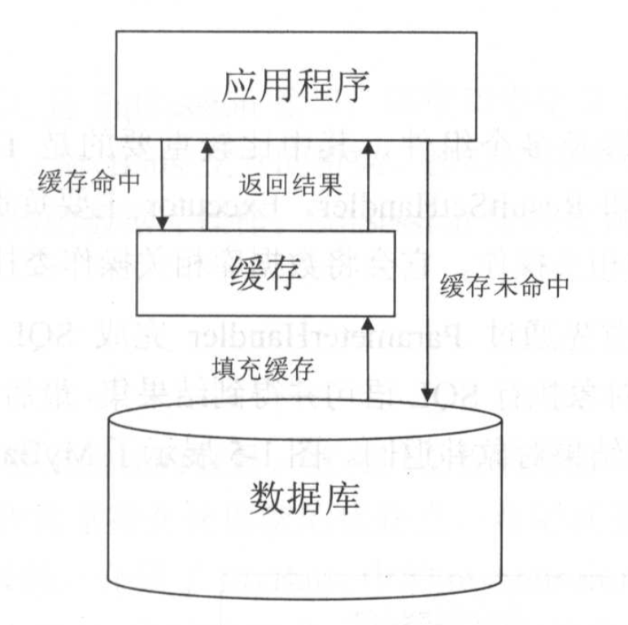
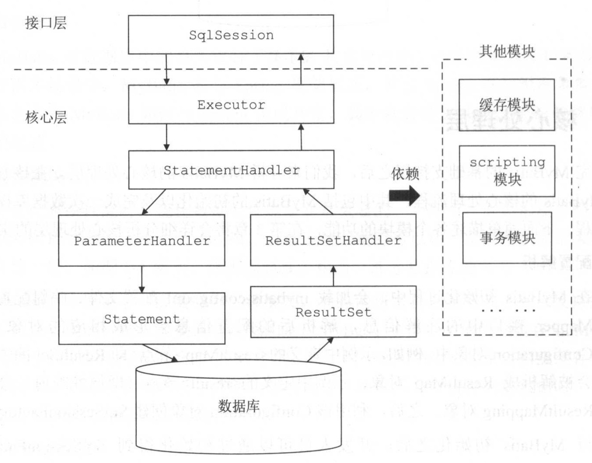

## 目录
1. ORM简介
1. Mybatis示例
1. Mybatis整体架构
    1. 基础支持层
    1. 核心处理层
    1. 接口层
1. 本章总结

## 一、ORM简介（JDBC用的好好的，这个ORM框架是个啥，能吃吗？）
1. 传统JDBC编程主要步骤如下（以查询操作为例）:
    1. 代码结构： 
        
    1. 代码示意： 
        ``` java
        public static void executeJdbcSql() throws Exception {
            // 1. 注册数据库驱动类，明确指定数据库URL地址、数据库用户名、密码等连接信息 。 
            String url = "jdbc:mysql://localhost:3306/mybatis_test?useSSL=false";
            String user = "root";
            String password = "111111";
            Class.forName("com.mysql.jdbc.Driver");
            // 2. 通过DriverManager打开数据库连接 。
            Connection conn = DriverManager.getConnection(url, user, password);
            // 3. 通过数据库连接创建 Statement对象 。
            Statement stmt = conn.createStatement();
            // 4. 通过 Statement对象执行 SQL语句，得到 ResultSet对象。 
            ResultSet rs = stmt.executeQuery("SELECT id,name FROM mytest where id = 1");
            // 5. 通过 ResultSet 读取数据，并将数据转换成 JavaBean 对象 。 
            while(rs.next()) {
                System.out.println("编号：" + rs.getInt("id") + ",姓名：" + rs.getString("name"));
            }
            // 6. 关闭 ResultSet、 Statement 对象以及数据库连接，释放相关资源。
            rs.close();
            stmt.close();
            conn.close();
        }
        ```
    1. 效果：   
        
1. 缺陷：上述JDBC代码基本上属于模板代码，即只要是执行sql操作，就要将上述代码写一遍，稍微好点的方法也就是将一些固定的步骤封装到一个工具类中（例如DBUtils.java），但第五步（数据提取与转换）的通用封装比较困难
1.  ORM框架解决的痛点： 
    1. 主要功能就是 __根据映射配置文件，完成数据在对象模型与关系模型之间的映射__，同时也屏蔽了最开始提到的重复代码，只暴露简单的API供开发人员使用 。
    1. 天然集成了缓存维护、数据源等web系统常用组件的第三方接口，

## 二、MyBatis示例（看起来挺像那么回事的，用用看呢）
这里讲解的是纯粹的mybatis使用示例，没有集成Spring
1. 代码结构：  
    
1. 代码示例： 
    1. pom文件： 
        ``` xml
        <dependencies>
            <dependency>
                <groupId>org.mybatis</groupId>
                <artifactId>mybatis</artifactId>
                <version>3.5.1</version>
            </dependency>
            <dependency>
                <groupId>mysql</groupId>
                <artifactId>mysql-connector-java</artifactId>
                <version>5.1.47</version>
            </dependency>
        </dependencies>
        ```
    1. mybatis-config.xml:  
        ``` xml
        <?xml version="1.0" encoding="UTF-8" ?>
        <!DOCTYPE configuration
                PUBLIC "-//mybatis.org//DTD Config 3.0//EN"
                "http://mybatis.org/dtd/mybatis-3-config.dtd">
        <configuration>
            <properties>
                <!-- 自定义属性值 -->
            </properties>
            <settings>
                <!-- 全局配置 -->
                <setting name="cacheEnabled" value="true"/>
            </settings>
            <typeAliases>
                <!-- 配置别名 -->
                <typeAlias type="cn.zephyr.mybatis.MyTest" alias="MyTest"/>
            </typeAliases>

            <environments default="development">
                <environment id="development">
                    <!-- 配置事务管理器的类型 -->
                    <transactionManager type="JDBC"/>
                    <!-- 配置数据源的类型，以及数据库连接的相关信息 -->
                    <dataSource type="POOLED">
                        <property name="driver" value="com.mysql.jdbc.Driver"/>
                        <property name="url" value="jdbc:mysql://localhost:3306/mybatis_test?useSSL=false"/>
                        <property name="username" value="root"/>
                        <property name="password" value="111111"/>
                    </dataSource>
                </environment>
            </environments>
            <!--配置映射配置文件的位置 -->
            <mappers>
                <mapper resource="cn/zephyr/mapper/MyTestMapper.xml"/>
            </mappers>
        </configuration>
        ```
    1. 实体类MyTest.java:  
        ``` java
        public class MyTest {
            private Integer id;
            private String name;
            // 省略setter、getter
        }
        ```
    1. mapper接口：     
        ``` java
        public interface MyTestMapper {

            MyTest selectOne(Integer id);
        }
        ```
    1. mapper.xml：  
        ``` xml
        <?xml version="1.0" encoding="UTF-8" ?>
        <!DOCTYPE mapper
                PUBLIC "-//mybatis.org//DTD Mapper 3.0//EN"
                "http://mybatis.org/dtd/mybatis-3-mapper.dtd">
        <mapper namespace="cn.zephyr.mybatis.MyTestMapper">
            <select id="selectOne" resultType="MyTest">
                select * from mytest where id = #{id}
            </select>
        </mapper>
        ```
    1. 最终调用的mybatis查询方法：  
        ``` java
        public class MybatisConnection {

            public static void mybatisExecuteSql() throws Exception {
                // 将配置文件写入IO流
                String configResource = "mybatis-config.xml";
                InputStream resourceAsStream = Resources.getResourceAsStream(configResource);
                // 根据配置文件生成SqlSessionFactory
                SqlSessionFactory sqlSessionFactory = new SqlSessionFactoryBuilder().build(resourceAsStream);
                // SqlSessionFactory生成SqlSession
                SqlSession sqlSession = sqlSessionFactory.openSession();
                // 定义查询条件参数
                Map<String,Object> parameter = new HashMap<String, Object>();
                parameter.put("id",1);
                // 执行查询
                MyTest myTest = (MyTest)sqlSession.selectOne("cn.zephyr.mybatis.MyTestMapper.selectOne",parameter);
                // 输出查询结果
                System.err.println(myTest);
                // 关闭会话
                sqlSession.close();
            }
        }
        ```
    1. 效果：  
        

## 三、Mybatis整体架构（庖丁解牛，讲讲Mybatis大概的解构）
MyBatis的整体架构分为三层，分别是基础支持层、核心处理层和接口层，如图所示：  
    
1. 基础支持层
    1. 反射模块：把相对难用的原生java反射做了顶层封装，提供了更加简洁易用的API
    1. 类型转换模块：别名机制是类型转换模块的主要功能之一 ；其另一功能是实现JDBC类型与Java类型之间的转换（例如VARCHAT与String互相转换等）
    1. 日志模块：主要用于集成第三方日志框架
    1. 资源加载模块：对类加载器进行封装，自己实现了一套资源加载服务
    1. 解析器模块（两个功能）：
        1. 对XPath进行封装，为MyBatis初始化时解析 mybatis-config.xml 配置文件以及映射配置文件提供支持；
        1. 为处理动态 SQL 语句中的占位符提供支持；
    1. 数据源模块：MyBatis自身提供了相应的数据源实现，也提供了与第三方数据源集成的接口
    1. 事务模块：自身提供了相应的事务接口和简单实现。 在更多场景中，MyBatis会与Spring框架集成，并由Spring框架管理事务，
    1. 缓存模块：MyBatis 中提供了一级缓存和二级缓存。这两级缓存与 MyBatis 以 及整个应用是运行在同一个JVM中的，共享同一块堆内存。如果这两级缓存中的数据量较大，则可能影响系统中其他功能的运行，所以当需要缓存大量数据时 ，优先考虑使用 Redis、 Memcache 等第三方缓存组件。  
        
    1. Binding模块
        1. 通过刚才的示例得知，在调用SqlSession相应方法执行sql操作时，需要指定映射文件（XxxMapper.xml）中定义的 SQL 节点，如果出现拼写错误，我们只能在运行时才能发现相应的异常。为了尽早发现这种错误，MyBatis通过Binding模块将用户自定义的Mapper接口与映射配置文件关联起来，系统可以通过调用自定义Mapper接口中的方法执行相应的SQL语句完成数据库操作，从而避免上述问题。
        1. 开发人员无须编写自定义 Mapper接口的实现，MyBatis会自动为其创建动态代理对象。
1. 核心处理层
    1. 配置解析：加载mybatis配置文件（对应上述mybatis-config.xml文件）、映射配置文件（XxxMapper.xml）以及 Mapper 接口(XxxMapper.java)中的注解信息，解析后的配置信息会形成相应的对象并保存到Configuration对象中 。
    1. SQL解析与scripting解析
        1. 拼凑SQL语句是一件烦琐且易出错的过程，为了从这项枯燥无趣的工作中解脱出来， MyBatis实现动态SQL语句的功能，提供了多种动态SQL语句对应的节点，例如:<where>节点、<if>节点、<foreach>节点等 。通过这些节点的组合使用，可以写出几乎满足所有需求的动态SQL语句。
        1. MyBatis中的scripting模块会根据用户传入的实参，解析映射文件中定义的动态 SQL 节点，并形成数据库可执行的SQL语句。之后会处理SQL语句中的占位符，绑定用户传入的实参。
    1. SQL执行:
        1. SQL语句的执行涉及多个组件 ，其中比较重要的是 __Executor__、__StatementHandler__ 、__ParameterHandler__ 和 __ResultSetHandler__ 。
        1. __Executor__ 主要负责维护一级缓存和二级缓存，并提供事务管理的相关操作,它会将数据库相关操作委托给 __StatementHandler__ 完成。
        1. __StatementHandler__ 首先通过 __ParameterHandler__ 完成 SQL 语句的实参绑定，然后通过 java.sql.Statement 对 象执行 SQL 语句并得到 结果集;
        1. 最后 __ResultSetHandler__ 完成结果集的映射，得到结果对象并返回
        
    1. 插件:MyBatis提供了插件接口，我们可以通过添加用户自定义插件的方式对MyBatis进行扩展。
1. 接口层 
相对简单，其核心是SqlSession接口，该接口中定义了MyBatis暴露给应用程序调用的API，是上层应用与MyBatis交互的桥梁

## 四、本章小结（The End）
首先介绍了ORM框架出现的背景、意义以及相关概念。通过一个简单的示例，介绍了 MyBatis 中的 mybatis-config.xml 配置文件、映射配置文件中的核心配置，以及MyBatis的使用方式，快速熟悉MyBatis。最后介绍了MyBatis的整体架构，井简单介绍了MyBatis的基础支持层、核心处理层以及接口层中的主要模块的功能。
