### 0. 大型电商网站的缓存架构

### 1. 环境搭建
1. 搭建4台虚拟机集群，centos6，
    1. 网络环境配置
        1. 首先设置网卡开机启动：  
            ``` sh
            vi /etc/sysconfig/network-scripts/ifcfg-eth0 
            ```
            ``` sh
            DEVICE=eth0
            TYPE=Ethernet
            ONBOOT=yes
            BOOTPROTO=dhcp
            ```
        1. 重启网卡服务后获取ip：  
            ``` sh
            service network restart
            ```
            
        1. 将ip固定，再重启网卡服务(桥接模式，子网掩码是固定值，网关采用宿主机的网关)：  
            ``` sh
            DEVICE=eth0
            TYPE=Ethernet
            ONBOOT=yes
            BOOTPROTO=static

            IPADDR=192.168.0.121
            NETMASK=255.255.255.0
            GATEWAY=192.168.0.1
            ```
        1. 关闭防火墙服务，并禁止开机启动：  
            ``` sh
            service iptables stop
            chkconfig iptables off
            ```
            
        1. 配置yum
            ``` sh
            yum clean all
            yum makecache
            yum install -y wget
            ```
    1. 安装jdk、perl
        1.[安装jdk](https://github.com/zephyrlai/my-architect-note/blob/master/99.%20%E5%90%84%E7%B1%BB%E5%AE%89%E8%A3%85%E6%95%99%E7%A8%8B/01.%20Linux%E4%B8%8Bjdk%E5%AE%89%E8%A3%85.md)  
        1. 安装perl
            1. 安装gcc环境
                ``` sh
                yum install -y gcc
                ```
            1. 下载安装包
                ``` sh
                wget http://www.cpan.org/src/5.0/perl-5.16.1.tar.gz
                ```
            1. 解压后编译并安装
                ``` sh
                tar -xzf perl-5.16.1.tar.gz
                cd perl-5.16.1
                ./Configure -des -Dprefix=/usr/local/perl
                make && make test && make install
                ```
            1. 查看版本号： 
                ``` sh
                perl -v
                ```
                
    1. 配置4台CentOS为ssh免密码互相通信
        1. 生成本机的公钥(过程中不断敲回车即可，ssh-keygen命令默认会将公钥放在/root/.ssh目录下)
            ``` sh
            ssh-keygen -t rsa
            ```
        1. 将公钥复制为authorized_keys文件，此时使用ssh连接本机就不需要输入密码了
            ``` sh
            cd /root/.ssh
            cp id_rsa.pub authorized_keys
            ```
        1. 配置三台机器互相之间的ssh免密码登录
            ``` sh
            ssh-copy-id -i hostname
            ```
        1. 效果：  
            
    1. redis安装（生产环境标准）
        1. 安装tcl环境：   
            ``` sh
            wget http://downloads.sourceforge.net/tcl/tcl8.6.1-src.tar.gz
            tar -xzvf tcl8.6.1-src.tar.gz
            cd  /usr/local/tcl8.6.1/unix/
            ./configure  
            make && make install
            ```
        1. 安装redis： 
            ``` sh 
            wget http://download.redis.io/releases/redis-5.0.5.tar.gz
            tar -zxvf redis-5.0.5.tar.gz
            cd redis-5.0.5
            make && make test && make install
            ```
        1. 配置redis：
            1. redis utils目录下，有个redis_init_script脚本，将其拷贝到linux的/etc/init.d目录中，并重命名为redis_6379
            1. （如果需要更改redis的启动端口，修改redis_6379脚本的第6行的REDISPORT（默认是6379））
            1. 将redis目录下的配置文件（redis.conf）移动到/etc/redis/6379.conf
            1. 新建redis的数据（持久化文件）存放目录：/var/redis/6379
            1. 调整redis.conf的如下配置：  
                1. daemonize	yes             #让redis以daemon进程运行
                1. pidfile		/var/run/redis_6379.pid         #设置redis的pid文件位置
                1. (port		6379)           #设置redis的监听端口号
                1. dir 		/var/redis/6379	    #设置持久化文件的存储位置
                1. bind  192.168.xx.xx    # 绑定本机ip
        1. 设置redis开机启动：  
            1. 在redis_6379脚本中，最上面，加入两行注释
                ``` sh
                # chkconfig:   2345 90 10
                # description:  Redis is a persistent key-value database
                ```
            1. 执行命令：  
                ``` sh
                chkconfig redis_6379 on
                ```
        1. redis的正确打开方式（与关闭方式）：  
            ``` sh
            # 打开方式一(/etc/init.d目录下)
            redis_6379 start
            # 打开方式二
            redis-server /redis.conf
            # 关闭(用kill -9的话，还有手动删除pid文件)
            redis-cli -h 192.168.xx.xx -p 6379 shutdown
            ```
### 2. redis持久化
1. 概述：  
    1. 持久化的作用：数据备份与灾难恢复
    1. 如果不使用持久化：一旦遭遇到灾难性故障，将丢失所有数据
    1. redis持久化的故障恢复机制：  
        
1. 2种持久化方案（RDB、AOF）：
    1. RDB（Redis DataBase）：对redis中的数据执行周期性的持久化，即每隔一段时间，生成一份当前完整redis的数据快照：  
        
        1. 优点
            1. RDB会生成多个数据文件，每个数据文件都代表了某一个时刻中redis的数据，这种多个数据文件的方式，非常适合做冷备，可以将这种完整的数据文件发送到一些远程的安全存储上去，比如说Amazon的S3云服务上去，在国内可以是阿里云的ODPS分布式存储上，以预定好的备份策略来定期备份redis中的数据
            1. RDB对redis对外提供的读写服务，影响非常小，可以让redis保持高性能，因为redis主进程只需要fork一个子进程，让子进程执行磁盘IO操作来进行RDB持久化即可
            1. 相对于AOF持久化机制来说，直接基于RDB数据文件来重启和恢复redis进程，更加快速
        1. 缺点
            1. 如果想要在redis故障时，尽可能少的丢失数据，那么RDB没有AOF好。一般来说，RDB数据快照文件，都是每隔5分钟，或者更长时间生成一次，这个时候就得接受一旦redis进程宕机，那么会丢失最近5分钟的数据
            1. RDB每次在fork子进程来执行RDB快照数据文件生成的时候，如果数据文件特别大，可能会导致对客户端提供的服务暂停数毫秒，或者甚至数秒
    1. AOF（Append Only File）：对每条写入命令作为日志，以append-only的模式写入一个日志文件中，在redis重启的时候，可以通过回放AOF日志中的写入指令来重新构建整个数据集
        1. AOF记录的是写指令，其文件内容只会增加，而不会减少
        1. redis的内存数据存满时（例如限定了1G的内存空间），会执行LRU算法，清理掉一部份不常用的数据，而AOF中对应的无效数据的写指令不会被删除；而AOF文件过大时，redis会基于当前的redis数据新建一个AOF文件，仅存放基于当前redis数据的写指令，删除原有的AOF文件  
            
        1. 优点
            1. AOF可以更好的保护数据不丢失，一般AOF会每隔1秒，通过一个后台线程执行一次fsync操作，最多丢失1秒钟的数据
            1. AOF日志文件以append-only模式写入，所以没有任何磁盘寻址的开销，写入性能非常高，而且文件不容易破损，即使文件尾部破损，也很容易修复
            1. AOF日志文件即使过大的时候，出现后台重写操作，也不会影响客户端的读写。因为在rewrite log的时候，会对其中的指导进行压缩，创建出一份需要恢复数据的最小日志出来。再创建新日志文件的时候，老的日志文件还是照常写入。当新的merge后的日志文件ready的时候，再交换新老日志文件即可。
            1. AOF日志文件的命令通过非常可读的方式进行记录，这个特性非常适合做灾难性的误删除的紧急恢复。比如某人不小心用flushall命令清空了所有数据，只要这个时候后台rewrite还没有发生，那么就可以立即拷贝AOF文件，将最后一条flushall命令给删了，然后再将该AOF文件放回去，就可以通过恢复机制，自动恢复所有数据
        1. 缺点
            1. 对于同一份数据来说，AOF日志文件通常比RDB数据快照文件更大
            1. AOF开启后，支持的写QPS会比RDB支持的写QPS低，因为AOF一般会配置成每秒fsync一次日志文件，当然，每秒一次fsync，性能也还是很高的
            1. 以前AOF发生过bug，就是通过AOF记录的日志，进行数据恢复的时候，没有恢复一模一样的数据出来。所以说，类似AOF这种较为复杂的基于命令日志/merge/回放的方式，比基于RDB每次持久化一份完整的数据快照文件的方式，更加脆弱一些，容易有bug。不过AOF就是为了避免rewrite过程导致的bug，因此每次rewrite并不是基于旧的指令日志进行merge的，而是基于当时内存中的数据进行指令的重新构建，这样健壮性会好很多。
1. RDB和AOF到底该如何选择
    1. 不要仅仅使用RDB，因为那样会导致你丢失很多数据
    1. 也不要仅仅使用AOF，因为那样有两个问题，  
        第一，你通过AOF做冷备，没有RDB做冷备，来的恢复速度更快;   
        第二，RDB每次简单粗暴生成数据快照，更加健壮，可以避免AOF这种复杂的备份和恢复机制的bug  
    1. 综合使用AOF和RDB两种持久化机制，用AOF来保证数据不丢失，作为数据恢复的第一选择; 用RDB来做不同程度的冷备，在AOF文件都丢失或损坏不可用的时候，还可以使用RDB来进行快速的数据恢复
1. RDB持久化实验： 
    1. 修改redis.conf，新增rdb写入规则： 每3s检测一次，如果有5个键发生改动，则写入rdb文件，重启redis后生效：  
          
    1. 新增三个键，rdb文件中没有写入：  
        
    1. 再新增2个键，rdb文件中写入了5个键：  
          
1. AOF持久化实验：
        1. 修改redis.conf，开启AOF持久化机制（每秒一次fsync）、开启AOF的rewrite机制(重启生效)  
              
              
        1. 插入一个键值对，查看AOF（日志）文件：  
            
        1. AOF的rewrite流程：  
            
1. 企业级数据备份与数据恢复的容灾演练  
    1. 持久化方案： RDB、AOF同时打开，RDB的复写频率与AOF的rewrite频率使用redis的默认配置即可，也可以根据实际需要进行调整，AOF的fsync频率建议使用everysec；
    1. 数据备份方案：  
        1. 写 __crontab__ 定时调度脚本去做数据备份  
            ``` sh
            crontab -e
            0 * * * * sh /usr/local/redis/copy/redis_rdb_copy_hourly.sh
            ```
        1. __每小时__ 都copy一份rdb的备份，到一个目录中去，仅仅保留最近48小时的备份  
            ``` sh
            #! /bin/sh
            # 获取当前时间
            cur_date=`date +%Y%m%d%k`
            # 备份当前文件
            cp -f /var/redis/6379/dump.rdb /usr/local/mysoftware/redis/backup/snapshotting/$cur_date.rdb
            # 删除48小时之前的文件
            del_date=`date -d -48hour +%Y%m%d%k`
            rm -rf /usr/local/mysoftware/redis/backup/snapshotting/$del_date.rdb
            ```  
            
        1. __每天__ 都保留一份当日的rdb的备份，到一个目录中去，仅仅保留最近1个月的备份  
            ``` sh
            #!/bin/sh 
            cur_date=`date +%Y%m%d`
            cp /var/redis/6379/dump.rdb /usr/local/redis/snapshotting/$cur_date.rdb

            del_date=`date -d -1month +%Y%m%d`
            rm -rf /usr/local/redis/snapshotting/$del_date.rdb
            ```
        1. 每次copy备份的时候，都把太旧的备份给删了（通常删除 __48小时__ 或者 __1个月__ 之前的数据）
        1. 每天晚上将当前服务器上 __所有的数据备份__，发送一份到远程的云服务上去
    1. 数据恢复方案（分5种情形讨论）：  
        1. 如果是redis进程挂掉：直接重启即可，redis会立即根据aof文件进行数据恢复；
        1. 如果是redis进程所在机器挂掉，那么重启机器后，尝试重启redis进程，尝试直接基于AOF日志文件进行数据恢复。如果AOF没有破损，也是可以直接基于AOF恢复的（AOF append-only，顺序写入）。如果AOF文件破损，那么用redis-check-aof fix 修复aof文件后恢复
        1. 如果redis挂掉，且当前最新的AOF和RDB文件出现了丢失/损坏（人为：rm -rf之类的），这种情况相对比较麻烦，单独讲解一下：
            1. 核心思路：利用最近一次备份的rdb文件生成aof文件，而不要使用redis重启后自动生成的空的aof文件  
            1. 在配置文件中关闭aof，重新拷入最近一次备份的rdb文件后，重启redis服务（将数据恢复到最近一次rdb备份的时刻）
            1. 使用redis热配置的方式打开aof持久化，关闭redis服务（只是暂用了热配置的方式开启了aof，而实际的配置文件并没有修改），配置文件中打开aof持久化开关，重启redis
            1. 此时可以看到数据可以取到，且aof文件正常
        1. 如果当前机器上的所有RDB文件全部损坏，那么从远程的云服务上拉取最新的RDB快照回来恢复数据
        1. 如果是发现有重大的数据错误，比如某个小时上线的程序一下子将数据全部污染了，数据全错了，那么可以选择某个更早的时间点，对数据进行恢复

### 3. redis读写分离
1. 概述：  
    1. 为什么要用redis读写分离：单机情况下redis能承受大约2万的QPS（具体数据因机器配置与业务场景而异），如果想要承接更高数值的QPS（10万以上），则需要用到读写分离的redis集群。
    1. 读写分离的原理：对于缓存而言，读的需求量是远大于写的需求量的，而读写分离的机制就是在主机上执行写操作，然后异步地将数据复制到从机上，而从机只负责读操作，假设一台从机具有2万QPS，当业务场景需要10万的QPS时，只需要横向扩展5台redis从机即可（可支持水平扩展的读高并发架构）：  
          
    1. 如果采用了主从架构，那么建议必须开启master node的持久化！
    1. redis replication的核心机制
        1. redis采用异步方式复制数据到slave节点，不过redis 2.8开始，slave node会周期性地确认自己每次复制的数据量
        1. 一个master node是可以配置多个slave node的
        1. slave node也可以连接其他的slave node
        1. slave node做复制的时候，是不会block master node的正常工作的
        1. slave node在做复制的时候，也不会block对自己的查询操作，它会用旧的数据集来提供服务; 但是复制完成的时候，需要删除旧数据集，加载新数据集，这个时候就会暂停对外服务了
        1. slave node主要用来进行横向扩容，做读写分离，扩容的slave node可以提高读的吞吐量
    1. 主从架构的核心原理
        1. 当启动一个slave node的时候，它会发送一个PSYNC命令给master node。开始主从复制的时候，master会启动一个后台线程，开始生成一份RDB快照文件，同时还会将从客户端收到的所有写命令缓存在内存中。RDB文件生成完毕之后，master会将这个RDB发送给slave，slave会先写入本地磁盘，然后再从本地磁盘加载到内存中。然后master会将内存中缓存的写命令发送给slave，slave也会同步这些数据。slave node如果跟master node有网络故障，断开了连接，会自动重连。master如果发现有多个slave node都来重新连接，仅仅会启动一个rdb save操作，用一份数据服务所有slave node。
            1. 如果这是slave node重新连接master node，那么master node仅仅会复制给slave部分缺少的数据; 
            1. 否则如果是slave node第一次连接master node，那么会触发一次full resynchronization。
            
    1. 主从复制的断点续传：从redis 2.8开始，就支持主从复制的断点续传，如果主从复制过程中，网络连接断掉了，那么可以接着上次复制的地方，继续复制下去，而不是从头开始复制一份
    1. 无磁盘化复制
        1. master在内存中直接创建rdb，然后发送给slave，不会在自己本地落地磁盘了
        1. 相关配置：  
            1. repl-diskless-sync
            1. repl-diskless-sync-delay，等待一定时长再开始复制，因为要等更多slave重新连接过来
    1. 过期key处理：slave不会过期key，只会等待master过期key。如果master过期了一个key，或者通过LRU淘汰了一个key，那么会模拟一条del命令发送给slave。
1. redis replication的完整运行流程与原理
    1. 复制的完整流程
        1. slave node启动，仅仅保存master node的信息，包括master node的host和ip（由slave node中的redis.conf里面的slaveof属性配置）
        1. slave node内部有个定时任务，每秒检查是否有新的master node要连接和复制，如果发现，就跟master node建立socket网络连接
        1. slave node发送ping命令给master node
        1. 口令认证，如果master设置了requirepass，那么salve node必须发送masterauth的口令过去进行认证
        1. master node第一次执行全量复制，将所有数据发给slave node
        1. master node后续持续将写命令，异步复制给slave node
          
    1. 数据同步相关的核心机制（指的就是第一次slave连接master的时候，执行的全量复制里面的一些细节的机制）
        1. 2个名词：  
            runid:主服务器ID
            offset:从服务器最后接收命令的偏移量
        1. master和slave都会维护一个（各自的）offset：  
            master会在自身不断累加offset，slave也会在自身不断累加offset。slave每秒都会上报自己的offset给master，同时master也会保存每个slave的offset（不一定就用在全量复制的，主要是master和slave都要知道各自的数据的offset，才能知道互相之间的数据不一致的情况）
        1. backlog（后面章节会详说）：  
            master node有一个backlog，默认是1MB大小，master node给slave node复制数据时，也会将数据在backlog中同步写一份。backlog主要是用来做全量复制中断候的增量复制的
        1. psync：从节点使用psync从master node进行复制，psync runid offset，master node会根据自身的情况返回响应信息，可能是FULLRESYNC runid offset触发全量复制，可能是CONTINUE触发增量复制  
            ``` sh
            PSYNC <runid> <offset>
            ```
        1. master的runid：  
            redis每次启动的时候都会有一个随机的id来保障redis的标识，重启后会重新生成，这就是redis的runid。如果master node重启(例如手动数据还原)，那么slave node在重连后进行数据同步时，使用```PSYNC <runid> <offset>```将之前保存的master node的runid发送到重启后的master node，由master node告知slave node是执行全量复制还是增量复制。如果需要不更改run id重启redis，可以使用redis-cli debug reload命令
    1. 全量复制
        1. master执行bgsave，在本地生成一份rdb快照文件
        1. master node将rdb快照文件发送给salve node，如果rdb复制时间超过60秒（redis-cli的repl-timeout配置项），那么slave node就会认为复制失败（可以适当调节大这个参数）
        1. master node在生成rdb时，会将所有新的写命令缓存在内存中，在salve node保存了rdb之后，再将新的写命令复制给salve node
        1. ```lient-output-buffer-limit slave 256MB 64MB 60```:如果在复制期间，内存缓冲区持续消耗超过64MB，或者一次性超过256MB，那么停止复制，复制失败
        1. slave node接收到rdb之后，清空自己的旧数据，然后重新加载rdb到自己的内存中，同时基于旧的数据版本对外提供服务
        1. 如果slave node开启了AOF，那么会立即执行BGREWRITEAOF，重写AOF
    1. 增量复制
        1. 如果全量复制过程中，master-slave网络连接断掉，那么salve重新连接master时，会触发增量复制
        1. master直接从自己的backlog中获取部分丢失的数据，发送给slave node，默认backlog就是1MB
        1. msater就是根据slave发送的psync中的offset来从backlog中获取数据的
    1. heartbeat:主从节点互相都会发送heartbeat信息,master默认每隔10秒发送一次heartbeat，salve node每隔1秒发送一个heartbeat
    1. 异步复制:master每次接收到写命令之后，现在内部写入数据，然后异步发送给slave node
1. 部署redis的读写分离架构：  
    1. （完成redis的单机安装与部署）
    1. 修改redis.conf(6379.conf):  
        ``` sh
        bind 192.168.0.112
        # 据说是外国的猿们请愿master-slave的说法涉嫌种族歧视，
        # 于是redis5.0中众多涉及到slave的名词都改成了replica，开源不易
        slaveof 192.168.1.1 6379
        # redis 5.0 对应的配置项：replicaof 
        slave-read-only yes # 默认开启，会拒绝所有的写操作，强制搭建成读写分离的架构
        # redis 5.0对应的配置项： replica-read-only
        ```
    1. 修改主机的redis.conf(6379.conf):  
        ``` sh
        bind 192.168.0.111
        ```
    1. 主机效果：  
          
    1. 从机效果：
        

### 4. redis哨兵架构
1. 主备切换的数据丢失问题
    1. 2种情况导致数据丢失
        1. 异步复制  
            因为master -> slave的复制是异步的，所以可能有部分数据还没复制到slave，master就宕机了，此时这些部分数据就丢失了
        1. 脑裂  
            1. 脑裂指的是，某个master所在机器突然脱离了正常的网络，跟其他slave机器不能连接，但是实际上master还运行着（客户端数据还在写入，却没能同步到slave node上），此时哨兵可能就会认为master宕机了，然后开启选举，将其他slave切换成了master，这个时候，集群里就会有两个master，也就是所谓的脑裂。
            1. 这种情况下，虽然某个slave被切换成了master，但是可能客户端还没来得及切换到新的master，还继续写向旧master的数据可能也丢失了，因此旧master再次恢复的时候，会被作为一个slave挂到新的master上去，自己的数据会清空，重新从新的master复制数据  
            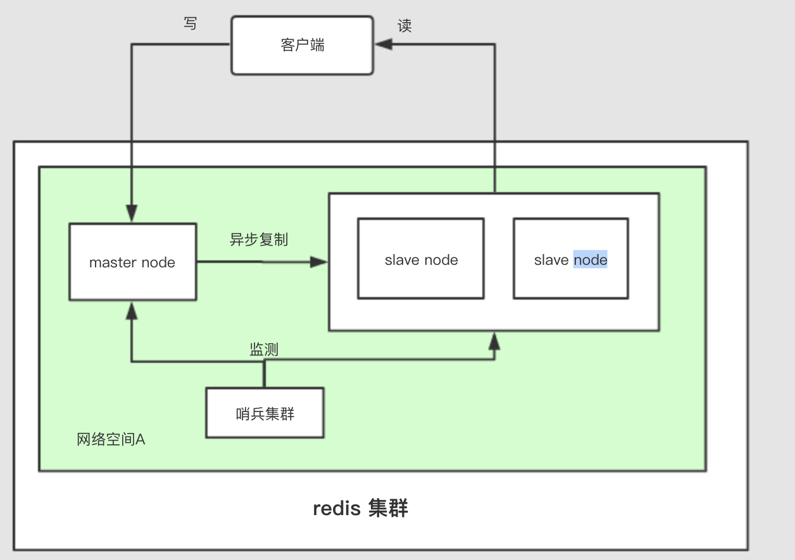  
            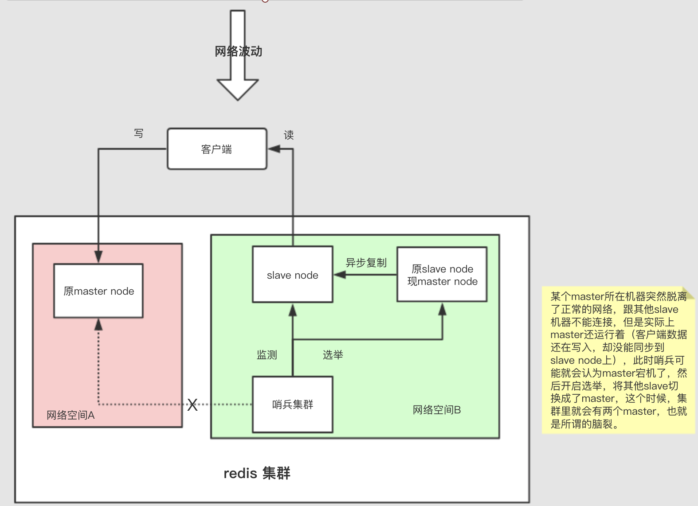  
              
    1. 解决异步复制和脑裂导致的数据丢失
        1. 配置：
            ``` sh
            # 要求至少有1个slave，数据复制和同步的延迟不能超过10秒
            min-slaves-to-write 1
            min-slaves-max-lag 10
            ```
            如果说一旦所有的slave，数据复制和同步的延迟都超过了10秒钟，那么这个时候，master就不会再接收任何请求了
        1. 在异步复制中的作用：  
            一旦slave复制数据和ack延时太长，就认为可能master宕机后损失的数据太多了，那么就拒绝写请求，这样可以把master宕机时由于部分数据未同步到slave导致的数据丢失降低的可控范围内
        1. 在脑裂中的作用：     
            如果一个master出现了脑裂，跟其他slave丢了连接，那么上面两个配置可以确保，如果不能继续给指定数量的slave发送数据，而且slave超过10秒没有给自己ack消息，那么就直接拒绝客户端的写请求。这样脑裂后的旧master就不会接受client的新数据，也就避免了后续数据丢失，最多就丢失10秒的数据。
1. （redis哨兵）工作原理分析
    1. sdown和odown转换机制
        1. sdown和odown是两种失败状态：
            1. sdown是主观宕机（Subject Down），就一个哨兵如果自己觉得master宕机了，那么就是主观宕机
            1. odown是客观宕机（Object Down），如果quorum数量的哨兵都觉得一个master宕机了，那么就是客观宕机
        1. sdown达成的条件：如果一个哨兵ping一个master，超过了is-master-down-after-milliseconds指定的毫秒数之后，就主观认为master宕机
        1. sdown到odown转换的条件：如果一个哨兵在指定时间内，收到了quorum指定数量的其他哨兵也认为那个master是sdown了，那么就认为是odown了
    1. 哨兵集群的自动发现机制
        1. 哨兵互相之间的发现，是通过redis的pub/sub系统实现的，每隔两秒钟，每个哨兵都会往自己监控的某个master+slaves集群对应的__sentinel__:hello channel里发送一个消息，内容是自己的host、ip和runid还有对这个master的监控配置，
        1. 每个哨兵也会去监听自己监控的每个master+slaves对应的__sentinel__:hello channel，然后去感知到同样在监听这个master+slaves的其他哨兵的存在
        1. 每个哨兵还会跟其他哨兵交换对master的监控配置，互相进行监控配置的同步
    1. slave配置的自动纠正  
        哨兵会负责自动纠正slave的一些配置，比如slave如果要成为潜在的master候选人，哨兵会确保slave在复制现有master的数据; 如果slave连接到了一个错误的master上（比如故障转移之后）那么哨兵会确保它们连接到正确的master上
    1. 从slave变为的master选举算法
        1. 如果一个master被认为odown了，而且majority数量的哨兵都允许了主备切换，那么某个哨兵就会执行主备切换操作，此时首先要选举一个slave来，而在选举时会考虑slave的一些信息
            1. 跟master断开连接的时长
                1. 如果一个slave跟master断开连接已经超过了down-after-milliseconds的10倍，外加master宕机的时长，那么slave就被认为不适合选举为master，对应的公式是：  
                ```(down-after-milliseconds * 10) + milliseconds_since_master_is_in_SDOWN_state```
            1. slave优先级：按照slave优先级进行排序，slave priority越低，优先级就越高
            1. 复制offset：哪个slave复制了越多的数据，offset越靠后，优先级就越高
            1. run id（取较小的）
    1. 名词解释：quorum（自由配置）、majority（依据slave node的数量自动计算）
        1. 每次一个哨兵要做主备切换，首先需要quorum数量的哨兵认为odown，然后选举出一个哨兵来做切换，这个哨兵还得得到majority数量的哨兵授权，才能正式执行切换
        1. 如果quorum < majority，比如5个哨兵，majority就是3，quorum设置为2，那么就3个哨兵授权就可以执行切换
        1. 如果quorum >= majority，那么必须quorum数量的哨兵都授权，比如5个哨兵，quorum是5，那么必须5个哨兵都同意授权，才能执行切换
    1. 关于configuration epoch
        1. 哨兵会对一套redis master+slave进行监控，有相应的监控的配置。执行切换的那个哨兵，会从要切换到的新master（原salve node）那里得到一个configuration epoch，这就是一个version号，每次切换的version号都必须是唯一的
        1. 如果第一个选举出的哨兵切换失败了，那么其他哨兵，会等待```failover-timeout```时间，然后接替刚才执行切换失败的哨兵，继续执行切换，此时会重新获取一个新的configuration epoch，作为新的version号
    1. configuraiton传播（在哨兵中的传播）
        1. 哨兵完成切换之后，会在自己本地更新生成最新的master配置，然后同步给其他的哨兵（通过redis的pub/sub消息机制）。这里之前的version号就很重要了，因为各种消息都是通过一个channel去发布和监听的，所以一个哨兵完成一次新的切换之后，新的master配置是跟着新的version号的。其他的哨兵都是根据版本号（是否与自己当前记录的版本号一致）来更新自己的master配置的
1. 实战演练：搭建三节点的哨兵集群（生产级别）
    1. 环境概况：基于一主三从的redis集群，准备在三个从节点上配置并启动哨兵服务
    1. redis服务启动情况：启动了一个主节点与一个从节点的redis服务，另外2个从节点的redis服务未启动
    1. 在三个从节点上配置并启动哨兵服务
        1. 将redis目录下的sentinel.conf移动至/etc/sentinel，并重命名为5000.conf（即：```/etc/sentinel/5000.conf```）
        1. 更改```/etc/sentinel/5000.conf```的如下配置
            ``` sh
            # 端口号
            port 5000
            # 本机ip方式访问
            bind 192.168.0.112
            # 数据文件目录（对应文件夹要手动创建）
            dir /var/sentinel/5000
            # sentinel monitor master-group-name master-hostname master-port quorum
            sentinel monitor mymaster 192.168.0.111 6379 2
            # 含义：超过多少毫秒跟一个redis实例断了连接，哨兵就可能认为这个redis实例宕机（不改动，采用默认值）
            sentinel down-after-milliseconds mymaster 30000
            # 含义：新的master别切换之后，同时有多少个slave被切换至新master，重新做同步，数字越低，花费的时间越多（不改动，采用默认值）
            sentinel parallel-syncs mymaster 1
            # 含义：执行故障转移的timeout超时时长（超时了就换个哨兵重新执行故障转移。不改动，采用默认值）
            sentinel failover-timeout mymaster 180000
            ```
        1. 创建哨兵的数据文件目录：```mkdir -p /var/sentinel/5000```
        1. 临时测试方式启动哨兵服务
            1. 方式一： 
                ``` sh
                redis-sentinel /etc/sentinal/5000.conf
                ```
            1. 方式二：
                ``` sh
                redis-server /etc/sentinal/5000.conf --sentinel
                ```
        1. 生产环境下的哨兵节点启动：
            1. 新增配置项：
                ``` sh
                    daemonize yes
                    logfile /var/log/sentinal/5000
                ```
            1. 启动： 
                ``` sh
                redis-sentinel /etc/sentinel/5000.conf
                ```
    1. 效果：
        1. 从节点01的哨兵控制台信息：
            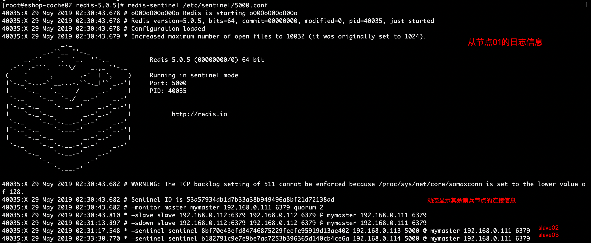  
        1. 从节点02的哨兵控制台信息：
            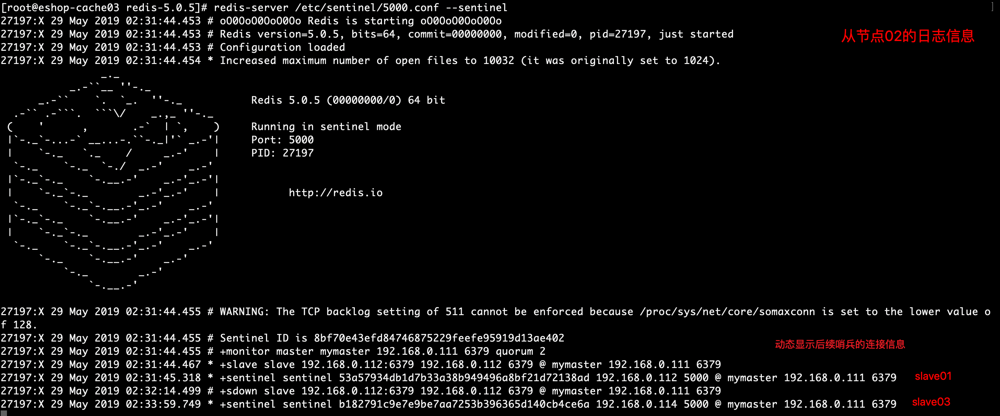  
        1. 从节点03的哨兵控制台信息： 
            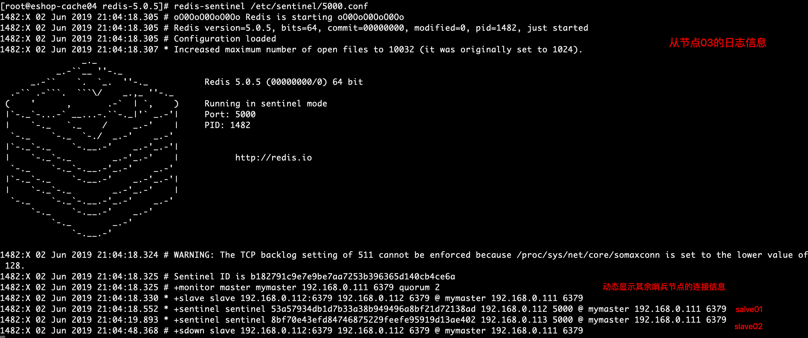  
    1. 检查哨兵状态的命令（通过redis-cli端口号5000登录到redis后查看：```redis-cli -h 192.168.0.112 -p 5000```）  
        ``` sh
        # SENTINEL get-master-addr-by-name mymaster
        sentinel master mymaster
        sentinel slaves mymaster
        sentinel sentinels mymaster
        ```
    1. 哨兵节点的增加和删除
        1. 增加单个哨兵接待：哨兵集群会自动检测，无需人为操作
        1. 删除单个哨兵接待：
            1. 停止sentinal进程
            1. ```SENTINEL RESET * ```，在所有sentinal上执行，清理所有的master状态
            1. ```SENTINEL MASTER mastername```，在所有sentinal上执行，查看所有sentinal对数量是否达成了一致
    1. 让某个slave node的永久下线（哨兵集群不再监测其是否在线、离线）  
        让master摘除某个已经下线的slave：```SENTINEL RESET mastername```，在所有的哨兵上面执行
    1. slave切换为Master的优先级  
        slave->master选举优先级：```slave-priority```(redis5.0中对应的配置项：```replica-priority```)，值越小优先级越高
    1. 基于哨兵集群架构下的安全认证
        1. 每个slave都有可能切换成master，所以每个实例都要配置两个指令
        1. master上启用安全认证，requirepass xxx
        1. slave node上配置master的连接口令，masterauth xxx
        1. sentinal：```sentinel auth-pass <master-group-name> <pass>```
1. 实战演练：容灾演练
    1. redis 集群的运行情况：运行了1主3从，启动了3台从机的上的哨兵服务
          
        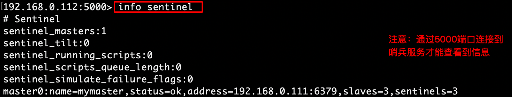  
    1. 模拟故障：命令行kill掉redis的master node
    1. 可以看到，经过哨兵集群的选举，推选了ip尾号0.113的从节点作为新的master node：
        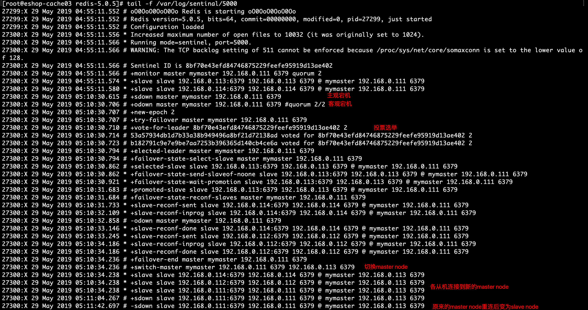
    1. 原master node重连后，也自动转变为新的slave node  
        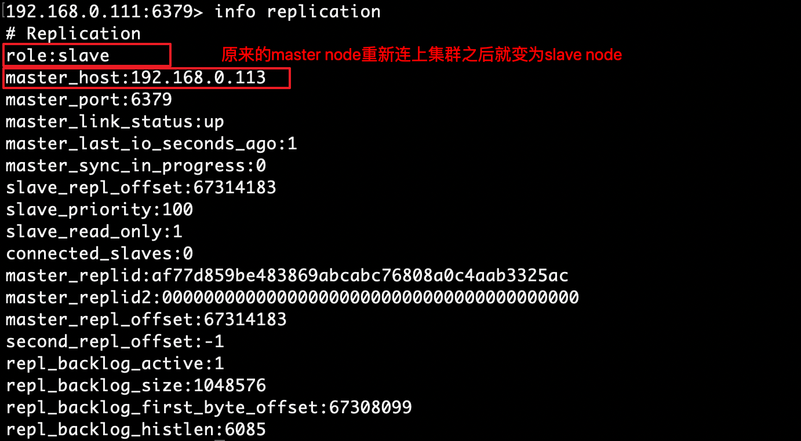  
    1. 各哨兵节点、redis服务的配置文件在新的master node诞生时，已被热更改：  
        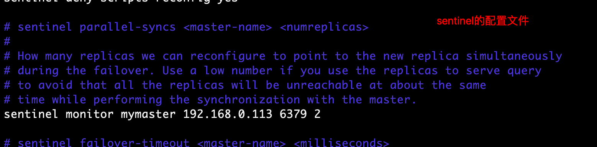  
        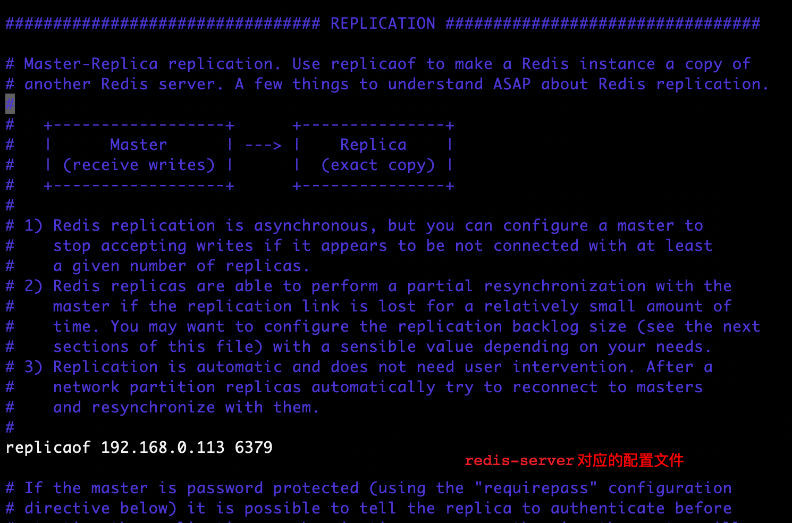
    1. 原来的数据依旧可以访问，不受到原master宕机的影响：  
        

### 5. redis cluster
1. 概述：
1. 搭建3主3从架构的cluster集群：
    1. 搭建6个cluster节点（端口号分别是：7001、7002、7003、7004、7005、7006，下面以7001端口号的节点为例进行搭建）
        1. 创建目录  
            ``` sh
            # 放redis-cluster配置文件（注意：不是redis启动的配置文件，redis-cluster的配置文件是redis自己维护的）
            mkdir -p /etc/redis-cluster
            # 放redis日志文件
            mkdir -p /var/redis/7001/log/
            # 放redis持久化文件
            mkdir -p /var/redis/7001/persistence/
            ```
        1. 将原来的```/etc/redis/6379.conf```在原目录下拷贝一份命名为```7001.conf```，并调整如下配置  
            ``` sh
            # 端口号
            port 7001
            # 开启cluster模式
            cluster-enabled yes
            # 配置cluster配置文件的路径（该配置文件由redis自己新建并维护）
            cluster-config-file /etc/redis-cluster/node-7001.conf
            # cluster节点超时时间（超时失联，则认为宕机）
            cluster-node-timeout 15000
            # 后台启动
            daemonize	yes		
            # pid文件					
            pidfile		/var/run/redis_7001.pid 
            # 持久化文件目录						
            dir 		/var/redis/7001/persistence  	
            # 日志文件目录
            logfile 	/var/redis/7001/log/7001.log
            # 绑定ip
            bind 192.168.31.187	
            # 开启aof	
            appendonly yes
            # 注释掉如下配置（之前配置读写分离集群时，redis自己热修改的配置）
            # replicaof 192.168.xx.xx 6379
            ```
        1. 将原来的```/etc/init.d/redis_6379```在原目录下拷贝一份命名为```redis_7001```，并修改端口为7001
        1. (/etc/init.d目录下)启动redis服务：
            ``` sh
            redis_7001 start
            ```  
            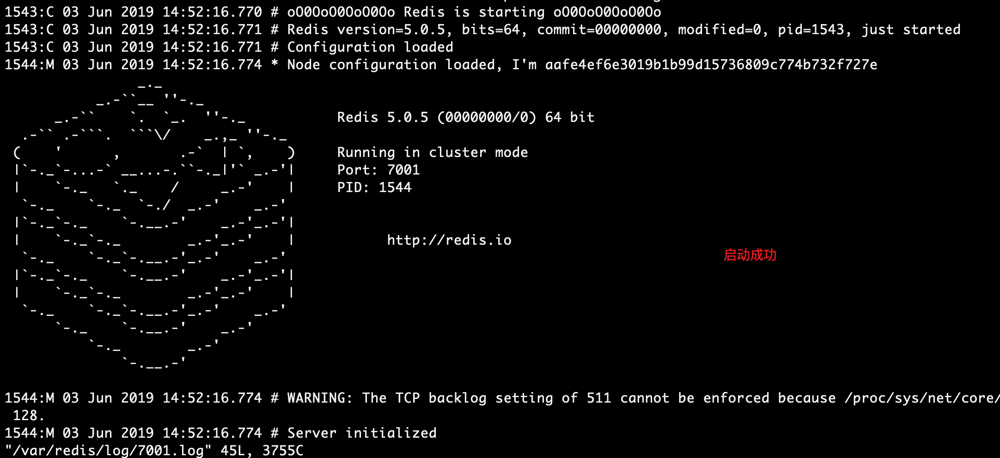
    1. 将6个节点组成cluster集群
        1. （旧的方式，已废弃，不推荐，了解即可）
            1. 安装ruby  
                ``` sh
                yum install -y ruby
                yum install -y rubygems
                gem install redis
                ```
            1. 执行第三步时报错“ERROR: Error installing redis-4.0.0.gem: redis requires Ruby version >= 2.2.2.”的解决方案：    
                ``` sh
                sudo yum install curl
                curl -sSL https://get.rvm.io | bash -s stable  
                source /usr/local/rvm/scripts/rvm
                rvm list known
                # 安装一个版本
                rvm install  2.4.1
                rvm use  2.4.1
                # 卸载一个版本
                # rvm remove 2.0.0
                # 设置默认版本
                rvm use 2.4.1 --default
                #
                gem install redis
                #redis-4.1.2
                cp /usr/local/mysoftware/redis/redis-5.0.5/src/redis-trib.rb /usr/local/bin
                redis-trib.rb create --replicas 1 192.168.0.111:7001 192.168.0.111:7002 192.168.0.112:7003 192.168.0.112:7004 192.168.0.113:7005 192.168.0.113:7006
                ```
            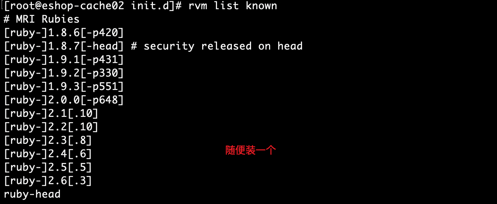  
            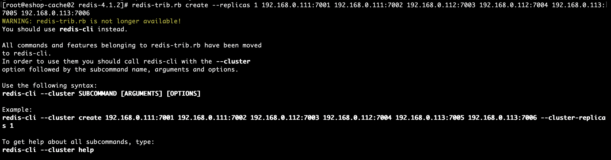
        1. 执行命令：  
            ``` sh
            redis-cli --cluster create 192.168.0.111:7001 192.168.0.111:7002 192.168.0.112:7003 192.168.0.112:7004 192.168.0.113:7005 192.168.0.113:7006 --cluster-replicas 1
            ```
        1. 效果：  
            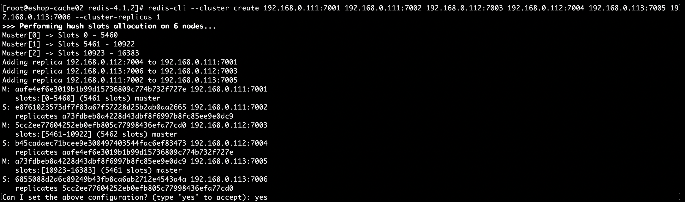  
            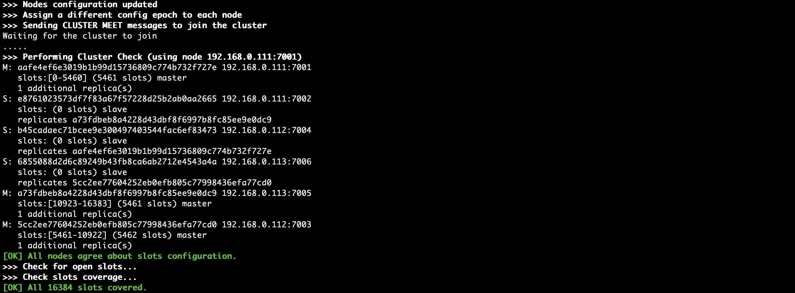
        1. 检查cluster集群状况：  
            ``` sh
            redis-cli --cluster check 192.168.0.111:7001
            ```  
            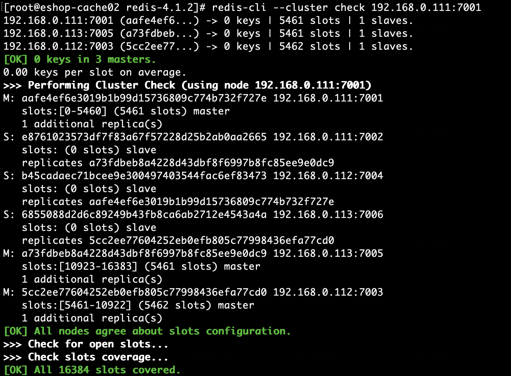


        
 