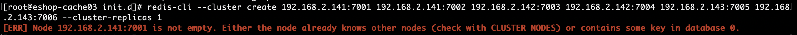
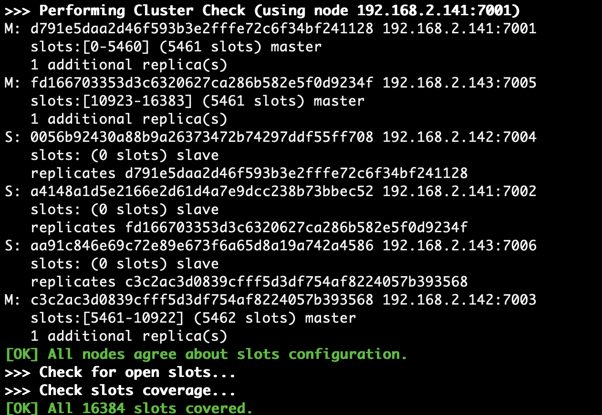

1. 报错信息：  
    ``` sh
    [ERR] Node 10.161.2.141:7001 is not empty. Either the node already knows other nodes (check with CLUSTER NODES) or contains some key in database 0.
    ```  
    
1. 原因：redis集群非正常关闭
1. 恢复方式： 
    1. 关闭所有redis节点
    1. 删除所有的持久化文件（rdb、aof）
    1. 删除所有的node_conf文件（redis自动生成的cluster配置文件）
    1. 必要情况下，在redis-cli连接到redis-server后执行：
        ``` sh
        flushdb
        ```
    1. 重启所有的redis节点并重新创建cluster集群：  
        ``` sh
        redis-cli --cluster create 192.168.2.141:7001 192.168.2.141:7002 192.168.2.142:7003 192.168.2.142:7004 192.168.2.143:7005 192.168.2.143:7006 --cluster-replicas 1
        ```  
        
> https://github.com/antirez/redis/issues/3154

